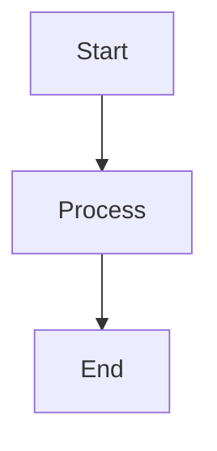

# Copilot Instructions for LCKYN Knowledge Base

This is an **Obsidian vault** organized using the **Johnny.Decimal system** for a Senior Data/ML/LLM Engineer's personal knowledge management.

## Architecture Overview

### Johnny.Decimal Structure
Folders follow the `XX-XX Category/YY_Subcategory/` pattern with two-level hierarchy:
- **10-19**: Intelligence & Modeling (LLM, ML, Deep Learning, XAI)
- **20-29**: Engineering & MLOps (Infrastructure, MLOps/LLMOps, Databases)
- **30-39**: Strategy & Architecture (System Design, Cost, Project Management)
- **40-49**: Data Management (Engineering, Quality, Feature Engineering)
- **50-59**: Knowledge Management (System Guides, Tagging, Tools)
- **60-69**: Game Development (Side projects)
- **70-79**: Development Toolbox (Python, SQL, Shell snippets)
- **90-99**: Archive & Personal (Post-mortems, Logs, Reading List)

Files use the `YY.NN Title.md` naming convention (e.g., `51.01 Johnny.Decimal System.md`).

## Obsidian Formatting Requirements

### YAML Frontmatter (Required)
Every note MUST include frontmatter with these fields:
```yaml
---
id: YY.NN
tags: [type/concept, status/evergreen, context/llm]
---
```

### Tagging Conventions
- **Lowercase only**, use **kebab-case** for multi-word tags
- Nested tag structure:
  - `#type/` → `concept`, `code`, `template`, `benchmark`, `tool`, `moc`
  - `#status/` → `seed`, `growing`, `evergreen`
  - `#context/` → `llm`, `mle`, `dl`, `finops`, `data-engineering`, `km`, `dev-tools`, `devops`, `python`, `mlops`, `safety`, `ai`

### Internal Links
Use Obsidian wiki-links: `[[Filename]]` or `[[Filename|Display Text]]`
Never convert to standard markdown links `[Text](URL)`.

### Callouts
Use Obsidian callout syntax:
```markdown
> [!INFO] Title
> Content here
```

### Math
Use `$inline$` and `$$block$$` LaTeX syntax.

### Diagrams
Use Mermaid for all diagrams (flowcharts, sequence diagrams, architecture diagrams, etc.):


### Dataview
Never modify ` ```dataview ` code blocks.

## Content Style Guidelines

### Code Examples
- **Minimize code blocks** - This is a knowledge base, not a code repository
- Prefer **concise snippets** (3-10 lines max) over full implementations
- Use **pseudocode or bullet points** to explain logic when possible
- Only include code when it demonstrates a **specific concept** or **syntax pattern**
- Avoid boilerplate, imports, and repetitive patterns
- Reference external documentation for full implementations

### Note Length
- Keep notes **focused and scannable**
- Use **tables** for comparisons instead of verbose explanations
- Prefer **bullet points** over paragraphs
- Target **200-400 lines** per note maximum
- Split large topics into multiple linked notes

### Writing Style
- **Concise over comprehensive** - link to docs for details
- **Concept-first** - explain the "what" and "why" before "how"
- Use **bold** for key terms on first mention
- Include **practical use cases** over theoretical depth

## File Conventions

### MOC Files (Maps of Content)
Each category has a `_MOC.md` file (e.g., `50_Knowledge_Management_MOC.md`) serving as an index.

### Attachments
Store images/PDFs in `99_Attachments/` folder.

### Archive
Legacy/deprecated content lives in `.old/` (gitignored patterns may apply).

## Key Reference Files
- System guide: [51.01 Johnny.Decimal System.md](50-59%20Knowledge_Management/51_System_Guides/51.01%20Johnny.Decimal%20System.md)
- Tagging strategy: [52.01 Taxonomy & Tagging Strategy.md](50-59%20Knowledge_Management/52_Tagging_Taxonomy/52.01%20Taxonomy%20%26%20Tagging%20Strategy.md)

