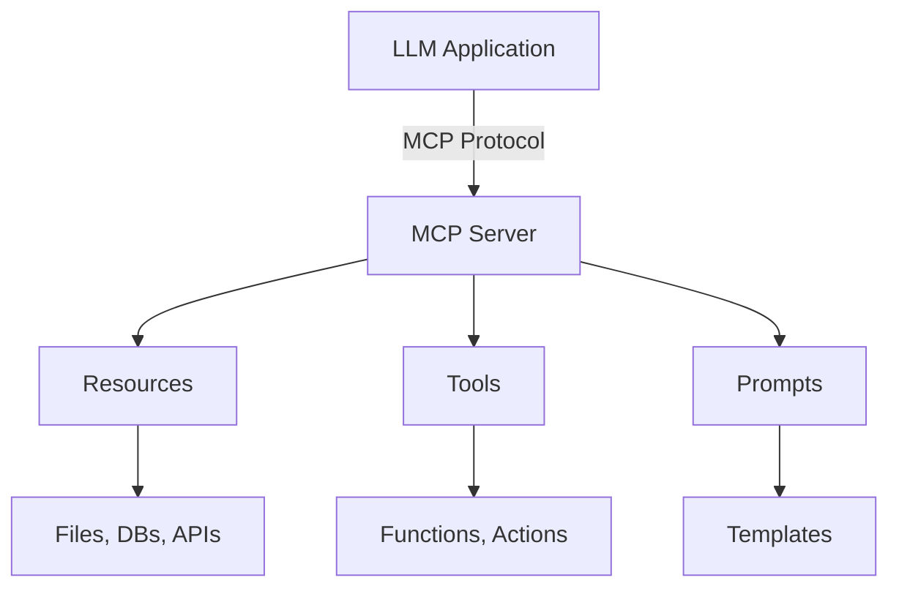

# MCP Server (Model Context Protocol)

## Overview
**Model Context Protocol (MCP)** is an open-source standard by Anthropic for connecting AI models to external data sources, tools, and services. Provides a universal interface eliminating custom integrations for each data source.

## Architecture



**Key Components**:
- **MCP Hosts**: LLM apps (Claude Desktop, IDEs)
- **MCP Servers**: Services exposing resources/tools/prompts
- **MCP Protocol**: JSON-RPC based communication
- **MCP Clients**: Libraries for connecting to servers

## MCP Server Components

### 1. Resources
Data that can be read by the LLM.

| Type | Examples |
|------|----------|
| Files | Documents, configs, code |
| Database | Query results, schemas |
| APIs | REST endpoints, webhooks |

### 2. Tools
Functions the LLM can invoke to perform actions.

| Type | Examples |
|------|----------|
| Data ops | CRUD, queries |
| External | API calls, emails |
| Compute | Calculations, transforms |

### 3. Prompts
Reusable templates with dynamic parameters.

## Building an MCP Server

### Server Structure (Python SDK)
1. Create `Server` instance
2. Register handlers with decorators:
   - `@app.list_resources()` - List available resources
   - `@app.read_resource()` - Read resource content
   - `@app.list_tools()` - List available tools
   - `@app.call_tool()` - Execute tool
3. Run with `stdio_server()`

### Tool Schema
Tools define input schema using JSON Schema:
- `name`: Tool identifier
- `description`: What the tool does
- `inputSchema`: JSON Schema for parameters

## Configuration

### Claude Desktop Config
**macOS**: `~/Library/Application Support/Claude/claude_desktop_config.json`
**Windows**: `%APPDATA%\Claude\claude_desktop_config.json`

```json
{
  "mcpServers": {
    "my-server": {
      "command": "python",
      "args": ["/path/to/server.py"],
      "env": {"API_KEY": "secret"}
    }
  }
}
```

## Official MCP Servers

| Server | Purpose | Key Features |
|--------|---------|--------------|
| **filesystem** | File access | Read, list, search files |
| **github** | GitHub integration | Repos, issues, PRs |
| **postgres** | Database access | SQL queries, schemas |
| **gdrive** | Google Drive | List, read documents |
| **slack** | Slack integration | Channels, messages |

## Protocol Communication

MCP uses JSON-RPC 2.0:
- **Request**: `{jsonrpc, id, method, params}`
- **Response**: `{jsonrpc, id, result}`
- **Methods**: `tools/call`, `resources/read`, `prompts/get`

## Security Best Practices

| Concern | Solution |
|---------|----------|
| Input validation | Sanitize all arguments |
| SQL injection | Use parameterized queries |
| Path traversal | Validate file paths against allowed dirs |
| Rate limiting | Track requests per client |
| Authentication | Verify API keys on initialize |
| Sandboxing | Restrict to allowed directories/operations |

## Integration Patterns

| Pattern | Description |
|---------|-------------|
| **Database** | Expose tables as resources, queries as tools |
| **REST API** | Wrap endpoints as tools |
| **File watcher** | Monitor directories, expose changes |
| **Multi-service** | Aggregate multiple data sources |

## Best Practices

1. **Error handling**: Return clear error messages in TextContent
2. **Logging**: Log all tool invocations for debugging
3. **Caching**: Cache expensive resource reads
4. **Async**: Use async/await for I/O operations
5. **Validation**: Validate all inputs before processing
6. **Documentation**: Clear descriptions for tools/resources

## Testing

- **Unit tests**: Test handlers in isolation
- **Integration tests**: Use `ClientSession` with actual server
- **Mocking**: Mock external services for reproducibility

## Related Concepts
- [[11.02 LLM Agents]]
- [[11.03 LLM Tool Calls]]
- [[11.06 AG-UI Protocol]]

## References
- Anthropic MCP Documentation
- `pip install mcp` - Official Python SDK
- GitHub: modelcontextprotocol/servers
