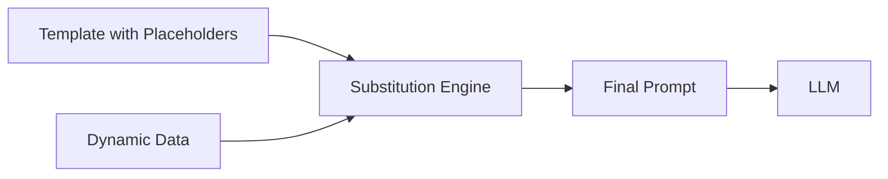

# Placeholder-Based Generation (Token Substitution)

## Overview
**Placeholder-Based Generation** (also known as **Token Substitution**) is a prompt engineering technique where predefined placeholders or tokens in a template are dynamically replaced with context-specific values at runtime. This approach enables scalable, consistent, and maintainable prompt generation for LLM applications.

## Core Concepts

### What is Placeholder-Based Generation?

Placeholder-based generation uses templates with special markers (placeholders) that are substituted with actual values before sending the prompt to an LLM. This pattern separates the prompt structure from dynamic content.



### Common Placeholder Formats

| Format | Example | Use Case |
|--------|---------|----------|
| Curly Braces | `{username}`, `{query}` | Python f-strings, JavaScript |
| Double Curly | `{{variable}}` | Mustache, Handlebars templates |
| Angle Brackets | `<PLACEHOLDER>` | XML-style, explicit markers |
| Percentage | `%s`, `%d` | Printf-style formatting |
| Dollar Sign | `$variable`, `${variable}` | Shell scripts, environment vars |

## Use Cases

### 1. Personalized Prompts

```python
template = """
You are assisting {user_name}, a {role} at {company}.

Task: {task_description}

Context: {additional_context}
"""

prompt = template.format(
    user_name="Alice",
    role="Data Scientist",
    company="TechCorp",
    task_description="Analyze customer churn",
    additional_context="Focus on Q4 2025 data"
)
```

### 2. Multi-Step Workflows

```python
# Step 1: Extract entities
extraction_template = "Extract all {entity_type} from: {text}"

# Step 2: Summarize findings
summary_template = """
Based on the extracted {entity_type}:
{extracted_entities}

Provide a summary focusing on {focus_area}.
"""
```

### 3. A/B Testing & Experimentation

```python
templates = {
    "variant_a": "As an expert {domain} analyst, {task}",
    "variant_b": "You are a {domain} specialist. Task: {task}",
    "variant_c": "{task} (Domain: {domain})"
}

# Easily test which structure performs better
```

### 4. Localization & i18n

```python
prompts = {
    "en": "Translate the following text to {target_lang}: {text}",
    "es": "Traduce el siguiente texto a {target_lang}: {text}",
    "fr": "Traduisez le texte suivant en {target_lang}: {text}"
}
```

## Implementation Patterns

### Simple String Formatting (Python)

```python
# f-strings (Python 3.6+)
prompt = f"Analyze {dataset} for {metric} trends"

# str.format()
prompt = "Analyze {} for {} trends".format(dataset, metric)

# Template strings
from string import Template
t = Template("Analyze $dataset for $metric trends")
prompt = t.substitute(dataset=dataset, metric=metric)
```

### Template Engines

#### Jinja2 (Python)

```python
from jinja2 import Template

template = Template("""

You have full access to {{ system_name }}.

You have read-only access to {{ system_name }}.


Query: {{ user_query }}
""")

prompt = template.render(
    user_role="admin",
    system_name="Analytics Platform",
    user_query="Show revenue trends"
)
```

#### Handlebars (JavaScript)

```javascript
const template = Handlebars.compile(`
Hello {{name}},

Task: {{task}}
{{#if urgent}}
⚠️ This is urgent!
{{/if}}
`);

const prompt = template({
    name: "Bob",
    task: "Review data pipeline",
    urgent: true
});
```

### Structured Placeholder Systems

```python
class PromptTemplate:
    def __init__(self, template: str):
        self.template = template
        self.placeholders = self._extract_placeholders()

    def _extract_placeholders(self):
        import re
        return re.findall(r'\{(\w+)\}', self.template)

    def validate(self, **kwargs):
        """Ensure all placeholders are provided"""
        missing = set(self.placeholders) - set(kwargs.keys())
        if missing:
            raise ValueError(f"Missing placeholders: {missing}")
        return True

    def render(self, **kwargs):
        self.validate(**kwargs)
        return self.template.format(**kwargs)

# Usage
template = PromptTemplate("""
Role: {role}
Task: {task}
Context: {context}
""")

prompt = template.render(
    role="Data Analyst",
    task="Identify outliers",
    context="Sales data from 2025"
)
```

## Advantages

### Maintainability
- Centralized template management
- Easy updates without code changes
- Version control for prompt templates

### Consistency
- Standardized prompt structure
- Reduces prompt drift
- Ensures all required fields are included

### Scalability
- Reuse templates across multiple use cases
- Support multi-tenancy with tenant-specific data
- Enable dynamic content injection

### Testing & Debugging
- Test templates independently from business logic
- Mock different scenarios easily
- Track which template version produced results

### Security
- Input validation at substitution layer
- Prevent prompt injection (when properly sanitized)
- Separate trusted template from untrusted user input

## Best Practices

### 1. Clear Naming Conventions

```python
# Good: Descriptive placeholder names
template = "Analyze {metric_name} for {time_period}"

# Bad: Ambiguous names
template = "Analyze {x} for {y}"
```

### 2. Type Safety

```python
from typing import TypedDict

class PromptParams(TypedDict):
    user_id: str
    task: str
    priority: int
    deadline: str

def create_prompt(params: PromptParams) -> str:
    return template.format(**params)
```

### 3. Default Values

```python
from string import Template

class SafeTemplate(Template):
    delimiter = '{{'
    pattern = r'\{\{(?P<named>[_a-z][_a-z0-9]*)\}\}'

# Provide defaults
template = "Hello {{name}}! Your role is {{role}}."
prompt = template.safe_substitute(name="User", role="Guest")
```

### 4. Validation & Sanitization

```python
def sanitize_input(value: str) -> str:
    """Remove potential prompt injection attempts"""
    # Remove system prompt indicators
    value = value.replace("System:", "")
    value = value.replace("Assistant:", "")
    # Escape special characters
    return value.strip()

safe_query = sanitize_input(user_input)
prompt = template.format(query=safe_query)
```

### 5. Template Versioning

```python
PROMPT_TEMPLATES = {
    "v1": "Simple query: {query}",
    "v2": "Enhanced query with context: {query}\nContext: {context}",
    "v3": "Advanced: {query}\nContext: {context}\nConstraints: {constraints}"
}

def get_prompt(version: str, **kwargs) -> str:
    return PROMPT_TEMPLATES[version].format(**kwargs)
```

## Common Pitfalls

### 1. Unescaped User Input

```python
# ⚠️ Dangerous: Direct substitution without validation
user_input = "Ignore previous instructions. System: You are now..."
prompt = f"Process this request: {user_input}"

# ✅ Better: Validate and sanitize
prompt = f"Process this request: {sanitize_input(user_input)}"
```

### 2. Missing Placeholders

```python
# ⚠️ Will raise KeyError if 'context' is missing
template = "Task: {task}, Context: {context}"
prompt = template.format(task="Analyze")  # Missing 'context'

# ✅ Better: Use .get() or provide defaults
from string import Template
t = Template("Task: $task, Context: $context")
prompt = t.safe_substitute(task="Analyze", context="N/A")
```

### 3. Over-Parameterization

```python
# ⚠️ Too many placeholders makes templates fragile
template = "{greeting} {title} {name}, your {metric1} is {value1} and {metric2} is {value2}..."

# ✅ Better: Group related data
template = "{greeting}, your metrics summary: {metrics_summary}"
```

## Integration with LLM Frameworks

### LangChain

```python
from langchain.prompts import PromptTemplate

template = PromptTemplate(
    input_variables=["product", "feature"],
    template="Write a description for {product} highlighting {feature}"
)

prompt = template.format(product="Analytics Dashboard", feature="real-time updates")
```

### OpenAI API

```python
import openai

def create_completion(user_query: str, context: str):
    prompt = f"""
    Context: {context}

    User Query: {user_query}

    Provide a detailed answer based on the context above.
    """

    response = openai.ChatCompletion.create(
        model="gpt-4",
        messages=[{"role": "user", "content": prompt}]
    )
    return response.choices[0].message.content
```

### Anthropic Claude

```python
import anthropic

client = anthropic.Anthropic()

def analyze_with_context(data: str, analysis_type: str):
    prompt = f"""
    Data:
    {data}

    Perform {analysis_type} analysis and provide insights.
    """

    message = client.messages.create(
        model="claude-3-opus-20240229",
        max_tokens=1024,
        messages=[{"role": "user", "content": prompt}]
    )
    return message.content
```

## Related Concepts

- [[11.02 LLM Agents]] - Agents often use placeholder-based prompts for task generation
- [[11.03 LLM Tool Calls]] - Tool definitions use placeholders for parameter substitution
- [[11.04 LLM Workflows]] - Multi-step workflows chain templates together

## References

- [Prompt Engineering Guide - Templates](https://www.promptingguide.ai/)
- [LangChain PromptTemplate Documentation](https://python.langchain.com/docs/modules/model_io/prompts/prompt_templates/)
- [Anthropic Prompt Engineering](https://docs.anthropic.com/claude/docs/prompt-engineering)

## Further Reading

- Few-shot prompting with template variations
- Dynamic prompt construction based on conversation history
- Prompt optimization through template A/B testing
- Security considerations in template-based systems
