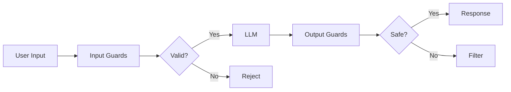

# LLM Guardrails

## Overview
**Guardrails** are safety mechanisms that monitor, validate, and filter LLM inputs and outputs. They prevent harmful, biased, or off-topic responses while maintaining application integrity.

## Guardrail Pipeline

## Types of Guardrails

### Input Guardrails

| Type | Purpose |
|------|---------|
| **Prompt Injection Detection** | Detect "ignore previous instructions" attacks |
| **PII Detection** | Block SSN, credit cards, emails |
| **Toxicity Filtering** | Block hate speech, profanity |
| **Topic Validation** | Reject off-domain questions |
| **Rate Limiting** | Prevent abuse |

**Detection Strategies**:
- Regex patterns for PII (SSN: `\d{3}-\d{2}-\d{4}`)
- Keyword lists for injection attempts
- ML classifiers for toxicity

### Output Guardrails

| Type | Purpose |
|------|---------|
| **Factuality Checking** | Cross-reference with knowledge base |
| **Hallucination Detection** | Check confidence levels |
| **Bias Detection** | Identify unfair outputs |
| **Content Filtering** | Remove harmful content |
| **Format Validation** | Ensure proper JSON/code structure |

### Contextual Guardrails

- **Topic drift detection**: Keep conversation on-topic
- **Jailbreak prevention**: Detect "pretend you are" attempts
- **Session limits**: Enforce turn/token budgets
- **State validation**: Ensure context coherence

## Guardrail Frameworks

| Framework | Approach |
|-----------|----------|
| **NeMo Guardrails** | NVIDIA, dialog flow rules (Colang) |
| **Guardrails AI** | Python validators, structured outputs |
| **LangChain Moderation** | OpenAI moderation API integration |
| **Custom Pipeline** | Combine multiple approaches |

## Implementation Strategies

| Strategy | Best For |
|----------|----------|
| **Rule-based** | Fast, interpretable, known patterns |
| **ML-based** | Nuanced detection, toxicity, sentiment |
| **API-based** | Production-grade (Perspective API) |
| **LLM self-eval** | Complex reasoning, custom criteria |

## Use Case Configurations

### Customer Support
- Input: Profanity filter, rate limit
- Output: Company policy compliance, no financial advice

### Healthcare
- Input: HIPAA compliance, PII detection
- Output: No diagnosis, require disclaimers

### Enterprise
- Input: Data classification, user permissions
- Output: No confidential leakage, audit logging

## Best Practices

### Layered Defense
Multiple layers, not single check:
1. **Fast**: Rule-based (milliseconds)
2. **Medium**: ML classifiers (10-50ms)
3. **Deep**: LLM reasoning (100ms+)

### Fail-Safe Defaults
On error, **reject** (fail closed), not allow.

### Monitoring
Track:
- Blocked inputs/outputs count
- False positive rate
- Latency per guardrail
- Bypass attempt patterns

### User Feedback
Collect feedback on guardrail decisions to improve accuracy over time.

### Performance
- Cache results for identical inputs
- Parallelize independent checks
- Use tiered evaluation (fast → slow)

## Common Patterns

| Pattern | Description |
|---------|-------------|
| **Blocklist** | Reject if matches known bad patterns |
| **Allowlist** | Only allow specific topics/formats |
| **Threshold** | Block if score > threshold |
| **Escalation** | Human review for edge cases |
| **Fallback** | Safe default response when blocked |

## Evaluation Metrics

| Metric | Description |
|--------|-------------|
| **Precision** | % blocked that were actually harmful |
| **Recall** | % harmful content caught |
| **Latency** | Time added per request |
| **False positive rate** | Valid requests incorrectly blocked |

## Related Concepts
- [[11.02 LLM Agents]]
- [[11.04 LLM Workflows]]
- [[11.11 Agentic LLM]]

## References
- NeMo Guardrails Documentation
- Guardrails AI Library
- Google Perspective API
- OpenAI Moderation Endpoint
