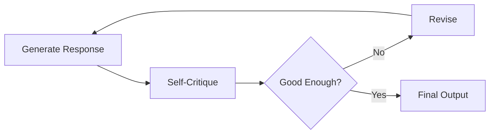
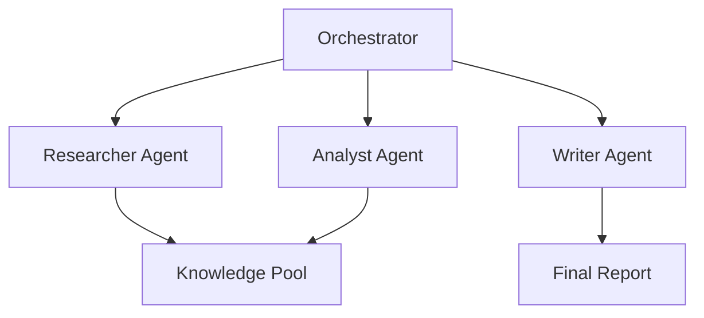

# Agentic LLM

## Overview
Agentic LLMs represent a paradigm shift from passive language models to autonomous agents capable of goal-directed behavior, multi-step reasoning, and iterative problem-solving. Unlike traditional LLMs that provide single-shot responses, agentic systems maintain state, make decisions, and adapt their behavior based on environmental feedback.

## Core Principles

### Autonomy
- Self-directed task execution without constant human intervention
- Ability to break down complex goals into actionable subtasks
- Dynamic replanning based on intermediate results

### Agency
- **Intentionality**: Goal-oriented behavior with clear objectives
- **Reactivity**: Respond to environmental changes in real-time
- **Proactivity**: Anticipate needs and take initiative
- **Social Ability**: Interact with humans and other agents

## Agentic Design Patterns

### 1. Reflection Pattern
Agents evaluate their own outputs and iteratively improve:


**Use Cases**: Code generation, creative writing, complex reasoning

### 2. Tool Use Pattern
Agents extend capabilities through external tools:
- Function calling APIs
- Code interpreters
- Web search and scraping
- Database queries
- File system operations

### 3. Planning Pattern
Decompose complex tasks into executable steps:
- **Single-path**: Linear plan execution
- **Multi-path**: Explore alternative strategies
- **Hierarchical**: Nested task decomposition

### 4. Multi-Agent Collaboration
Specialized agents working together:


## Agentic Workflows

### ReAct (Reasoning + Acting)
Interleave reasoning traces with tool actions:
```
Thought: I need current weather data for location X
Action: weather_api.get_current("X")
Observation: Temperature 72°F, Sunny
Thought: Based on weather, I should recommend...
Action: generate_recommendation(weather_data)
```

### Plan-Execute-Reflect
1. **Plan**: Create structured task breakdown
2. **Execute**: Perform actions sequentially
3. **Reflect**: Evaluate outcomes and adjust

### Recursive Task Decomposition
```python
def solve_task(task):
    if is_simple(task):
        return execute_directly(task)
    else:
        subtasks = decompose(task)
        results = [solve_task(st) for st in subtasks]
        return combine_results(results)
```

## Memory Architecture

### Working Memory
- Current conversation context
- Active task state
- Immediate observations

### Episodic Memory
- Past interactions and experiences
- Success/failure patterns
- Learned strategies

### Semantic Memory
- Domain knowledge
- Tool documentation
- Procedural knowledge

### Implementation Strategies
- **Vector stores**: Semantic similarity search
- **Graph databases**: Relationship-based retrieval
- **Hybrid**: Combine multiple memory types

## Agentic Capabilities

### Self-Improvement
- Learning from past mistakes
- Updating internal knowledge
- Refining strategies over time

### Meta-Cognition
- Monitoring own reasoning process
- Detecting uncertainty and gaps
- Requesting clarification when needed

### Robust Error Handling
- Retry with modified strategies
- Fallback to alternative approaches
- Graceful degradation

## Advanced Agentic Systems

### Generative Agents
Simulate believable human behavior:
- Maintain character profiles
- Generate contextual responses
- Form and pursue goals

### Research Agents
Autonomous information gathering:
1. Query formulation
2. Source discovery
3. Information extraction
4. Synthesis and summarization

### Code Agents
Software development assistance:
- Requirements analysis
- Code generation
- Testing and debugging
- Refactoring

### Decision-Making Agents
Complex analytical tasks:
- Multi-criteria evaluation
- Risk assessment
- Scenario analysis
- Recommendation generation

## Evaluation Metrics

### Task Success Rate
$$\text{Success Rate} = \frac{\text{Completed Tasks}}{\text{Total Tasks}}$$

### Efficiency
- Number of steps to completion
- Token usage
- API calls made
- Time to completion

### Quality Metrics
- Factual accuracy
- Relevance of actions
- Goal alignment
- User satisfaction

## Challenges & Limitations

### Technical Challenges
- **Context window limits**: Managing long-running conversations
- **Error propagation**: Mistakes compound across steps
- **Tool reliability**: Dependencies on external systems
- **State management**: Maintaining coherent agent state

### Safety Concerns
- **Unintended actions**: Agents taking harmful steps
- **Goal misalignment**: Achieving wrong objectives
- **Resource consumption**: Runaway loops and costs
- **Privacy**: Handling sensitive information

### Mitigation Strategies
1. Human-in-the-loop approval for critical actions
2. Sandbox environments for testing
3. Rate limiting and budget controls
4. Comprehensive logging and monitoring
5. Clear stop conditions and guardrails

## Best Practices

### Design Principles
- **Start simple**: Begin with minimal autonomy, expand gradually
- **Clear objectives**: Well-defined goals and success criteria
- **Bounded autonomy**: Constrain action space appropriately
- **Fail safely**: Design for graceful failure modes

### Implementation Guidelines
```python
# Agentic loop structure
def agentic_loop(goal, max_iterations=10):
    state = initialize_state(goal)

    for i in range(max_iterations):
        # Perceive
        observation = perceive_environment(state)

        # Reason
        plan = llm.reason(observation, state, goal)

        # Act
        result = execute_action(plan.next_action)

        # Update
        state = update_state(state, result)

        # Check termination
        if is_goal_achieved(state, goal):
            return state.result

    return handle_timeout(state)
```

### Monitoring & Observability
- Log all LLM calls with prompts and responses
- Track decision trees and reasoning paths
- Monitor token usage and costs
- Alert on anomalous behavior

## Frameworks & Tools

### Agent Orchestration
- **LangGraph**: State machines for complex agents
- **CrewAI**: Role-based multi-agent systems
- **AutoGen**: Multi-agent conversation framework
- **Semantic Kernel**: Plugin-based agent architecture

### Specialized Frameworks
- **Agents**: OpenAI's beta agent framework
- **Swarm**: Lightweight multi-agent coordination
- **TaskWeaver**: Code-first agent framework
- **AgentGPT**: Browser-based autonomous agents

## Related Concepts

- [[11_LLM_Dev_MOC]]
- [[11.02 LLM Agents]] - Basic agent concepts
- [[11.03 LLM Tool Calls]] - Actions in agentic systems
- [[11.04 LLM Workflows]] - Multi-step orchestration
- [[11.10 LLM Guardrails]] - Safety constraints
- [[11.13 Chain of Thought]] - Reasoning patterns

## References
- "The Rise and Potential of Large Language Model Based Agents: A Survey" (2023)
- "ReAct: Synergizing Reasoning and Acting in Language Models"
- "Generative Agents: Interactive Simulacra of Human Behavior"
- "Chain-of-Thought Prompting Elicits Reasoning in Large Language Models"
