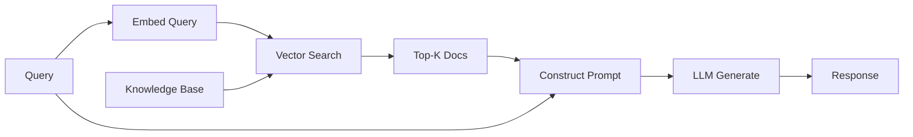

# RAG (Retrieval-Augmented Generation)

## Overview
Technique that enhances LLM outputs by retrieving relevant information from external knowledge sources before generating responses. Addresses hallucination, outdated knowledge, and domain-specific information without model retraining.

## Core Pipeline



### Four Stages
1. **Indexing**: Chunk docs → embed → store in vector DB
2. **Retrieval**: Query → embed → similarity search → top-K docs
3. **Augmentation**: Inject retrieved context into prompt
4. **Generation**: LLM produces grounded response

## Document Processing

### Chunking Strategies

| Strategy | Description | Best For |
|----------|-------------|----------|
| **Fixed-size** | Split by token/character count | Simple, consistent |
| **Semantic** | Split by paragraph/section | Preserve meaning |
| **Recursive** | Try separators in order | Balance both |
| **Sentence** | Split by sentences | Fine-grained retrieval |

**Key Parameters**:
- **Size**: 256-1024 tokens (balance context vs granularity)
- **Overlap**: 10-20% to preserve continuity
- **Boundaries**: Respect semantic units

### Embedding Models

| Provider | Model | Dims | Notes |
|----------|-------|------|-------|
| OpenAI | text-embedding-3-small | 1536 | Fast, cheap |
| OpenAI | text-embedding-3-large | 3072 | Best quality |
| Open Source | BGE-large-en | 1024 | Strong open alternative |
| Open Source | all-MiniLM-L6-v2 | 384 | Lightweight |

## Retrieval Methods

### Basic: Semantic Search
Embed query, find nearest vectors by cosine similarity.

### Hybrid Search
Combine vector (semantic) + BM25 (keyword):
- `alpha=0`: Pure keyword
- `alpha=1`: Pure semantic
- `alpha=0.5`: Balanced

> [!TIP]
> Hybrid works best when users mix natural language with specific terms/IDs.

### Reranking
Two-stage retrieval:
1. Fast retrieval (top 20-50 candidates)
2. Cross-encoder reranking (select top 3-5)

Cross-encoders are more accurate but slower than bi-encoders.

## Advanced Techniques

| Technique | Description | When to Use |
|-----------|-------------|-------------|
| **Multi-Query** | Generate query variations, retrieve for each | Ambiguous queries |
| **HyDE** | Generate hypothetical answer, use for retrieval | Zero-shot domains |
| **Parent-Child** | Retrieve small chunks, expand to parent context | Precise + broad context |
| **Recursive** | Multi-hop retrieval for follow-up questions | Complex reasoning |
| **Self-RAG** | LLM decides when to retrieve | Selective retrieval |

### Conversational RAG
For multi-turn chat:
1. Rewrite follow-up with chat history → standalone query
2. Retrieve with standalone query
3. Generate with history + context

## Prompt Design

Basic template:
```
Use the following context to answer. If unsure, say so.

Context:
[1] {doc1}
[2] {doc2}
...

Question: {query}

Answer with citations [1], [2]:
```

**Tips**:
- Require citations to reduce hallucination
- Number sources for traceability
- Include "if not found, say so" instruction

## Evaluation Metrics

### Retrieval Quality
- **Recall@K**: % relevant docs in top K
- **MRR**: Mean reciprocal rank of first relevant doc
- **NDCG**: Weighted relevance at each position

### Generation Quality
| Metric | Measures |
|--------|----------|
| **Faithfulness** | Is response grounded in context? |
| **Answer Relevance** | Does it address the question? |
| **Context Precision** | Are retrieved docs relevant? |
| **Context Recall** | Was all needed info retrieved? |

Tools: RAGAS, TruLens, DeepEval

## Production Considerations

### Latency Optimization
- Batch embeddings
- Cache frequent queries
- Async retrieval + reranking
- Quantized vectors

### Cost Factors
| Component | Cost Driver |
|-----------|-------------|
| Embeddings | Tokens processed |
| Storage | Vector count × dimensions |
| Retrieval | Queries per month |
| LLM | Context tokens per call |

### Data Freshness
- Incremental indexing for updates
- Timestamp filtering for recency
- Scheduled knowledge base refreshes

### Security
- Filter retrievals by user permissions
- PII handling in stored content
- Multi-tenant data isolation

## Common Challenges

| Problem | Solution |
|---------|----------|
| Irrelevant retrieval | Hybrid search, reranking |
| Lost in middle | Reorder by relevance, compress |
| Outdated info | Timestamp filters, regular updates |
| Long context | Summarization, better chunking |
| Hallucination | Citation requirements, verification |

## Frameworks & Tools

### Orchestration
- **LangChain**: Full pipeline orchestration
- **LlamaIndex**: Advanced indexing
- **Haystack**: Production pipelines

### Vector Stores
See [[23.01 Vector Databases]]

## Related Concepts

- [[11_LLM_Dev_MOC]]
- [[11.02 LLM Agents]] - Agents with RAG retrieval
- [[11.11 Agentic LLM]] - Agentic RAG patterns
- [[23.01 Vector Databases]] - Embedding storage
- [[23.02 TF-IDF]] - Hybrid retrieval baseline

## References
- "Retrieval-Augmented Generation for Knowledge-Intensive NLP Tasks" (Lewis et al., 2020)
- "Self-RAG: Learning to Retrieve, Generate, and Critique"
- "HyDE: Precise Zero-Shot Dense Retrieval"
- RAGAS Framework Documentation
