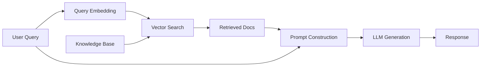
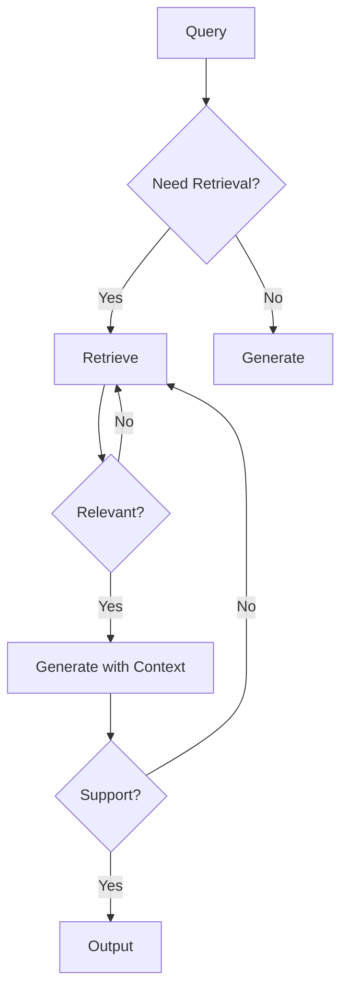

# RAG (Retrieval-Augmented Generation)

## Overview
Retrieval-Augmented Generation (RAG) is a technique that enhances LLM outputs by retrieving relevant information from external knowledge sources before generating responses. It addresses LLM limitations like hallucination, outdated knowledge, and lack of domain-specific information without requiring model retraining.

## Core Architecture



### Basic RAG Pipeline
1. **Indexing**: Convert documents to embeddings and store in vector DB
2. **Retrieval**: Find relevant documents for user query
3. **Augmentation**: Inject retrieved context into LLM prompt
4. **Generation**: LLM produces response based on context

## RAG Components

### 1. Document Processing

#### Chunking Strategies
```python
# Fixed-size chunks
def fixed_chunk(text, chunk_size=512, overlap=50):
    chunks = []
    for i in range(0, len(text), chunk_size - overlap):
        chunks.append(text[i:i + chunk_size])
    return chunks

# Semantic chunks (paragraph/section based)
def semantic_chunk(text):
    return text.split('\n\n')  # Split by paragraphs

# Recursive chunking
def recursive_chunk(text, max_size=1000):
    separators = ['\n\n', '\n', '. ', ' ']
    # Try each separator until chunks are small enough
```

**Chunking Best Practices**:
- **Size**: 256-1024 tokens (balance context vs granularity)
- **Overlap**: 10-20% to preserve context continuity
- **Boundaries**: Respect semantic units (sentences, paragraphs)
- **Metadata**: Preserve document title, section, page number

#### Embedding Generation
```python
from openai import OpenAI

client = OpenAI()

def embed_chunks(chunks):
    response = client.embeddings.create(
        model="text-embedding-3-large",
        input=chunks,
        dimensions=1024  # Optional: reduce dimensionality
    )
    return [e.embedding for e in response.data]
```

**Popular Embedding Models**:
- **OpenAI**: `text-embedding-3-small/large`
- **Open Source**: `BAAI/bge-large-en-v1.5`, `sentence-transformers/all-MiniLM-L6-v2`
- **Domain-Specific**: Fine-tuned models for medical, legal, code

### 2. Vector Storage

#### Vector Database Options
- **Pinecone**: Managed, scalable, fast
- **Weaviate**: Open-source, hybrid search
- **Qdrant**: High-performance, filtering
- **Chroma**: Lightweight, embedded
- **FAISS**: In-memory, research

#### Storage Schema
```python
# Example: Storing chunks with metadata
{
    "id": "doc1_chunk3",
    "embedding": [0.12, -0.34, ...],  # Vector
    "metadata": {
        "source": "technical_manual.pdf",
        "page": 42,
        "section": "Installation Guide",
        "timestamp": "2026-01-10"
    },
    "text": "To install the software..."
}
```

### 3. Retrieval Methods

#### Semantic Search
```python
# Cosine similarity search
def retrieve(query, k=5):
    query_embedding = embed_text(query)
    results = vector_db.similarity_search(
        query_embedding,
        k=k
    )
    return results
```

#### Hybrid Search
Combine vector search with keyword/BM25:
```python
def hybrid_search(query, k=5, alpha=0.5):
    # Vector search
    semantic_results = vector_search(query, k=k*2)

    # BM25 keyword search
    keyword_results = bm25_search(query, k=k*2)

    # Combine with weighted scores
    combined = merge_results(
        semantic_results,
        keyword_results,
        alpha=alpha  # Weight between semantic/keyword
    )
    return combined[:k]
```

#### Reranking
Improve relevance with cross-encoder models:
```python
from sentence_transformers import CrossEncoder

reranker = CrossEncoder('cross-encoder/ms-marco-MiniLM-L-6-v2')

def rerank(query, candidates, top_k=3):
    pairs = [[query, doc.text] for doc in candidates]
    scores = reranker.predict(pairs)

    # Sort by score and return top_k
    ranked = sorted(zip(candidates, scores),
                   key=lambda x: x[1], reverse=True)
    return [doc for doc, score in ranked[:top_k]]
```

### 4. Prompt Construction

#### Basic RAG Prompt
```python
def create_rag_prompt(query, retrieved_docs):
    context = "\n\n".join([
        f"[{i+1}] {doc.text}"
        for i, doc in enumerate(retrieved_docs)
    ])

    prompt = f"""Use the following context to answer the question.
If the answer cannot be found in the context, say so.

Context:
{context}

Question: {query}

Answer:"""
    return prompt
```

#### Advanced Prompt with Citations
```python
prompt = f"""Answer the question using ONLY the provided sources.
Cite sources using [1], [2], etc.

Sources:
{numbered_context}

Question: {query}

Instructions:
- Only use information from the sources
- Cite sources inline with [N]
- If sources don't contain the answer, state that clearly
- Be concise and accurate

Answer:"""
```

## Advanced RAG Techniques

### Multi-Query Retrieval
Generate multiple query variations for better coverage:
```python
def multi_query_rag(user_query):
    # Generate query variations
    variations = llm.generate(
        f"Generate 3 different versions of this question:\n{user_query}"
    )

    # Retrieve for each variation
    all_docs = []
    for query in variations:
        docs = retrieve(query, k=3)
        all_docs.extend(docs)

    # Deduplicate and rerank
    unique_docs = deduplicate(all_docs)
    final_docs = rerank(user_query, unique_docs, top_k=5)

    return generate_with_context(user_query, final_docs)
```

### HyDE (Hypothetical Document Embeddings)
Generate hypothetical answer, then retrieve:
```python
def hyde_rag(query):
    # Generate hypothetical answer
    hypothetical = llm.generate(
        f"Write a detailed answer to: {query}"
    )

    # Use hypothetical answer for retrieval
    docs = retrieve(hypothetical, k=5)

    # Generate final answer with retrieved context
    return generate_with_context(query, docs)
```

### Parent-Child Chunking
Retrieve small chunks, use larger parent for context:
```python
# Index: Small chunks for precise retrieval
small_chunks = chunk_document(doc, size=256)

# Store parent-child relationships
for chunk in small_chunks:
    store_with_parent(
        chunk=chunk,
        parent=get_parent_chunk(chunk, size=1024)
    )

# Retrieval: Find small chunk, use parent for LLM
def retrieve_with_parent(query):
    small_chunks = retrieve(query, k=5)
    parent_chunks = [get_parent(chunk) for chunk in small_chunks]
    return parent_chunks
```

### Recursive Retrieval
Multi-hop retrieval for complex queries:
```python
def recursive_retrieve(query, depth=2):
    docs = retrieve(query, k=3)

    if depth > 0:
        # Extract follow-up questions from retrieved docs
        followups = extract_questions(docs)

        for followup in followups:
            sub_docs = recursive_retrieve(followup, depth-1)
            docs.extend(sub_docs)

    return deduplicate(docs)
```

### Self-RAG
LLM decides when to retrieve and evaluates relevance:


## RAG Evaluation

### Retrieval Metrics

**Recall@K**: Percentage of relevant docs in top K
$$\text{Recall@K} = \frac{\text{Relevant docs in top K}}{\text{Total relevant docs}}$$

**MRR (Mean Reciprocal Rank)**
$$\text{MRR} = \frac{1}{|Q|} \sum_{i=1}^{|Q|} \frac{1}{\text{rank}_i}$$

**NDCG (Normalized Discounted Cumulative Gain)**
$$\text{DCG@K} = \sum_{i=1}^{K} \frac{2^{rel_i} - 1}{\log_2(i + 1)}$$

### Generation Metrics

- **Faithfulness**: Response grounded in retrieved context
- **Answer Relevance**: Response addresses the question
- **Context Precision**: Retrieved docs are relevant
- **Context Recall**: All needed info was retrieved

### RAGAS Framework
```python
from ragas import evaluate
from ragas.metrics import (
    faithfulness,
    answer_relevancy,
    context_precision,
    context_recall
)

results = evaluate(
    dataset,
    metrics=[
        faithfulness,
        answer_relevancy,
        context_precision,
        context_recall
    ]
)
```

## Production Considerations

### Latency Optimization
- **Batch embeddings**: Process multiple chunks together
- **Caching**: Cache frequent queries and embeddings
- **Async retrieval**: Parallelize vector search and reranking
- **Index optimization**: Use quantization, filtering

### Cost Management
```python
# Estimate costs
embedding_cost = num_chunks * EMBEDDING_PRICE_PER_1K / 1000
storage_cost = num_vectors * dimensions * STORAGE_PRICE
retrieval_cost = queries_per_month * SEARCH_PRICE
llm_cost = avg_context_tokens * calls * LLM_PRICE_PER_1K / 1000

total_monthly_cost = (
    embedding_cost + storage_cost +
    retrieval_cost + llm_cost
)
```

### Data Freshness
- **Incremental indexing**: Add/update documents without reindexing all
- **Timestamp filtering**: Prioritize recent documents
- **Version control**: Track document versions
- **Scheduled updates**: Regular knowledge base refreshes

### Security & Privacy
- **Access control**: Filter retrievals by user permissions
- **PII handling**: Redact sensitive information
- **Data isolation**: Multi-tenant vector stores
- **Audit logging**: Track what users access

## Common Patterns

### Conversational RAG
```python
def conversational_rag(query, chat_history):
    # Rewrite query with chat context
    standalone_query = llm.generate(
        f"History: {chat_history}\n"
        f"Follow-up: {query}\n"
        f"Standalone question:"
    )

    # Retrieve with standalone query
    docs = retrieve(standalone_query, k=5)

    # Generate with history + context
    response = llm.generate(
        f"History: {chat_history}\n"
        f"Context: {docs}\n"
        f"Question: {query}\n"
        f"Answer:"
    )

    return response
```

### Multi-Modal RAG
```python
def multimodal_rag(query, doc_type='mixed'):
    # Retrieve text
    text_docs = retrieve_text(query, k=3)

    # Retrieve images (with CLIP embeddings)
    if doc_type in ['image', 'mixed']:
        image_docs = retrieve_images(query, k=2)

    # Retrieve tables (structured data)
    if doc_type in ['table', 'mixed']:
        table_docs = retrieve_tables(query, k=2)

    # Generate with multi-modal context
    return llm.generate_multimodal(
        query, text_docs, image_docs, table_docs
    )
```

### Agentic RAG
```python
def agentic_rag(query):
    agent_prompt = f"""You have access to a knowledge base retrieval tool.

Query: {query}

Plan your retrieval strategy:
1. What should you search for?
2. Do you need multiple searches?
3. What follow-up searches might help?

Execute your plan step by step."""

    # Agent decides retrieval strategy
    plan = agent.plan(agent_prompt)

    # Execute planned retrievals
    all_docs = []
    for search in plan.searches:
        docs = retrieve(search.query, k=search.k)
        all_docs.extend(docs)

    # Agent synthesizes final answer
    return agent.synthesize(query, all_docs)
```

## Challenges & Solutions

| Challenge | Solution |
|-----------|----------|
| **Irrelevant retrieval** | Hybrid search, reranking, query expansion |
| **Lost in the middle** | Reorder docs by relevance, use smaller context |
| **Outdated information** | Timestamp filtering, regular updates |
| **Expensive embeddings** | Cache, batch processing, smaller models |
| **Long context limits** | Compression, summarization, chunking |
| **Hallucination** | Citation requirements, faithfulness checks |
| **Multi-hop reasoning** | Recursive retrieval, agentic RAG |

## Tools & Frameworks

### Complete RAG Frameworks
- **LangChain**: Full RAG orchestration
- **LlamaIndex**: Advanced indexing and retrieval
- **Haystack**: Production-ready RAG pipelines
- **DSPy**: Programmatic RAG optimization

### Vector Databases
- **Pinecone**: Managed vector DB
- **Weaviate**: Hybrid search capabilities
- **Qdrant**: High-performance filtering
- **Chroma**: Lightweight embedding DB
- **Milvus**: Scalable vector similarity search

### Evaluation
- **RAGAS**: RAG assessment framework
- **TruLens**: LLM observability and evaluation
- **DeepEval**: LLM testing framework

## Best Practices

1. **Start simple**: Basic RAG before advanced techniques
2. **Measure everything**: Track retrieval and generation metrics
3. **Iterate on chunks**: Experiment with size, overlap, boundaries
4. **Tune retrieval**: Test different k values, reranking
5. **Prompt engineering**: Clear instructions, citation requirements
6. **User feedback**: Collect thumbs up/down, improve over time
7. **Monitor costs**: Track embedding, storage, LLM usage
8. **Handle failures**: Fallback responses, retry logic

## Related Concepts
- [[11.04 LLM Workflows]]
- [[11.02 LLM Agents]]
- [[11.11 Agentic LLM]]
- [[23_Database_Retrieval]]

## References
- "Retrieval-Augmented Generation for Knowledge-Intensive NLP Tasks" (Lewis et al., 2020)
- "RAGAS: Automated Evaluation of Retrieval Augmented Generation"
- "Self-RAG: Learning to Retrieve, Generate, and Critique through Self-Reflection"
- "HyDE: Precise Zero-Shot Dense Retrieval without Relevance Labels"
