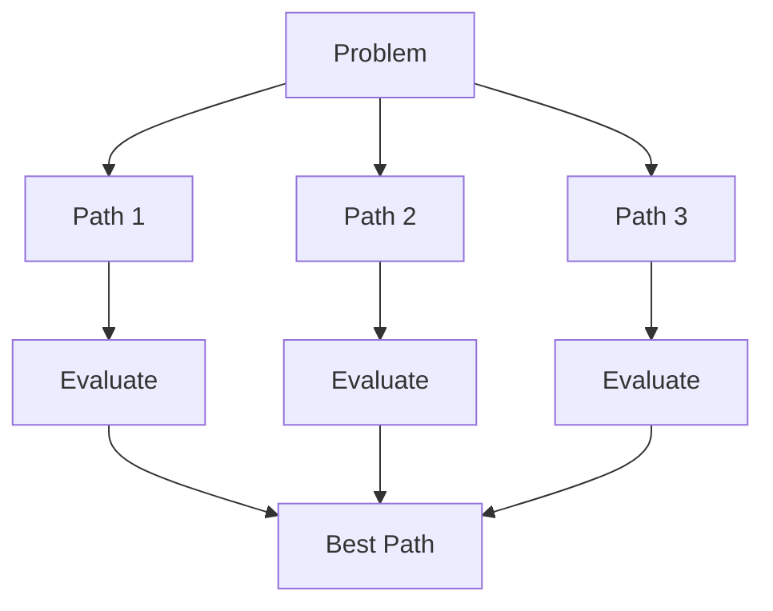

# Chain of Thought (CoT)

## Overview
Chain of Thought prompting is a technique that encourages LLMs to break down complex reasoning into intermediate steps before arriving at a final answer. This mimics human step-by-step problem solving and significantly improves performance on tasks requiring multi-step reasoning.

## Why It Works
- Forces explicit reasoning rather than pattern matching
- Reduces errors by validating each step
- Makes model's logic transparent and debuggable
- Improves accuracy on math, logic, and multi-hop questions

## Prompting Techniques

| Technique | Description | Use Case |
|-----------|-------------|----------|
| **Zero-shot CoT** | Add "Let's think step by step" | Quick reasoning boost |
| **Few-shot CoT** | Provide examples with reasoning | Consistent format |
| **Auto-CoT** | LLM generates its own examples | Domain adaptation |
| **Complex CoT** | Select complex examples for demos | Hard reasoning tasks |

### Zero-shot CoT
Simply append reasoning trigger:
```
Q: {question}
A: Let's think step by step.
```

### Few-shot CoT
Provide worked examples:
```
Q: If there are 3 cars in a parking lot and 2 more arrive, how many are there?
A: Let's work through this:
- Start with 3 cars
- 2 more arrive: 3 + 2 = 5
- Therefore, there are 5 cars.

Q: {new_question}
A:
```

## Advanced Variants

### Tree of Thoughts (ToT)
Explore multiple reasoning branches:

- Generate multiple next-step candidates
- Evaluate each path's promise
- Prune or expand branches
- Backtrack if needed

### Self-Consistency
Sample multiple reasoning paths, take majority vote:
1. Generate N different CoT reasoning chains
2. Extract final answer from each
3. Return most frequent answer
4. Higher N = more reliable, more costly

### Least-to-Most Prompting
Decompose → Solve subproblems → Combine:
```
1. Break problem into simpler sub-questions
2. Solve each sub-question in order
3. Use prior answers to solve later ones
4. Combine for final answer
```

## When to Use CoT

| Good Fit | Poor Fit |
|----------|----------|
| Math word problems | Simple factual recall |
| Multi-step logic | Single-step tasks |
| Code debugging | Classification |
| Planning tasks | Translation |
| Comparative analysis | Summarization |

## Implementation Tips
- **Be explicit**: "Think through this carefully, step by step"
- **Format output**: Request numbered steps for clarity
- **Validate steps**: Ask model to verify each step
- **Cost awareness**: More tokens = higher cost

## Limitations
- Increases token usage and latency
- Can produce plausible-sounding but wrong reasoning
- Not always beneficial for simple tasks
- May require task-specific examples

## Related Concepts
- [[11.02 LLM Agents]] - Agents use CoT for planning
- [[11.04 LLM Workflows]] - CoT in iterative refinement
- [[11.11 Agentic LLM]] - ReAct combines reasoning with actions
- [[11.09 Placeholder-Based Generation]] - Templates for CoT prompts

## References
- "Chain-of-Thought Prompting Elicits Reasoning in Large Language Models" (Wei et al., 2022)
- "Self-Consistency Improves Chain of Thought Reasoning in Language Models"
- "Tree of Thoughts: Deliberate Problem Solving with Large Language Models"
- "Least-to-Most Prompting Enables Complex Reasoning in Large Language Models"
