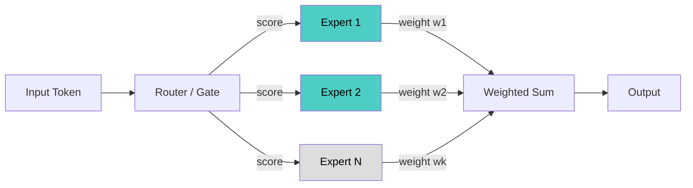

# Mixture of Experts (MoE)

## Overview
**Mixture of Experts (MoE)** is a neural network architecture that uses a **gating mechanism** to route each input to a subset of specialized sub-networks (**experts**), enabling massive model capacity without proportionally increasing compute cost per inference.

## Key Concepts
- **Experts**: Independent feed-forward networks, each specializing in different input patterns
- **Gating Network (Router)**: Learned module that decides which experts process each token
- **Sparse Activation**: Only a few experts (e.g., 2 out of 64) are activated per token → compute stays manageable
- **Top-k Routing**: Router selects top-k experts per token; outputs are weighted-summed
- **Total Parameters vs Active Parameters**: MoE models have large total params but only a fraction is active per forward pass

## How It Works



| Component | Role |
|---|---|
| Router / Gate | Produces probability distribution over experts |
| Expert FFN | Processes token independently |
| Load Balancing Loss | Auxiliary loss to prevent routing collapse (all tokens → same expert) |

## Routing Techniques

### 1. Token-Choice Routing (Top-k)
Each **token** independently selects its top-k experts. Standard approach used in most MoE models.

$$g(x) = \text{Softmax}(\text{TopK}(x \cdot W_g))$$

- ✅ Simple, well-studied
- ❌ Can cause load imbalance — popular experts get overloaded

### 2. Expert-Choice Routing
Each **expert** selects its top-k tokens (inverted selection). Introduced in Google's Expert Choice paper (2022).

- ✅ Guaranteed perfect load balance
- ❌ Tokens may be dropped if no expert selects them; hard to use for autoregressive generation

### 3. Switch Routing (Top-1)
Route each token to exactly **1 expert**. Maximally sparse — used in Switch Transformer.

- ✅ Lowest compute cost per token
- ❌ Less expressive; more sensitive to routing errors

### 4. Shared Expert Routing (DeepSeek-V2/V3)
Combine **shared experts** (always active) + **routed experts** (sparse). Shared experts handle common patterns; routed experts handle specialization.

```
Output = SharedExpert(x) + Σ(RouteExpert_i(x) · gate_i)
```

- ✅ Better generalization; fewer cold-start issues for new tokens
- Used in: DeepSeek-V2, DeepSeek-V3

### 5. Fine-Grained Expert Segmentation
Split each large expert into many smaller experts (e.g., 1 expert → 4 smaller ones, k scales proportionally). Increases routing granularity without increasing compute.

- More flexible combinations; better specialization
- Used in: DeepSeek-V2 (160 routed + 2 shared experts)

---

## Load Balancing Techniques

Routing collapse (all tokens → same expert) is a key failure mode. Solutions:

| Technique | How It Works |
|---|---|
| **Auxiliary Loss** | Add $L_{aux} = \alpha \cdot \sum_i f_i \cdot P_i$ penalizing uneven expert usage |
| **Token Dropping** | Cap the number of tokens per expert; excess tokens skip that expert |
| **Expert Capacity Factor** | Buffer capacity = `(tokens/experts) × capacity_factor`; overflow is dropped |
| **Z-loss** | Penalizes large router logits to stabilize softmax (PaLM-2, Gemini) |
| **Random Jitter** | Add noise to router logits during training to encourage exploration |

> [!WARNING] Auxiliary Loss Weight
> Too high $\alpha$ → forces uniform routing, destroying specialization. Too low → experts collapse. Tune carefully (typical range: `1e-2` to `1e-3`).

---

## Training Techniques

### Gradient Flow through Router
Router uses straight-through estimator or soft routing during training — the discrete top-k selection is non-differentiable, so gradients flow through the **weights** (soft scores), not the selection itself.

### Expert Parallelism
Distribute different experts across devices. Requires all-to-all communication (tokens → their assigned expert device) — the dominant communication cost in distributed MoE.

```
Device 1: Expert 1, 2    ← tokens routed here via all-to-all
Device 2: Expert 3, 4
Device 3: Expert 5, 6, 7, 8
```

### Mixed Precision & Quantization
- Experts can be quantized independently (e.g., INT4/INT8)
- Popular for CPU/consumer GPU offloading (llama.cpp, Ollama)
- Shared experts typically kept in higher precision

---

## Notable MoE Models

| Model | Total Params | Active Params | Experts | Top-k | Key Innovation |
|---|---|---|---|---|---|
| Switch Transformer | varies | varies | up to 2048 | 1 | Ultra-sparse top-1 routing |
| Mixtral 8x7B | ~47B | ~13B | 8 | 2 | First widely adopted open MoE |
| GPT-4 (rumored) | ~1.8T | ~280B | 16 | 2 | Large-scale MoE at OpenAI |
| DeepSeek-V2 | 236B | 21B | 160 + 2 shared | 6 | Fine-grained + shared experts |
| DeepSeek-V3 | 671B | 37B | 256 + 1 shared | 8 | Multi-token prediction + MoE |
| Qwen1.5-MoE | 14.3B | 2.7B | 64 | 4 | Efficient small MoE |

---

## Advantages
- **Scales capacity** without linear compute increase
- **Faster inference** than equivalent dense model at same param count
- **Specialization** — experts learn distinct syntactic/semantic patterns

## Challenges
- **Load balancing** — uneven routing degrades performance
- **Memory footprint** — all expert weights must be loaded even if sparse
- **Training instability** — routing collapse; requires careful auxiliary loss tuning
- **Communication overhead** — expert parallelism adds all-to-all latency
- **Cold experts** — some experts rarely activated; waste parameters

> [!TIP] When to prefer MoE
> Use MoE when you need **large model capacity** but are constrained on **inference compute budget**. Ideal for serving at scale where latency matters.

> [!WARNING] Memory vs Compute tradeoff
> MoE saves compute but **not memory** — all expert weights must reside in memory (or be offloaded), making deployment on small GPUs challenging.

## Related Concepts
- [[11_LLM_Dev_MOC]] - Parent category
- [[11.01 Attention Mechanism]] - Core building block; MoE replaces FFN layers in transformers
- [[11.18 LLM Throughput & Memory Bound]] - MoE compute vs memory tradeoffs at inference
- [[11.16 Context Window Management]] - MoE affects per-token compute budget
- [[13.10 Activation Functions]] - Used within expert FFN layers
