# Era of LLM

## Overview
The LLM landscape has evolved through distinct eras — each shifting **what matters most** when building with language models. The progression moves from crafting better prompts, to engineering richer context, to building autonomous agents, and finally to orchestrating full agentic systems.

## The Four Eras

```mermaid
graph LR
    A["🔤 Prompt Engineering<br/>(2022-2023)"] --> B["📦 Context Engineering<br/>(2024-2025)"]
    B --> C["🤖 Agent Era<br/>(2025)"]
    C --> D["🌐 Agentic Era<br/>(2025+)"]
    style A fill:#f9d71c,color:#000
    style B fill:#4ecdc4,color:#000
    style C fill:#45b7d1,color:#000
    style D fill:#6c5ce7,color:#fff
```

### Era 1 — Prompt Engineering (2022–2023)

**Core idea**: The quality of output depends on how you **ask** the model.

| Technique | Description |
|---|---|
| Zero/Few-shot | Provide examples within the prompt |
| [[11.13 Chain of Thought]] | "Think step by step" |
| Role prompting | "You are a senior engineer…" |
| Output formatting | Constrain response structure (JSON, XML) |

> [!INFO] Bottleneck
> The model only knows what's in its training data and the prompt. No external knowledge, no actions.

**Limitation**: No matter how clever the prompt, the model is **stateless** and **toolless** — it can only generate text.

---

### Era 2 — Context Engineering (2024–2025)

**Core idea**: The quality of output depends on **what information** you feed the model.

The focus shifted from *how you ask* to *what you provide*. Context engineering is the art of building dynamic systems that supply the **right information at the right time** within the context window.

| Component | Role |
|---|---|
| [[11.12 RAG]] | Retrieve relevant docs at query time |
| [[11.16 Context Window Management]] | Optimize what fits in the window |
| System prompts | Persistent instructions & persona |
| Conversation history | Multi-turn memory |
| Tool results | Inject real-world data into context |

> [!TIP] Key Insight
> "Context engineering" reframes the problem — you're no longer writing prompts, you're **building information pipelines** that assemble the perfect context for each request.

**Context engineering includes:**
- **Retrieval** — pulling from vector DBs, knowledge graphs, APIs
- **Compression** — summarizing history, pruning irrelevant tokens
- **Routing** — selecting which context sources matter per query
- **Ordering** — structuring context for optimal model attention

**Limitation**: The model still responds **reactively** — one request, one response. No autonomy.

---

### Era 3 — Agent (2025)

**Core idea**: The model can **reason, plan, and act** using tools in a loop.

Agents break free from single-turn interactions. An LLM agent perceives, reasons, acts, and observes in a continuous loop until a goal is achieved.

```mermaid
graph TD
    A[User Goal] --> B[Plan]
    B --> C[Act — Tool Call]
    C --> D[Observe Result]
    D --> E{Goal Met?}
    E -->|No| B
    E -->|Yes| F[Return Result]
```

| Capability | What Changed |
|---|---|
| [[11.03 LLM Tool Calls]] | Models can call functions & APIs |
| [[11.13 Chain of Thought]] | Structured multi-step reasoning |
| ReAct pattern | Interleave thinking and acting |
| Memory | Maintain state across steps |

> [!WARNING] Challenge
> Single agents are powerful but fragile — they hallucinate plans, misuse tools, and lack specialization for complex tasks.

**Limitation**: A single agent struggles with tasks requiring **diverse expertise** or **parallel workstreams**.

---

### Era 4 — Agentic Systems (2025+)

**Core idea**: Multiple specialized agents **collaborate** within orchestrated systems.

The agentic era moves from *one agent doing everything* to **systems of agents** — each with distinct roles, tools, and memory — coordinated by orchestration layers.

| Pattern | Description |
|---|---|
| Multi-agent collaboration | Specialized agents with distinct roles |
| [[11.08 MCP Server]] | Standardized tool connectivity |
| [[11.06 AG-UI Protocol]] | Agent-to-UI streaming |
| [[11.10 LLM Guardrails]] | Safety rails for autonomous systems |
| Human-in-the-loop | Approval gates for critical actions |

> [!TIP] The Agentic Stack
> Agentic systems combine **all previous eras**: prompt engineering for agent instructions, context engineering for knowledge retrieval, and agent loops for execution — all orchestrated across multiple agents.

**Key characteristics:**
- **Specialization** — each agent is expert at one domain
- **Delegation** — orchestrator routes tasks to the right agent
- **Parallelism** — agents work concurrently on subtasks
- **Resilience** — failure in one agent doesn't collapse the system
- **Protocol-driven** — standardized communication (MCP, AG-UI, A2A)

---

## Evolution Summary

| Dimension | Prompt Eng. | Context Eng. | Agent | Agentic |
|---|---|---|---|---|
| **Focus** | How to ask | What to provide | How to act | How to orchestrate |
| **Interaction** | Single-turn | Single-turn + retrieval | Multi-turn loop | Multi-agent system |
| **Tools** | ❌ | ❌ (retrieval only) | ✅ Single agent | ✅ Multi-agent |
| **Autonomy** | None | None | Goal-directed | System-level |
| **Memory** | Prompt only | Context window | Working + episodic | Shared + individual |
| **Failure mode** | Bad output | Missing context | Hallucinated plans | Coordination failures |
| **Key skill** | Prompt craft | Information architecture | Agent design | System orchestration |

> [!EXAMPLE] Concrete Example — "Analyze competitor pricing"
> - **Prompt eng.**: "List competitors and their prices" → model guesses from training data
> - **Context eng.**: RAG retrieves latest pricing docs → model summarizes accurately
> - **Agent**: Agent searches web, scrapes sites, builds comparison table autonomously
> - **Agentic**: Research agent gathers data, analyst agent compares, writer agent produces report — all coordinated

## What's Next?

- **Autonomous multi-agent ecosystems** with persistent memory across sessions
- **Self-improving agents** that learn from past task outcomes
- **Agent marketplaces** — composable, reusable agent components
- **Formal verification** of agent behavior for safety-critical domains

## Related Concepts
- [[11_LLM_Dev_MOC]] - Parent category
- [[11.14 Prompt Engineering]] - Era 1: crafting effective prompts
- [[11.16 Context Window Management]] - Era 2: managing what the model sees
- [[11.12 RAG]] - Era 2: retrieval-augmented context
- [[11.02 LLM Agents]] - Era 3: autonomous agent fundamentals
- [[11.11 Agentic LLM]] - Era 4: agentic design patterns
- [[11.03 LLM Tool Calls]] - Enabler for agent and agentic eras
- [[11.08 MCP Server]] - Protocol for agentic tool connectivity
- [[11.06 AG-UI Protocol]] - Agent-to-UI communication
