# LLM Memory Architecture

## Overview
LLM-based agents need memory beyond the context window to build persistent, intelligent systems. Memory is categorized by **scope** (how long it lasts), **storage** (where it lives), and **access pattern** (how it's retrieved).

```mermaid
graph TD
    A[Agent] --> WM["🧠 Working Memory\n(In-context / Short-term)"]
    A --> EM["📖 Episodic / Recall Memory\n(Conversation History)"]
    A --> AM["🗄️ Archival Memory\n(Long-term / External)"]
    A --> PM["⚙️ Procedural / Entity Memory\n(Reflective / Semantic)"]
    WM -->|"limited by context window"| CW[Context Window]
    AM -->|"retrieve via similarity search"| VDB[(Vector DB)]
    PM -->|"retrieve via key lookup"| KV[(Key-Value / Graph)]
```



---

## 1. Short-Term Memory — Working Memory (In-Context)

**What**: Everything currently inside the **context window** — the model's active "RAM".

**Storage**: In-context tokens (prompt + conversation history)

**Characteristics**:
- Immediately available — no retrieval step
- Bounded by context window size (4K → 1M+ tokens depending on model)
- Ephemeral — lost when the session ends
- Most expensive memory type (every token costs compute)

**Contents typically include**:
- System prompt / persona instructions
- Current conversation turns
- Tool call results injected into context
- Retrieved chunks from RAG
- Scratchpad / chain-of-thought reasoning

**Management strategies** (see [[11.16 Context Window Management]]):
- Sliding window — keep only the last N turns
- Summarization — compress old turns into a summary
- Priority eviction — keep high-value turns, drop filler
- [[11.21 Prompt Caching]] — reuse the KV cache of static prefix tokens

> [!INFO] Working memory ≠ context window size
> The context window is the **limit**. Working memory is the **design** of what you put inside it — system prompt, history, retrieved docs, tool outputs, etc.

---

## 2. Long-Term Memory — Archival Memory (External)

**What**: Persistent storage outside the model, retrieved on demand. Survives across sessions.

**Storage**: Vector databases, document stores, SQL/NoSQL databases

**Access pattern**: Semantic similarity search (embedding-based) or keyword/metadata filter

**Types of archival memory**:

| Sub-type | What's stored | Retrieval |
|---|---|---|
| **Episodic** | Past conversation summaries, interaction logs | Similarity + timestamp |
| **Semantic** | Facts, domain knowledge, reference docs | Similarity search (RAG) |
| **User memory** | User preferences, profile, past decisions | Key lookup + similarity |


**Frameworks**:
- [[11.12 RAG]] — primary pattern for semantic archival retrieval
- **MemGPT / Letta** — OS-inspired memory management (archival storage + paging)
- **Mem0** — user-level persistent memory layer
- **Zep** — long-term memory for conversational AI

> [!TIP] Archival memory vs RAG
> RAG is the **retrieval mechanism** for archival memory. Archival memory is the broader concept of what you store and why — RAG is how you get it back into context.

---

## 3. Entity / Procedural Memory — Reflective Memory (Semantic)

**What**: Structured knowledge about **specific entities** (people, objects, concepts) and **how to do things** (procedures, skills, workflows). Updated through **reflection** — the agent writes to its own memory based on experience.

**Storage**: Key-value stores, knowledge graphs, structured documents

**Sub-types**:

### Entity Memory
Tracks facts about named entities across interactions:
```
User "Alice":
  - Prefers Python over JavaScript
  - Works on recommendation systems
  - Has asked about RAG 3 times
```

### Procedural Memory
Encodes learned skills, task templates, and SOPs:
```
Procedure: "Debug async Python code"
  1. Check event loop not blocked
  2. Add asyncio.create_task() tracing
  3. Use aiohttp debug mode
  4. ...
```

### Reflective Memory (Self-Updating)
Agent periodically reflects and writes structured summaries back to memory:


**Inspiration**: [Generative Agents (Park et al., 2023)](https://arxiv.org/abs/2304.03442) — agents maintain a "memory stream" and periodically reflect to extract higher-level insights.

**Frameworks**:
- **LangMem** — LangChain's memory management library
- **LangGraph + MemorySaver** — checkpointed state across runs
- **Graphiti / Zep** — entity-aware memory graphs
- **Cognitive Architectures** (SOAR, ACT-R inspired) — procedural + declarative split

---

## Memory Types Comparison

| | Working Memory | Archival Memory | Entity/Procedural Memory |
|---|---|---|---|
| **Scope** | Current session | Cross-session | Cross-session |
| **Storage** | Context window (in-model) | External DB | External DB (structured) |
| **Capacity** | Limited (tokens) | Unlimited | Unlimited |
| **Retrieval** | Instant (already in context) | Semantic search | Key lookup / graph |
| **Latency** | None | ~50–200ms | ~10–100ms |
| **Cost** | High (tokens) | Low (storage + embed) | Low (storage) |
| **Persistence** | Session only | Permanent | Permanent |
| **Write mechanism** | Prompt construction | Manual / RAG ingestion | Reflection / extraction |

---

## Design Patterns

### MemGPT Paging Model
Treat the context window like RAM and external storage like disk. Agent explicitly calls `memory_search()` and `memory_insert()` tools to page information in/out.

```
[Core Memory]  ← always in context (persona, user facts)
[Recall Memory] ← recent conversation summaries
[Archival Memory] ← deep storage, retrieved on demand
```

### Layered Memory Stack
```
Layer 1: System prompt     (static, always present)
Layer 2: Core user profile (semi-static, updated rarely)
Layer 3: Session summary   (updated each turn)
Layer 4: Retrieved docs    (dynamic, query-dependent)
Layer 5: Current turn      (ephemeral)
```

### Write-Then-Retrieve Loop
```
Agent observes → extracts entities → writes to memory store
Agent queries → retrieves relevant memory → acts → writes back
```

---

## Practical Use Cases

| Use Case | Memory Types Used |
|---|---|
| Customer support bot | Working + Entity (user history) |
| Personal AI assistant | Working + Archival + Entity |
| Research agent | Working + Archival (knowledge base) |
| Long-running coding agent | Working + Procedural (learned patterns) |
| Multi-session companion | All four types |

---

## Related Concepts
- [[11_LLM_Dev_MOC]] - Parent category
- [[11.16 Context Window Management]] - Managing working memory effectively
- [[11.21 Prompt Caching]] - Reducing working memory cost via KV cache reuse
- [[11.12 RAG]] - Primary retrieval mechanism for archival memory
- [[11.11 Agentic LLM]] - Memory is a core component of agentic design
- [[11.02 LLM Agents]] - Agent loop uses all memory types
- [[11.19 Era of LLM]] - Context engineering era built on memory architecture
