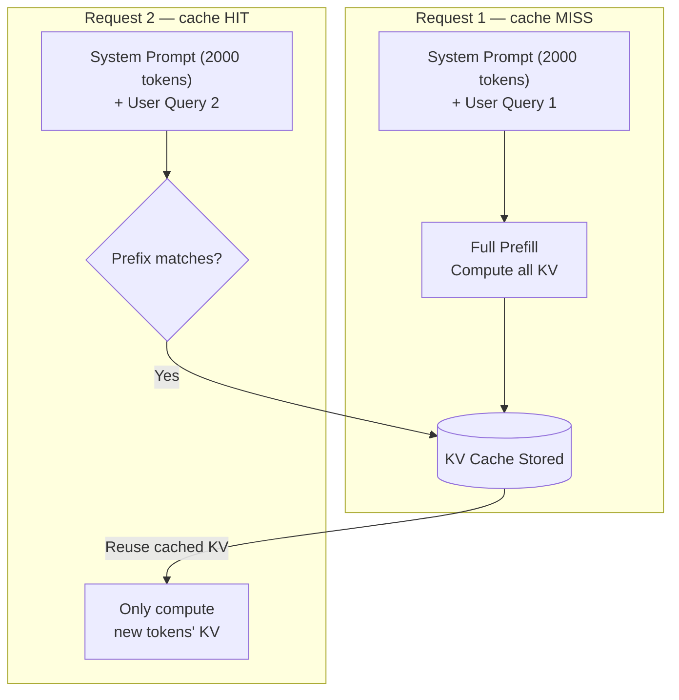

# Prompt Caching

## Overview
**Prompt caching** reuses the **KV (key-value) cache** from a previous LLM inference when the **prefix of a new request matches** a prior one. This avoids recomputing attention keys and values for the static part of the prompt — dramatically reducing latency and cost for requests with large, repeated prefixes.

> [!INFO] What is the KV cache?
> During the attention mechanism's forward pass, every token generates a **key** and **value** vector. For a static prefix (system prompt, docs, few-shot examples), these are **identical** on every call. Caching them means the GPU skips recomputing them entirely.

---

## How It Works



**Two phases of LLM inference**:
- **Prefill**: Process all input tokens (expensive — O(n²) attention)
- **Decode**: Generate output tokens one by one (cheaper)

Prompt caching eliminates **repeated prefill** cost for the static prefix.

---

## Cost & Latency Impact

| Metric | Without Cache | With Cache Hit |
|---|---|---|
| Input token cost | Full price | ~80% discount (Anthropic), 50% (OpenAI) |
| Time to first token | Proportional to prefix length | Near-instant for cached prefix |
| Compute | Full prefill every call | Only new tokens prefilled |

> [!EXAMPLE] Real savings
> System prompt = 10,000 tokens. 1,000 requests/day.
> - Without cache: 10M tokens/day prefill cost
> - With cache: ~200K tokens/day (only new query tokens)
> - **~98% reduction in input token cost**

---

## Provider Support

| Provider | Feature name | Cache granularity | TTL | Discount |
|---|---|---|---|---|
| **Anthropic** (Claude) | Prompt Caching | Explicit `cache_control` breakpoints | 5 min (default), 1 hr (extended) | 90% read discount, 25% write surcharge |
| **OpenAI** (GPT-4o+) | Automatic Prompt Caching | Automatic prefix match (≥1024 tokens) | 5–10 min | 50% discount on cached tokens |
| **Google** (Gemini) | Context Caching | Explicit cache object | 1 hr+ | Per-cached-token storage fee + reduced input cost |
| **Together AI / Fireworks** | KV cache reuse | Automatic | Session | Varies |

---

## Implementation Patterns

### Anthropic — Explicit Cache Breakpoints
Mark where you want the cache boundary using `cache_control`:
```python
messages = [
    {
        "role": "user",
        "content": [
            {
                "type": "text",
                "text": LARGE_SYSTEM_DOCUMENT,   # 5000+ tokens
                "cache_control": {"type": "ephemeral"}  # ← cache up to here
            },
            {
                "type": "text",
                "text": user_query               # dynamic — not cached
            }
        ]
    }
]
```

### OpenAI — Automatic (No Code Changes)
OpenAI automatically caches the longest matching prefix ≥ 1024 tokens. Just ensure static content comes **first** in the prompt:
```python
# Good — static content first, dynamic last
messages = [
    {"role": "system", "content": STATIC_SYSTEM_PROMPT},  # cached automatically
    {"role": "user",   "content": dynamic_query}           # not cached
]
```

### Google Gemini — Explicit Cache Object
```python
import google.generativeai as genai

cache = genai.caching.CachedContent.create(
    model="gemini-1.5-flash",
    contents=[large_document],
    ttl=datetime.timedelta(hours=1),
)
model = genai.GenerativeModel.from_cached_content(cached_content=cache)
response = model.generate_content("Summarize the key findings")
```

---

## Prompt Design for Maximum Cache Hits

> [!TIP] Golden rule
> **Static content first, dynamic content last.** The cache key is the prefix — any change early in the prompt invalidates everything after it.

```
[CACHED]  ───────────────────────────────────────────────
  System instructions        (never changes)
  Few-shot examples          (never changes)
  Retrieved documents        (changes per topic, not per query)
  Conversation history       (changes per session)
[NOT CACHED]  ──────────────────────────────────────────
  Current user message       (changes every request)
```

**What to put in the cached prefix**:
- System prompt / persona
- Tool definitions / function schemas
- Reference documents (codebases, manuals, policies)
- Few-shot examples
- Long conversation history (append new turns after cache boundary)

**What NOT to cache** (avoid at prefix):
- Current timestamp / date
- User-specific dynamic data
- Random seeds or session IDs
- Anything that changes per-request

---

## Interaction with Other Memory Types

| Memory Layer | Caching Role |
|---|---|
| System prompt (working memory) | Best candidate — static across all calls |
| RAG chunks (archival memory) | Cache if same docs are reused across queries |
| Conversation history (episodic) | Cache older turns; append new turns after boundary |
| Few-shot examples (procedural) | Cache the full example bank |

See [[11.20 LLM Memory Architecture]] for how caching fits into the broader memory stack.

---

## Limitations & Gotchas

- **Cache TTL**: Caches expire (5 min to 1 hr depending on provider) — warm-up calls may pay full price
- **Write surcharge**: Anthropic charges 25% extra on the first cache-write call
- **Minimum size**: OpenAI requires ≥ 1024 tokens to trigger caching; Anthropic ≥ 1024 tokens per `cache_control` block
- **Order sensitivity**: Even a single token change before the cache boundary invalidates the cache
- **Multimodal**: Images/PDFs can be cached with Gemini Context Caching — very cost-effective for repeated document analysis

---

## Related Concepts
- [[11_LLM_Dev_MOC]] - Parent category
- [[11.20 LLM Memory Architecture]] - Where caching fits in the memory stack
- [[11.16 Context Window Management]] - Strategies for what goes in the cached prefix
- [[11.14 Prompt Engineering]] - Structuring prompts to maximize cache hits
- [[11.18 LLM Throughput & Memory Bound]] - KV cache is the memory bottleneck at inference
- [[32.05 Training vs Inference Costs]] - Caching as an inference cost optimization technique
- [[32.04 Multi-Model Cost Strategy]] - Complements model routing for cost reduction
