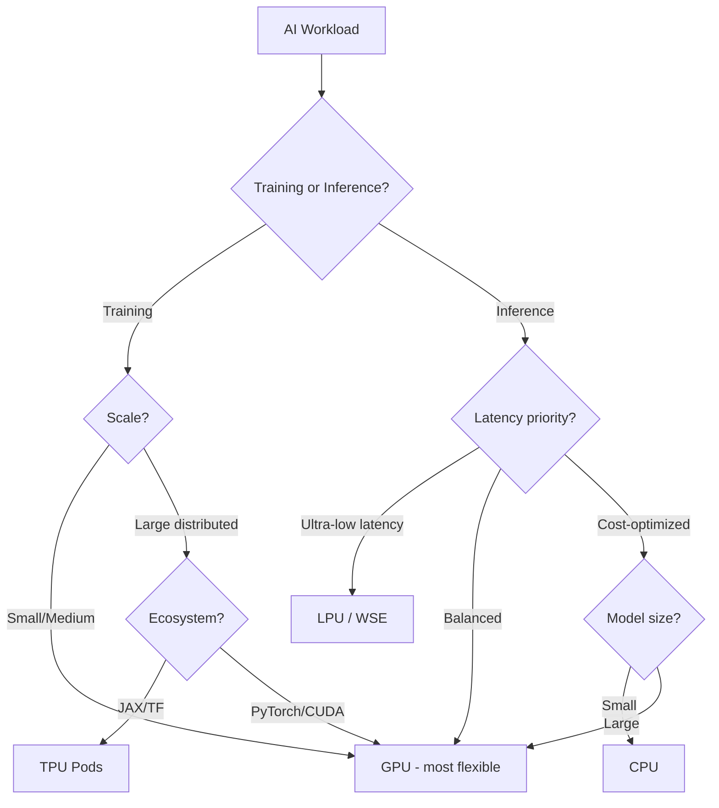

# Computing Units for AI

## Overview
Modern AI workloads run on specialized processors optimized for different stages of the ML lifecycle. The four main computing units — **CPU**, **GPU**, **TPU**, and **LPU** — each address distinct bottlenecks in training and inference.

## Comparison Table

| Aspect | CPU | GPU | TPU | LPU |
|---|---|---|---|---|
| **Full name** | Central Processing Unit | Graphics Processing Unit | Tensor Processing Unit | Language Processing Unit |
| **Maker** | Intel, AMD, ARM | NVIDIA, AMD | Google | Groq |
| **Design goal** | General-purpose sequential compute | Massively parallel compute | Matrix math for ML training/inference | LLM inference specifically |
| **Core count** | 4–128 cores | Thousands of CUDA/stream cores | Thousands of MXUs | Single-core (software-defined) |
| **Memory** | DDR5 DRAM (~100 GB/s) | HBM2e/HBM3 (~2–3 TB/s) | HBM (~1–2 TB/s) | On-chip SRAM (eliminates HBM) |
| **Parallelism** | Low (task-level) | High (data/thread-level) | High (systolic array) | Deterministic (compiler-scheduled) |
| **Best for** | Preprocessing, orchestration, small models | Training + inference at scale | Large-scale training (Google Cloud) | Ultra-low latency LLM inference |
| **Availability** | Everywhere | Cloud + on-prem | Google Cloud only (TPU pods) | GroqCloud + on-prem |

## CPU (Central Processing Unit)

- **Architecture** — Few powerful cores optimized for sequential and branching logic
- **Strengths** — Versatile, handles OS/networking/preprocessing, low latency for small tasks
- **Weakness for AI** — Too few cores for matrix multiplication at scale
- **Use in ML** — Data preprocessing, feature engineering, model orchestration, small model inference (e.g., scikit-learn)

> [!TIP] When CPU is enough
> For tabular ML models (XGBoost, LightGBM) and small batch inference, CPU is often the most cost-effective choice.

## GPU (Graphics Processing Unit)

- **Architecture** — Thousands of small cores for SIMT (Single Instruction, Multiple Threads) parallel execution
- **Key hardware** — NVIDIA A100, H100, H200, B200; AMD MI300X
- **Strengths** — Mature ecosystem (CUDA), flexible for both training and inference, wide availability
- **Key features:**

| Feature | Purpose |
|---|---|
| **Tensor Cores** | Accelerated mixed-precision matrix ops (FP16, BF16, INT8) |
| **HBM (High Bandwidth Memory)** | ~2–3 TB/s bandwidth for weight loading |
| **NVLink / NVSwitch** | High-speed multi-GPU communication |
| **CUDA / ROCm** | Software ecosystem for parallel programming |

- **Limitation** — [[11.18 LLM Throughput & Memory Bound|Memory-bound during LLM decode phase]] — must load entire model weights from HBM per token

## TPU (Tensor Processing Unit)

- **Architecture** — Google's custom ASIC with **systolic arrays** (Matrix Multiply Units / MXUs) optimized for dense matrix operations
- **Key hardware** — TPU v4, v5e, v5p, Trillium (v6)
- **Strengths** — Tightly integrated with JAX/TensorFlow, excellent for large-scale distributed training
- **Key features:**

| Feature | Purpose |
|---|---|
| **Systolic arrays (MXUs)** | Efficient matrix multiply without register file overhead |
| **BFloat16 native** | Training-friendly reduced precision |
| **ICI (Inter-Chip Interconnect)** | High-bandwidth TPU-to-TPU links in pods |
| **TPU Pods** | Up to thousands of TPUs in a single training job |

- **Limitation** — Google Cloud only, less flexible software ecosystem than CUDA

> [!INFO] Systolic Arrays
> Data flows through a grid of processing elements in a wave pattern, each performing a multiply-accumulate. This maximizes data reuse and minimizes memory access — ideal for matrix multiplication.

## LPU (Language Processing Unit)

- **Architecture** — [[11.20 Groq|Groq's]] custom ASIC with single-core software-defined design and on-chip SRAM for weight storage
- **Strengths** — Deterministic execution, ultra-low latency inference, no memory bandwidth bottleneck
- **Key features:**

| Feature | Purpose |
|---|---|
| **On-chip SRAM** | Hundreds of MB, eliminates HBM round-trips |
| **Static scheduling** | Compiler pre-determines all data movement |
| **Chip-to-chip links** | Plesiosynchronous protocol scales across chips |
| **Air-cooled** | No liquid cooling infrastructure needed |

- **Limitation** — Inference only (no training), newer ecosystem

## WSE (Wafer-Scale Engine)

> [!INFO] Honorable Mention
> [[11.21 Cerebras|Cerebras WSE]] is another custom chip approach — an entire silicon wafer (~46,225 mm²) as a single processor with ~40+ GB on-chip SRAM. Supports both training and inference.

## Choosing the Right Compute

## Related Concepts
- [[11_LLM_Dev_MOC]] — Parent MOC
- [[11.18 LLM Throughput & Memory Bound]] — Why hardware choice matters for inference
- [[11.20 Groq]] — LPU provider
- [[11.21 Cerebras]] — WSE provider
- [[11.17 Mixture of Experts]] — Architecture that benefits from specialized hardware
