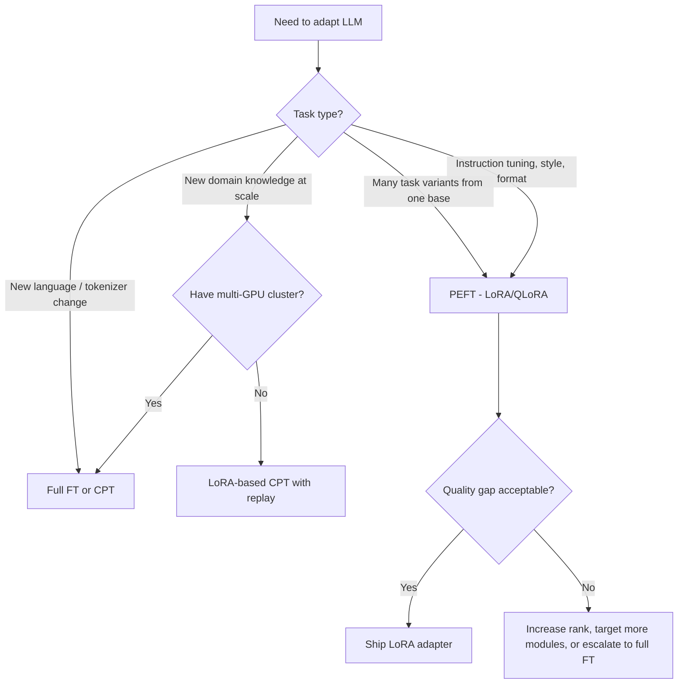

# 11.34 Full Fine-Tuning vs PEFT

## Overview
Choosing between **full fine-tuning** (updating all model weights) and **PEFT** (training small adapters with the base frozen) is a core trade-off in post-training. Full FT offers maximum capacity at high cost; PEFT trades a small quality margin for **10–100× lower compute, VRAM, and storage**.

## Side-by-Side Comparison

| Dimension | Full Fine-Tuning | PEFT (LoRA/QLoRA) |
| --- | --- | --- |
| Trainable params | 100% | 0.01–1% |
| VRAM (7B model, bf16) | ~80–120 GB | ~16–24 GB (LoRA), ~6–10 GB (QLoRA) |
| Optimizer state | 8× model size (Adam) | 8× **adapter** size only |
| Checkpoint size | Full model (GBs) | Adapter only (MBs) |
| Training speed | Baseline | 1.5–3× faster per step |
| Quality ceiling | Highest | Within 1–3% on most SFT tasks |
| Catastrophic forgetting | High risk | Low (base frozen) |
| Multi-task serving | One model per task | Many adapters per base |
| Inference latency | Native | Native (if merged) or slight overhead |
| Distribution shift handling | Strong | Weaker for far-OOD domains |

## When Full FT Wins
- **Major distribution shift**: New language, new modality, new domain far from pre-training
- **[[11.33 Continued Pre-training]]**: Injecting large-scale knowledge needs full capacity
- **Maximum quality**: Frontier-quality production models where every benchmark point matters
- **Architectural changes**: Modifying tokenizer, embeddings, or layer structure
- **Abundant compute**: Multi-node clusters available, cost not the bottleneck

## When PEFT Wins
- **Standard SFT**: Instruction tuning, format learning, style transfer
- **Multi-tenant serving**: Many task-specific specializations from one base (vLLM/SGLang adapter hot-swap)
- **Limited compute**: Single-GPU or consumer hardware
- **Rapid iteration**: Experimenting with many recipes quickly
- **Storage-constrained**: Adapter checkpoints are MBs vs GBs
- **Forgetting concerns**: Base capabilities must remain intact

## Quality Gap — What the Research Says
> [!INFO] Empirical Findings
> - **LoRA matches full FT** on most instruction-tuning benchmarks within 1–2% (LoRA, QLoRA papers)
> - **Gap widens** for: long-context fine-tuning, math/reasoning specialization, and continued pre-training
> - **DoRA closes the gap** further by decomposing weight magnitude and direction
> - At **higher ranks** ($r \geq 64$) and **all-layer targeting**, LoRA approaches full FT closely

## Hybrid Approaches
- **LoRA → merge → full FT**: Warm-start full FT from a LoRA-adapted base
- **PEFT for SFT, full FT for CPT**: Use the right tool per stage
- **ReFT, BitFit, IA³**: Even more parameter-efficient variants for narrow tasks
- **Spectrum / freeze-then-tune**: Selectively unfreeze high-impact layers

## Decision Heuristic

> [!TIP] Default Recommendation
> **Start with QLoRA.** It is cheap, fast, and good enough for ~90% of fine-tuning needs. Escalate to full FT only when measured quality gaps justify the cost.

> [!WARNING] Hidden Costs of Full FT
> - Optimizer states (Adam) require **2× model size in fp32** for momentum/variance
> - Activation memory grows with sequence length and batch size
> - Checkpoint storage and transfer costs compound across experiments
> - Distributed training (FSDP, DeepSpeed) adds engineering complexity

## Related Concepts
- [[11_LLM_Dev_MOC]]
- [[11.32 PEFT]] - methods covered by the PEFT side of this comparison
- [[11.31 Supervised Fine-Tuning]] - the most common context for this decision
- [[11.33 Continued Pre-training]] - typically requires full FT or large-rank LoRA
- [[11.27 LLM Generation Engines]] - serving infrastructure differs (single model vs multi-adapter)
