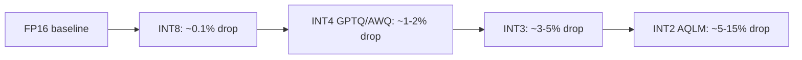

# 11.39 Quantization

## Overview
**Quantization** reduces the precision of model weights (and sometimes activations) from FP16/BF16 to **INT8, INT4, or lower**, shrinking memory 2–8× and accelerating memory-bound inference. Modern post-training quantization (PTQ) methods like **GPTQ, AWQ, and GGUF** preserve quality within 1–2% of full precision on most LLMs.

## Why Quantize
- **Memory**: A 70B model in BF16 = 140 GB; in INT4 = ~35 GB → fits on one 48 GB GPU
- **Bandwidth**: Inference is [[11.18 LLM Throughput & Memory Bound|memory-bound]]; smaller weights = more tokens/sec
- **Cost**: Cheaper hardware, more concurrent requests per GPU
- **Edge deployment**: Phones, laptops via GGUF/llama.cpp

## Key Concepts
- **PTQ (Post-Training Quantization)**: Quantize a trained FP model — fast, no retraining
- **QAT (Quantization-Aware Training)**: Simulate quantization during training — best quality, expensive
- **Weight-only vs Weight+Activation**: Weight-only is easier and most popular for LLMs
- **Granularity**: per-tensor → per-channel → per-group (group size 32–128 is the sweet spot)
- **Calibration**: A small dataset (~128 samples) used to estimate weight/activation distributions

## Methods Compared

| Method | Bits | Type | Calibration | Best For |
| --- | --- | --- | --- | --- |
| **GPTQ** | 3/4/8 | Weight-only PTQ | Yes | GPU inference, accurate INT4 |
| **AWQ** | 4 | Weight-only PTQ | Yes | GPU inference, preserves salient channels |
| **GGUF** (llama.cpp) | 2–8 | Weight-only PTQ | Optional | CPU + edge, many quant levels |
| **bitsandbytes (NF4)** | 4 | Weight-only PTQ | No | QLoRA training, easy integration |
| **SmoothQuant** | 8 | Weight + activation | Yes | INT8 inference with activation quant |
| **FP8 (E4M3/E5M2)** | 8 | Native low-precision | No | H100/B200, training + inference |
| **AQLM, QuIP#** | 2 | Extreme PTQ | Yes | Research, very tight memory |

## GPTQ vs AWQ
> [!INFO] Both Are Weight-Only INT4 PTQ
> - **GPTQ**: Solves a layer-wise reconstruction problem, updating remaining weights to compensate for quantization error. Slightly higher accuracy.
> - **AWQ**: Identifies **salient weight channels** (those with large activation magnitudes) and protects them via per-channel scaling. Faster to apply, often equal quality.
> Both produce 4-bit checkpoints usable with vLLM, SGLang, TensorRT-LLM.

## GGUF / llama.cpp Quants
| Tag | Effective Bits | Quality | Notes |
| --- | --- | --- | --- |
| Q8_0 | 8.5 | ~lossless | Reference quality |
| Q6_K | 6.6 | Excellent | Good default if memory allows |
| Q5_K_M | 5.7 | Very good | Common sweet spot |
| **Q4_K_M** | 4.8 | Good | **Most popular**, balanced |
| Q3_K_M | 3.9 | Acceptable | Budget |
| Q2_K | 3.0 | Degraded | Last resort |

`_K` = k-quants (per-block scaling), `_M` = medium (mixed precision across layers).

## Quality vs Bits

> [!TIP] Default Recipe
> **AWQ INT4** (group size 128) for GPU inference, **Q4_K_M GGUF** for CPU/edge. Both deliver ~95–99% of FP16 quality at ~25% of the memory.

## Practical Use Cases
- Serving 70B models on a single 48 GB GPU
- Running 7B models on consumer laptops (GGUF + llama.cpp)
- Multi-tenant inference: more concurrent users per GPU
- Fine-tuning via [[11.32 PEFT|QLoRA]] (NF4 base + bf16 LoRA adapters)
- Edge / mobile LLM deployment

> [!WARNING] Common Pitfalls
> - **Bad calibration data**: Quantizing on data far from production distribution → quality cliff
> - **Per-tensor quant for LLMs**: Outlier activations destroy quality; use per-channel/group
> - **INT4 + long context**: KV cache dominates memory; weight quant helps less. Quantize KV cache too (FP8/INT8 KV).
> - **Quantizing fine-tuned models**: Always re-evaluate; quant noise can erase narrow fine-tuning gains
> - **Math/reasoning regression**: Aggressive quants hurt chain-of-thought tasks more than chat — benchmark before shipping

## Related Concepts
- [[11_LLM_Dev_MOC]]
- [[11.32 PEFT]] - QLoRA combines NF4 quantization with LoRA training
- [[11.18 LLM Throughput & Memory Bound]] - explains why quantization speeds up inference
- [[11.27 LLM Generation Engines]] - vLLM/SGLang/TensorRT-LLM all consume GPTQ/AWQ
- [[11.40 Pruning & Sparsity]] - complementary compression technique
- [[11.41 Speculative Decoding]] - stacks with quantization for further speedup
