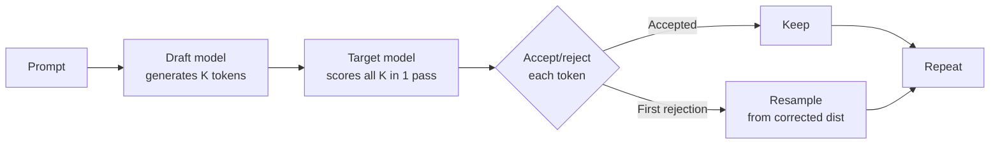

# 11.41 Speculative Decoding

## Overview
**Speculative decoding** accelerates LLM inference by using a small, fast **draft model** to propose multiple tokens, which the large **target model** then **verifies in a single forward pass**. Accepted tokens are kept; rejected ones are corrected. Output distribution is **mathematically identical** to the target model — pure speedup, no quality loss.

## Why It Works
LLM decoding is [[11.18 LLM Throughput & Memory Bound|memory-bound]]: each step loads the entire model into SRAM to produce **one token**. Verifying $K$ candidate tokens costs only slightly more than producing one — so if the draft model gets even half right, you get nearly $K\times$ speedup.

## How It Works

- **Draft phase**: Small model autoregressively produces $K$ tokens (cheap)
- **Verification**: Target model runs **one forward pass** over draft tokens, getting probabilities for all positions
- **Acceptance**: For each draft token, accept with probability $\min(1, p_{\text{target}} / p_{\text{draft}})$
- **Correction**: On first rejection, resample from $\max(0, p_{\text{target}} - p_{\text{draft}})$ — preserves target distribution exactly

## Variants

| Method | Draft Source | Notes |
| --- | --- | --- |
| **Vanilla Speculative** | Separate small model | Original (Leviathan, Chen 2023) |
| **Self-Speculative** | Layer-skipped target | No separate draft needed |
| **Medusa** | Multiple decoding heads on target | Predicts several future tokens in parallel |
| **EAGLE / EAGLE-2** | Lightweight predictor on target features | SOTA acceptance rates |
| **Lookahead Decoding** | N-gram lookups from generation history | No draft model |
| **Prompt Lookup** | Copy spans from prompt (RAG-like) | Huge win for summarization, code edits |

## Speedup Math
With acceptance rate $\alpha$ and draft length $K$:

$$\text{Expected tokens per step} = \frac{1 - \alpha^{K+1}}{1 - \alpha}$$

| $\alpha$ | $K=4$ | $K=8$ |
| --- | --- | --- |
| 0.5 | ~1.9× | ~2.0× |
| 0.7 | ~2.6× | ~3.1× |
| 0.9 | ~3.4× | ~5.7× |

> [!TIP] Real-World Speedups
> EAGLE-2 reports **3–4× speedup** on Llama-3 70B; Medusa **2–3×**; prompt lookup **5×+** on tasks with high prompt-output overlap (code refactoring, summarization).

## Choosing a Draft Model
- **Same family, smaller size**: Llama-3 70B target + Llama-3 8B draft — high acceptance
- **Distilled draft**: Train a tiny model specifically to mimic the target
- **Same tokenizer required**: Otherwise alignment breaks
- **~10–20× smaller**: Sweet spot between speed and acceptance rate

## Practical Use Cases
- **Latency-sensitive serving**: Chat, code completion, low-batch interactive use
- **Long-form generation**: Summarization, translation, document drafting
- **Prompt-heavy tasks**: Prompt lookup decoding for code edits, RAG outputs that quote sources
- **Combined with [[11.39 Quantization]]**: Quantized target + tiny draft = compounded speedup

## When NOT to Use
> [!WARNING] Speculative Decoding Has Limits
> - **Large batch serving**: At high batch sizes, the target model becomes compute-bound; speculative decoding adds overhead with little gain
> - **Very high temperature**: Acceptance rate drops as sampling diverges from draft
> - **Highly creative / divergent outputs**: Low draft-target agreement → wasted draft compute
> - **Engineering complexity**: Two models, KV cache management, scheduler changes

## Engine Support
- **vLLM**: Speculative decoding (separate draft, EAGLE), prompt lookup
- **SGLang**: EAGLE-2, MTP (multi-token prediction)
- **TensorRT-LLM**: Medusa, EAGLE, lookahead
- **llama.cpp**: Speculative + prompt lookup
- **Native multi-token prediction**: DeepSeek-V3, future models train with MTP heads built-in

> [!INFO] Multi-Token Prediction (MTP)
> DeepSeek-V3 trains with **MTP heads** that predict the next several tokens during pre-training. At inference, these heads serve as the "draft" — no separate model needed, with very high acceptance rates.

## Related Concepts
- [[11_LLM_Dev_MOC]]
- [[11.18 LLM Throughput & Memory Bound]] - the memory-bound regime that makes speculation profitable
- [[11.27 LLM Generation Engines]] - serving stacks that implement speculative decoding
- [[11.39 Quantization]] - stacks multiplicatively for total speedup
- [[11.21 Prompt Caching]] - complementary inference optimization for repeated prompts
