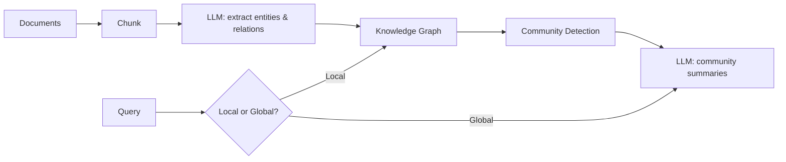

# Graph RAG

## Overview
**Graph RAG** replaces (or augments) flat vector retrieval with a **knowledge graph** built from the corpus: an LLM extracts entities and relationships at indexing time, communities of related entities are detected and summarized, and queries retrieve over the graph structure instead of isolated chunks. Popularized by **Microsoft's GraphRAG** (2024).

> [!INFO] The problem it solves
> Vanilla [[11.12 RAG]] answers **local** questions ("what does X say about Y?") but fails on **global** ones ("what are the main themes across this corpus?") — no single chunk contains the answer, so similarity search retrieves nothing useful.

## Key Concepts

- **Entity & relation extraction** — LLM reads every chunk and emits `(entity, relation, entity)` triples plus entity descriptions
- **Community detection** — graph clustering (typically **Leiden algorithm**) groups related entities into hierarchical communities
- **Community summaries** — LLM pre-writes a summary per community at each hierarchy level; these become retrievable "god-node" answers for corpus-wide questions
- **Local search** — start from entities matched in the query, walk their neighborhoods, collect related chunks + relationships
- **Global search** — map-reduce over community summaries to answer holistic questions

## Pipeline

## Graph RAG vs Vector RAG

| | Vector RAG | Graph RAG |
|---|---|---|
| **Retrieval unit** | Similar chunks | Entities, relations, community summaries |
| **Best at** | Specific factual lookups | Thematic / multi-hop / "whole corpus" questions |
| **Multi-hop reasoning** | Weak (needs recursive retrieval) | Native — follow edges |
| **Indexing cost** | One embedding pass (cheap) | LLM call per chunk (expensive) |
| **Freshness** | Easy incremental updates | Re-extraction + re-clustering needed |
| **Explainability** | Opaque similarity scores | Traceable entity/relation paths |

## Practical Use Cases

- Corpus-level synthesis: "summarize the key risks across all these reports"
- Multi-hop questions: "how is A connected to C?" when the link goes through B
- Domains where relationships matter more than text similarity (org charts, supply chains, codebases, investigations)

> [!WARNING] Cost
> Indexing runs an LLM over the entire corpus — often 10–100× the cost of embedding-only indexing. Use it when global/multi-hop questions justify it, not as a default upgrade.

> [!TIP] Hybrid is common
> Production systems often combine both: vector search for local lookups, graph traversal + community summaries for global questions.

## Related Concepts
- [[11_LLM_Dev_MOC]] - parent index
- [[11.12 RAG]] - baseline this extends
- [[11.44 Contextual RAG]] - alternative fix that keeps flat retrieval
- [[11.28 Context Rot]] - community summaries keep context small on global questions
- [[23.01 Vector Databases]] - still used for entity/chunk embedding search

## References
- "From Local to Global: A Graph RAG Approach to Query-Focused Summarization" (Edge et al., Microsoft, 2024)
- Microsoft GraphRAG library documentation
