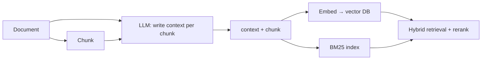

# Contextual RAG

## Overview
**Contextual RAG** (a.k.a. **Contextual Retrieval**, Anthropic, 2024) fixes the core weakness of chunking: a chunk ripped out of its document loses the context needed to retrieve it. Before indexing, an LLM writes a short **chunk-specific context blurb** (50–100 tokens) situating the chunk within its source document; the blurb is prepended to the chunk for **both** embedding and BM25 indexing.

> [!EXAMPLE] The problem
> Chunk: *"The company's revenue grew by 3% over the previous quarter."*
> Which company? Which quarter? The chunk can't be retrieved for "ACME Q2 2023 revenue growth" — the identifying terms aren't in it.
> Contextualized: *"This chunk is from ACME Corp's Q2 2023 SEC filing; previous-quarter revenue was $314M. The company's revenue grew by 3%..."*

## Key Concepts

- **Contextual Embeddings** — embed `context + chunk` instead of the bare chunk
- **Contextual BM25** — index the same augmented text for keyword search; exact identifiers (names, IDs, error codes) now match
- **Prompt caching makes it affordable** — the full document is cached once; each chunk's context generation reuses the cached prefix (see [[11.21 Prompt Caching]]). Anthropic's estimate: ~$1.02 per million document tokens
- **Stacks with reranking** — contextual retrieval fixes recall at index time; a reranker fixes precision at query time

## Reported Results (Anthropic, 2024)

| Setup | Top-20 retrieval failure rate reduction |
|---|---|
| Contextual Embeddings | −35% |
| + Contextual BM25 (hybrid) | −49% |
| + Reranking | −67% |

## Pipeline

## When to Use

- Corpora full of context-dependent chunks: filings, contracts, logs, meeting notes, codebases
- Queries containing exact identifiers that hybrid BM25 must catch
- Knowledge bases under ~200K tokens per query scope: consider **skipping RAG entirely** and stuffing the doc into context with prompt caching (Anthropic's own recommendation)

> [!WARNING]
> Re-contextualization is required when documents change — the blurb depends on the whole document, so edits invalidate all of its chunks, making incremental updates costlier than plain chunking.

## Related Concepts
- [[11_LLM_Dev_MOC]] - parent index
- [[11.12 RAG]] - baseline pipeline this improves
- [[11.21 Prompt Caching]] - what makes context generation cheap
- [[11.43 Graph RAG]] - heavier alternative for global/multi-hop questions
- [[11.45 Hypothetical Document Embeddings (HyDE)]] - query-side fix; this is the document-side fix

## References
- "Introducing Contextual Retrieval" (Anthropic engineering blog, Sep 2024)
