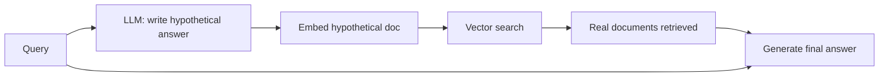

# Hypothetical Document Embeddings (HyDE)

## Overview
**HyDE** improves dense retrieval by fixing the **query–document asymmetry**: a short question and the passage that answers it live in different regions of embedding space. Instead of embedding the query, an LLM first writes a **hypothetical answer document** (facts may be wrong — that's fine), and that fake document's embedding is used to search. Answer-shaped text lands near real answer-shaped text.

> [!INFO] Origin
> "Precise Zero-Shot Dense Retrieval without Relevance Labels" (Gao et al., 2022). Designed for **zero-shot** settings — no relevance-labeled training data needed.

## How It Works

1. Prompt: *"Write a passage that answers: {query}"* (optionally N samples, average their embeddings)
2. Embed the hypothetical passage(s) — **not** the query
3. Nearest-neighbor search returns **real** documents
4. Generation uses the real documents; the hallucinated draft is discarded

> [!TIP] Why hallucination doesn't hurt
> The hypothetical document is never shown to the user or used as evidence — only its **shape and vocabulary** matter. Retrieval grounds the final answer in real corpus text.

## Key Concepts

- **Query-document asymmetry** — questions and answers embed differently; HyDE searches doc-to-doc instead of query-to-doc
- **Zero-shot strength** — shines when the embedding model wasn't fine-tuned for the domain or for QA-style retrieval
- **Multi-sample averaging** — generating several hypotheticals and averaging embeddings smooths out individual hallucinations

## Trade-offs

| Pro | Con |
|---|---|
| Big gains in zero-shot / out-of-domain retrieval | Extra LLM call per query → latency + cost |
| No training data or index changes needed | If the LLM knows nothing about the topic, the hypothetical misleads retrieval |
| Composes with hybrid search & reranking | Weaker gains once you have a domain-tuned embedder |

## When to Use

- New domain, no labeled data, off-the-shelf embedder underperforming
- Short/vague user queries against long-form documents
- Contrast with [[11.44 Contextual RAG]]: HyDE transforms the **query side** at query time; Contextual RAG enriches the **document side** at index time — they stack

## Related Concepts
- [[11_LLM_Dev_MOC]] - parent index
- [[11.12 RAG]] - listed there as an advanced technique
- [[11.44 Contextual RAG]] - complementary document-side fix
- [[23.01 Vector Databases]] - where the search happens
- [[11.46 Falsification-Verification RAG (FVA-RAG)]] - also uses generate-then-retrieve, for verification

## References
- "Precise Zero-Shot Dense Retrieval without Relevance Labels" (Gao et al., 2022)
