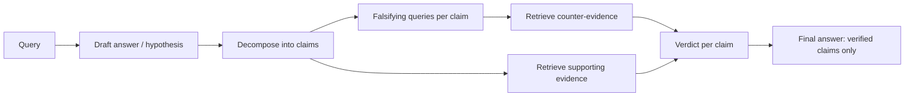

# Falsification-Verification RAG (FVA-RAG)

## Overview
**FVA-RAG** applies Popper's **falsification principle** to retrieval: instead of only fetching evidence that *supports* a draft answer (confirmation bias — the failure mode of vanilla [[11.12 RAG]] and self-verification loops), it deliberately retrieves evidence that could **refute** it. Claims survive only if they withstand an active attempt at disproof.

> [!INFO] Status
> A 2025-era research direction, not a settled standard. The core idea — adversarial retrieval as a verification step — appears under several names (falsification-driven RAG, counter-evidence retrieval, verification agents).

## The Problem: Confirmation-Biased Retrieval

- Similarity search retrieves text that *looks like* the draft answer — including text repeating the same popular misconception
- "Check your answer against the context" self-verification uses the **same** supporting documents, so errors self-confirm
- Hallucinated claims often have plausible-sounding neighbors in embedding space

## How It Works

1. **Hypothesize** — generate a draft answer (with or without initial retrieval)
2. **Decompose** — split the draft into atomic, checkable claims
3. **Falsify** — for each claim, generate queries designed to surface *contradicting* evidence ("evidence that X is false", negations, alternative candidates)
4. **Verify** — judge each claim against both supporting and refuting evidence: supported / refuted / insufficient
5. **Revise** — keep verified claims, correct refuted ones, hedge or drop unverifiable ones

## Key Concepts

- **Falsification queries** — the retrieval novelty: search for the claim's negation, not the claim
- **Claim-level granularity** — verifying whole answers hides which part is wrong; atomic claims localize errors
- **Asymmetric burden of proof** — one solid piece of counter-evidence outweighs many similar supporting passages
- Related pattern at the agent level: adversarial verifier agents that try to *refute* a finding rather than confirm it

## Trade-offs

| Pro | Con |
|---|---|
| Directly attacks hallucination and popular-misconception traps | Multiplies retrieval + LLM calls per answer (latency, cost) |
| Produces per-claim evidence trails (auditable) | Counter-evidence retrieval fails if the corpus itself is one-sided |
| Composable with any base RAG pipeline | Verifier LLM can still misjudge conflicting evidence |

## When to Use

- High-stakes QA where a wrong answer is worse than "insufficient evidence" (medical, legal, financial)
- Corpora known to contain contradictions or outdated facts
- As a second pass over answers from a cheap fast pipeline — verify only what you'll act on

## Related Concepts
- [[11_LLM_Dev_MOC]] - parent index
- [[11.12 RAG]] - baseline pipeline being verified
- [[11.45 Hypothetical Document Embeddings (HyDE)]] - shares generate-then-retrieve, opposite goal (recall vs refutation)
- [[11.15 LLM Evaluation Metrics]] - faithfulness metrics measure what FVA-RAG enforces
- [[11.10 LLM Guardrails]] - output-side quality control this complements
- [[11.47 Knowledge Base Poisoning]] - falsification helps only if the corpus isn't poisoned
