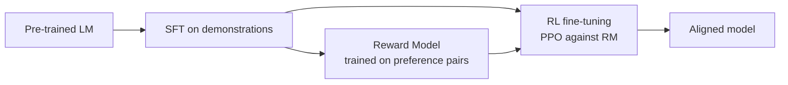

# RLHF

## Overview
**Reinforcement Learning from Human Feedback (RLHF)** is the post-training stage that aligns a language model with human preferences. Instead of imitating labeled answers (as in [[11.31 Supervised Fine-Tuning]]), the model is optimized against a learned **reward signal** derived from human comparisons of outputs — teaching it *which of two answers people prefer*, not just *what an answer looks like*.

> [!INFO] Why preferences instead of labels
> For open-ended tasks ("write a helpful reply"), there is no single correct answer to imitate. Humans are bad at writing perfect demonstrations but good at **comparing** two candidates — preference data is cheaper, more consistent, and captures subtle qualities (tone, honesty, harmlessness) that labels can't.

## The Classic Pipeline (InstructGPT-style)

1. **SFT** — fine-tune on human demonstrations to get a reasonable starting policy ([[11.31 Supervised Fine-Tuning]])
2. **Reward modeling** — humans rank pairs of model outputs; train a [[11.50 Reward Models|reward model]] to predict the preferred one
3. **RL optimization** — use **PPO** (Proximal Policy Optimization) to maximize reward, with a **KL penalty** keeping the policy close to the SFT model

## Key Concepts

- **Policy** — the LLM being trained; each generated token is an "action"
- **KL divergence penalty** — regularizer preventing the policy from drifting far from the SFT reference; without it the model exploits the reward model and produces degenerate text
- **Reward hacking** — the policy finds outputs that score high on the RM but are actually bad (verbosity, sycophancy, confident nonsense) — see [[11.50 Reward Models]]
- **On-policy training** — PPO samples fresh generations from the current policy each step, which is what makes it expensive

## Why PPO Is Painful in Practice

| Pain point | Consequence |
|---|---|
| **4 models in memory** (policy, reference, RM, value/critic) | Huge VRAM footprint; needs [[11.37 Distributed Training]] |
| **Training instability** | Sensitive to KL coefficient, learning rate, reward normalization |
| **On-policy sampling** | Generation dominates wall-clock time |
| **Reward model quality ceiling** | Policy can only be as aligned as the RM is accurate |

These costs motivated simpler alternatives: [[11.51 Direct Preference Optimization (DPO)]] (no RL, no RM at train time) and [[11.52 GRPO]] (no value model, group-based baselines).

## Practical Use Cases

- **Instruction alignment** — making base models helpful, honest, harmless (ChatGPT, Claude lineage)
- **Style & tone control** — optimizing for qualities hard to specify with labels
- **Task-specific preference tuning** — e.g., preferring concise summaries, safer code suggestions

> [!TIP] When you don't need full RLHF
> For most applied teams, [[11.51 Direct Preference Optimization (DPO)]] on a few thousand preference pairs captures most of the benefit at a fraction of the complexity. Full PPO-style RLHF pays off mainly at frontier-lab scale or when you need online, continually-updated reward signals.

## Related Concepts
- [[11_LLM_Dev_MOC]] - parent index
- [[11.31 Supervised Fine-Tuning]] - prerequisite stage; provides the reference policy
- [[11.50 Reward Models]] - the learned preference signal RLHF optimizes
- [[11.51 Direct Preference Optimization (DPO)]] - RL-free alternative
- [[11.52 GRPO]] - lighter-weight RL variant without a value model
- [[11.37 Distributed Training]] - required to fit the multi-model PPO setup

## References
- "Training language models to follow instructions with human feedback" (Ouyang et al., 2022 — InstructGPT)
- "Deep reinforcement learning from human preferences" (Christiano et al., 2017)
