```mermaid
graph TB
    subgraph "Underfitting: Linear Model on Nonlinear Data"
        A["📊 Data: Curved pattern"] 
        B["📈 Model: Straight line"]
        C["❌ Misses most patterns"]
    end
    
    style A fill:#e1f5ff
    style B fill:#ffe1e1
    style C fill:#fff4e1
```

```mermaid
graph TB
    subgraph "Overfitting: Complex Model Memorizes Noise"
        A["📊 Data: Points with noise"] 
        B["📈 Model: Wiggly curve through every point"]
        C["❌ Captures noise, not pattern"]
    end
    
    style A fill:#e1f5ff
    style B fill:#ffe1e1
    style C fill:#fff4e1
```

# Overfitting and Underfitting

## Overview
Overfitting and underfitting are fundamental problems in machine learning that describe how well a model generalizes from training data to unseen data. Achieving the right balance between these two extremes is crucial for building effective models.

## The Bias-Variance Tradeoff

### Core Concept
Every model's total error can be decomposed into three components:

$$\text{Total Error} = \text{Bias}^2 + \text{Variance} + \text{Irreducible Error}$$


## Underfitting

### Definition
**Underfitting** occurs when a model is too simple to capture the underlying patterns in the data. The model performs poorly on both training and test data.

### Characteristics
- **High training error**: Poor performance on training data
- **High test error**: Poor performance on unseen data
- **High bias**: Model makes strong assumptions
- **Low variance**: Predictions are consistent but consistently wrong

### Visual Example


### Common Causes
1. **Model too simple**: Linear model for nonlinear data
2. **Insufficient features**: Not enough information to learn
3. **Over-regularization**: Too much penalty on complexity
4. **Inadequate training**: Stopped training too early

### Signs of Underfitting
- Training accuracy is low (< desired threshold)
- Training and validation errors are both high
- Learning curves plateau early
- Model has low capacity (few parameters)

### Solutions
1. **Increase model complexity**: Add more layers, neurons, or features
2. **Add features**: Include more relevant variables
3. **Reduce regularization**: Lower L1/L2 penalties or dropout
4. **Train longer**: More epochs or iterations
5. **Try different algorithms**: Switch to more powerful models

## Overfitting

### Definition
**Overfitting** occurs when a model learns the training data too well, including noise and random fluctuations. It performs well on training data but poorly on unseen data.

### Characteristics
- **Low training error**: Excellent performance on training data
- **High test error**: Poor performance on unseen data
- **Low bias**: Model makes few assumptions
- **High variance**: Predictions vary significantly with different training sets

### Visual Example


### Common Causes
1. **Model too complex**: Too many parameters relative to data
2. **Insufficient data**: Not enough examples to generalize
3. **Too many features**: Curse of dimensionality
4. **No regularization**: Model not penalized for complexity
5. **Training too long**: Model memorizes training data

### Signs of Overfitting
- Training accuracy very high (near 100%)
- Large gap between training and validation accuracy
- Validation error increases while training error decreases
- Model has high capacity (many parameters)

### Solutions

#### 1. Get More Data
```python
# More diverse training examples
# Data augmentation for images/text
```

#### 2. Regularization Techniques

**L1 Regularization (Lasso)**
$$\text{Loss} = \text{MSE} + \lambda \sum_{i=1}^n |w_i|$$
- Encourages sparsity
- Feature selection

**L2 Regularization (Ridge)**
$$\text{Loss} = \text{MSE} + \lambda \sum_{i=1}^n w_i^2$$
- Penalizes large weights
- Smoother models

**Elastic Net** (L1 + L2)
$$\text{Loss} = \text{MSE} + \lambda_1 \sum_{i=1}^n |w_i| + \lambda_2 \sum_{i=1}^n w_i^2$$

#### 3. Dropout
```python
# Neural network example
nn.Dropout(p=0.5)  # Randomly drop 50% of neurons during training
```

#### 4. Early Stopping


#### 5. Cross-Validation
```python
from sklearn.model_selection import cross_val_score

# K-fold cross-validation
scores = cross_val_score(model, X, y, cv=5)
```

#### 6. Reduce Model Complexity
- Fewer layers in neural networks
- Smaller decision trees (max_depth)
- Fewer features (feature selection)
- Simpler architecture

#### 7. [[13.03 Batch Normalization|Batch Normalization]]
- Adds noise during training
- Has regularization effect
- Improves generalization

#### 8. [[12.01 Ensemble Methods Bagging & Boosting techniques|Ensemble Methods]]
- Bagging (Random Forest): Reduces variance
- Boosting: Reduces both bias and variance
- Stacking: Combines multiple models

## The Sweet Spot

### Optimal Model Complexity

```mermaid
graph TB
    A[Model Complexity] --> B[Error Rate]
    
    subgraph "Error Decomposition"
        C[Training Error<br/>Decreases →]
        D[Validation Error<br/>U-shaped curve]
        E[Test Error<br/>Similar to validation]
    end
    
    F["← Underfitting Zone"] -.-> G[Sweet Spot]
    G -.-> H[Overfitting Zone →]
    
    style G fill:#e1ffe1
    style F fill:#ffe1e1
    style H fill:#ffe1e1
```



### Learning Curves

**Underfitting Pattern:**
```
Training Error:   High, plateaus high
Validation Error: High, similar to training
Gap:              Small
```

**Good Fit Pattern:**
```
Training Error:   Low, converges
Validation Error: Low, close to training
Gap:              Small
```

**Overfitting Pattern:**
```
Training Error:   Very low, keeps decreasing
Validation Error: Higher, diverges from training
Gap:              Large and increasing
```


## Diagnostic Techniques

### 1. Learning Curve Analysis
Plot training and validation errors vs. training set size or epochs.

### 2. Validation Curves
Plot performance vs. hyperparameter values (e.g., regularization strength).

### 3. Cross-Validation Scores
Compare scores across different folds:
- High variance in scores → Overfitting
- Low scores across all folds → Underfitting

### 4. Residual Analysis
For regression:
- Random residuals → Good fit
- Patterns in residuals → Underfitting
- Perfect fit on training → Overfitting

## Practical Guidelines

### Model Selection Workflow


### Checklist

**If Underfitting:**
- ✅ Increase model complexity
- ✅ Add more features
- ✅ Reduce regularization
- ✅ Train longer
- ✅ Try ensemble methods

**If Overfitting:**
- ✅ Get more training data
- ✅ Add regularization (L1/L2/Dropout)
- ✅ Reduce model complexity
- ✅ Use cross-validation
- ✅ Early stopping
- ✅ Data augmentation
- ✅ Feature selection

## Examples by Model Type

### Linear Models
- **Underfitting**: Linear regression on nonlinear data
- **Overfitting**: Polynomial regression with very high degree

### Decision Trees
- **Underfitting**: max_depth=1 (decision stump)
- **Overfitting**: max_depth=None (grows until perfect fit)

### Neural Networks
- **Underfitting**: Too few layers/neurons, stopped training early
- **Overfitting**: Too many parameters, trained too long without regularization

### k-Nearest Neighbors (k-NN)
- **Underfitting**: k too large (e.g., k=100)
- **Overfitting**: k too small (e.g., k=1)

## Mathematical Perspective

### Bias
$$\text{Bias}[\hat{f}(x)] = E[\hat{f}(x)] - f(x)$$
- Expected difference between predicted and true values
- Measures systematic errors

### Variance
$$\text{Variance}[\hat{f}(x)] = E[(\hat{f}(x) - E[\hat{f}(x)])^2]$$
- Variability of predictions across different training sets
- Measures sensitivity to training data

### Tradeoff
- Increasing model complexity: ↓ Bias, ↑ Variance
- Decreasing model complexity: ↑ Bias, ↓ Variance

## Code Example

### Detecting Overfitting in PyTorch
```python
import torch
import torch.nn as nn
import matplotlib.pyplot as plt

def train_and_diagnose(model, train_loader, val_loader, epochs=100):
    train_losses = []
    val_losses = []
    
    optimizer = torch.optim.Adam(model.parameters())
    criterion = nn.MSELoss()
    
    for epoch in range(epochs):
        # Training
        model.train()
        train_loss = 0
        for X_batch, y_batch in train_loader:
            optimizer.zero_grad()
            output = model(X_batch)
            loss = criterion(output, y_batch)
            loss.backward()
            optimizer.step()
            train_loss += loss.item()
        
        # Validation
        model.eval()
        val_loss = 0
        with torch.no_grad():
            for X_batch, y_batch in val_loader:
                output = model(X_batch)
                val_loss += criterion(output, y_batch).item()
        
        train_losses.append(train_loss / len(train_loader))
        val_losses.append(val_loss / len(val_loader))
    
    # Diagnose
    final_gap = val_losses[-1] - train_losses[-1]
    
    if train_losses[-1] > 0.5 and val_losses[-1] > 0.5:
        print("⚠️ Underfitting detected")
    elif final_gap > 0.3:
        print("⚠️ Overfitting detected")
    else:
        print("✅ Good fit")
    
    # Plot learning curves
    plt.plot(train_losses, label='Training Loss')
    plt.plot(val_losses, label='Validation Loss')
    plt.legend()
    plt.show()
```

## Related Concepts
- [[12.01 Ensemble Methods Bagging & Boosting techniques]]
- [[13.03 Batch Normalization]]
- Cross-Validation (to be added)
- Regularization Techniques (to be added)
- Feature Selection (to be added)

## References
- Hastie, T., Tibshirani, R., & Friedman, J. (2009). "The Elements of Statistical Learning."
- Goodfellow, I., Bengio, Y., & Courville, A. (2016). "Deep Learning."
- [Bias-Variance Tradeoff](https://en.wikipedia.org/wiki/Bias%E2%80%93variance_tradeoff)
