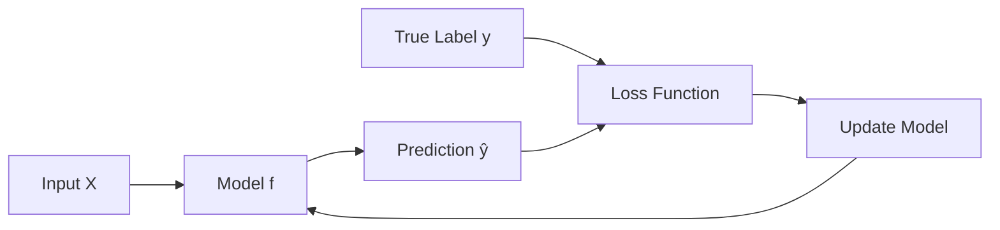
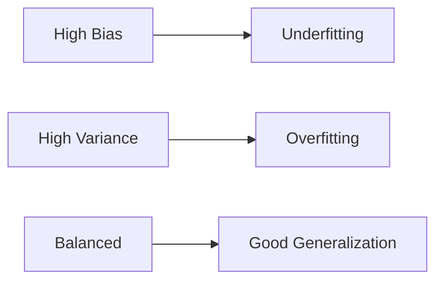

# Supervised Learning

## Overview
Supervised learning is a machine learning paradigm where models learn from labeled training data to make predictions on unseen data. The "supervision" comes from having known input-output pairs during training.

## Core Concept

## Types of Problems

| Type | Output | Examples |
|------|--------|----------|
| **Classification** | Discrete categories | Spam detection, image recognition |
| **Regression** | Continuous values | Price prediction, temperature forecast |
| **Multi-label** | Multiple categories | Article tagging, gene function |
| **Ordinal** | Ordered categories | Rating prediction, severity levels |

## Common Algorithms

### Classification
| Algorithm | Use Case | Pros | Cons |
|-----------|----------|------|------|
| [[12.04 Logistic Regression\|Logistic Regression]] | Binary/multiclass | Interpretable, fast | Linear boundaries |
| Decision Trees | Interpretable rules | Easy to explain | Overfits easily |
| Random Forest | General purpose | Robust, handles missing | Black box |
| SVM | High-dimensional | Effective margins | Slow on large data |
| k-NN | Simple baseline | No training | Slow inference |
| Neural Networks | Complex patterns | Flexible | Data hungry |

### Regression
| Algorithm | Use Case | Pros | Cons |
|-----------|----------|------|------|
| Linear Regression | Simple relationships | Interpretable | Assumes linearity |
| Ridge/Lasso | Regularized linear | Prevents overfit | Still linear |
| Decision Trees | Non-linear | Interpretable | Overfits |
| Gradient Boosting | Competitions | High accuracy | Complex tuning |
| Neural Networks | Complex patterns | Flexible | Needs data |

## Training Process

1. **Split Data**: Train/validation/test (e.g., 70/15/15)
2. **Feature Engineering**: Transform raw inputs
3. **Model Selection**: Choose algorithm(s)
4. **Training**: Minimize loss on training set
5. **Validation**: Tune hyperparameters
6. **Evaluation**: Final test set performance

## Loss Functions

### Classification
| Loss | Formula | Use Case |
|------|---------|----------|
| Cross-Entropy | $-\sum y \log(\hat{y})$ | Probabilistic output |
| Hinge Loss | $\max(0, 1 - y \cdot \hat{y})$ | SVM |
| Focal Loss | $-(1-\hat{y})^\gamma \log(\hat{y})$ | Imbalanced classes |

### Regression
| Loss | Formula | Use Case |
|------|---------|----------|
| MSE | $\frac{1}{n}\sum(y - \hat{y})^2$ | General purpose |
| MAE | $\frac{1}{n}\sum\|y - \hat{y}\|$ | Robust to outliers |
| Huber | Combination | Best of both |

## Evaluation Metrics

### Classification
| Metric | Formula | When to Use |
|--------|---------|-------------|
| Accuracy | $\frac{TP+TN}{Total}$ | Balanced classes |
| Precision | $\frac{TP}{TP+FP}$ | Minimize false positives |
| Recall | $\frac{TP}{TP+FN}$ | Minimize false negatives |
| F1-Score | $2 \cdot \frac{P \cdot R}{P+R}$ | Balance P/R |
| AUC-ROC | Area under curve | Ranking quality |

### Regression
| Metric | Description |
|--------|-------------|
| RMSE | Root mean squared error |
| MAE | Mean absolute error |
| R² | Explained variance ratio |
| MAPE | Mean absolute percentage error |

## Bias-Variance Tradeoff

| Issue | Symptom | Solution |
|-------|---------|----------|
| Underfitting | High train error | More complexity, features |
| Overfitting | Low train, high test error | Regularization, more data |

## Regularization Techniques
- **L1 (Lasso)**: Sparse features, feature selection
- **L2 (Ridge)**: Small weights, prevents overfit
- **Elastic Net**: Combines L1 + L2
- **Dropout**: Neural network regularization
- **Early Stopping**: Stop before overfit

## Related Concepts
- [[12.01 Ensemble Methods Bagging & Boosting techniques]]
- [[12.02 Overfitting and Underfitting]]
- [[12.04 Logistic Regression]]
- [[12.07 Bias-Variance Tradeoff]]

## References
- "Pattern Recognition and Machine Learning" (Bishop)
- "The Elements of Statistical Learning" (Hastie et al.)
- Scikit-learn Documentation
