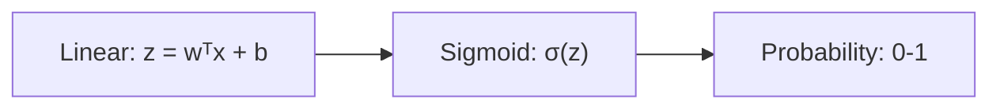

# Logistic Regression

## Overview
Logistic Regression is a linear model for classification that predicts probabilities using the logistic (sigmoid) function. Despite its name, it's a classification algorithm, not regression.

## Core Idea
Transform linear combination of features through sigmoid to get probability:

$$P(y=1|x) = \sigma(w^Tx + b) = \frac{1}{1 + e^{-(w^Tx + b)}}$$

## Sigmoid Function



| Property | Value |
|----------|-------|
| Range | (0, 1) |
| At z=0 | 0.5 |
| Monotonic | Yes |
| Derivative | $\sigma(z)(1-\sigma(z))$ |

## Decision Boundary
Predict class 1 if $P(y=1|x) \geq 0.5$, equivalently when $w^Tx + b \geq 0$

The boundary is **linear** (hyperplane in feature space).

## Loss Function
**Binary Cross-Entropy (Log Loss)**:

$$L = -\frac{1}{n}\sum_{i=1}^{n}[y_i \log(\hat{y}_i) + (1-y_i)\log(1-\hat{y}_i)]$$

| Term | When Active | Penalizes |
|------|-------------|-----------|
| $-\log(\hat{y})$ | $y=1$ | Low probability for positive |
| $-\log(1-\hat{y})$ | $y=0$ | High probability for negative |

## Optimization
No closed-form solution. Use iterative methods:
- **Gradient Descent**: Standard approach
- **Newton's Method**: Faster convergence
- **L-BFGS**: Quasi-Newton, memory efficient

Gradient update:
$$w := w - \alpha \cdot \frac{1}{n}\sum_{i=1}^{n}(\hat{y}_i - y_i)x_i$$

## Regularization

| Type | Penalty | Effect |
|------|---------|--------|
| L2 (Ridge) | $\lambda\sum w_j^2$ | Shrinks all weights |
| L1 (Lasso) | $\lambda\sum \|w_j\|$ | Sparse weights (feature selection) |
| Elastic Net | $\lambda_1\|w\| + \lambda_2\|w\|^2$ | Combined benefits |

## Multiclass Extension

### One-vs-Rest (OvR)
- Train K binary classifiers
- Each separates one class from rest
- Predict class with highest probability

### Softmax (Multinomial)
$$P(y=k|x) = \frac{e^{w_k^Tx}}{\sum_{j=1}^{K}e^{w_j^Tx}}$$

- Single model with K weight vectors
- Probabilities sum to 1
- Use cross-entropy loss

## Implementation

```python
from sklearn.linear_model import LogisticRegression

# Binary classification
model = LogisticRegression(
    penalty='l2',        # Regularization
    C=1.0,               # Inverse regularization strength
    solver='lbfgs',      # Optimization algorithm
    max_iter=100
)
model.fit(X_train, y_train)

# Predictions
y_pred = model.predict(X_test)           # Class labels
y_prob = model.predict_proba(X_test)     # Probabilities

# Coefficients (interpretability)
print(model.coef_)       # Feature weights
print(model.intercept_)  # Bias term
```

## Solver Selection

| Solver | Multiclass | L1 | L2 | Large Data |
|--------|------------|----|----|------------|
| `lbfgs` | ✅ | ❌ | ✅ | ✅ |
| `liblinear` | OvR | ✅ | ✅ | ❌ |
| `saga` | ✅ | ✅ | ✅ | ✅ |
| `newton-cg` | ✅ | ❌ | ✅ | ✅ |

## Interpreting Coefficients
- **Sign**: Positive → increases probability of class 1
- **Magnitude**: Larger → stronger effect
- **Odds Ratio**: $e^{w_j}$ = multiplicative change in odds per unit increase

```python
import numpy as np
odds_ratios = np.exp(model.coef_[0])
```

## Assumptions
1. **Linear decision boundary**: Classes separable by hyperplane
2. **Independent observations**: No autocorrelation
3. **No multicollinearity**: Features not highly correlated
4. **Large sample size**: Rule of thumb: 10-20 samples per feature

## Advantages
| Pro | Description |
|-----|-------------|
| Interpretable | Coefficients have clear meaning |
| Probabilistic | Outputs calibrated probabilities |
| Fast | Training and inference |
| Regularizable | Built-in overfitting prevention |
| Baseline | Strong starting point |

## Limitations
| Con | Description |
|-----|-------------|
| Linear boundaries | Can't capture complex patterns |
| Feature engineering | May need manual interaction terms |
| Imbalanced data | Needs class weighting or resampling |

## When to Use
✅ **Good for**:
- Binary classification baseline
- Interpretability required
- Probabilistic predictions needed
- High-dimensional sparse data (with L1)

❌ **Consider alternatives when**:
- Non-linear decision boundaries
- Complex feature interactions
- Image/text (use deep learning)

## Related Concepts
- [[12.03 Supervised Learning]]
- [[12.01 Ensemble Methods Bagging & Boosting techniques]]
- [[12.02 Overfitting and Underfitting]]

## References
- Scikit-learn Logistic Regression Documentation
- "Pattern Recognition and Machine Learning" (Bishop, Chapter 4)
- "An Introduction to Statistical Learning" (James et al.)
