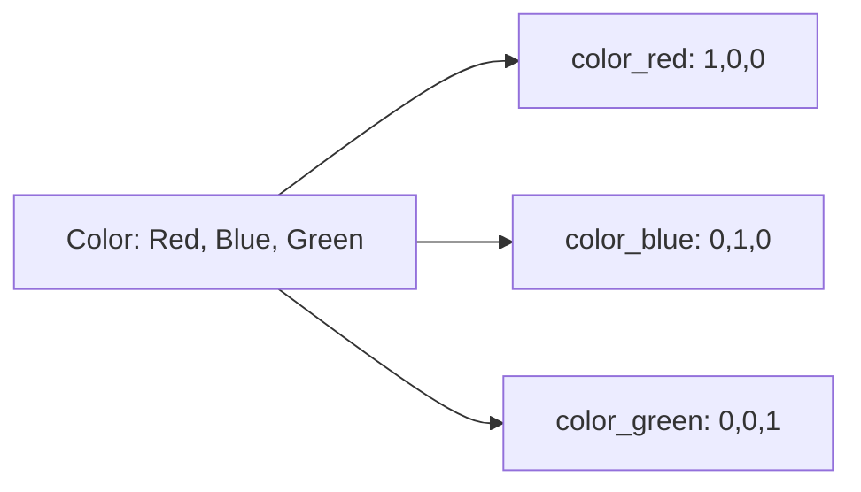

# One-Hot Encoding

## Overview
One-Hot Encoding converts categorical variables into binary vectors where each category becomes a separate column with values 0 or 1. Only one column is "hot" (1) for each observation.

## Concept



| Original | color_red | color_blue | color_green |
|----------|-----------|------------|-------------|
| Red | 1 | 0 | 0 |
| Blue | 0 | 1 | 0 |
| Green | 0 | 0 | 1 |
| Red | 1 | 0 | 0 |

## Why One-Hot?

| Problem with Ordinal | Solution |
|---------------------|----------|
| Implies order (1 < 2 < 3) | No ordering in one-hot |
| Implies distance | Equal distance between all categories |
| Model may learn false patterns | Each category independent |

## Implementations

### Pandas
```python
import pandas as pd

# get_dummies (quick, DataFrame-friendly)
df_encoded = pd.get_dummies(df, columns=['color', 'size'])

# With prefix
df_encoded = pd.get_dummies(df, columns=['color'], prefix='c')

# Drop first to avoid multicollinearity
df_encoded = pd.get_dummies(df, columns=['color'], drop_first=True)
```

### Scikit-learn
```python
from sklearn.preprocessing import OneHotEncoder

# Default: sparse output
encoder = OneHotEncoder(sparse_output=False, handle_unknown='ignore')
encoded = encoder.fit_transform(df[['color']])

# Get feature names
encoder.get_feature_names_out(['color'])
# ['color_Blue', 'color_Green', 'color_Red']

# Inverse transform
encoder.inverse_transform(encoded)
```

### With ColumnTransformer
```python
from sklearn.compose import ColumnTransformer
from sklearn.preprocessing import OneHotEncoder

preprocessor = ColumnTransformer([
    ('cat', OneHotEncoder(handle_unknown='ignore'), ['color', 'size']),
], remainder='passthrough')

X_encoded = preprocessor.fit_transform(X)
```

## Key Parameters

| Parameter | Options | Use Case |
|-----------|---------|----------|
| `drop` | `None`, `'first'`, `'if_binary'` | Avoid multicollinearity |
| `handle_unknown` | `'error'`, `'ignore'`, `'infrequent_if_exist'` | New categories at inference |
| `sparse_output` | `True`, `False` | Memory efficiency |
| `min_frequency` | int or float | Group rare categories |
| `max_categories` | int | Limit total categories |

## Drop Strategies

### No Drop (Default)
```python
OneHotEncoder(drop=None)
# color: [Red, Blue] → [1,0], [0,1]
```
Full representation but redundant for linear models.

### Drop First
```python
OneHotEncoder(drop='first')
# color: [Red, Blue] → [0], [1]
# Red becomes baseline (all zeros)
```
Avoids dummy variable trap in linear regression.

### Drop If Binary
```python
OneHotEncoder(drop='if_binary')
# Binary: [Yes, No] → [1], [0]
# Multi-class: unchanged
```

## Handling Unknown Categories

```python
# At training
encoder = OneHotEncoder(handle_unknown='ignore')
encoder.fit(X_train)

# At inference - unknown category → all zeros
encoder.transform(X_test)  # Won't error on new categories
```

| Strategy | Behavior |
|----------|----------|
| `'error'` | Raise error (default) |
| `'ignore'` | All zeros for unknown |
| `'infrequent_if_exist'` | Map to infrequent bin |

## High Cardinality Problem

When category has many unique values (e.g., ZIP codes, user IDs):

| Issue | Impact |
|-------|--------|
| Feature explosion | Memory, computation |
| Sparse data | Many zeros |
| Overfitting | Rare categories |

### Solutions

```python
# 1. Limit max categories
OneHotEncoder(max_categories=10)

# 2. Group rare categories
OneHotEncoder(min_frequency=0.05)  # 5% threshold

# 3. Target encoding (alternative)
from sklearn.preprocessing import TargetEncoder
encoder = TargetEncoder()

# 4. Feature hashing
from sklearn.feature_extraction import FeatureHasher
hasher = FeatureHasher(n_features=10, input_type='string')
```

## Comparison with Other Encodings

| Encoding | Output | Best For |
|----------|--------|----------|
| **One-Hot** | Binary columns | Nominal categories, linear models |
| **Ordinal** | Integer | Ordinal data, tree models |
| **Target** | Float (mean target) | High cardinality |
| **Binary** | Binary digits | Medium cardinality |
| **Hashing** | Fixed-size hash | Very high cardinality |

## Full Pipeline Example

```python
from sklearn.compose import ColumnTransformer
from sklearn.pipeline import Pipeline
from sklearn.preprocessing import OneHotEncoder, StandardScaler
from sklearn.linear_model import LogisticRegression

# Define columns
categorical_cols = ['color', 'size', 'brand']
numerical_cols = ['price', 'weight']

# Preprocessor
preprocessor = ColumnTransformer([
    ('num', StandardScaler(), numerical_cols),
    ('cat', OneHotEncoder(drop='first', handle_unknown='ignore'), categorical_cols),
])

# Pipeline
pipeline = Pipeline([
    ('preprocess', preprocessor),
    ('classifier', LogisticRegression())
])

pipeline.fit(X_train, y_train)
```

## Best Practices

1. **Drop first for linear models**: Avoid multicollinearity
2. **Handle unknowns**: Set `handle_unknown='ignore'` for production
3. **Limit cardinality**: Use `max_categories` or alternative encoding
4. **Fit on training only**: Prevent data leakage
5. **Use pipelines**: Ensure consistent preprocessing

## Common Pitfalls

| Pitfall | Problem | Solution |
|---------|---------|----------|
| Fit on all data | Data leakage | Fit on train only |
| Ignore unknowns | Errors in production | `handle_unknown='ignore'` |
| High cardinality | Memory explosion | Limit or use alternatives |
| Dummy trap | Singular matrix | `drop='first'` |

## Related Concepts

- [[12_Machine_Learning_MOC]]
- [[12.05 Feature Discretization]] - Often precedes one-hot encoding
- [[12.04 Logistic Regression]] - Common use case for encoding
- [[43.01 Feature Engineering Patterns]] - Encoding strategies

## References
- Scikit-learn OneHotEncoder Documentation
- Pandas get_dummies Documentation
- "Feature Engineering for Machine Learning" (Zheng & Casari)
