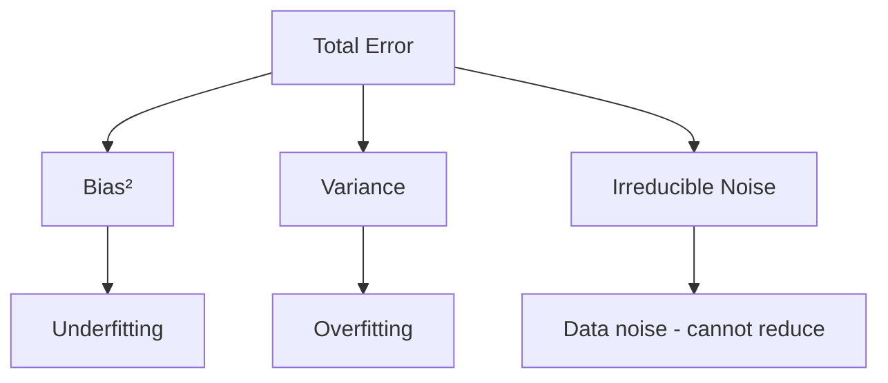
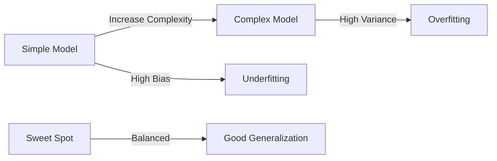
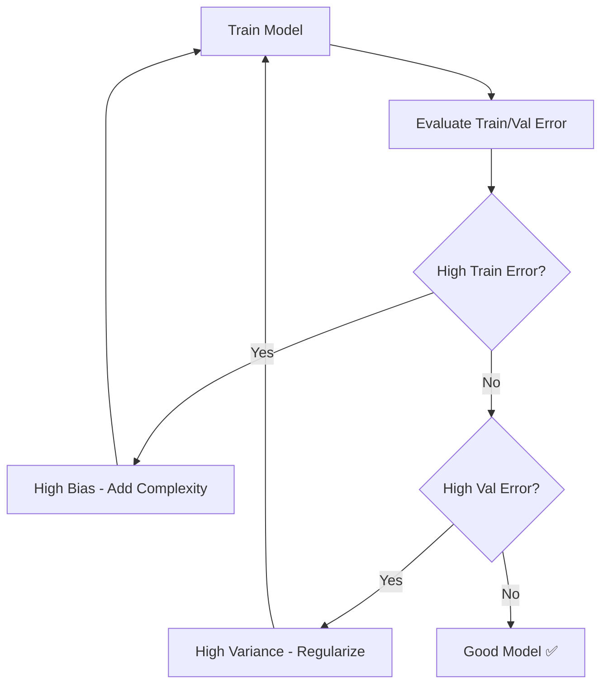

# Bias-Variance Tradeoff

## Overview
The bias-variance tradeoff is a fundamental concept explaining the balance between two sources of prediction error. Reducing one typically increases the other, and finding the optimal balance is key to building models that generalize well.

## Error Decomposition

Total prediction error can be decomposed as:

$$\text{Error} = \text{Bias}^2 + \text{Variance} + \text{Irreducible Noise}$$



## Definitions

| Term | Definition | Cause |
|------|------------|-------|
| **Bias** | Error from wrong assumptions | Model too simple |
| **Variance** | Error from sensitivity to training data | Model too complex |
| **Irreducible Error** | Noise inherent in data | Cannot be reduced |

## Visual Intuition

### Dartboard Analogy

| | Low Variance | High Variance |
|---|---|---|
| **Low Bias** | Clustered at center ✅ | Scattered around center |
| **High Bias** | Clustered off-center | Scattered off-center ❌ |

```
Low Bias, Low Variance    High Bias, Low Variance
       ●●●                       ●●●
      ●●●●●                     ●●●●●
       ●●●                       ●●●
    (on target)              (off target)

Low Bias, High Variance   High Bias, High Variance
     ●   ●                    ●   ●
   ●   ●   ●                ●   ●   ●
     ●   ●                    ●   ●
  (around target)          (scattered, off)
```

## The Tradeoff



| Model Complexity | Bias | Variance | Result |
|-----------------|------|----------|--------|
| Too simple | High | Low | Underfitting |
| Optimal | Balanced | Balanced | Good generalization |
| Too complex | Low | High | Overfitting |

## Diagnosing the Problem

### Learning Curves

```
Error
  │
  │  ╲ Training Error
  │   ╲____________________
  │
  │   ____________________
  │  ╱ Validation Error
  │ ╱
  └────────────────────────→ Training Size

  High Bias (Underfitting)     High Variance (Overfitting)

  │                            │  ╲
  │ ════════════════           │   ╲ Training
  │ ════════════════           │    ╲___________
  │                            │
  │                            │    ___________
  │                            │   ╱ Validation
  └──────────────→             └──────────────→
  (both converge high)         (large gap)
```

### Diagnostic Table

| Symptom | Diagnosis | Solution |
|---------|-----------|----------|
| High train error, high test error | High bias | More complexity |
| Low train error, high test error | High variance | Regularization |
| Low train error, low test error | Good fit ✅ | Deploy! |
| High train error, low test error | Possible data leakage | Check pipeline |

## Solutions

### Reducing Bias (Underfitting)
| Strategy | Example |
|----------|---------|
| More features | Add polynomial terms |
| Complex model | Use ensemble, neural network |
| Reduce regularization | Lower λ |
| More training time | More epochs |
| Feature engineering | Domain-specific transforms |

### Reducing Variance (Overfitting)
| Strategy | Example |
|----------|---------|
| More training data | Collect or augment |
| Regularization | L1, L2, dropout |
| Simpler model | Fewer parameters |
| Early stopping | Stop before overfit |
| Ensemble methods | Bagging, random forest |
| Cross-validation | Better model selection |
| Feature selection | Remove noisy features |

## Model Examples

| Model | Bias | Variance | Notes |
|-------|------|----------|-------|
| Linear Regression | High | Low | Assumes linearity |
| Decision Tree (deep) | Low | High | Memorizes data |
| Random Forest | Low | Medium | Bagging reduces variance |
| k-NN (k=1) | Low | High | Memorizes neighbors |
| k-NN (k=n) | High | Low | Predicts mean |
| Neural Network (large) | Low | High | Needs regularization |

## Regularization Effect

$$\text{Loss} = \text{Error} + \lambda \cdot \text{Complexity Penalty}$$

| λ Value | Effect |
|---------|--------|
| λ = 0 | No regularization, high variance |
| λ small | Slight bias increase, variance decrease |
| λ optimal | Best tradeoff |
| λ large | High bias, underfitting |

## Ensemble Methods & Bias-Variance

| Method | Primary Effect |
|--------|----------------|
| **Bagging** (Random Forest) | Reduces variance |
| **Boosting** (XGBoost) | Reduces bias |
| **Stacking** | Can reduce both |

### Why Bagging Reduces Variance
- Average of many models
- Each sees different data sample
- $\text{Var}(\bar{X}) = \frac{\sigma^2}{n}$

### Why Boosting Reduces Bias
- Sequential correction of errors
- Each model focuses on residuals
- Combines weak learners into strong

## Mathematical Formulation

For a model $\hat{f}(x)$ estimating true function $f(x)$:

$$E[(y - \hat{f}(x))^2] = \text{Bias}[\hat{f}(x)]^2 + \text{Var}[\hat{f}(x)] + \sigma^2$$

Where:
- $\text{Bias}[\hat{f}(x)] = E[\hat{f}(x)] - f(x)$
- $\text{Var}[\hat{f}(x)] = E[\hat{f}(x)^2] - E[\hat{f}(x)]^2$
- $\sigma^2$ = irreducible error (noise variance)

## Practical Workflow



## Related Concepts

- [[12_Machine_Learning_MOC]]
- [[12.02 Overfitting and Underfitting]] - Practical manifestation
- [[12.08 Cross-Validation]] - Helps estimate variance
- [[12.01 Ensemble Methods Bagging & Boosting techniques]] - Reduce variance/bias
- [[12.09 Hyperparameter Tuning]] - Control model complexity

## References
- "The Elements of Statistical Learning" (Hastie et al., Chapter 7)
- "Understanding Machine Learning" (Shalev-Shwartz & Ben-David)
- "Pattern Recognition and Machine Learning" (Bishop)
