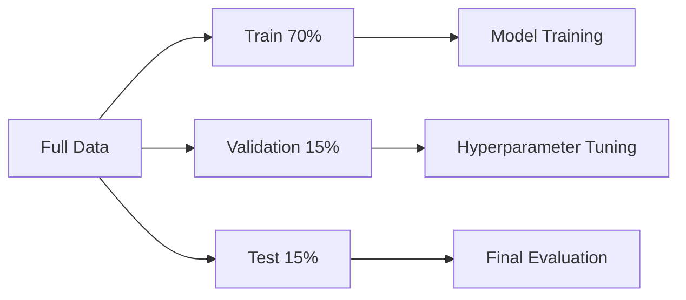
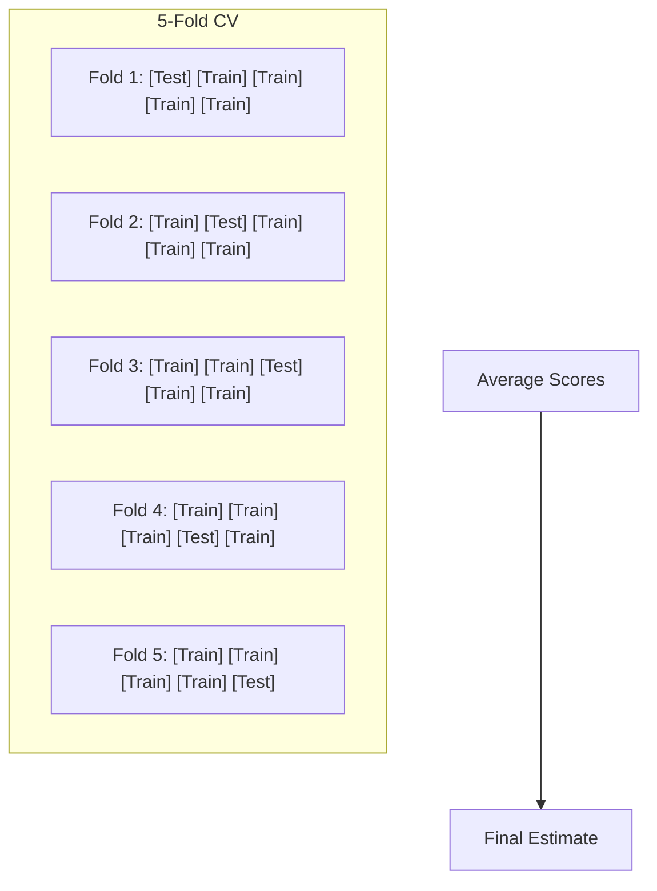
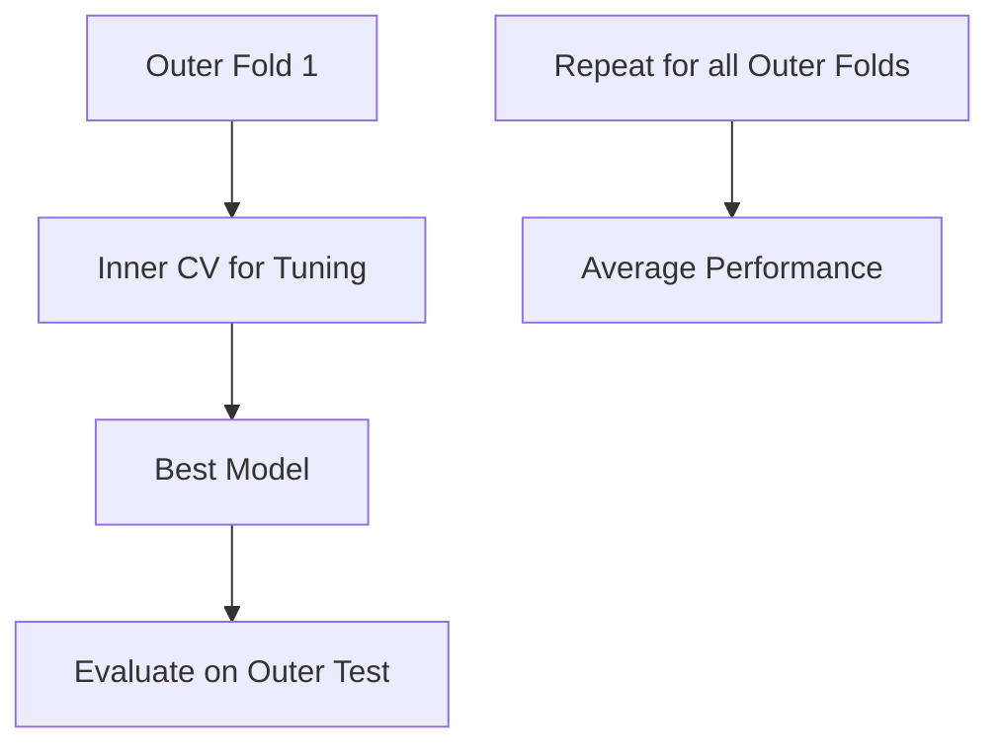

# Cross-Validation & Train-Test Split

## Overview
Cross-validation and train-test splitting are techniques for evaluating model performance on unseen data. They help detect overfitting and provide reliable estimates of how a model will generalize.

## Why Split Data?

| Problem | Consequence |
|---------|-------------|
| Evaluate on training data | Overly optimistic metrics |
| No holdout set | Can't detect overfitting |
| Single split | High variance in estimates |

## Train-Test Split

### Basic Split
```python
from sklearn.model_selection import train_test_split

X_train, X_test, y_train, y_test = train_test_split(
    X, y,
    test_size=0.2,      # 20% for test
    random_state=42,    # Reproducibility
    shuffle=True        # Shuffle before split
)
```

### Common Ratios

| Split | Train | Test | Use Case |
|-------|-------|------|----------|
| 80/20 | 80% | 20% | Default, medium datasets |
| 70/30 | 70% | 30% | Smaller datasets |
| 90/10 | 90% | 10% | Large datasets |

### Train-Validation-Test Split
```python
# First split: train+val / test
X_temp, X_test, y_temp, y_test = train_test_split(
    X, y, test_size=0.15, random_state=42
)

# Second split: train / val
X_train, X_val, y_train, y_val = train_test_split(
    X_temp, y_temp, test_size=0.176, random_state=42  # 0.176 ≈ 15% of original
)

# Result: 70% train, 15% val, 15% test
```



### Stratified Split
Preserves class distribution (important for imbalanced data):

```python
X_train, X_test, y_train, y_test = train_test_split(
    X, y,
    test_size=0.2,
    stratify=y,         # Preserve class ratios
    random_state=42
)
```

## Cross-Validation

### K-Fold Cross-Validation



```python
from sklearn.model_selection import cross_val_score, KFold

# Basic usage
scores = cross_val_score(model, X, y, cv=5)
print(f"Mean: {scores.mean():.3f} (+/- {scores.std()*2:.3f})")

# Explicit KFold
kfold = KFold(n_splits=5, shuffle=True, random_state=42)
scores = cross_val_score(model, X, y, cv=kfold)
```

### Stratified K-Fold
Preserves class distribution in each fold:

```python
from sklearn.model_selection import StratifiedKFold

skf = StratifiedKFold(n_splits=5, shuffle=True, random_state=42)
scores = cross_val_score(model, X, y, cv=skf)
```

### Common CV Strategies

| Strategy | Use Case | Code |
|----------|----------|------|
| K-Fold | Regression, balanced classification | `KFold(n_splits=5)` |
| Stratified K-Fold | Imbalanced classification | `StratifiedKFold(n_splits=5)` |
| Leave-One-Out | Small datasets | `LeaveOneOut()` |
| Leave-P-Out | Very small datasets | `LeavePOut(p=2)` |
| Repeated K-Fold | More stable estimates | `RepeatedKFold(n_splits=5, n_repeats=10)` |
| Group K-Fold | Grouped data (e.g., patients) | `GroupKFold(n_splits=5)` |
| Time Series Split | Temporal data | `TimeSeriesSplit(n_splits=5)` |

### Time Series Split
Respects temporal order (no future data leakage):

```python
from sklearn.model_selection import TimeSeriesSplit

tscv = TimeSeriesSplit(n_splits=5)

# Visualization of splits:
# Fold 1: [Train] | [Test]
# Fold 2: [Train Train] | [Test]
# Fold 3: [Train Train Train] | [Test]
# Fold 4: [Train Train Train Train] | [Test]
# Fold 5: [Train Train Train Train Train] | [Test]
```


### Group K-Fold
Ensures same group never in both train and test:

```python
from sklearn.model_selection import GroupKFold

# Example: multiple samples per patient
groups = df['patient_id']
gkf = GroupKFold(n_splits=5)

for train_idx, test_idx in gkf.split(X, y, groups):
    # Each patient only in train OR test, never both
    pass
```

## Cross-Validation for Hyperparameter Tuning

### GridSearchCV
```python
from sklearn.model_selection import GridSearchCV

param_grid = {
    'C': [0.1, 1, 10],
    'kernel': ['rbf', 'linear']
}

grid_search = GridSearchCV(
    estimator=SVC(),
    param_grid=param_grid,
    cv=5,
    scoring='accuracy',
    n_jobs=-1
)

grid_search.fit(X_train, y_train)
print(grid_search.best_params_)
print(grid_search.best_score_)
```

### cross_validate (Multiple Metrics)
```python
from sklearn.model_selection import cross_validate

scoring = ['accuracy', 'precision', 'recall', 'f1']
results = cross_validate(
    model, X, y,
    cv=5,
    scoring=scoring,
    return_train_score=True
)

for metric in scoring:
    print(f"{metric}: {results[f'test_{metric}'].mean():.3f}")
```

## Choosing K (Number of Folds)

| K Value | Pros | Cons |
|---------|------|------|
| K=5 | Good balance, common default | — |
| K=10 | Lower bias | Higher variance, slower |
| K=n (LOO) | Lowest bias | Highest variance, very slow |
| K=3 | Fast | Higher bias |

**Rule of thumb**: Use K=5 or K=10 for most cases.

## Nested Cross-Validation
For unbiased performance estimate with hyperparameter tuning:

```python
from sklearn.model_selection import cross_val_score, GridSearchCV

# Inner loop: hyperparameter tuning
inner_cv = StratifiedKFold(n_splits=5, shuffle=True, random_state=42)
grid_search = GridSearchCV(model, param_grid, cv=inner_cv)

# Outer loop: performance estimation
outer_cv = StratifiedKFold(n_splits=5, shuffle=True, random_state=42)
scores = cross_val_score(grid_search, X, y, cv=outer_cv)

print(f"Nested CV Score: {scores.mean():.3f} (+/- {scores.std()*2:.3f})")
```



## Common Mistakes

| Mistake | Problem | Solution |
|---------|---------|----------|
| Preprocessing before split | Data leakage | Use Pipeline |
| Tuning on test set | Overfitting to test | Use validation set |
| Ignoring temporal order | Future leakage | TimeSeriesSplit |
| Ignoring groups | Related samples leak | GroupKFold |
| Single train-test split | High variance estimate | Use CV |

## Best Practices

1. **Always use stratified CV** for classification
2. **Pipeline preprocessing** to prevent leakage
3. **Hold out final test set** for unbiased evaluation
4. **Use nested CV** when tuning hyperparameters
5. **Set random_state** for reproducibility
6. **Report mean ± std** from CV scores

## Complete Example

```python
from sklearn.model_selection import (
    train_test_split, StratifiedKFold, GridSearchCV
)
from sklearn.pipeline import Pipeline
from sklearn.preprocessing import StandardScaler
from sklearn.svm import SVC

# 1. Hold out test set
X_train, X_test, y_train, y_test = train_test_split(
    X, y, test_size=0.2, stratify=y, random_state=42
)

# 2. Create pipeline (prevents leakage)
pipeline = Pipeline([
    ('scaler', StandardScaler()),
    ('svc', SVC())
])

# 3. Cross-validation for tuning
param_grid = {'svc__C': [0.1, 1, 10], 'svc__kernel': ['rbf', 'linear']}
cv = StratifiedKFold(n_splits=5, shuffle=True, random_state=42)

grid_search = GridSearchCV(pipeline, param_grid, cv=cv, scoring='f1')
grid_search.fit(X_train, y_train)

# 4. Final evaluation on test set
print(f"Best params: {grid_search.best_params_}")
print(f"CV Score: {grid_search.best_score_:.3f}")
print(f"Test Score: {grid_search.score(X_test, y_test):.3f}")
```

## Related Concepts

- [[12_Machine_Learning_MOC]]
- [[12.07 Bias-Variance Tradeoff]] - CV estimates variance
- [[12.02 Overfitting and Underfitting]] - CV detects overfitting
- [[12.09 Hyperparameter Tuning]] - CV used during tuning

## References
- Scikit-learn Cross-validation Documentation
- "An Introduction to Statistical Learning" (James et al., Chapter 5)
- "The Elements of Statistical Learning" (Hastie et al.)
