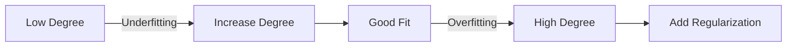

# Polynomial Regression

**Polynomial regression** extends linear regression by adding polynomial terms, allowing the model to fit non-linear relationships while remaining a linear model in terms of parameters.

## Definition

For degree $d$:
$$\hat{y} = w_0 + w_1 x + w_2 x^2 + \cdots + w_d x^d$$

**Key insight**: Still a linear model because it's linear in the coefficients $w_i$, just with transformed features.

## Feature Transformation

| Original | Polynomial Features (degree=2) |
|----------|-------------------------------|
| $x$ | $1, x, x^2$ |
| $x_1, x_2$ | $1, x_1, x_2, x_1^2, x_1 x_2, x_2^2$ |

> [!INFO] Feature Explosion
> For $n$ features and degree $d$: number of terms = $\binom{n+d}{d}$
> - 2 features, degree 3 → 10 terms
> - 10 features, degree 3 → 286 terms

## Choosing Polynomial Degree

| Degree | Behavior | Risk |
|--------|----------|------|
| 1 | Linear fit | Underfitting |
| 2-3 | Captures curvature | Usually good |
| 4+ | Complex patterns | Overfitting |

## Preventing Overfitting

> [!WARNING] High Degree = Overfitting Risk
> - Use [[12.08 Cross-Validation]] to select degree
> - Apply Ridge/Lasso regularization
> - Keep degree ≤ 3-4 in practice

| Strategy | How It Helps |
|----------|--------------|
| Cross-validation | Select optimal degree |
| Regularization | Penalize large coefficients |
| More data | Reduces variance |
| Feature scaling | Essential for stability |

## Practical Use Cases

- **Growth curves**: Population, revenue trends
- **Physical phenomena**: Projectile motion, curves
- **Seasonal patterns**: When combined with other features
- **Quick non-linear baseline**: Before trying complex models

## Comparison with Other Methods

| Method | Flexibility | Interpretability | Overfitting Risk |
|--------|-------------|------------------|------------------|
| Linear Regression | Low | High | Low |
| Polynomial (d=2-3) | Medium | Medium | Medium |
| Polynomial (d>5) | High | Low | High |
| Decision Trees | High | Medium | Medium |
| Neural Networks | Very High | Low | Controllable |

## Related Concepts

- [[12_Machine_Learning_MOC]] - parent category
- [[12.12 Linear Regression]] - foundation for polynomial regression
- [[12.02 Overfitting and Underfitting]] - key risk with high degrees
- [[12.07 Bias-Variance Tradeoff]] - degree controls this tradeoff
- [[12.08 Cross-Validation]] - for selecting polynomial degree
- [[43_Feature_Engineering_MOC]] - polynomial features as feature engineering
