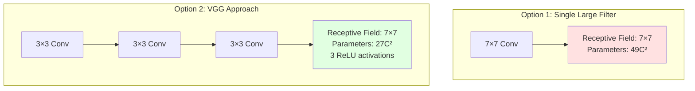
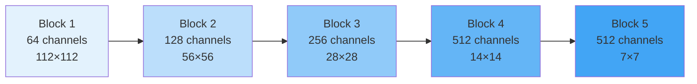
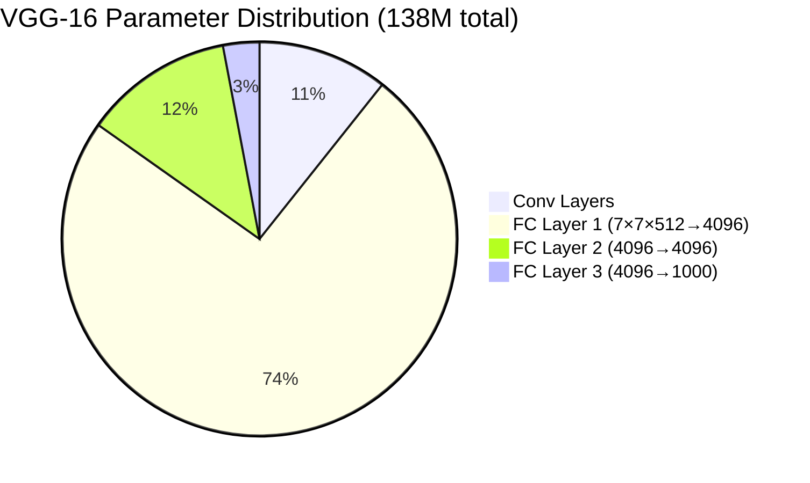

# VGG (Visual Geometry Group)

## Overview
VGG is a deep convolutional neural network architecture developed by the Visual Geometry Group at Oxford University (Simonyan & Zisserman, 2014). It demonstrated that network depth is critical for good performance in visual recognition tasks, winning 2nd place in ILSVRC 2014.

## Key Innovations

### 1. Depth Matters
VGG showed that increasing network depth (16-19 layers) with very small (3×3) convolution filters leads to better performance than using larger filters in shallower networks.

### 2. Uniform Architecture
- **3×3 convolution filters** throughout the network
- **2×2 max pooling** with stride 2
- **Same padding** to preserve spatial dimensions
- **Doubling of channels** after each pooling layer

### 3. Simplicity
Consistent, repeatable building blocks made the architecture easy to understand and implement.

## Architecture Variants

### VGG-16 (16 weight layers)

```mermaid
graph TD
    A[Input: 224×224×3] --> B1[Conv3-64<br/>ReLU]
    B1 --> B2[Conv3-64<br/>ReLU]
    B2 --> B3[MaxPool 2×2]

    B3 --> C1[Conv3-128<br/>ReLU]
    C1 --> C2[Conv3-128<br/>ReLU]
    C2 --> C3[MaxPool 2×2]

    C3 --> D1[Conv3-256<br/>ReLU]
    D1 --> D2[Conv3-256<br/>ReLU]
    D2 --> D3[Conv3-256<br/>ReLU]
    D3 --> D4[MaxPool 2×2]

    D4 --> E1[Conv3-512<br/>ReLU]
    E1 --> E2[Conv3-512<br/>ReLU]
    E2 --> E3[Conv3-512<br/>ReLU]
    E3 --> E4[MaxPool 2×2]

    E4 --> F1[Conv3-512<br/>ReLU]
    F1 --> F2[Conv3-512<br/>ReLU]
    F2 --> F3[Conv3-512<br/>ReLU]
    F3 --> F4[MaxPool 2×2]

    F4 --> G[Flatten]
    G --> H1[FC-4096<br/>ReLU + Dropout]
    H1 --> H2[FC-4096<br/>ReLU + Dropout]
    H2 --> H3[FC-1000]
    H3 --> I[Softmax]

    style A fill:#e1f5ff
    style I fill:#ffe1e1
    style G fill:#fff4e1
```



**Total**: 13 conv layers + 3 FC layers = 16 layers

### VGG-19 (19 weight layers)
Similar structure but with an additional conv layer in each block:
- Block 3: 4 conv layers (instead of 3)
- Block 4: 4 conv layers (instead of 3)
- Block 5: 4 conv layers (instead of 3)

**Total**: 16 conv layers + 3 FC layers = 19 layers

## Design Principles

### Small Receptive Fields
**Why 3×3 convolutions?**
- Two 3×3 conv layers have the same receptive field as one 5×5 layer
- Three 3×3 conv layers = one 7×7 layer



- **Benefits**:
  - More non-linearity (more ReLU activations)
  - Fewer parameters: 3×(3²×C²) = 27C² vs 49C² for 7×7
  - Deeper network with same receptive field

### Channel Progression



Doubling channels after pooling maintains computational balance while increasing representational capacity.

## Parameters

### VGG-16 Parameters



**Breakdown:**
- Conv layers: ~14.7M parameters (10.7%)
- FC layers: ~123M parameters (89.3%)
- **Total: ~138M parameters**

### Why So Many Parameters?
The first fully connected layer (7×7×512 → 4096) alone has:
- 7 × 7 × 512 × 4096 = **102M parameters**

This is the major bottleneck and memory limitation of VGG.

## Connection to Vanishing Gradient Problem

VGG networks face challenges related to [[13.01 Vanishing Gradient|vanishing gradients]]:

### The Problem
- **16-19 layers deep**: Gradients must backpropagate through many layers
- **Multiplication of small derivatives**: Each layer's gradient is multiplied during backpropagation
- **Deep architecture**: More layers = more opportunities for gradient decay


### VGG's Solutions

#### 1. ReLU Activation
```python
f(x) = max(0, x)
# Derivative: 1 if x > 0, else 0
```
- Prevents gradient saturation for positive values
- No compression of gradients like sigmoid/tanh
- Allows gradients to flow more easily

#### 2. Careful Initialization
- Weight initialization schemes (Xavier/He initialization)
- Prevents initial gradients from being too small or large
- Helps maintain gradient flow from the start

#### 3. Batch Normalization (Later Addition)
While not in the original VGG paper, modern implementations often add:
- Normalizes layer inputs
- Reduces internal covariate shift
- Allows higher learning rates
- Improves gradient flow

### Limitations
Despite these solutions, VGG still struggles with:
- **Very deep training**: Harder to train than ResNet
- **Slower convergence**: Takes longer to reach optimal performance
- **No skip connections**: Unlike ResNet, no direct gradient path

## Performance

### ILSVRC 2014 Results
- **Top-5 error**: 7.3% (VGG-16)
- **Rank**: 2nd place (beaten by GoogLeNet at 6.7%)
- Still widely used due to simplicity

### Transfer Learning
VGG became extremely popular for transfer learning:
- Pre-trained on ImageNet
- Feature extractor for other tasks
- Simple to modify (remove FC layers, add new classifier)

## Advantages

### 1. Simplicity
- Uniform architecture
- Easy to implement
- Interpretable structure

### 2. Strong Features
- Deep features are highly discriminative
- Excellent for transfer learning
- Good generalization

### 3. Standardization
- Became a benchmark architecture
- Easy to reproduce
- Well-documented

## Disadvantages

### 1. Computational Cost
- **138M parameters** (VGG-16)
- **Memory intensive**: ~500MB for inference
- **Slow training**: Many operations required

### 2. Large Model Size
- Difficult to deploy on mobile/edge devices
- Storage requirements are high
- Transfer/download time significant

### 3. Fully Connected Bottleneck
- FC layers contain 90% of parameters
- Mostly in first FC layer
- Limits scalability

### 4. Limited Depth
- Without skip connections, can't go much deeper
- Gradient flow issues prevent scaling to 50+ layers
- ResNet solved this with residual connections

## Modern Alternatives

### Why ResNet Superseded VGG
- **Skip connections**: Better gradient flow
- **Deeper networks**: 50, 101, 152 layers
- **Fewer parameters**: ResNet-50 has ~25M (vs VGG-16's 138M)
- **Better performance**: Lower error rates

### When to Still Use VGG
- **Transfer learning**: Pre-trained features still useful
- **Teaching**: Simple to understand for learning
- **Specific tasks**: Some tasks still benefit from VGG features
- **Style transfer**: VGG features popular in artistic applications

## Implementation Example

### PyTorch VGG-16
```python
import torch.nn as nn

class VGG16(nn.Module):
    def __init__(self, num_classes=1000):
        super(VGG16, self).__init__()

        self.features = nn.Sequential(
            # Block 1
            nn.Conv2d(3, 64, 3, padding=1),
            nn.ReLU(inplace=True),
            nn.Conv2d(64, 64, 3, padding=1),
            nn.ReLU(inplace=True),
            nn.MaxPool2d(2, stride=2),

            # Block 2
            nn.Conv2d(64, 128, 3, padding=1),
            nn.ReLU(inplace=True),
            nn.Conv2d(128, 128, 3, padding=1),
            nn.ReLU(inplace=True),
            nn.MaxPool2d(2, stride=2),

            # Block 3
            nn.Conv2d(128, 256, 3, padding=1),
            nn.ReLU(inplace=True),
            nn.Conv2d(256, 256, 3, padding=1),
            nn.ReLU(inplace=True),
            nn.Conv2d(256, 256, 3, padding=1),
            nn.ReLU(inplace=True),
            nn.MaxPool2d(2, stride=2),

            # Block 4
            nn.Conv2d(256, 512, 3, padding=1),
            nn.ReLU(inplace=True),
            nn.Conv2d(512, 512, 3, padding=1),
            nn.ReLU(inplace=True),
            nn.Conv2d(512, 512, 3, padding=1),
            nn.ReLU(inplace=True),
            nn.MaxPool2d(2, stride=2),

            # Block 5
            nn.Conv2d(512, 512, 3, padding=1),
            nn.ReLU(inplace=True),
            nn.Conv2d(512, 512, 3, padding=1),
            nn.ReLU(inplace=True),
            nn.Conv2d(512, 512, 3, padding=1),
            nn.ReLU(inplace=True),
            nn.MaxPool2d(2, stride=2),
        )

        self.classifier = nn.Sequential(
            nn.Linear(512 * 7 * 7, 4096),
            nn.ReLU(inplace=True),
            nn.Dropout(0.5),
            nn.Linear(4096, 4096),
            nn.ReLU(inplace=True),
            nn.Dropout(0.5),
            nn.Linear(4096, num_classes),
        )

    def forward(self, x):
        x = self.features(x)
        x = x.view(x.size(0), -1)  # Flatten
        x = self.classifier(x)
        return x
```

## Historical Impact

### Influence on CNN Design
- Proved that depth is crucial
- Popularized small filter sizes
- Established patterns for modern architectures
- Showed importance of uniform design

### Foundation for Future Work
- **ResNet**: Addressed depth limitations with skip connections
- **Inception**: Explored multi-scale features
- **EfficientNet**: Optimized depth-width-resolution tradeoffs
- **MobileNet**: Efficient alternatives for mobile deployment

## Related Concepts

- [[13_Deep_Learning_CV_MOC]]
- [[13.01 Vanishing Gradient]] - Deep network challenge VGG faced
- [[13.03 Batch Normalization]] - Modern training technique
- [[13.04 EfficientNet]] - Modern efficient architecture

## References
- Simonyan, K., & Zisserman, A. (2014). "Very Deep Convolutional Networks for Large-Scale Image Recognition." ICLR 2015.
- [VGG Paper](https://arxiv.org/abs/1409.1556)
- [VGG in PyTorch](https://pytorch.org/vision/stable/models.html#vgg)
