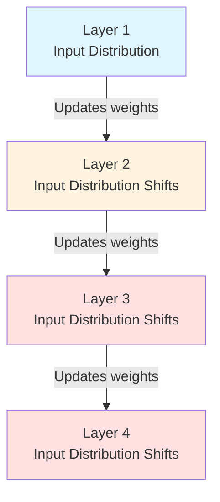
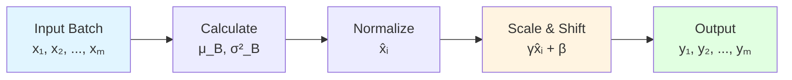
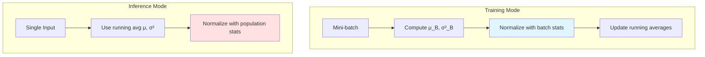
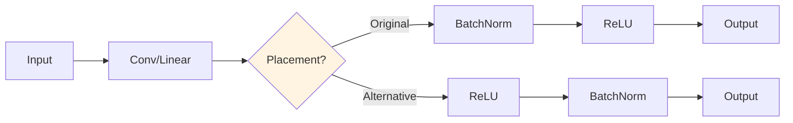
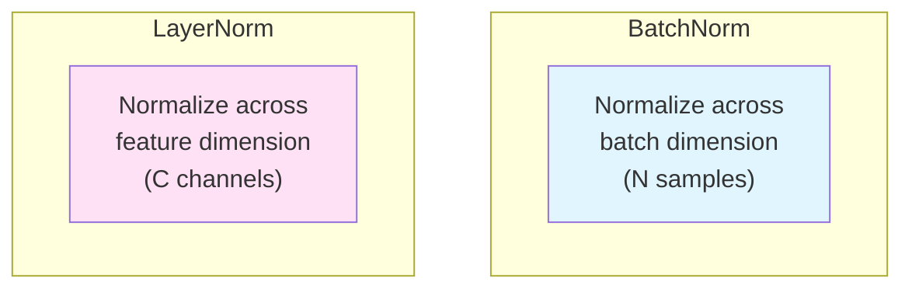
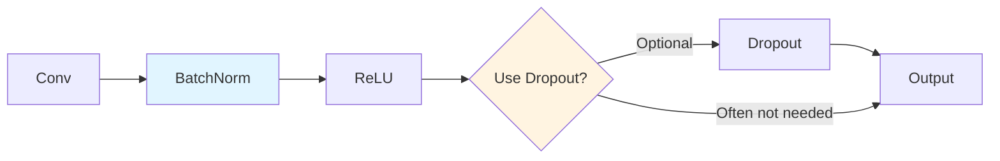

# Batch Normalization

## Overview
Batch Normalization (BatchNorm or BN) is a technique introduced by Sergey Ioffe and Christian Szegedy in 2015 that normalizes the inputs of each layer to have zero mean and unit variance. It has become a fundamental building block in modern deep neural networks, dramatically improving training speed and stability.

## The Problem: Internal Covariate Shift

### What is Internal Covariate Shift?
During training, the distribution of inputs to each layer constantly changes as the parameters of previous layers update. This phenomenon makes training difficult because:
- Each layer must continuously adapt to new input distributions
- Deep networks suffer more as changes compound through layers
- Requires careful initialization and low learning rates



### Impact on Training
- **Saturated activations**: Sigmoid/tanh neurons can get stuck in saturation regions
- **Exploding/vanishing gradients**: Unstable gradient flow
- **Slow convergence**: Network takes longer to train
- **Sensitivity to initialization**: Poor initialization can prevent learning

## How Batch Normalization Works

### Algorithm

For a mini-batch $B = \{x_1, x_2, ..., x_m\}$:

**Step 1: Calculate batch statistics**
$$\mu_B = \frac{1}{m}\sum_{i=1}^m x_i$$
$$\sigma_B^2 = \frac{1}{m}\sum_{i=1}^m (x_i - \mu_B)^2$$

**Step 2: Normalize**
$$\hat{x}_i = \frac{x_i - \mu_B}{\sqrt{\sigma_B^2 + \epsilon}}$$

**Step 3: Scale and shift (learnable parameters)**
$$y_i = \gamma \hat{x}_i + \beta$$

Where:
- $\gamma$ (scale) and $\beta$ (shift) are learnable parameters
- $\epsilon$ is a small constant for numerical stability (typically $10^{-5}$)



### Why Scale and Shift?
The learnable parameters $\gamma$ and $\beta$ allow the network to:
- **Undo normalization if needed**: Can learn $\gamma = \sqrt{\sigma_B^2}$ and $\beta = \mu_B$
- **Preserve representational power**: Network can learn optimal distribution
- **Flexibility**: Not forced to have zero mean and unit variance

## Training vs Inference

### During Training
- Use batch statistics ($\mu_B$, $\sigma_B^2$)
- Update running averages of mean and variance

### During Inference
- Use running averages (population statistics)
- No dependency on batch
- Deterministic output for same input



## Benefits

### 1. Faster Training
- Allows higher learning rates (10-100x)
- Converges in fewer epochs
- Less sensitive to initialization

### 2. Regularization Effect
- Adds noise during training (batch statistics vary)
- Reduces need for dropout
- Improves generalization

### 3. Mitigates Vanishing Gradients
- Prevents layer inputs from becoming too small/large
- Maintains healthy gradient flow
- Directly addresses [[13.01 Vanishing Gradient|vanishing gradient problem]]

### 4. Reduces Sensitivity
- Less dependent on weight initialization
- More robust to hyperparameter choices
- Easier to tune

## Placement in Network

### Common Pattern
```python
# Typical ordering
Conv2d / Linear
BatchNorm
Activation (ReLU)
```

### Before or After Activation?
**Original paper**: BatchNorm → Activation
**Common practice**: Varies, both work well



## Implementation

### PyTorch Example
```python
import torch.nn as nn

class ConvBlock(nn.Module):
    def __init__(self, in_channels, out_channels):
        super().__init__()
        self.conv = nn.Conv2d(in_channels, out_channels, 3, padding=1)
        self.bn = nn.BatchNorm2d(out_channels)
        self.relu = nn.ReLU(inplace=True)

    def forward(self, x):
        x = self.conv(x)
        x = self.bn(x)      # BatchNorm after conv
        x = self.relu(x)
        return x
```

### Parameters
```python
# For BatchNorm2d with C channels:
# Learnable: γ (scale) and β (shift) → 2C parameters
# Running stats: running_mean and running_var → 2C (not trained)

bn = nn.BatchNorm2d(64)
# Learnable parameters: 2 × 64 = 128
# Running statistics: 2 × 64 = 128 (not updated by gradient)
```

## Variants

### 1. Layer Normalization (LayerNorm)
- Normalizes across features instead of batch
- Better for RNNs, Transformers
- Not dependent on batch size



### 2. Instance Normalization (InstanceNorm)
- Normalizes each instance independently
- Popular in style transfer
- Used in GANs

### 3. Group Normalization (GroupNorm)
- Divides channels into groups
- Normalizes within each group
- Works well with small batch sizes

### 4. Weight Normalization
- Normalizes weight vectors
- Decouples magnitude from direction
- Alternative approach

## Connection to VGG

While not in the original [[13.02 VGG|VGG]] paper (2014), modern implementations often add BatchNorm:

### VGG without BatchNorm (Original)
- Harder to train
- Requires careful initialization
- Lower learning rates needed
- Slower convergence

### VGG with BatchNorm (Modern)
```python
# VGG block with BatchNorm
nn.Conv2d(in_ch, out_ch, 3, padding=1)
nn.BatchNorm2d(out_ch)  # Added
nn.ReLU(inplace=True)
```

**Improvements:**
- Faster training (2-3x speedup)
- Better gradient flow through 16-19 layers
- Less sensitive to initialization
- Can use higher learning rates

## Limitations and Considerations

### 1. Batch Size Dependency
- **Small batches**: Poor estimate of statistics
- **Batch size = 1**: Cannot compute batch statistics
- **Solution**: Use GroupNorm or LayerNorm

### 2. Inference Mismatch
- Training uses batch stats, inference uses running averages
- Can cause train/test discrepancy
- Requires proper handling of running statistics

### 3. Computational Overhead
- Additional forward/backward computations
- Memory for running statistics
- Usually negligible compared to benefits

### 4. Recurrent Networks
- Less effective for RNNs/LSTMs
- LayerNorm preferred for sequence models
- Batch statistics don't make sense across time

## Best Practices

### 1. Placement
- After convolutional/linear layers
- Before activation functions (common)
- Experiment with both orderings

### 2. Initialization
- Use default initialization for $\gamma = 1$, $\beta = 0$
- No need for special weight initialization (BatchNorm helps)

### 3. Batch Size
- Use batch size ≥ 16 for stable statistics
- Larger batches generally better for BatchNorm
- Consider GroupNorm for small batches

### 4. Combined with Dropout
- BatchNorm provides regularization
- May not need dropout with BatchNorm
- If combining, place dropout after BatchNorm



## Mathematical Intuition

### Whitening Transformation
BatchNorm approximates a whitening transformation:
- Makes features uncorrelated
- Unit variance
- Easier for subsequent layers to learn

### Smoothing the Loss Landscape
Recent research suggests BatchNorm:
- Makes the optimization landscape smoother
- Reduces sensitivity to learning rate
- Enables better gradient flow

## Impact on Deep Learning

### Revolutionary Effect
- Enabled training of very deep networks
- Standard component in ResNet, Inception, etc.
- Shifted focus from initialization to architecture
- Made deep learning more accessible

### Timeline
- **2015**: Batch Normalization introduced
- **2016**: Layer Normalization for RNNs
- **2018**: Group Normalization for vision
- **Now**: Various normalization techniques for different domains

## Related Concepts

- [[13_Deep_Learning_CV_MOC]]
- [[13.01 Vanishing Gradient]] - Problem BatchNorm helps address
- [[13.02 VGG]] - Architecture before BatchNorm
- [[13.05 Learning Rate]] - BatchNorm allows higher LR

## References
- Ioffe, S., & Szegedy, C. (2015). "Batch Normalization: Accelerating Deep Network Training by Reducing Internal Covariate Shift." ICML 2015.
- [Original Paper](https://arxiv.org/abs/1502.03167)
- [How Does Batch Normalization Help Optimization?](https://arxiv.org/abs/1805.11604) (NeurIPS 2018)
