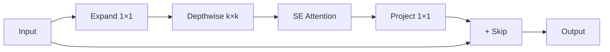

# EfficientNet

## Overview
CNN family that systematically scales network depth, width, and resolution using a compound coefficient. Achieves SOTA ImageNet accuracy with significantly fewer parameters than previous models. Introduced by Google Research (2019).

**Key Innovation**: Compound scaling - uniformly scale all dimensions together rather than arbitrarily.

## The Scaling Problem

Traditional scaling approaches:
- **Depth**: Add layers (ResNet-50 → ResNet-152)
- **Width**: More channels per layer
- **Resolution**: Larger input images

**Issue**: Arbitrary scaling is inefficient; dimensions should scale together.

## Compound Scaling

Scale all three dimensions with compound coefficient $\phi$:

$$d = \alpha^\phi, \quad w = \beta^\phi, \quad r = \gamma^\phi$$

Constraint: $\alpha \cdot \beta^2 \cdot \gamma^2 \approx 2$ (FLOPs grow ~2× per $\phi$)

**EfficientNet values** (from grid search):
- $\alpha = 1.2$ (depth)
- $\beta = 1.1$ (width)
- $\gamma = 1.15$ (resolution)

## Model Variants

| Model | φ | Resolution | Params | FLOPs | Top-1 Acc |
|-------|---|------------|--------|-------|-----------|
| B0 | 0 | 224 | 5.3M | 0.39B | 77.1% |
| B1 | 0.5 | 240 | 7.8M | 0.70B | 79.1% |
| B2 | 1 | 260 | 9.2M | 1.0B | 80.1% |
| B3 | 2 | 300 | 12M | 1.8B | 81.6% |
| B4 | 3 | 380 | 19M | 4.2B | 82.9% |
| B5 | 4 | 456 | 30M | 9.9B | 83.6% |
| B6 | 5 | 528 | 43M | 19B | 84.0% |
| B7 | 6 | 600 | 66M | 37B | 84.3% |

**Efficiency**: B0 achieves ResNet-50 accuracy with 8× fewer parameters.

## Architecture Components

### MBConv Block (Mobile Inverted Bottleneck)
Core building block from MobileNetV2:
1. **Expansion**: 1×1 conv increases channels (6×)
2. **Depthwise**: Spatial filtering with k×k kernels
3. **SE Module**: Channel attention (squeeze-and-excitation)
4. **Projection**: 1×1 conv reduces channels
5. **Skip connection**: Add input if same dimensions

### Squeeze-and-Excitation (SE)
Adaptive channel recalibration:
1. Global average pooling (squeeze)
2. Two FC layers with reduction ratio
3. Sigmoid gating (excitation)
4. Element-wise multiply with input

## EfficientNetV2 Improvements

Released 2021 with faster training:
- **Fused-MBConv**: Regular conv in early layers (faster than depthwise)
- **Progressive learning**: Increase image size during training
- **Adaptive regularization**: Adjust dropout with image size

| Model | Params | Top-1 | Training Speed |
|-------|--------|-------|----------------|
| V2-S | 24M | 83.9% | 2.3× faster than V1-B5 |
| V2-M | 54M | 85.1% | - |
| V2-L | 120M | 85.7% | - |

## Model Selection Guide

| Use Case | Recommended |
|----------|-------------|
| Mobile/edge | B0-B2 |
| Server deployment | B3-B4 |
| Research/benchmarking | B5-B7 |
| Fast training | V2-S or V2-M |

## Transfer Learning Strategy

1. Load pretrained ImageNet weights
2. Replace classifier head for your classes
3. **Option A**: Freeze backbone, train classifier only
4. **Option B**: Fine-tune entire model with low LR (1e-4)
5. Use progressive unfreezing for best results

## Training Tips

- **Data augmentation**: RandAugment or AutoAugment
- **Regularization**: Mixup, CutMix, Dropout
- **Learning rate**: Cosine schedule with warmup
- **Mixed precision**: FP16 for 2× faster training
- **Match resolution**: Use model's intended input size

## Downstream Applications

| Task | How to Use |
|------|------------|
| **Classification** | Replace final FC layer |
| **Feature extraction** | Remove classifier, use backbone features |
| **Object detection** | EfficientDet (EfficientNet + BiFPN) |
| **Segmentation** | Use as encoder in U-Net/FPN |

## Optimization for Deployment

| Technique | Effect |
|-----------|--------|
| **Quantization (INT8)** | 4× smaller, 2-3× faster CPU |
| **TensorRT** | Optimized GPU inference |
| **Pruning** | Remove redundant weights |
| **Knowledge distillation** | Train smaller model from larger |

## Limitations

- Training cost increases with compound scaling
- Higher resolutions need more GPU memory
- Not always fastest despite efficiency claims
- Small object detection needs larger input sizes

## Related Concepts

- [[13_Deep_Learning_CV_MOC]]
- [[13.02 VGG]] - Earlier architecture comparison
- [[13.03 Batch Normalization]] - Training technique used
- [[13.01 Vanishing Gradient]] - Compound scaling addresses depth

## References
- "EfficientNet: Rethinking Model Scaling for CNNs" (Tan & Le, 2019)
- "EfficientNetV2: Smaller Models and Faster Training" (Tan & Le, 2021)
- "MobileNetV2: Inverted Residuals and Linear Bottlenecks"
- PyTorch: `timm.create_model('efficientnet_b0', pretrained=True)`
