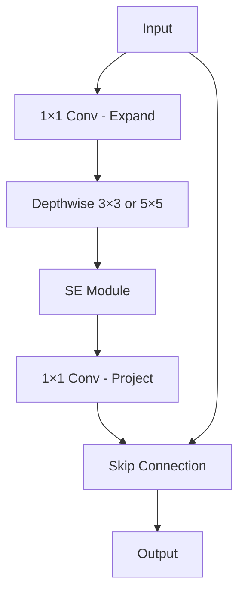

# EfficientNet

## Overview
EfficientNet is a family of convolutional neural networks that systematically scales network depth, width, and resolution using a compound coefficient. Introduced by Google Research in 2019, it achieves state-of-the-art accuracy on ImageNet while being significantly more efficient than previous models.

**Key Innovation**: Compound scaling method that uniformly scales all dimensions (depth/width/resolution) rather than arbitrary scaling.

## Core Concepts

### The Scaling Problem
Traditional approaches scale CNNs arbitrarily:
- **Depth scaling**: Add more layers (ResNet-50 → ResNet-101)
- **Width scaling**: Increase channels per layer (wider networks)
- **Resolution scaling**: Use larger input images (224×224 → 299×299)

**Problem**: Arbitrary scaling is inefficient and requires manual tuning.

### Compound Scaling
EfficientNet scales all three dimensions with a single compound coefficient:

$$\text{depth: } d = \alpha^\phi$$
$$\text{width: } w = \beta^\phi$$
$$\text{resolution: } r = \gamma^\phi$$

Subject to constraint:
$$\alpha \cdot \beta^2 \cdot \gamma^2 \approx 2$$
$$\alpha \geq 1, \beta \geq 1, \gamma \geq 1$$

Where:
- $\phi$ = compound coefficient (user-specified)
- $\alpha, \beta, \gamma$ = grid search constants for depth, width, resolution

**Intuition**: Increasing image resolution requires more layers (depth) and channels (width) to capture finer-grained patterns.

## EfficientNet Architecture

### Base Model (EfficientNet-B0)
Discovered through neural architecture search (NAS):

| Stage | Operator | Resolution | Channels | Layers |
|-------|----------|------------|----------|--------|
| 1 | Conv3×3 | 224×224 | 32 | 1 |
| 2 | MBConv1, k3×3 | 112×112 | 16 | 1 |
| 3 | MBConv6, k3×3 | 112×112 | 24 | 2 |
| 4 | MBConv6, k5×5 | 56×56 | 40 | 2 |
| 5 | MBConv6, k3×3 | 28×28 | 80 | 3 |
| 6 | MBConv6, k5×5 | 14×14 | 112 | 3 |
| 7 | MBConv6, k5×5 | 14×14 | 192 | 4 |
| 8 | MBConv6, k3×3 | 7×7 | 320 | 1 |
| 9 | Conv1×1, Pooling, FC | 7×7 | 1280 | 1 |

**Parameters**: 5.3M
**FLOPs**: 0.39B
**Top-1 Accuracy**: 77.1%

### MBConv Block (Mobile Inverted Bottleneck)
Core building block borrowed from MobileNetV2:



**Components**:
1. **Expansion**: 1×1 convolution increases channels (expansion ratio, usually 6×)
2. **Depthwise**: Spatial filtering with k×k kernels
3. **Squeeze-and-Excitation (SE)**: Channel attention mechanism
4. **Projection**: 1×1 convolution reduces channels
5. **Skip connection**: Residual connection if input/output same size

### Squeeze-and-Excitation (SE) Module
Adaptive channel-wise feature recalibration:

```python
class SEBlock(nn.Module):
    def __init__(self, channels, reduction=4):
        super().__init__()
        self.squeeze = nn.AdaptiveAvgPool2d(1)
        self.excitation = nn.Sequential(
            nn.Linear(channels, channels // reduction),
            nn.SiLU(),
            nn.Linear(channels // reduction, channels),
            nn.Sigmoid()
        )

    def forward(self, x):
        b, c, _, _ = x.size()
        # Squeeze: Global average pooling
        y = self.squeeze(x).view(b, c)
        # Excitation: FC layers
        y = self.excitation(y).view(b, c, 1, 1)
        # Scale: Element-wise multiplication
        return x * y.expand_as(x)
```

## EfficientNet Family

### Scaling Variants
Using compound coefficient $\phi$:

| Model | φ | Depth | Width | Resolution | Params | FLOPs | Top-1 Acc |
|-------|---|-------|-------|------------|--------|-------|-----------|
| B0 | 0 | 1.0 | 1.0 | 224 | 5.3M | 0.39B | 77.1% |
| B1 | 0.5 | 1.1 | 1.0 | 240 | 7.8M | 0.70B | 79.1% |
| B2 | 1 | 1.2 | 1.1 | 260 | 9.2M | 1.0B | 80.1% |
| B3 | 2 | 1.4 | 1.2 | 300 | 12M | 1.8B | 81.6% |
| B4 | 3 | 1.8 | 1.4 | 380 | 19M | 4.2B | 82.9% |
| B5 | 4 | 2.2 | 1.6 | 456 | 30M | 9.9B | 83.6% |
| B6 | 5 | 2.6 | 1.8 | 528 | 43M | 19B | 84.0% |
| B7 | 6 | 3.1 | 2.0 | 600 | 66M | 37B | 84.3% |

**Scaling coefficients** (grid search results):
- $\alpha = 1.2$ (depth)
- $\beta = 1.1$ (width)
- $\gamma = 1.15$ (resolution)

### EfficientNetV2
Improved version (2021) with faster training:

**Key improvements**:
1. **Fused-MBConv**: Replace depthwise conv with regular conv in early layers
2. **Progressive learning**: Gradually increase image size during training
3. **Adaptive regularization**: Adjust dropout/augmentation with image size

| Model | Params | ImageNet Top-1 | Training Speed |
|-------|--------|----------------|----------------|
| V2-S | 24M | 83.9% | 2.3× faster than V1-B5 |
| V2-M | 54M | 85.1% | - |
| V2-L | 120M | 85.7% | - |

## Implementation

### Using PyTorch (timm library)
```python
import timm
import torch
import torch.nn as nn

# Load pretrained EfficientNet-B0
model = timm.create_model('efficientnet_b0', pretrained=True)

# For custom number of classes
num_classes = 10
model = timm.create_model(
    'efficientnet_b0',
    pretrained=True,
    num_classes=num_classes
)

# Get model summary
print(model)

# Inference
model.eval()
with torch.no_grad():
    img = torch.randn(1, 3, 224, 224)
    output = model(img)
    print(output.shape)  # (1, num_classes)
```

### Using TensorFlow/Keras
```python
from tensorflow.keras.applications import EfficientNetB0
from tensorflow.keras import layers, models

# Load pretrained model
base_model = EfficientNetB0(
    include_top=False,
    weights='imagenet',
    input_shape=(224, 224, 3)
)

# Build classifier
model = models.Sequential([
    base_model,
    layers.GlobalAveragePooling2D(),
    layers.Dropout(0.2),
    layers.Dense(10, activation='softmax')
])

# Freeze base model for transfer learning
base_model.trainable = False

model.compile(
    optimizer='adam',
    loss='categorical_crossentropy',
    metrics=['accuracy']
)

model.summary()
```

### Custom Implementation (MBConv Block)
```python
import torch
import torch.nn as nn

class MBConv(nn.Module):
    def __init__(
        self,
        in_channels,
        out_channels,
        kernel_size=3,
        stride=1,
        expansion=6,
        se_ratio=0.25
    ):
        super().__init__()
        self.use_residual = (stride == 1 and in_channels == out_channels)
        hidden_dim = in_channels * expansion

        layers = []

        # Expansion phase
        if expansion != 1:
            layers.extend([
                nn.Conv2d(in_channels, hidden_dim, 1, bias=False),
                nn.BatchNorm2d(hidden_dim),
                nn.SiLU()
            ])

        # Depthwise convolution
        layers.extend([
            nn.Conv2d(
                hidden_dim, hidden_dim, kernel_size,
                stride=stride, padding=kernel_size//2,
                groups=hidden_dim, bias=False
            ),
            nn.BatchNorm2d(hidden_dim),
            nn.SiLU()
        ])

        # Squeeze-and-Excitation
        if se_ratio:
            se_channels = max(1, int(in_channels * se_ratio))
            self.se = nn.Sequential(
                nn.AdaptiveAvgPool2d(1),
                nn.Conv2d(hidden_dim, se_channels, 1),
                nn.SiLU(),
                nn.Conv2d(se_channels, hidden_dim, 1),
                nn.Sigmoid()
            )
        else:
            self.se = None

        # Projection phase
        layers.extend([
            nn.Conv2d(hidden_dim, out_channels, 1, bias=False),
            nn.BatchNorm2d(out_channels)
        ])

        self.conv = nn.Sequential(*layers)

    def forward(self, x):
        identity = x
        out = self.conv(x)

        # Apply SE
        if self.se is not None:
            out = out * self.se(out)

        # Skip connection
        if self.use_residual:
            out = out + identity

        return out
```

## Training Strategies

### Transfer Learning
```python
import torch.optim as optim
from torch.utils.data import DataLoader

# Load pretrained model
model = timm.create_model('efficientnet_b0', pretrained=True)

# Option 1: Fine-tune entire model
for param in model.parameters():
    param.requires_grad = True

# Option 2: Freeze backbone, train classifier only
for name, param in model.named_parameters():
    if 'classifier' not in name:
        param.requires_grad = False

# Replace classifier
model.classifier = nn.Linear(model.classifier.in_features, num_classes)

# Training
optimizer = optim.Adam(model.parameters(), lr=1e-4)
criterion = nn.CrossEntropyLoss()

for epoch in range(epochs):
    for images, labels in train_loader:
        optimizer.zero_grad()
        outputs = model(images)
        loss = criterion(outputs, labels)
        loss.backward()
        optimizer.step()
```

### Data Augmentation (AutoAugment)
```python
from torchvision import transforms

# Standard augmentation
train_transforms = transforms.Compose([
    transforms.RandomResizedCrop(224),
    transforms.RandomHorizontalFlip(),
    transforms.AutoAugment(transforms.AutoAugmentPolicy.IMAGENET),
    transforms.ToTensor(),
    transforms.Normalize(
        mean=[0.485, 0.456, 0.406],
        std=[0.229, 0.224, 0.225]
    )
])

# EfficientNet recommends RandAugment
from timm.data import RandAugment

augment = RandAugment(
    num_ops=2,        # Number of augmentation operations
    magnitude=9       # Strength of augmentations
)
```

### Progressive Resizing (EfficientNetV2)
```python
# Start with smaller images, gradually increase
training_schedule = [
    {'epochs': 10, 'size': 128, 'dropout': 0.1},
    {'epochs': 20, 'size': 192, 'dropout': 0.2},
    {'epochs': 30, 'size': 224, 'dropout': 0.3},
]

for stage in training_schedule:
    # Update transforms
    train_loader = get_dataloader(image_size=stage['size'])

    # Update dropout
    model.classifier[0].p = stage['dropout']

    # Train
    train(model, train_loader, epochs=stage['epochs'])
```

### Mixed Precision Training
```python
from torch.cuda.amp import autocast, GradScaler

scaler = GradScaler()

for images, labels in train_loader:
    optimizer.zero_grad()

    # Forward pass with autocasting
    with autocast():
        outputs = model(images)
        loss = criterion(outputs, labels)

    # Backward pass with gradient scaling
    scaler.scale(loss).backward()
    scaler.step(optimizer)
    scaler.update()
```

## Performance Comparison

### ImageNet Accuracy vs Parameters
```
EfficientNet-B7: 84.3% acc, 66M params
ResNet-152:      78.3% acc, 60M params
DenseNet-264:    77.9% acc, 33M params
```

**Efficiency**: EfficientNet-B0 achieves ResNet-50 accuracy with 8× fewer parameters.

### Accuracy vs FLOPs
EfficientNet is on the Pareto frontier (best accuracy for given FLOPs).

## Use Cases

### Image Classification
```python
from PIL import Image
import torch
from torchvision import transforms

# Load model
model = timm.create_model('efficientnet_b0', pretrained=True)
model.eval()

# Preprocess
transform = transforms.Compose([
    transforms.Resize(256),
    transforms.CenterCrop(224),
    transforms.ToTensor(),
    transforms.Normalize([0.485, 0.456, 0.406], [0.229, 0.224, 0.225])
])

# Predict
img = Image.open('image.jpg')
img_tensor = transform(img).unsqueeze(0)

with torch.no_grad():
    output = model(img_tensor)
    probabilities = torch.nn.functional.softmax(output[0], dim=0)
    top5_prob, top5_catid = torch.topk(probabilities, 5)

print("Top 5 predictions:")
for i in range(5):
    print(f"{top5_catid[i]}: {top5_prob[i]:.4f}")
```

### Feature Extraction
```python
# Remove classifier head
backbone = timm.create_model(
    'efficientnet_b0',
    pretrained=True,
    num_classes=0,  # Remove classifier
    global_pool=''  # Remove pooling
)

# Extract features
features = backbone(img_tensor)  # Shape: (1, 1280, 7, 7)

# Or with global pooling
backbone_pooled = timm.create_model(
    'efficientnet_b0',
    pretrained=True,
    num_classes=0
)
features_pooled = backbone_pooled(img_tensor)  # Shape: (1, 1280)
```

### Object Detection (EfficientDet)
EfficientNet as backbone for detection:
```python
# EfficientDet uses EfficientNet + BiFPN
# Available in detectron2 or effdet library
from effdet import get_efficientdet_config, EfficientDet

config = get_efficientdet_config('tf_efficientdet_d0')
model = EfficientDet(config)
```

### Semantic Segmentation
```python
import segmentation_models_pytorch as smp

# EfficientNet as encoder
model = smp.Unet(
    encoder_name='efficientnet-b0',
    encoder_weights='imagenet',
    in_channels=3,
    classes=21  # Number of segmentation classes
)
```

## Optimization Techniques

### Model Quantization
```python
import torch.quantization as quantization

# Post-training quantization
model_fp32 = timm.create_model('efficientnet_b0', pretrained=True)
model_fp32.eval()

# Prepare for quantization
model_fp32.qconfig = quantization.get_default_qconfig('fbgemm')
model_prepared = quantization.prepare(model_fp32)

# Calibrate with representative data
with torch.no_grad():
    for data in calibration_loader:
        model_prepared(data)

# Convert to quantized model
model_int8 = quantization.convert(model_prepared)

# 4× smaller, 2-3× faster on CPU
```

### Knowledge Distillation
```python
def distillation_loss(student_logits, teacher_logits, labels, alpha=0.5, T=3):
    """
    Combine hard targets (labels) with soft targets (teacher).

    T: Temperature for softening distributions
    alpha: Weight between hard and soft losses
    """
    hard_loss = F.cross_entropy(student_logits, labels)

    soft_loss = F.kl_div(
        F.log_softmax(student_logits / T, dim=1),
        F.softmax(teacher_logits / T, dim=1),
        reduction='batchmean'
    ) * (T ** 2)

    return alpha * hard_loss + (1 - alpha) * soft_loss

# Train smaller model with larger teacher
teacher = timm.create_model('efficientnet_b7', pretrained=True)
student = timm.create_model('efficientnet_b0', pretrained=False)

teacher.eval()
for images, labels in train_loader:
    with torch.no_grad():
        teacher_logits = teacher(images)

    student_logits = student(images)
    loss = distillation_loss(student_logits, teacher_logits, labels)
    loss.backward()
```

### Model Pruning
```python
import torch.nn.utils.prune as prune

# Prune 30% of weights in Conv2d layers
for module in model.modules():
    if isinstance(module, nn.Conv2d):
        prune.l1_unstructured(module, name='weight', amount=0.3)

# Make pruning permanent
for module in model.modules():
    if isinstance(module, nn.Conv2d):
        prune.remove(module, 'weight')
```

## Best Practices

1. **Model selection**:
   - B0-B2: Mobile/edge devices
   - B3-B4: Server deployment
   - B5-B7: Research, benchmarking

2. **Transfer learning**:
   - Start with pretrained ImageNet weights
   - Fine-tune on smaller learning rate (1e-4)
   - Use progressive unfreezing

3. **Data augmentation**:
   - Use AutoAugment or RandAugment
   - Mixup/CutMix for regularization
   - Match augmentation strength to model size

4. **Training**:
   - Use mixed precision (AMP) for speed
   - Cosine learning rate schedule
   - Warmup for first few epochs

5. **Deployment**:
   - Quantize for CPU inference
   - TensorRT for GPU inference
   - ONNX for cross-platform

## Limitations

- **Training cost**: Compound scaling increases training time
- **Memory**: Higher resolutions require more GPU memory
- **Inference speed**: Not always fastest despite efficiency claims
- **Small objects**: Large input sizes needed for tiny objects

## Related Concepts
- [[13.02 VGG]]
- [[13.03 Batch Normalization]]
- [[13.01 Vanishing Gradient]]

## References
- "EfficientNet: Rethinking Model Scaling for Convolutional Neural Networks" (Tan & Le, 2019)
- "EfficientNetV2: Smaller Models and Faster Training" (Tan & Le, 2021)
- "MobileNetV2: Inverted Residuals and Linear Bottlenecks" (Sandler et al., 2018)
- "Squeeze-and-Excitation Networks" (Hu et al., 2018)
- Official Implementation: github.com/tensorflow/tpu/tree/master/models/official/efficientnet
