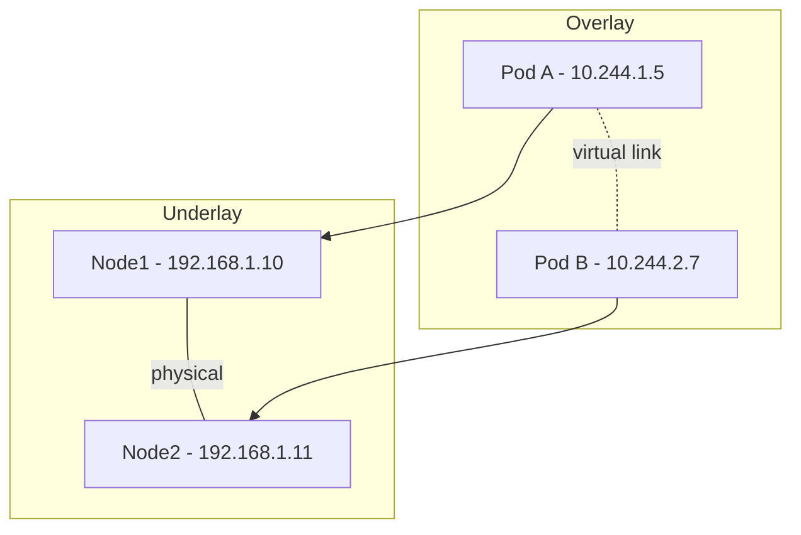

# Overlay Network

## Overview
An **overlay network** is a virtual network built on top of an existing physical (underlay) network. Nodes connect via logical links that may traverse many underlying hops, enabling features like service discovery, encryption, and cross-host connectivity without changing the underlay.

## Underlay vs. Overlay

| Aspect | Underlay | Overlay |
|--------|----------|---------|
| Layer | Physical / L2-L3 | Logical / L3-L7 |
| Addressing | Real IPs, MACs | Virtual IPs, tunnels |
| Concerns | Routing, hardware | Policy, identity, encryption |
| Examples | Ethernet, BGP fabric | VXLAN, WireGuard mesh, Istio |

## How It Works

Packets are **encapsulated** at the source node (overlay header + original packet), routed across the underlay, then **decapsulated** at the destination node.

## Common Encapsulation Protocols

| Protocol | Layer | Notes |
|----------|-------|-------|
| **VXLAN** | L2 over UDP | Most common in K8s CNIs (Flannel, Calico) |
| **Geneve** | L2/L3 over UDP | Extensible, used by OVN, Antrea |
| **GRE** | L3 over IP | Simple, no encryption |
| **IP-in-IP** | L3 over IP | Lightweight, used by Calico |
| **WireGuard** | L3 over UDP | Encrypted, used by Cilium, Tailscale |

## Overlay Network Examples

### Container & Kubernetes
- **Flannel** - VXLAN-based pod network
- **Calico** - BGP underlay or IP-in-IP/VXLAN overlay
- **Cilium** - eBPF-based, optional WireGuard encryption
- **Weave Net** - Mesh overlay with built-in encryption

### Service Mesh (L7 overlay)
- **Istio**, **Linkerd**, **Consul Connect** - sidecar proxies form an L7 overlay for mTLS, routing, observability

### Mesh VPNs (see [[21.01 VPN]])
- **Tailscale**, **Netbird**, **ZeroTier** - identity-based overlay across hosts/clouds

### Data Center
- **OVN/OVS** - Open Virtual Network on top of Open vSwitch
- **NSX-T** - VMware's overlay for software-defined DC

## Trade-offs

> [!INFO] Why Use an Overlay
> - Decouple application networking from physical topology
> - Enable multi-tenant isolation on shared infrastructure
> - Add encryption, policy, and observability uniformly

> [!WARNING] Costs
> - **Encapsulation overhead** (~50 bytes per packet) → MTU tuning required
> - **Performance penalty** vs. native routing; mitigated by eBPF, hardware offload (VXLAN NIC offload)
> - **Debugging complexity**: tcpdump on underlay shows tunnel traffic, not app packets

## Practical Use Cases

- **Kubernetes pod-to-pod** networking across nodes/clouds
- **Multi-cloud / hybrid** connectivity without coordinating underlay routes
- **Zero-trust networking** with identity-based access between services
- **ML training clusters** spanning on-prem + cloud GPUs via mesh overlay

## Related Concepts
- [[21_Infrastructure_MOC]]
- [[21.01 VPN]] - VPN tunnels are often the encrypted transport for overlays
