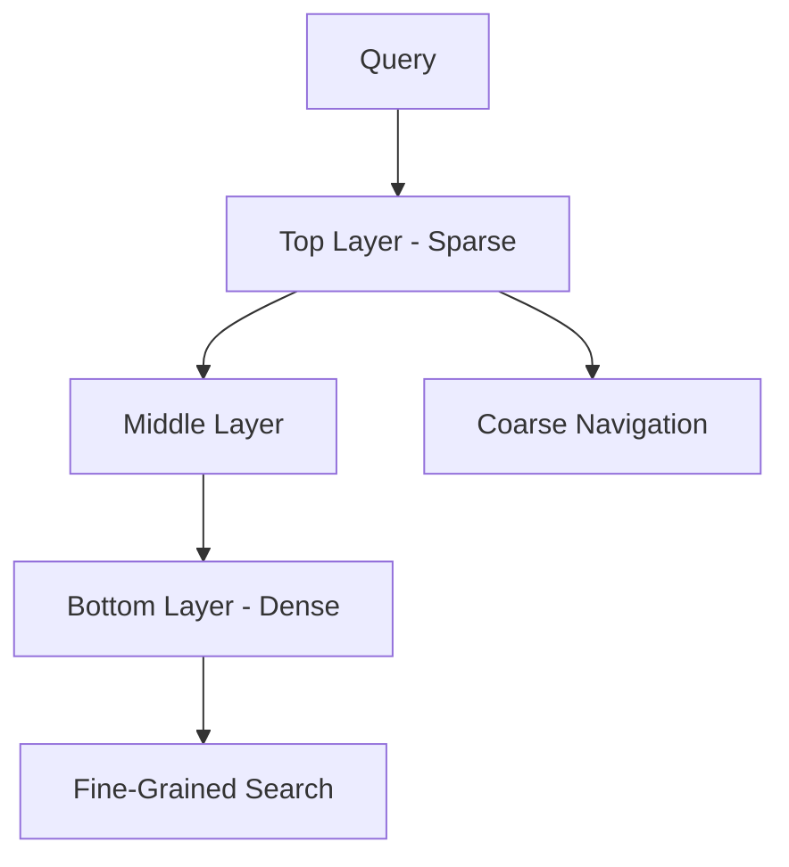

# Vector Databases

## Overview
Vector databases are specialized data stores designed to efficiently store, index, and search high-dimensional vectors (embeddings). They enable semantic search by finding vectors similar to a query vector, making them essential for RAG systems, recommendation engines, and similarity search applications.

## Core Concepts

### Embeddings
High-dimensional numerical representations of data:
- **Text**: Sentence/document embeddings (768-4096 dimensions)
- **Images**: Visual feature vectors (512-2048 dimensions)
- **Audio**: Acoustic embeddings
- **Multi-modal**: Combined representation spaces

### Similarity Metrics

#### Cosine Similarity
Measures angle between vectors (normalized dot product):
$$\text{cosine}(A, B) = \frac{A \cdot B}{\|A\| \|B\|} = \frac{\sum_{i=1}^n A_i B_i}{\sqrt{\sum_{i=1}^n A_i^2} \sqrt{\sum_{i=1}^n B_i^2}}$$

**Range**: -1 to 1 (1 = identical direction)
**Best for**: Text embeddings, normalized vectors

#### Euclidean Distance (L2)
Straight-line distance between points:
$$d(A, B) = \sqrt{\sum_{i=1}^n (A_i - B_i)^2}$$

**Range**: 0 to ∞ (0 = identical)
**Best for**: Spatial data, un-normalized vectors

#### Dot Product
Sum of element-wise multiplication:
$$A \cdot B = \sum_{i=1}^n A_i B_i$$

**Range**: -∞ to ∞
**Best for**: Already normalized embeddings, faster computation

#### Manhattan Distance (L1)
Sum of absolute differences:
$$d(A, B) = \sum_{i=1}^n |A_i - B_i|$$

**Best for**: High-dimensional sparse data

## Indexing Algorithms

### Approximate Nearest Neighbor (ANN)
Trade accuracy for speed in similarity search.

#### HNSW (Hierarchical Navigable Small World)
Graph-based index with layers:


**Characteristics**:
- Fast search: O(log n)
- High memory usage
- Good recall/speed tradeoff
- Used by: Qdrant, Weaviate, Chroma

#### IVF (Inverted File Index)
Partition space into clusters:
1. Train k-means on data
2. Assign vectors to nearest cluster
3. Search only relevant clusters

**Characteristics**:
- Configurable speed/accuracy (nprobe parameter)
- Lower memory than HNSW
- Requires training phase
- Used by: FAISS, Milvus

#### Product Quantization (PQ)
Compress vectors for memory efficiency:
1. Split vector into subvectors
2. Quantize each subvector to codebook
3. Store codes instead of full vectors

**Compression**: 20-30x reduction
**Trade-off**: Slight accuracy loss

### Flat Index
Brute-force exact search:
- 100% recall guarantee
- O(n) search time
- Best for small datasets (<100k vectors)

## Popular Vector Databases

### Pinecone
**Type**: Managed cloud service
**Pricing**: Usage-based ($0.096/GB/month)

```python
from pinecone import Pinecone

pc = Pinecone(api_key="your-key")

# Create index
index = pc.create_index(
    name="my-index",
    dimension=1536,
    metric="cosine",
    spec=ServerlessSpec(
        cloud='aws',
        region='us-east-1'
    )
)

# Upsert vectors
index.upsert(vectors=[
    ("id1", [0.1, 0.2, ...], {"text": "Hello"}),
    ("id2", [0.3, 0.4, ...], {"text": "World"})
])

# Search
results = index.query(
    vector=[0.15, 0.25, ...],
    top_k=5,
    include_metadata=True
)
```

**Pros**: Managed, scalable, simple
**Cons**: Costly at scale, vendor lock-in

### Qdrant
**Type**: Open-source, self-hosted or cloud
**Language**: Rust

```python
from qdrant_client import QdrantClient
from qdrant_client.models import Distance, VectorParams, PointStruct

client = QdrantClient(url="http://localhost:6333")

# Create collection
client.create_collection(
    collection_name="my_collection",
    vectors_config=VectorParams(
        size=768,
        distance=Distance.COSINE
    )
)

# Insert vectors
client.upsert(
    collection_name="my_collection",
    points=[
        PointStruct(
            id=1,
            vector=[0.1, 0.2, ...],
            payload={"text": "Hello", "category": "greeting"}
        )
    ]
)

# Search with filters
results = client.search(
    collection_name="my_collection",
    query_vector=[0.15, 0.25, ...],
    query_filter={
        "must": [
            {"key": "category", "match": {"value": "greeting"}}
        ]
    },
    limit=5
)
```

**Pros**: Rich filtering, efficient, good docs
**Cons**: Needs infrastructure management

### Weaviate
**Type**: Open-source, GraphQL API
**Special**: Built-in vectorizers, hybrid search

```python
import weaviate

client = weaviate.Client("http://localhost:8080")

# Define schema
schema = {
    "class": "Document",
    "vectorizer": "text2vec-openai",
    "properties": [
        {"name": "content", "dataType": ["text"]},
        {"name": "category", "dataType": ["string"]}
    ]
}
client.schema.create_class(schema)

# Insert (auto-vectorizes)
client.data_object.create(
    data_object={"content": "Hello world", "category": "greeting"},
    class_name="Document"
)

# Hybrid search (vector + keyword)
result = (
    client.query
    .get("Document", ["content", "category"])
    .with_hybrid(query="greeting", alpha=0.5)
    .with_limit(5)
    .do()
)
```

**Pros**: Hybrid search, auto-vectorization, GraphQL
**Cons**: Complex setup, heavier resource usage

### Chroma
**Type**: Open-source, embedded
**Language**: Python

```python
import chromadb
from chromadb.config import Settings

client = chromadb.Client(Settings(
    chroma_db_impl="duckdb+parquet",
    persist_directory="./chroma_data"
))

# Create collection
collection = client.create_collection(
    name="my_collection",
    metadata={"hnsw:space": "cosine"}
)

# Add documents (auto-generates embeddings)
collection.add(
    documents=["Hello world", "Goodbye world"],
    metadatas=[{"source": "doc1"}, {"source": "doc2"}],
    ids=["id1", "id2"]
)

# Query
results = collection.query(
    query_texts=["greeting"],
    n_results=5,
    where={"source": "doc1"}
)
```

**Pros**: Lightweight, easy setup, embedded mode
**Cons**: Not designed for massive scale

### Milvus
**Type**: Open-source, cloud-native
**Language**: Go/C++

```python
from pymilvus import connections, Collection, FieldSchema, CollectionSchema, DataType

# Connect
connections.connect(host="localhost", port="19530")

# Define schema
fields = [
    FieldSchema(name="id", dtype=DataType.INT64, is_primary=True),
    FieldSchema(name="embedding", dtype=DataType.FLOAT_VECTOR, dim=768),
    FieldSchema(name="text", dtype=DataType.VARCHAR, max_length=1000)
]
schema = CollectionSchema(fields)
collection = Collection(name="my_collection", schema=schema)

# Create index
index_params = {
    "index_type": "IVF_FLAT",
    "metric_type": "L2",
    "params": {"nlist": 128}
}
collection.create_index(field_name="embedding", index_params=index_params)

# Insert
collection.insert([
    [1, 2, 3],  # ids
    [[0.1, 0.2, ...], [0.3, 0.4, ...], [0.5, 0.6, ...]],  # embeddings
    ["text1", "text2", "text3"]  # texts
])

# Search
collection.load()
results = collection.search(
    data=[[0.15, 0.25, ...]],
    anns_field="embedding",
    param={"metric_type": "L2", "params": {"nprobe": 10}},
    limit=5
)
```

**Pros**: Highly scalable, GPU support, multiple indices
**Cons**: Complex deployment

### FAISS (Facebook AI Similarity Search)
**Type**: Library (not a database)
**Language**: C++/Python

```python
import faiss
import numpy as np

# Create index
dimension = 768
index = faiss.IndexFlatL2(dimension)  # Exact search

# Or ANN index
# index = faiss.IndexIVFFlat(quantizer, dimension, nlist=100)

# Add vectors
vectors = np.random.random((1000, dimension)).astype('float32')
index.add(vectors)

# Search
query = np.random.random((1, dimension)).astype('float32')
distances, indices = index.search(query, k=5)
```

**Pros**: Extremely fast, research-proven, flexible
**Cons**: In-memory only, no persistence, manual management

## Feature Comparison

| Database | Type | Managed | Hybrid Search | Filtering | Scalability | Best For |
|----------|------|---------|---------------|-----------|-------------|----------|
| **Pinecone** | Cloud | Yes | No | Basic | Excellent | Production, ease of use |
| **Qdrant** | OSS/Cloud | Optional | No | Advanced | Very Good | Production, rich queries |
| **Weaviate** | OSS/Cloud | Optional | Yes | Good | Very Good | Hybrid search, GraphQL |
| **Chroma** | OSS | No | No | Basic | Moderate | Prototyping, embedded |
| **Milvus** | OSS | Optional | No | Good | Excellent | Large scale, GPU |
| **FAISS** | Library | No | No | None | In-memory | Research, custom builds |

## Advanced Features

### Metadata Filtering
Pre-filter before vector search:
```python
# Qdrant example
results = client.search(
    collection_name="products",
    query_vector=embedding,
    query_filter={
        "must": [
            {"key": "price", "range": {"gte": 10, "lte": 100}},
            {"key": "category", "match": {"value": "electronics"}}
        ]
    },
    limit=10
)
```

### Multi-Vector Search
Search across multiple vector fields:
```python
# Different embeddings for title, description
collection.search(
    vectors={
        "title_vector": title_embedding,
        "description_vector": desc_embedding
    },
    weights={"title_vector": 0.7, "description_vector": 0.3}
)
```

### Hybrid Search (Vector + BM25)
Combine semantic and keyword search:
```python
# Weaviate
results = (
    client.query
    .get("Document", ["content"])
    .with_hybrid(
        query="machine learning",
        alpha=0.5  # 0=BM25, 1=vector, 0.5=balanced
    )
    .do()
)
```

### Sharding & Replication
Horizontal scaling for large datasets:
```python
# Qdrant
client.create_collection(
    collection_name="large_collection",
    vectors_config=VectorParams(size=768, distance=Distance.COSINE),
    shard_number=4,  # Distribute across 4 shards
    replication_factor=2  # 2 copies for reliability
)
```

## Performance Optimization

### Indexing Strategy
```python
# HNSW tuning
index_params = {
    "M": 16,  # Number of connections (higher = better recall, more memory)
    "ef_construction": 200,  # Build-time search depth
}

# Search tuning
search_params = {
    "ef": 100  # Search-time candidate list (higher = better recall, slower)
}
```

### Quantization
Reduce memory footprint:
```python
# Product Quantization in FAISS
quantizer = faiss.IndexFlatL2(dimension)
index = faiss.IndexIVFPQ(
    quantizer,
    dimension,
    nlist=100,      # Number of clusters
    m=8,            # Subvectors
    nbits=8         # Bits per subvector
)
```

### Batch Operations
Process multiple vectors at once:
```python
# Batch upsert
batch_size = 1000
for i in range(0, len(vectors), batch_size):
    batch = vectors[i:i+batch_size]
    index.upsert(batch)

# Batch search
queries = [query1, query2, query3]
results = index.query_batch(queries, top_k=5)
```

## Production Considerations

### Monitoring
Key metrics to track:
- **Query latency**: p50, p95, p99
- **Index size**: Memory/disk usage
- **Query throughput**: QPS (queries per second)
- **Recall@K**: Accuracy of ANN search

### Backup & Recovery
```python
# Qdrant snapshot
client.create_snapshot(collection_name="my_collection")

# Restore
client.recover_snapshot(
    collection_name="my_collection",
    snapshot_path="snapshots/my_collection-2026-01-10.snapshot"
)
```

### Multi-Tenancy
Isolate data per tenant:
```python
# Option 1: Separate collections per tenant
collection_name = f"tenant_{tenant_id}"

# Option 2: Metadata filtering
collection.search(
    query_vector=embedding,
    query_filter={"tenant_id": tenant_id}
)

# Option 3: Separate indices with namespace
index_name = f"{tenant_id}_index"
```

### Security
- **Authentication**: API keys, OAuth
- **Encryption**: At-rest and in-transit
- **Network isolation**: VPC, firewalls
- **Access control**: Role-based permissions

## Cost Optimization

### Strategies
1. **Dimensionality reduction**: Use smaller embeddings (e.g., 384 vs 1536)
2. **Quantization**: PQ for 10-30x compression
3. **Tiered storage**: Hot/cold data separation
4. **Batch operations**: Reduce API calls
5. **Self-hosting**: For large-scale deployments

### Cost Comparison (1M vectors, 1536 dims)

| Solution | Monthly Cost | Notes |
|----------|--------------|-------|
| Pinecone | ~$150-300 | Managed, serverless |
| Qdrant Cloud | ~$100-200 | Managed, cheaper than Pinecone |
| Self-hosted (AWS) | ~$50-150 | EC2/ECS + storage |
| Chroma (embedded) | ~$20-50 | Storage only, no compute |

## Use Cases

### RAG Systems
```python
# Query -> Embedding -> Vector Search -> Context -> LLM
def rag_pipeline(query):
    query_embedding = embed(query)
    docs = vector_db.search(query_embedding, top_k=5)
    context = "\n".join([d.text for d in docs])
    response = llm.generate(f"Context: {context}\n\nQuery: {query}")
    return response
```

### Recommendation Engine
```python
# Find similar items
item_embedding = get_item_embedding(item_id)
similar_items = vector_db.search(
    item_embedding,
    top_k=10,
    filter={"category": item.category}
)
```

### Duplicate Detection
```python
# Find near-duplicates
doc_embedding = embed(new_document)
duplicates = vector_db.search(
    doc_embedding,
    top_k=1,
    threshold=0.95  # High similarity threshold
)
```

### Image Search
```python
# Visual similarity search
image_embedding = clip_model.encode_image(image)
similar_images = vector_db.search(image_embedding, top_k=20)
```

## Best Practices

1. **Choose the right metric**: Cosine for text, L2 for images
2. **Tune index parameters**: Balance recall vs speed
3. **Use metadata filtering**: Reduce search space
4. **Monitor recall**: Ensure ANN quality is acceptable
5. **Batch when possible**: Improve throughput
6. **Plan for scale**: Sharding, replication from the start
7. **Version embeddings**: Track model changes
8. **Test before production**: Benchmark with real workload

## Related Concepts
- [[11.12 RAG]]
- [[41.01 Parquet File Format]]
- [[11.02 LLM Agents]]

## References
- "Billion-scale Similarity Search with GPUs" (Johnson et al., 2017)
- "Efficient and Robust Approximate Nearest Neighbor Search Using Hierarchical Navigable Small World Graphs"
- Vector Database Benchmarks: ann-benchmarks.com
- Pinecone Learning Center
- Qdrant Documentation
