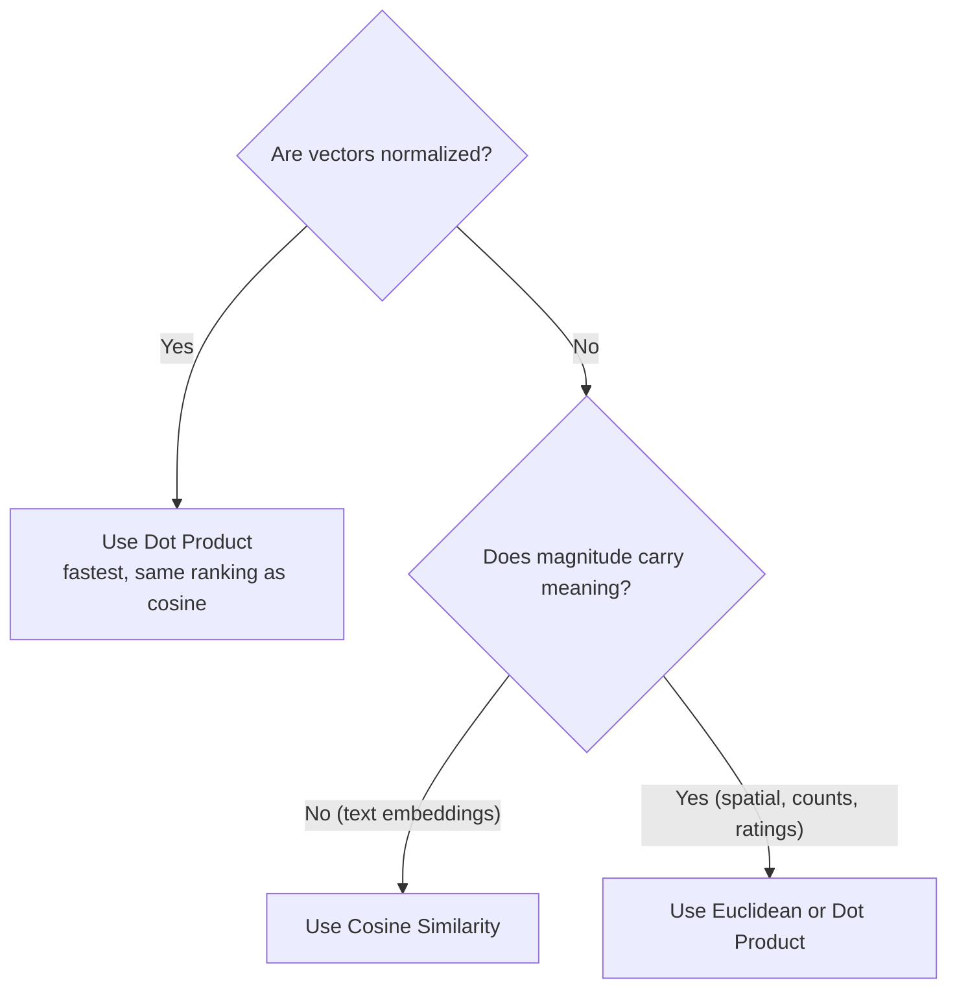

# Vector Similarity Metrics

## Overview

**Similarity metrics** quantify how "close" two vectors (embeddings) are in high-dimensional space. The three most common — **Cosine Similarity**, **Dot Product**, and **Euclidean Distance** — power semantic search, RAG retrieval, recommendation, and clustering. Choosing the wrong one can silently degrade retrieval quality.

> [!INFO]
> **Similarity** vs **Distance**: higher similarity = more alike (cosine, dot product); higher distance = less alike (Euclidean). Vector databases handle the conversion internally, but keep the direction in mind when ranking results.

## The Three Metrics

### Cosine Similarity

$$\text{cosine}(A, B) = \frac{A \cdot B}{\|A\| \, \|B\|}$$

- Measures the **angle** between two vectors — ignores magnitude entirely.
- Range: $[-1, 1]$ — `1` = same direction, `0` = orthogonal (unrelated), `-1` = opposite.
- Intuition: "Do these vectors *point the same way*?" — a long document and a short one about the same topic score high.
- Default choice for **text embeddings**, where direction encodes meaning and length is noise.

### Dot Product (Inner Product)

$$A \cdot B = \sum_{i} A_i B_i$$

- Combines **angle AND magnitude** — larger vectors produce larger scores.
- Range: $(-\infty, \infty)$ — unbounded, scores are not comparable across datasets.
- Intuition: cosine similarity **scaled by both vector lengths**: $A \cdot B = \|A\|\|B\|\cos\theta$.
- Fastest to compute (no square roots, no normalization) — used in attention ([[11.01 Attention Mechanism]]) and recommender systems where magnitude carries signal (e.g., item popularity).

### Euclidean Distance (L2)

$$d(A, B) = \sqrt{\sum_{i} (A_i - B_i)^2}$$

- Measures **straight-line distance** between vector endpoints — sensitive to both angle and magnitude.
- Range: $[0, \infty)$ — `0` = identical vectors; larger = farther apart.
- Intuition: "How far apart do these points *sit* in space?"
- Natural fit for **spatial/dense numeric data** (coordinates, sensor readings, image feature maps) and algorithms like k-means that reason about positions.

## Comparison Table

| | **Cosine Similarity** | **Dot Product** | **Euclidean (L2)** |
|---|---|---|---|
| **Measures** | Angle only | Angle × magnitude | Point-to-point distance |
| **Range** | $[-1, 1]$ | $(-\infty, \infty)$ | $[0, \infty)$ |
| **Higher means** | More similar | More similar | Less similar (it's a distance) |
| **Magnitude-sensitive** | ❌ No | ✅ Yes | ✅ Yes |
| **Compute cost** | Medium (needs norms) | Cheapest | Medium (needs sqrt) |
| **Scores comparable across queries** | ✅ Yes (bounded) | ❌ No (unbounded) | ⚠️ Relative only |
| **Best for** | Text embeddings, docs of varying length | Normalized embeddings, recsys, attention | Spatial data, k-means, un-normalized features |

## How They Relate

> [!TIP]
> **For unit-normalized vectors ($\|A\| = \|B\| = 1$), all three metrics produce the same ranking:**
> - $\text{cosine}(A, B) = A \cdot B$ — identical values
> - $d(A, B)^2 = 2 - 2 (A \cdot B)$ — Euclidean is a monotonic transform of cosine
>
> This is why many embedding providers (e.g., OpenAI) pre-normalize embeddings and recommend dot product: same results as cosine, cheaper to compute.

> [!EXAMPLE]
> $A = (3, 4)$, $B = (6, 8)$ — same direction, different length:
> - **Cosine** = $1.0$ → "identical topic"
> - **Dot product** = $50$ → large, boosted by magnitude
> - **Euclidean** = $5.0$ → "clearly different points"
>
> Whether $A$ and $B$ count as "the same" depends entirely on the metric — this is the whole decision in one example.

## Common Pitfalls

> [!WARNING]
> - **Mismatched metric**: the metric at query time must match what the embedding model was trained/benchmarked with — check the model card. Using L2 on a cosine-trained model degrades recall.
> - **Dot product without normalization**: long documents get inflated scores regardless of relevance ("magnitude bias").
> - **Curse of dimensionality**: in very high dimensions, Euclidean distances between random points concentrate — contrast between near/far neighbors shrinks. Angle-based metrics tend to hold up better.
> - **Cosine on sparse count vectors**: works (classic TF-IDF retrieval), but consider that zero-magnitude vectors make cosine undefined — guard against empty inputs.

## Practical Use Cases

- **RAG / semantic search** → cosine (or dot product on normalized embeddings) — see [[11.12 RAG]]
- **Recommendation systems** → dot product, when magnitude encodes popularity/strength of preference
- **k-means clustering, anomaly detection** → Euclidean, since centroids live in coordinate space
- **Attention scores in Transformers** → scaled dot product ($\frac{QK^T}{\sqrt{d_k}}$)
- **Keyword retrieval (TF-IDF)** → cosine over sparse vectors — see [[23.02 TF-IDF]]

## Related Concepts

- [[23_Database_Retrieval_MOC]] - parent index
- [[23.01 Vector Databases]] - where these metrics are configured per index
- [[11.12 RAG]] - primary use case: semantic retrieval
- [[23.02 TF-IDF]] - cosine over sparse keyword vectors
- [[72.19 Similarity Search]] - ANN algorithms that accelerate these metrics at scale
- [[72.20 Edit Distance]] - contrast: similarity for strings, not vectors
