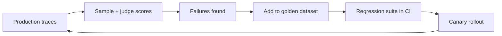

# Online Evaluation & Prompt Regression

## Overview
**Online evaluation** measures LLM quality on live production traffic; **prompt regression testing** catches quality drops *before* shipping a prompt, model, or parameter change. Together they give LLM apps what unit tests + monitoring give normal software. The core problem they solve: prompts are code, but most teams edit them with no test suite — a one-word tweak that fixes one case silently breaks five others.

## Offline vs Online

| | **Offline eval** | **Online eval** |
|---|---|---|
| Data | Curated dataset (golden set) | Live traffic samples |
| When | Pre-deploy, in CI | Continuously, post-deploy |
| Signal | [[11.15 LLM Evaluation Metrics]], [[24.05 LLM-as-Judge]], assertions | Judge scores, user feedback, task completion, retries |
| Catches | Known failure modes | Unknown ones — real inputs are weirder than your dataset |
| Analog | Unit/integration tests | Monitoring + A/B testing |

You need both: offline evals gate changes; online evals tell you the golden set has gone stale.

## Prompt Regression Suite in CI

1. **Golden dataset** — 50–500 real cases mined from production traces ([[24.04 LLM Observability & Tracing]]), especially past failures (each production bug becomes a test case — same discipline as code)
2. **Version prompts like code** — in git, templated, reviewed; never live-edited in a dashboard
3. **On every change** (prompt, model, temperature, RAG config) run the suite:
   - **Assertions** — cheap, deterministic: valid JSON, required fields, length bounds, banned content
   - **Judge scoring** — [[24.05 LLM-as-Judge]] per criterion for the fuzzy qualities
4. **Compare against baseline** — block on regression beyond a threshold, not on absolute score

> [!WARNING] Flakiness is structural
> LLM outputs vary run-to-run even at temperature 0 (provider-side nondeterminism). Score on aggregates over the dataset — "faithfulness ≥ 0.9 across 200 cases" — never on single-example pass/fail, or CI becomes noise.

## Shipping Changes Safely

- **Shadow mode** — run the new prompt/model on real traffic without serving it; compare outputs offline. Zero user risk
- **Canary** — serve to 1–5% of traffic; watch judge scores, feedback, retries, cost before ramping
- **A/B test** — for changes where the metric is behavioral (task completion, deflection rate)
- **Model migrations** — treat a provider model bump exactly like a prompt change: full regression suite + canary; behavior shifts even between "minor" versions

## Feedback Loop

The loop is the point: online eval finds new failures → they become offline test cases → the suite prevents their recurrence.

## Related Concepts
- [[24_Monitoring_MOC]] - parent index
- [[24.04 LLM Observability & Tracing]] - source of eval data and canary signals
- [[24.05 LLM-as-Judge]] - the scoring engine for both modes
- [[11.15 LLM Evaluation Metrics]] - metric definitions per task
- [[11.14 Prompt Engineering]] - what's being version-controlled and tested
- [[22.03 CI-CD for ML]] - the classic-ML counterpart of this pipeline

## References
- Langfuse / Braintrust / promptfoo documentation on eval pipelines
