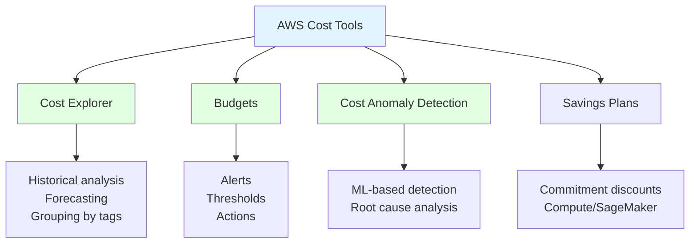
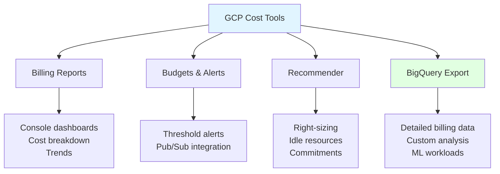
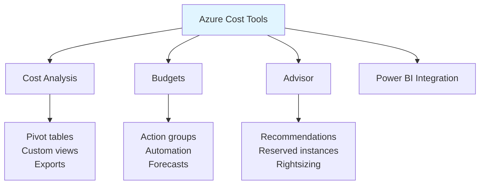
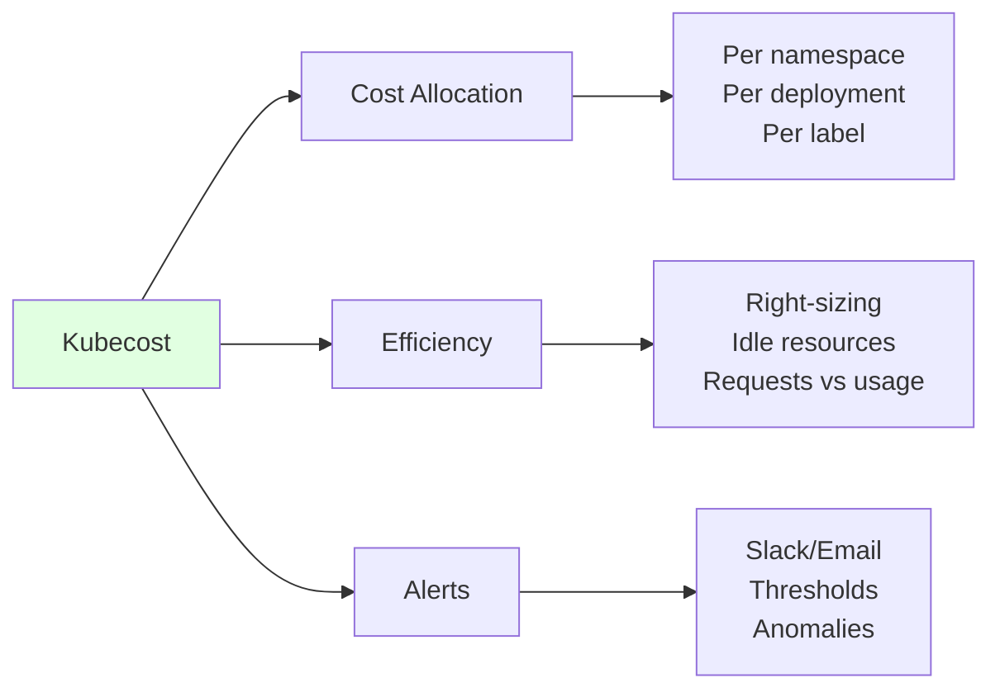
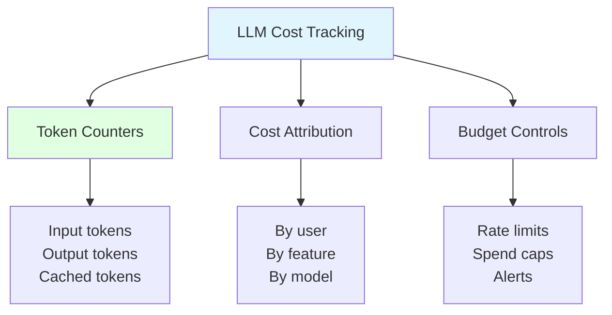
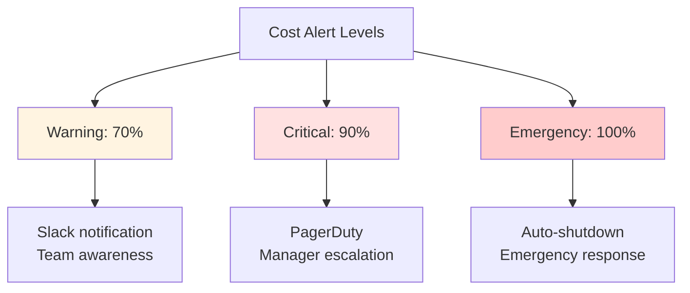
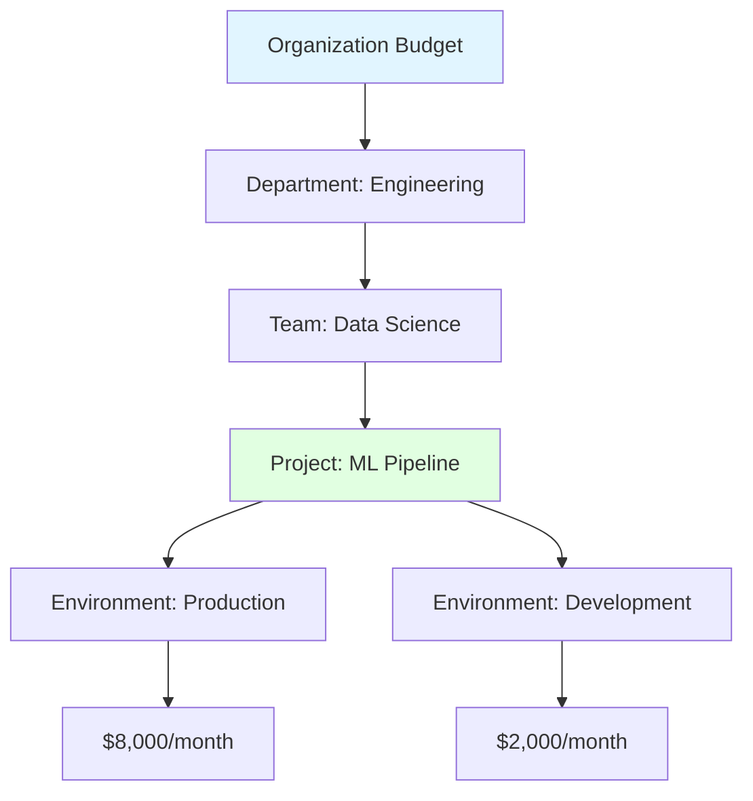

# Cost Monitoring Tools

## Overview
Cost monitoring tools provide visibility into cloud and infrastructure spending, enabling data-driven decisions for optimization. For ML/LLM workloads, monitoring is critical due to high compute costs, variable API usage, and complex multi-service architectures.

## Cloud Provider Tools

### AWS Cost Management



**Cost Explorer:**
```python
import boto3

client = boto3.client('ce')

# Get cost and usage
response = client.get_cost_and_usage(
    TimePeriod={
        'Start': '2026-01-01',
        'End': '2026-01-07'
    },
    Granularity='DAILY',
    Metrics=['UnblendedCost', 'UsageQuantity'],
    GroupBy=[
        {'Type': 'DIMENSION', 'Key': 'SERVICE'},
        {'Type': 'TAG', 'Key': 'Project'}
    ],
    Filter={
        'Dimensions': {
            'Key': 'SERVICE',
            'Values': ['Amazon SageMaker', 'Amazon EC2']
        }
    }
)

for result in response['ResultsByTime']:
    print(f"Date: {result['TimePeriod']['Start']}")
    for group in result['Groups']:
        service = group['Keys'][0]
        cost = group['Metrics']['UnblendedCost']['Amount']
        print(f"  {service}: ${float(cost):.2f}")
```

**Budget Alerts:**
```python
import boto3

budgets = boto3.client('budgets')

# Create monthly budget with alert
budgets.create_budget(
    AccountId='123456789012',
    Budget={
        'BudgetName': 'ML-Infrastructure-Monthly',
        'BudgetLimit': {
            'Amount': '10000',
            'Unit': 'USD'
        },
        'BudgetType': 'COST',
        'TimeUnit': 'MONTHLY',
        'CostFilters': {
            'TagKeyValue': ['user:Project$ml-pipeline']
        }
    },
    NotificationsWithSubscribers=[
        {
            'Notification': {
                'NotificationType': 'ACTUAL',
                'ComparisonOperator': 'GREATER_THAN',
                'Threshold': 80,
                'ThresholdType': 'PERCENTAGE'
            },
            'Subscribers': [
                {'SubscriptionType': 'EMAIL', 'Address': 'team@example.com'},
                {'SubscriptionType': 'SNS', 'Address': 'arn:aws:sns:...'}
            ]
        }
    ]
)
```

### GCP Cost Management



**BigQuery Billing Analysis:**
```sql
-- Daily cost by service and project
SELECT
  DATE(usage_start_time) AS date,
  service.description AS service,
  project.id AS project_id,
  SUM(cost) AS total_cost,
  SUM(usage.amount) AS usage_amount,
  usage.unit AS usage_unit
FROM `project.dataset.gcp_billing_export_v1_*`
WHERE DATE(usage_start_time) >= DATE_SUB(CURRENT_DATE(), INTERVAL 30 DAY)
GROUP BY date, service, project_id, usage_unit
ORDER BY total_cost DESC;

-- GPU usage costs (Vertex AI, Compute Engine)
SELECT
  DATE(usage_start_time) AS date,
  sku.description AS sku,
  SUM(cost) AS gpu_cost
FROM `project.dataset.gcp_billing_export_v1_*`
WHERE sku.description LIKE '%GPU%'
  OR sku.description LIKE '%A100%'
  OR sku.description LIKE '%T4%'
GROUP BY date, sku
ORDER BY date DESC, gpu_cost DESC;
```

### Azure Cost Management



**Azure Cost Query:**
```python
from azure.identity import DefaultAzureCredential
from azure.mgmt.costmanagement import CostManagementClient

credential = DefaultAzureCredential()
client = CostManagementClient(credential)

# Query costs
query = {
    "type": "ActualCost",
    "timeframe": "MonthToDate",
    "dataset": {
        "granularity": "Daily",
        "aggregation": {
            "totalCost": {"name": "Cost", "function": "Sum"}
        },
        "grouping": [
            {"type": "Dimension", "name": "ServiceName"},
            {"type": "Tag", "name": "Environment"}
        ],
        "filter": {
            "dimensions": {
                "name": "ResourceGroup",
                "operator": "In",
                "values": ["ml-production", "ml-staging"]
            }
        }
    }
}

result = client.query.usage(
    scope="/subscriptions/{subscription-id}",
    parameters=query
)
```

## Third-Party Tools

### Kubecost (Kubernetes)



**Kubecost API:**
```python
import requests

KUBECOST_URL = "http://kubecost.internal/model"

# Get allocation by namespace
response = requests.get(
    f"{KUBECOST_URL}/allocation",
    params={
        "window": "7d",
        "aggregate": "namespace",
        "accumulate": "true"
    }
)

allocations = response.json()['data'][0]
for namespace, data in allocations.items():
    cpu_cost = data.get('cpuCost', 0)
    gpu_cost = data.get('gpuCost', 0)
    memory_cost = data.get('ramCost', 0)
    total = cpu_cost + gpu_cost + memory_cost
    print(f"{namespace}: ${total:.2f} (GPU: ${gpu_cost:.2f})")
```

### Infracost (IaC)

**Terraform Cost Estimation:**
```bash
# Install
brew install infracost

# Get API key
infracost auth login

# Estimate costs before apply
infracost breakdown --path .

# Compare costs between branches
infracost diff --path . --compare-to main
```

**CI/CD Integration:**
```yaml
# .github/workflows/infracost.yml
name: Infracost
on: pull_request

jobs:
  infracost:
    runs-on: ubuntu-latest
    steps:
      - uses: actions/checkout@v4

      - name: Setup Infracost
        uses: infracost/actions/setup@v3
        with:
          api-key: ${{ secrets.INFRACOST_API_KEY }}

      - name: Generate cost estimate
        run: |
          infracost breakdown --path . \
            --format json \
            --out-file /tmp/infracost.json

      - name: Post PR comment
        uses: infracost/actions/comment@v3
        with:
          path: /tmp/infracost.json
          behavior: update
```

### OpenCost (Open Source)

```yaml
# Kubernetes deployment
apiVersion: apps/v1
kind: Deployment
metadata:
  name: opencost
spec:
  replicas: 1
  template:
    spec:
      containers:
        - name: opencost
          image: quay.io/kubecost1/opencost
          env:
            - name: PROMETHEUS_SERVER_ENDPOINT
              value: "http://prometheus:9090"
            - name: CLOUD_PROVIDER_API_KEY
              valueFrom:
                secretKeyRef:
                  name: cloud-credentials
                  key: api-key
```

## LLM-Specific Cost Monitoring

### Token Usage Tracking



**Token Cost Calculator:**
```python
from dataclasses import dataclass
from typing import Optional
import tiktoken

@dataclass
class ModelPricing:
    input_cost_per_1k: float
    output_cost_per_1k: float
    cached_input_cost_per_1k: Optional[float] = None

# Pricing as of Jan 2026 (example)
PRICING = {
    "gpt-4o": ModelPricing(0.0025, 0.010, 0.00125),
    "gpt-4o-mini": ModelPricing(0.00015, 0.0006, 0.000075),
    "claude-3-5-sonnet": ModelPricing(0.003, 0.015, 0.0003),
    "claude-3-5-haiku": ModelPricing(0.0008, 0.004, 0.00008),
}

class LLMCostTracker:
    def __init__(self, model: str):
        self.model = model
        self.pricing = PRICING[model]
        self.encoder = tiktoken.encoding_for_model("gpt-4o")
        self.total_input_tokens = 0
        self.total_output_tokens = 0
        self.total_cost = 0.0

    def count_tokens(self, text: str) -> int:
        return len(self.encoder.encode(text))

    def track_request(
        self,
        input_tokens: int,
        output_tokens: int,
        cached_input_tokens: int = 0
    ) -> float:
        """Track a request and return cost."""
        # Calculate costs
        regular_input = input_tokens - cached_input_tokens
        input_cost = (regular_input / 1000) * self.pricing.input_cost_per_1k

        if cached_input_tokens and self.pricing.cached_input_cost_per_1k:
            input_cost += (cached_input_tokens / 1000) * self.pricing.cached_input_cost_per_1k

        output_cost = (output_tokens / 1000) * self.pricing.output_cost_per_1k

        request_cost = input_cost + output_cost

        # Update totals
        self.total_input_tokens += input_tokens
        self.total_output_tokens += output_tokens
        self.total_cost += request_cost

        return request_cost

    def get_summary(self) -> dict:
        return {
            "model": self.model,
            "total_input_tokens": self.total_input_tokens,
            "total_output_tokens": self.total_output_tokens,
            "total_cost": round(self.total_cost, 4)
        }

# Usage
tracker = LLMCostTracker("gpt-4o")

# After each API call
cost = tracker.track_request(
    input_tokens=1500,
    output_tokens=500,
    cached_input_tokens=1000
)
print(f"Request cost: ${cost:.4f}")
print(tracker.get_summary())
```

### Cost Attribution by Feature

```python
from collections import defaultdict
from datetime import datetime
import json

class LLMCostAttributor:
    def __init__(self):
        self.costs_by_feature = defaultdict(float)
        self.costs_by_user = defaultdict(float)
        self.costs_by_model = defaultdict(float)
        self.requests = []

    def log_request(
        self,
        feature: str,
        user_id: str,
        model: str,
        input_tokens: int,
        output_tokens: int,
        cost: float
    ):
        """Log a request with attribution."""
        self.costs_by_feature[feature] += cost
        self.costs_by_user[user_id] += cost
        self.costs_by_model[model] += cost

        self.requests.append({
            "timestamp": datetime.utcnow().isoformat(),
            "feature": feature,
            "user_id": user_id,
            "model": model,
            "input_tokens": input_tokens,
            "output_tokens": output_tokens,
            "cost": cost
        })

    def get_report(self) -> dict:
        return {
            "by_feature": dict(self.costs_by_feature),
            "by_user": dict(self.costs_by_user),
            "by_model": dict(self.costs_by_model),
            "total_cost": sum(self.costs_by_feature.values()),
            "total_requests": len(self.requests)
        }

    def export_to_bigquery(self, table_id: str):
        """Export requests to BigQuery for analysis."""
        from google.cloud import bigquery

        client = bigquery.Client()
        errors = client.insert_rows_json(table_id, self.requests)

        if errors:
            raise Exception(f"BigQuery insert errors: {errors}")

        self.requests.clear()
```

### Prometheus Metrics

```python
from prometheus_client import Counter, Histogram, Gauge

# Define metrics
llm_tokens_total = Counter(
    'llm_tokens_total',
    'Total tokens processed',
    ['model', 'direction', 'feature']
)

llm_cost_total = Counter(
    'llm_cost_dollars_total',
    'Total LLM API cost in dollars',
    ['model', 'feature']
)

llm_request_duration = Histogram(
    'llm_request_duration_seconds',
    'LLM request duration',
    ['model'],
    buckets=[0.5, 1, 2, 5, 10, 30, 60]
)

llm_cost_rate = Gauge(
    'llm_cost_rate_per_hour',
    'Current hourly spend rate',
    ['model']
)

# Track request
def track_llm_metrics(
    model: str,
    feature: str,
    input_tokens: int,
    output_tokens: int,
    cost: float,
    duration: float
):
    llm_tokens_total.labels(
        model=model, direction='input', feature=feature
    ).inc(input_tokens)

    llm_tokens_total.labels(
        model=model, direction='output', feature=feature
    ).inc(output_tokens)

    llm_cost_total.labels(model=model, feature=feature).inc(cost)
    llm_request_duration.labels(model=model).observe(duration)
```

**Grafana Dashboard Query:**
```promql
# Hourly cost by model
sum(rate(llm_cost_dollars_total[1h])) by (model) * 3600

# Token usage by feature
sum(rate(llm_tokens_total[5m])) by (feature)

# Cost anomaly (current vs 7d average)
(
  sum(rate(llm_cost_dollars_total[1h]))
  /
  avg_over_time(sum(rate(llm_cost_dollars_total[1h]))[7d:1h])
) > 1.5
```

## Custom Dashboards

### Streamlit Cost Dashboard

```python
import streamlit as st
import pandas as pd
import plotly.express as px
from datetime import datetime, timedelta

st.set_page_config(page_title="ML Cost Dashboard", layout="wide")

st.title("🎯 ML Infrastructure Cost Dashboard")

# Sidebar filters
st.sidebar.header("Filters")
date_range = st.sidebar.date_input(
    "Date Range",
    value=(datetime.now() - timedelta(days=30), datetime.now())
)
services = st.sidebar.multiselect(
    "Services",
    ["SageMaker", "EC2", "S3", "Lambda", "OpenAI API", "Anthropic API"],
    default=["SageMaker", "OpenAI API"]
)

# Fetch data (example)
@st.cache_data(ttl=3600)
def load_cost_data(start_date, end_date):
    # Replace with actual data fetching
    return pd.DataFrame({
        'date': pd.date_range(start_date, end_date),
        'service': ['SageMaker'] * 30 + ['OpenAI API'] * 30,
        'cost': [100 + i * 5 for i in range(60)],
        'project': ['ml-pipeline'] * 60
    })

df = load_cost_data(date_range[0], date_range[1])

# KPI Cards
col1, col2, col3, col4 = st.columns(4)
with col1:
    st.metric("Total Spend", f"${df['cost'].sum():,.2f}")
with col2:
    st.metric("Daily Average", f"${df['cost'].mean():,.2f}")
with col3:
    st.metric("Projected Monthly", f"${df['cost'].mean() * 30:,.2f}")
with col4:
    change = (df['cost'].iloc[-1] - df['cost'].iloc[-7]) / df['cost'].iloc[-7] * 100
    st.metric("7d Change", f"{change:+.1f}%")

# Charts
st.subheader("Cost Over Time")
fig = px.line(df, x='date', y='cost', color='service')
st.plotly_chart(fig, use_container_width=True)

st.subheader("Cost by Service")
fig2 = px.pie(df.groupby('service')['cost'].sum().reset_index(),
              values='cost', names='service')
st.plotly_chart(fig2, use_container_width=True)
```

## Alerting Strategies

### Multi-Level Alerts



**Alert Configuration:**
```python
from dataclasses import dataclass
from enum import Enum
import httpx

class AlertLevel(Enum):
    INFO = "info"
    WARNING = "warning"
    CRITICAL = "critical"
    EMERGENCY = "emergency"

@dataclass
class CostAlert:
    level: AlertLevel
    threshold_percent: float
    budget: float
    actual: float
    service: str

    @property
    def message(self) -> str:
        percent = (self.actual / self.budget) * 100
        return (
            f"🚨 {self.level.value.upper()} Cost Alert\n"
            f"Service: {self.service}\n"
            f"Budget: ${self.budget:,.2f}\n"
            f"Actual: ${self.actual:,.2f} ({percent:.1f}%)"
        )

class AlertManager:
    def __init__(self, slack_webhook: str, pagerduty_key: str):
        self.slack_webhook = slack_webhook
        self.pagerduty_key = pagerduty_key

    async def send_alert(self, alert: CostAlert):
        if alert.level == AlertLevel.INFO:
            await self._send_slack(alert.message, channel="#costs-info")

        elif alert.level == AlertLevel.WARNING:
            await self._send_slack(alert.message, channel="#costs-alerts")

        elif alert.level == AlertLevel.CRITICAL:
            await self._send_slack(alert.message, channel="#costs-critical")
            await self._send_pagerduty(alert)

        elif alert.level == AlertLevel.EMERGENCY:
            await self._send_slack(alert.message, channel="#incidents")
            await self._send_pagerduty(alert, severity="critical")
            await self._trigger_shutdown(alert.service)

    async def _send_slack(self, message: str, channel: str):
        async with httpx.AsyncClient() as client:
            await client.post(self.slack_webhook, json={
                "channel": channel,
                "text": message
            })

    async def _send_pagerduty(self, alert: CostAlert, severity: str = "warning"):
        async with httpx.AsyncClient() as client:
            await client.post(
                "https://events.pagerduty.com/v2/enqueue",
                json={
                    "routing_key": self.pagerduty_key,
                    "event_action": "trigger",
                    "payload": {
                        "summary": alert.message,
                        "severity": severity,
                        "source": "cost-monitor"
                    }
                }
            )

    async def _trigger_shutdown(self, service: str):
        # Implement emergency shutdown logic
        pass
```

## Best Practices

### 1. Tagging Strategy

```python
# Required tags for all resources
REQUIRED_TAGS = {
    "Project": "ml-pipeline",
    "Environment": "production|staging|development",
    "Team": "data-science",
    "CostCenter": "12345",
    "Owner": "email@example.com"
}

# Terraform example
resource "aws_sagemaker_endpoint" "model" {
  name = "my-model-endpoint"

  tags = {
    Project     = "ml-pipeline"
    Environment = "production"
    Team        = "data-science"
    CostCenter  = "12345"
    Owner       = "ml-team@example.com"
    Model       = "fraud-detection-v2"
  }
}
```

### 2. Budget Hierarchy



### 3. Regular Reviews

| Frequency | Review Focus | Participants |
|-----------|--------------|--------------|
| Daily | Anomaly detection | On-call engineer |
| Weekly | Trend analysis | Team lead |
| Monthly | Budget vs actual | Manager + Finance |
| Quarterly | Architecture optimization | Leadership |

### 4. Automation

```python
# Auto-scaling based on cost
async def cost_aware_autoscaler():
    current_spend = await get_current_daily_spend()
    budget_remaining = DAILY_BUDGET - current_spend

    if budget_remaining < DAILY_BUDGET * 0.1:
        # Scale down to minimum
        await scale_inference_endpoints(replicas=1)
        await disable_non_critical_jobs()
        await send_alert("Approaching daily budget limit")

    elif budget_remaining < DAILY_BUDGET * 0.3:
        # Reduce capacity
        await scale_inference_endpoints(replicas=2)
        await send_alert("Budget utilization at 70%")
```

## Tool Comparison

| Tool | Best For | Pricing | LLM Support |
|------|----------|---------|-------------|
| **AWS Cost Explorer** | AWS-native | Free | Via custom tags |
| **GCP Billing** | GCP-native | Free | Vertex AI breakdown |
| **Kubecost** | Kubernetes | Free/Pro | GPU tracking |
| **Infracost** | IaC estimation | Free/Pro | ❌ |
| **OpenCost** | Open source K8s | Free | GPU metrics |
| **Custom (Prometheus)** | Full control | Free | Full flexibility |

## Related Concepts
- [[32.02 Operational Costs]]
- [[32.03 Initial Setup Costs]]
- [[32.04 Multi-Model Cost Strategy]]
- [[32.05 Training vs Inference Costs]]
- [[32.06 FinOps Practices]]
- [[41.01 Parquet File Format]] (storage cost implications)

## References
- [AWS Cost Management Documentation](https://docs.aws.amazon.com/cost-management/)
- [GCP Cloud Billing](https://cloud.google.com/billing/docs)
- [Azure Cost Management](https://docs.microsoft.com/azure/cost-management/)
- [Kubecost Documentation](https://docs.kubecost.com/)
- [OpenCost Project](https://www.opencost.io/)
- [FinOps Foundation](https://www.finops.org/)
