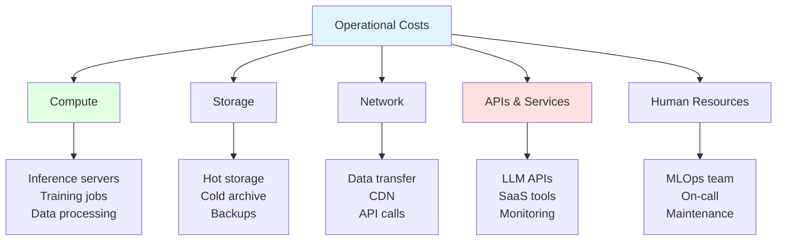
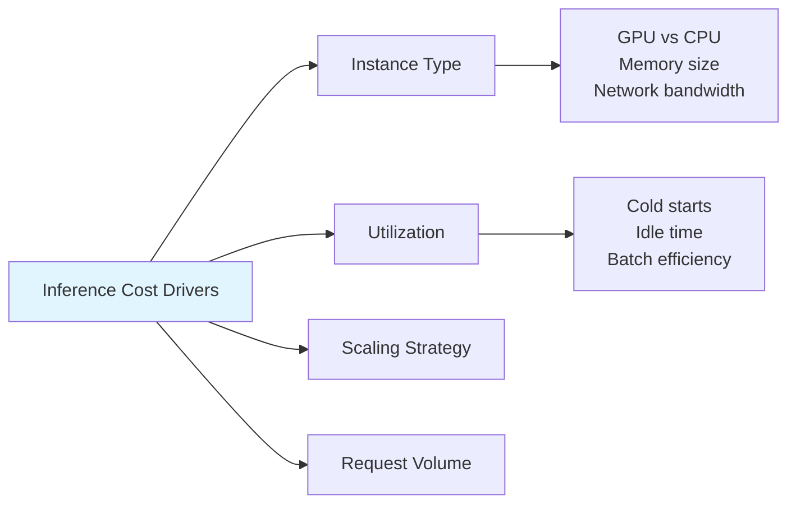
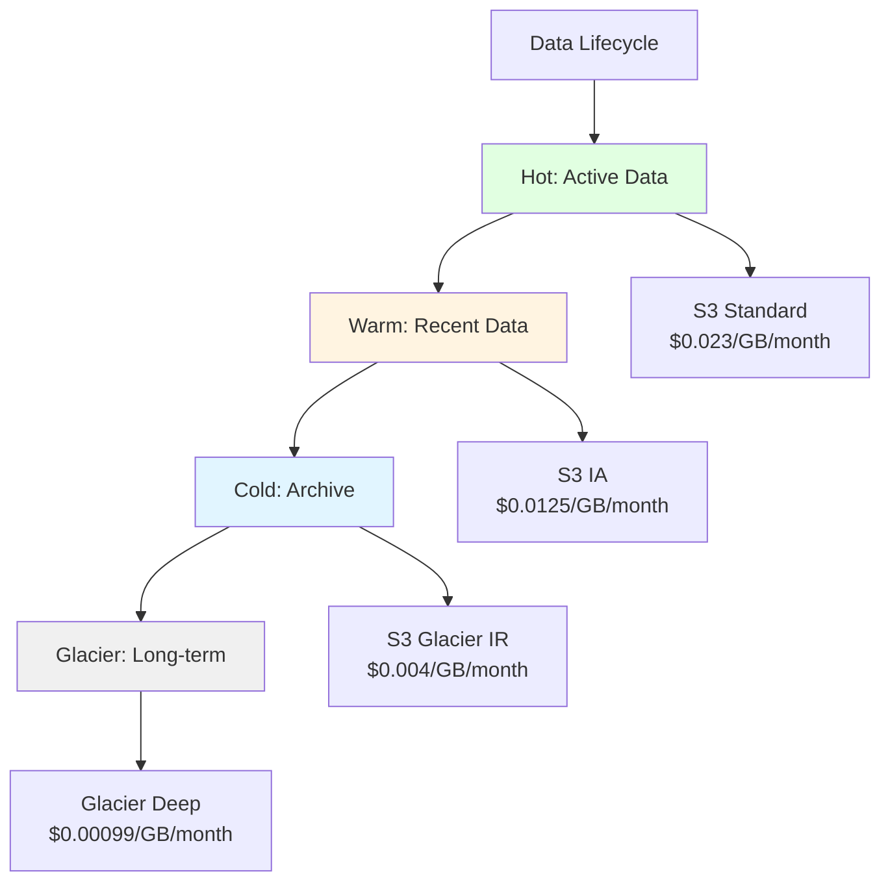
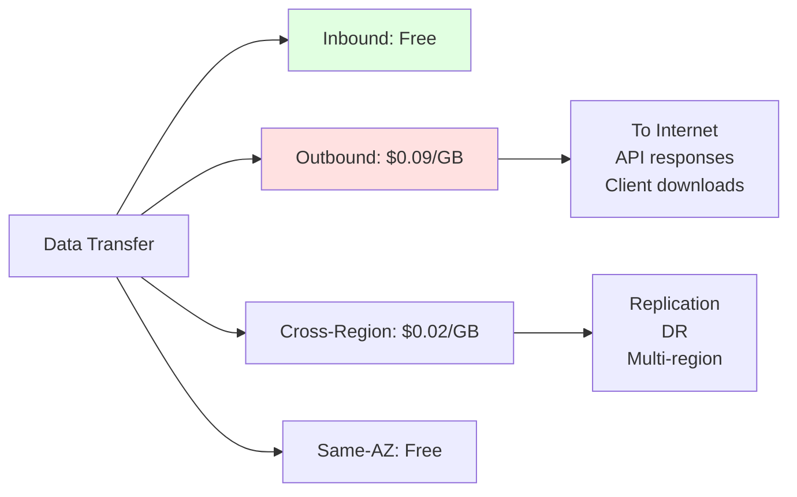
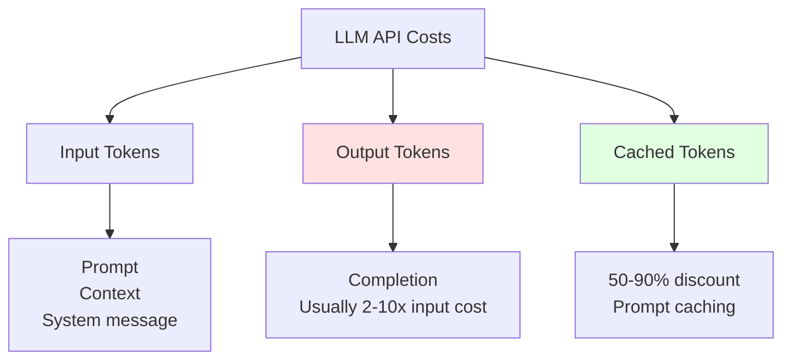
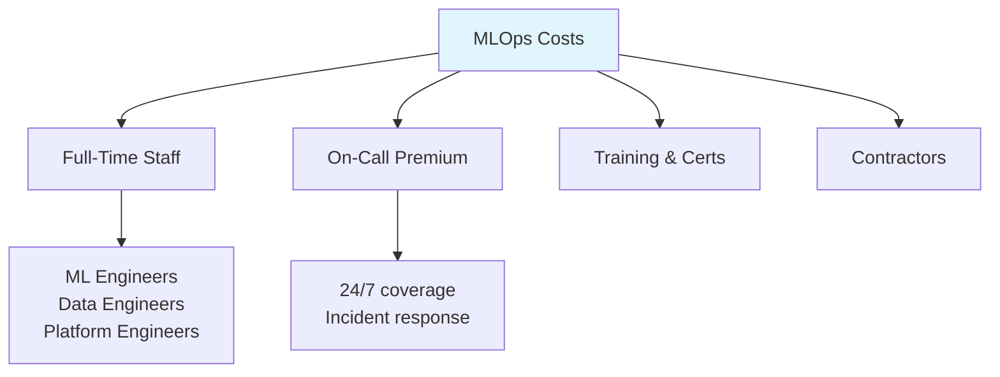
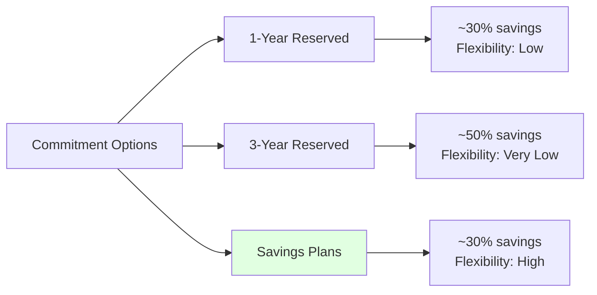

# Operational Costs (OpEx)

## Overview
Operational costs are recurring expenses incurred during the day-to-day running of ML/LLM systems. Unlike initial setup costs, OpEx scales with usage, traffic, and data volume. Understanding and optimizing operational costs is critical for sustainable ML infrastructure.

## Cost Categories



## Compute Costs

### Inference Costs



**Cost Calculation:**
```python
from dataclasses import dataclass
from typing import Optional

@dataclass
class InferenceInstance:
    name: str
    hourly_cost: float
    gpu_memory_gb: float
    max_batch_size: int
    avg_latency_ms: float

# AWS SageMaker pricing examples (Jan 2026)
INSTANCE_PRICING = {
    "ml.g5.xlarge": InferenceInstance("g5.xlarge", 1.408, 24, 32, 50),
    "ml.g5.2xlarge": InferenceInstance("g5.2xlarge", 1.515, 24, 64, 45),
    "ml.p4d.24xlarge": InferenceInstance("p4d.24xlarge", 32.77, 320, 256, 20),
    "ml.inf2.xlarge": InferenceInstance("inf2.xlarge", 0.758, 32, 128, 30),
}

def calculate_inference_cost(
    requests_per_day: int,
    avg_batch_size: int,
    instance_type: str,
    target_utilization: float = 0.7
) -> dict:
    """Calculate daily inference costs."""
    instance = INSTANCE_PRICING[instance_type]

    # Batches needed
    batches_per_day = requests_per_day / avg_batch_size

    # Time per batch (including overhead)
    batch_time_hours = (instance.avg_latency_ms / 1000) / 3600

    # Total compute hours needed
    compute_hours = batches_per_day * batch_time_hours

    # Account for utilization (idle time)
    actual_hours = compute_hours / target_utilization

    # Minimum 1 instance always on
    actual_hours = max(actual_hours, 24)

    daily_cost = actual_hours * instance.hourly_cost
    cost_per_request = daily_cost / requests_per_day

    return {
        "instance": instance_type,
        "daily_cost": round(daily_cost, 2),
        "monthly_cost": round(daily_cost * 30, 2),
        "cost_per_1k_requests": round(cost_per_request * 1000, 4),
        "instance_hours": round(actual_hours, 2)
    }

# Example
result = calculate_inference_cost(
    requests_per_day=100_000,
    avg_batch_size=16,
    instance_type="ml.g5.xlarge"
)
print(result)
# {'instance': 'ml.g5.xlarge', 'daily_cost': 33.79,
#  'monthly_cost': 1013.7, 'cost_per_1k_requests': 0.3379,
#  'instance_hours': 24.0}
```

### Training Costs

```python
@dataclass
class TrainingJob:
    model_name: str
    instance_type: str
    instance_count: int
    training_hours: float
    spot_enabled: bool = False

def calculate_training_cost(job: TrainingJob) -> dict:
    """Calculate training job cost."""
    instance = INSTANCE_PRICING.get(job.instance_type)
    if not instance:
        raise ValueError(f"Unknown instance: {job.instance_type}")

    base_cost = (
        instance.hourly_cost *
        job.instance_count *
        job.training_hours
    )

    # Spot instances ~70% discount
    if job.spot_enabled:
        actual_cost = base_cost * 0.3
        savings = base_cost - actual_cost
    else:
        actual_cost = base_cost
        savings = 0

    return {
        "model": job.model_name,
        "base_cost": round(base_cost, 2),
        "actual_cost": round(actual_cost, 2),
        "spot_savings": round(savings, 2),
        "cost_per_hour": round(actual_cost / job.training_hours, 2)
    }

# Example: Fine-tuning LLM
job = TrainingJob(
    model_name="llama-3-8b-finetuned",
    instance_type="ml.p4d.24xlarge",
    instance_count=4,
    training_hours=8,
    spot_enabled=True
)
print(calculate_training_cost(job))
# {'model': 'llama-3-8b-finetuned', 'base_cost': 1048.64,
#  'actual_cost': 314.59, 'spot_savings': 734.05,
#  'cost_per_hour': 39.32}
```

### Batch Processing Costs

```python
from datetime import datetime, timedelta

def calculate_batch_costs(
    data_size_gb: float,
    processing_rate_gb_per_hour: float,
    instance_hourly_cost: float,
    frequency: str = "daily"
) -> dict:
    """Calculate batch processing costs."""
    hours_per_job = data_size_gb / processing_rate_gb_per_hour
    cost_per_job = hours_per_job * instance_hourly_cost

    frequency_multiplier = {
        "hourly": 24 * 30,
        "daily": 30,
        "weekly": 4,
        "monthly": 1
    }

    jobs_per_month = frequency_multiplier.get(frequency, 30)
    monthly_cost = cost_per_job * jobs_per_month

    return {
        "hours_per_job": round(hours_per_job, 2),
        "cost_per_job": round(cost_per_job, 2),
        "jobs_per_month": jobs_per_month,
        "monthly_cost": round(monthly_cost, 2)
    }
```

## Storage Costs

### Tiered Storage Strategy



**Storage Cost Calculator:**
```python
@dataclass
class StorageTier:
    name: str
    cost_per_gb_month: float
    retrieval_cost_per_gb: float
    min_storage_days: int

STORAGE_TIERS = {
    "s3_standard": StorageTier("S3 Standard", 0.023, 0, 0),
    "s3_ia": StorageTier("S3 Infrequent Access", 0.0125, 0.01, 30),
    "s3_glacier_ir": StorageTier("Glacier Instant", 0.004, 0.03, 90),
    "s3_glacier_da": StorageTier("Glacier Deep Archive", 0.00099, 0.02, 180),
}

def calculate_storage_cost(
    hot_data_gb: float,
    warm_data_gb: float,
    cold_data_gb: float,
    archive_data_gb: float,
    monthly_retrievals_gb: float = 0
) -> dict:
    """Calculate monthly storage costs by tier."""

    costs = {
        "hot": hot_data_gb * STORAGE_TIERS["s3_standard"].cost_per_gb_month,
        "warm": warm_data_gb * STORAGE_TIERS["s3_ia"].cost_per_gb_month,
        "cold": cold_data_gb * STORAGE_TIERS["s3_glacier_ir"].cost_per_gb_month,
        "archive": archive_data_gb * STORAGE_TIERS["s3_glacier_da"].cost_per_gb_month,
    }

    # Add retrieval costs (assume from cold tier)
    retrieval_cost = monthly_retrievals_gb * STORAGE_TIERS["s3_glacier_ir"].retrieval_cost_per_gb

    total = sum(costs.values()) + retrieval_cost

    return {
        "storage_costs": {k: round(v, 2) for k, v in costs.items()},
        "retrieval_cost": round(retrieval_cost, 2),
        "total_monthly": round(total, 2),
        "total_data_tb": round((hot_data_gb + warm_data_gb + cold_data_gb + archive_data_gb) / 1024, 2)
    }

# Example: 10TB ML dataset
result = calculate_storage_cost(
    hot_data_gb=500,      # Active training data
    warm_data_gb=2000,    # Recent experiments
    cold_data_gb=5000,    # Old model artifacts
    archive_data_gb=2500, # Historical data
    monthly_retrievals_gb=100
)
print(result)
# {'storage_costs': {'hot': 11.5, 'warm': 25.0, 'cold': 20.0, 'archive': 2.48},
#  'retrieval_cost': 3.0, 'total_monthly': 61.98, 'total_data_tb': 9.77}
```

## Network Costs

### Data Transfer Pricing



**Network Cost Estimation:**
```python
def calculate_network_costs(
    api_response_size_kb: float,
    requests_per_month: int,
    cross_region_sync_gb: float = 0,
    cdn_enabled: bool = False
) -> dict:
    """Calculate monthly network transfer costs."""

    # Outbound to internet
    outbound_gb = (api_response_size_kb * requests_per_month) / (1024 * 1024)

    # AWS pricing tiers
    if outbound_gb <= 10 * 1024:  # First 10TB
        outbound_cost = outbound_gb * 0.09
    elif outbound_gb <= 50 * 1024:  # Next 40TB
        outbound_cost = 10 * 1024 * 0.09 + (outbound_gb - 10 * 1024) * 0.085
    else:
        outbound_cost = (10 * 1024 * 0.09 + 40 * 1024 * 0.085 +
                        (outbound_gb - 50 * 1024) * 0.07)

    # CDN reduces origin fetches by ~80%
    if cdn_enabled:
        outbound_cost *= 0.2
        cdn_cost = outbound_gb * 0.085  # CloudFront pricing
    else:
        cdn_cost = 0

    # Cross-region transfer
    cross_region_cost = cross_region_sync_gb * 0.02

    return {
        "outbound_gb": round(outbound_gb, 2),
        "outbound_cost": round(outbound_cost, 2),
        "cdn_cost": round(cdn_cost, 2),
        "cross_region_cost": round(cross_region_cost, 2),
        "total_monthly": round(outbound_cost + cdn_cost + cross_region_cost, 2)
    }
```

## LLM API Costs

### Token-Based Pricing



**LLM Cost Tracker:**
```python
from dataclasses import dataclass, field
from typing import Dict, List
from datetime import datetime

@dataclass
class LLMPricing:
    model: str
    input_per_1m: float
    output_per_1m: float
    cached_per_1m: float = 0

# Current pricing (Jan 2026)
LLM_PRICING = {
    # OpenAI
    "gpt-4o": LLMPricing("gpt-4o", 2.50, 10.00, 1.25),
    "gpt-4o-mini": LLMPricing("gpt-4o-mini", 0.15, 0.60, 0.075),
    "o1": LLMPricing("o1", 15.00, 60.00, 7.50),
    "o1-mini": LLMPricing("o1-mini", 3.00, 12.00, 1.50),

    # Anthropic
    "claude-3-5-sonnet": LLMPricing("claude-3.5-sonnet", 3.00, 15.00, 0.30),
    "claude-3-5-haiku": LLMPricing("claude-3.5-haiku", 0.80, 4.00, 0.08),

    # Google
    "gemini-2-flash": LLMPricing("gemini-2-flash", 0.10, 0.40, 0.025),
    "gemini-2-pro": LLMPricing("gemini-2-pro", 1.25, 5.00, 0.315),
}

@dataclass
class UsageRecord:
    timestamp: datetime
    model: str
    input_tokens: int
    output_tokens: int
    cached_tokens: int = 0
    feature: str = "default"
    user_id: str = "system"
    cost: float = field(init=False)

    def __post_init__(self):
        pricing = LLM_PRICING[self.model]
        regular_input = self.input_tokens - self.cached_tokens

        self.cost = (
            (regular_input / 1_000_000) * pricing.input_per_1m +
            (self.cached_tokens / 1_000_000) * pricing.cached_per_1m +
            (self.output_tokens / 1_000_000) * pricing.output_per_1m
        )

class LLMCostTracker:
    def __init__(self):
        self.records: List[UsageRecord] = []

    def track(
        self,
        model: str,
        input_tokens: int,
        output_tokens: int,
        cached_tokens: int = 0,
        feature: str = "default",
        user_id: str = "system"
    ) -> float:
        record = UsageRecord(
            timestamp=datetime.utcnow(),
            model=model,
            input_tokens=input_tokens,
            output_tokens=output_tokens,
            cached_tokens=cached_tokens,
            feature=feature,
            user_id=user_id
        )
        self.records.append(record)
        return record.cost

    def get_summary(self, days: int = 30) -> dict:
        cutoff = datetime.utcnow() - timedelta(days=days)
        recent = [r for r in self.records if r.timestamp >= cutoff]

        by_model: Dict[str, float] = {}
        by_feature: Dict[str, float] = {}

        for r in recent:
            by_model[r.model] = by_model.get(r.model, 0) + r.cost
            by_feature[r.feature] = by_feature.get(r.feature, 0) + r.cost

        total = sum(r.cost for r in recent)

        return {
            "total_cost": round(total, 2),
            "total_requests": len(recent),
            "avg_cost_per_request": round(total / len(recent), 4) if recent else 0,
            "by_model": {k: round(v, 2) for k, v in sorted(by_model.items(), key=lambda x: -x[1])},
            "by_feature": {k: round(v, 2) for k, v in sorted(by_feature.items(), key=lambda x: -x[1])}
        }

# Usage
tracker = LLMCostTracker()

# Track API calls
tracker.track("gpt-4o", input_tokens=2000, output_tokens=500, feature="chat")
tracker.track("claude-3-5-sonnet", input_tokens=5000, output_tokens=1000,
              cached_tokens=3000, feature="rag")

print(tracker.get_summary())
```

## Monitoring & Observability Costs

### SaaS Tool Costs

| Tool | Pricing Model | Typical Monthly Cost |
|------|---------------|---------------------|
| **Datadog** | Per host + ingestion | $15-50/host + $0.10/GB logs |
| **New Relic** | Per user + data | $99/user + $0.30/GB |
| **Grafana Cloud** | Active series + logs | $8/1k series + $0.50/GB |
| **Prometheus** | Self-hosted | Compute + storage only |
| **OpenTelemetry** | Self-hosted | Compute + storage only |

```python
def calculate_observability_cost(
    hosts: int,
    log_gb_per_day: float,
    metrics_series: int,
    apm_hosts: int = 0
) -> dict:
    """Estimate monthly observability costs."""

    # Datadog pricing
    datadog = {
        "infrastructure": hosts * 15,  # $15/host
        "logs": log_gb_per_day * 30 * 0.10,  # $0.10/GB ingested
        "apm": apm_hosts * 31,  # $31/host
        "metrics": max(0, (metrics_series - 100) / 100) * 5  # Custom metrics
    }
    datadog["total"] = sum(datadog.values())

    # Grafana Cloud
    grafana = {
        "metrics": (metrics_series / 1000) * 8,
        "logs": log_gb_per_day * 30 * 0.50,
        "traces": apm_hosts * 10
    }
    grafana["total"] = sum(grafana.values())

    # Self-hosted (compute only)
    self_hosted = {
        "prometheus_instance": 100,  # m5.large equivalent
        "grafana_instance": 50,
        "storage": log_gb_per_day * 30 * 0.023  # S3
    }
    self_hosted["total"] = sum(self_hosted.values())

    return {
        "datadog": {k: round(v, 2) for k, v in datadog.items()},
        "grafana_cloud": {k: round(v, 2) for k, v in grafana.items()},
        "self_hosted": {k: round(v, 2) for k, v in self_hosted.items()}
    }
```

## Human Resource Costs

### MLOps Team Costs



| Role | Typical Salary Range | Fully Loaded Cost* |
|------|---------------------|-------------------|
| Junior ML Engineer | $100-130k | $130-170k |
| Senior ML Engineer | $150-200k | $195-260k |
| Staff ML Engineer | $200-280k | $260-365k |
| MLOps Engineer | $140-180k | $180-235k |
| Data Engineer | $130-170k | $170-220k |

*Fully loaded = Salary × 1.3 (benefits, taxes, equipment)

## Cost Optimization Strategies

### 1. Right-Sizing

```python
def analyze_rightsizing(
    current_instance: str,
    avg_cpu_percent: float,
    avg_memory_percent: float,
    avg_gpu_percent: float = 0
) -> dict:
    """Recommend instance right-sizing."""

    recommendations = []

    if avg_cpu_percent < 30 and avg_memory_percent < 30:
        recommendations.append({
            "action": "downsize",
            "reason": f"CPU {avg_cpu_percent}%, Memory {avg_memory_percent}%",
            "potential_savings": "40-60%"
        })

    if avg_gpu_percent < 20 and avg_gpu_percent > 0:
        recommendations.append({
            "action": "switch_to_cpu_or_smaller_gpu",
            "reason": f"GPU utilization only {avg_gpu_percent}%",
            "potential_savings": "50-80%"
        })

    if avg_cpu_percent > 80 or avg_memory_percent > 80:
        recommendations.append({
            "action": "upsize_or_scale_out",
            "reason": "High utilization may cause performance issues",
            "potential_savings": "N/A (reliability improvement)"
        })

    return {
        "current_instance": current_instance,
        "utilization": {
            "cpu": avg_cpu_percent,
            "memory": avg_memory_percent,
            "gpu": avg_gpu_percent
        },
        "recommendations": recommendations
    }
```

### 2. Spot/Preemptible Instances

```python
SPOT_SAVINGS = {
    "ml.g5.xlarge": 0.65,      # 65% savings
    "ml.g5.2xlarge": 0.70,
    "ml.p4d.24xlarge": 0.75,
    "ml.c5.4xlarge": 0.60,
}

def calculate_spot_savings(
    instance_type: str,
    hours_per_month: float,
    on_demand_hourly: float
) -> dict:
    """Calculate potential spot instance savings."""
    on_demand_cost = hours_per_month * on_demand_hourly

    savings_percent = SPOT_SAVINGS.get(instance_type, 0.60)
    spot_cost = on_demand_cost * (1 - savings_percent)

    return {
        "on_demand_cost": round(on_demand_cost, 2),
        "spot_cost": round(spot_cost, 2),
        "monthly_savings": round(on_demand_cost - spot_cost, 2),
        "savings_percent": f"{savings_percent * 100:.0f}%"
    }
```

### 3. Reserved Capacity



## Monthly Cost Summary Template

```python
@dataclass
class MonthlyCostReport:
    period: str

    # Compute
    inference_cost: float
    training_cost: float
    batch_processing_cost: float

    # Storage
    storage_cost: float

    # Network
    network_cost: float

    # APIs
    llm_api_cost: float
    other_api_cost: float

    # Observability
    monitoring_cost: float

    @property
    def total(self) -> float:
        return (
            self.inference_cost +
            self.training_cost +
            self.batch_processing_cost +
            self.storage_cost +
            self.network_cost +
            self.llm_api_cost +
            self.other_api_cost +
            self.monitoring_cost
        )

    def breakdown(self) -> dict:
        total = self.total
        return {
            "period": self.period,
            "total": round(total, 2),
            "breakdown": {
                "compute": {
                    "inference": round(self.inference_cost, 2),
                    "training": round(self.training_cost, 2),
                    "batch": round(self.batch_processing_cost, 2),
                    "subtotal": round(self.inference_cost + self.training_cost + self.batch_processing_cost, 2)
                },
                "storage": round(self.storage_cost, 2),
                "network": round(self.network_cost, 2),
                "apis": {
                    "llm": round(self.llm_api_cost, 2),
                    "other": round(self.other_api_cost, 2),
                    "subtotal": round(self.llm_api_cost + self.other_api_cost, 2)
                },
                "monitoring": round(self.monitoring_cost, 2)
            }
        }

# Example report
report = MonthlyCostReport(
    period="2026-01",
    inference_cost=3500,
    training_cost=1200,
    batch_processing_cost=800,
    storage_cost=450,
    network_cost=320,
    llm_api_cost=2100,
    other_api_cost=150,
    monitoring_cost=280
)

print(report.breakdown())
```

## Related Concepts
- [[32.01 Cost Monitoring Tools]]
- [[32.03 Initial Setup Costs]]
- Cloud Cost Optimization (to be added)
- LLM API Cost Optimization (to be added)

## References
- [AWS Pricing Calculator](https://calculator.aws/)
- [GCP Pricing Calculator](https://cloud.google.com/products/calculator)
- [Azure Pricing Calculator](https://azure.microsoft.com/pricing/calculator/)
- [OpenAI Pricing](https://openai.com/pricing)
- [Anthropic Pricing](https://www.anthropic.com/pricing)
