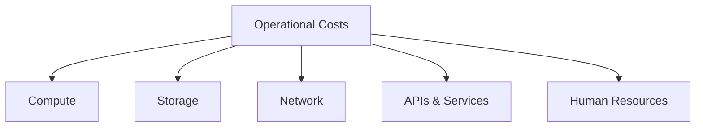

# Operational Costs (OpEx)

## Overview
Recurring expenses for day-to-day ML/LLM systems. Unlike CapEx, OpEx scales with usage, traffic, and data volume. Critical to optimize for sustainable infrastructure.

## Cost Categories



## Compute Costs

### Inference Costs

| Factor | Impact |
|--------|--------|
| Instance type | GPU vs CPU, memory size |
| Utilization | Cold starts, idle time |
| Scaling strategy | On-demand vs reserved |
| Request volume | Linear scaling |

**Cost Formula**:
```
Daily Cost = (Requests/Day × Latency/Request) / Utilization × Hourly Rate
```

### Training Costs

| Factor | Impact |
|--------|--------|
| GPU hours | Major cost driver |
| Instance count | Multi-GPU scaling |
| Spot usage | 60-70% savings |
| Checkpointing | Recovery from interruptions |

### Batch Processing

| Frequency | Monthly Jobs | Cost Pattern |
|-----------|--------------|--------------|
| Hourly | 720 | High |
| Daily | 30 | Medium |
| Weekly | 4 | Low |

## Storage Costs

### Tiered Storage (AWS S3)

| Tier | Use Case | Cost/GB/Month |
|------|----------|---------------|
| **Standard** | Active data | $0.023 |
| **Infrequent Access** | Recent experiments | $0.0125 |
| **Glacier Instant** | Old artifacts | $0.004 |
| **Glacier Deep** | Long-term archive | $0.00099 |

**Lifecycle Strategy**: Auto-transition based on access patterns.

## Network Costs

| Transfer Type | Cost |
|---------------|------|
| Inbound | Free |
| Outbound to Internet | $0.09/GB |
| Cross-Region | $0.02/GB |
| Same-AZ | Free |

**Optimization**: Use CDN, compress responses, minimize cross-region.

## LLM API Costs

### Current Pricing (Jan 2026)

| Model | Input/1M | Output/1M | Notes |
|-------|----------|-----------|-------|
| o1 | $15.00 | $60.00 | Complex reasoning |
| GPT-4o | $2.50 | $10.00 | General use |
| GPT-4o-mini | $0.15 | $0.60 | Cost-effective |
| Claude 3.5 Sonnet | $3.00 | $15.00 | Long context |
| Claude 3.5 Haiku | $0.80 | $4.00 | Fast, cheap |
| Gemini 2 Flash | $0.10 | $0.40 | Ultra-cheap |

### Cost Tracking Dimensions

| Dimension | Purpose |
|-----------|---------|
| By model | Compare efficiency |
| By feature | Identify expensive features |
| By user | Track heavy users |
| By time | Trend analysis |

## Monitoring Costs

### SaaS Tools

| Tool | Pricing Model | Typical Monthly |
|------|---------------|-----------------|
| Datadog | Per host + logs | $15/host + $0.10/GB |
| New Relic | Per user + data | $99/user + $0.30/GB |
| Grafana Cloud | Active series | $8/1k series + $0.50/GB |
| Self-hosted | Compute only | EC2 + storage |

## Human Resource Costs

| Role | Salary Range | Fully Loaded* |
|------|--------------|---------------|
| Junior ML Engineer | $100-130k | $130-170k |
| Senior ML Engineer | $150-200k | $195-260k |
| Staff ML Engineer | $200-280k | $260-365k |
| MLOps Engineer | $140-180k | $180-235k |

*Fully loaded = Salary × 1.3 (benefits, taxes, equipment)

## Optimization Strategies

### Right-Sizing

| Utilization | Action |
|-------------|--------|
| CPU/Memory <30% | Downsize instance |
| GPU <20% | Switch to CPU or smaller GPU |
| >80% | Upsize or scale out |

### Cost Reduction Tactics

| Strategy | Savings | Implementation |
|----------|---------|----------------|
| Spot instances | 60-75% | Checkpointing, fault tolerance |
| Reserved capacity | 30-50% | Committed use discounts |
| Right-sizing | 20-40% | Match instance to workload |
| Auto-scaling | 20-30% | Scale to zero when idle |
| Prompt caching | 50-90% | Cache repeated prompts |
| Response caching | 70-90% | Cache identical requests |

### Monthly Review Checklist

- [ ] Analyze top 5 cost drivers
- [ ] Review unused/idle resources
- [ ] Check spot vs on-demand ratio
- [ ] Validate storage tier assignments
- [ ] Compare LLM costs vs budget
- [ ] Review rightsizing recommendations

## Related Concepts
- [[32_Cost_Management_MOC]] - Parent category
- [[32.03 Initial Setup Costs]] - Contrast: one-time vs recurring costs
- [[32.01 Cost Monitoring Tools]] - How to track operational spend
- [[32.06 FinOps Practices]] - Organizational framework for optimization

## References
- AWS, GCP, Azure Pricing Pages
- OpenAI, Anthropic, Google Pricing
