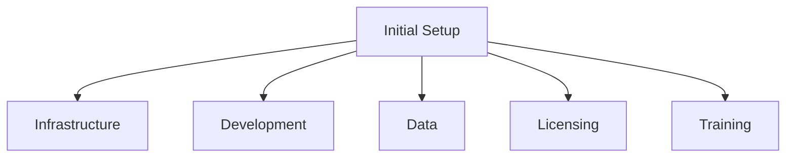

# Initial Setup Costs (CapEx)

## Overview
One-time or upfront expenditures to establish ML/LLM infrastructure. Understanding CapEx helps with budgeting, ROI calculations, and build-vs-buy decisions.

## Cost Categories



## Infrastructure Setup

### Cloud Infrastructure

| Component | Effort (hours) | Monthly Baseline |
|-----------|----------------|------------------|
| VPC & Networking | 16 | $50 |
| Kubernetes (EKS/GKE) | 40 | $200 |
| ML Platform (SageMaker/Vertex) | 24 | $100 |
| Data Lake | 32 | $150 |
| Secrets & KMS | 8 | $20 |
| Monitoring & Logging | 24 | $100 |
| CI/CD for ML | 40 | $50 |
| Feature Store | 60 | $200 |
| Model Registry | 16 | $30 |
| Vector Database | 24 | $150 |

**Estimation Formula**:
```
Total Setup = (Engineering Hours × Hourly Rate) × 1.2 contingency
```

### On-Premises Hardware

| Component | Unit Cost | Annual Maintenance |
|-----------|-----------|-------------------|
| NVIDIA H100 Server | $300,000 | $30,000 |
| Storage Array (100TB) | $80,000 | $8,000 |
| Network Switch (100GbE) | $25,000 | $2,500 |
| UPS System | $15,000 | $1,500 |

**5-Year TCO** = CapEx + (Annual Maintenance × 5) + DC prep (10%) + Networking (5%)

## Development Costs

### Model Development Phases

| Phase | Weeks | Team Size | Compute/Week |
|-------|-------|-----------|--------------|
| Research & Prototyping | 4 | 2 | $500 |
| Core Development | 6 | 3 | $2,000 |
| Training & Tuning | 4 | 2 | $5,000 |
| Evaluation & Testing | 2 | 2 | $500 |
| Productionization | 4 | 2 | $1,000 |

**Complexity Multiplier**: 1.5× for LLMs, 2× for frontier models

### Pipeline Development

| Component | Dev Days | Integration | Testing |
|-----------|----------|-------------|---------|
| Data Ingestion | 5 | 3 | 2 |
| Data Validation | 3 | 2 | 2 |
| Feature Engineering | 8 | 4 | 3 |
| Training Pipeline | 10 | 5 | 4 |
| Model Validation | 5 | 3 | 3 |
| Serving Pipeline | 8 | 4 | 4 |
| Monitoring | 5 | 3 | 2 |

## Data Costs

### Data Labeling

| Task Type | Cost/Item | Items/Hour |
|-----------|-----------|------------|
| Text Classification | $0.05 | 120 |
| NER Tagging | $0.15 | 40 |
| Object Detection | $0.30 | 20 |
| Image Segmentation | $0.80 | 8 |
| LLM Preference/RLHF | $0.50 | 15 |
| Q&A Pair Generation | $0.25 | 30 |

**Total Cost** = Items × Cost/Item × Quality Passes + Expert Review (10% × 3× rate) + Overhead (15%)

### Data Migration

- Transfer costs: $0.05-0.12/GB depending on source/destination
- Engineering time for ETL development
- Validation/QA: 20% of engineering cost

## Licensing Costs

| Category | Examples | Setup Fee | Annual |
|----------|----------|-----------|--------|
| ML Platforms | Databricks, DataRobot | $0-10K | $40-100K |
| Model APIs | OpenAI Enterprise | $0 | $60K+ |
| Dev Tools | GitHub Enterprise | $0 | $21/user/month |
| Experiment Tracking | W&B | $0 | $50/user/month |

### Model License Types

| Model | Commercial | License | Cost |
|-------|------------|---------|------|
| Llama 3 | ✅ | Meta License | Free |
| Mistral | ✅ | Apache 2.0 | Free |
| GPT-4 | ✅ | API Only | Per-token |
| Claude | ✅ | API Only | Per-token |

## Team Training

| Program | Days | Cost/Person |
|---------|------|-------------|
| MLOps Bootcamp | 5 | $2,500 |
| Kubernetes for ML | 3 | $1,500 |
| LLM Engineering | 4 | $3,000 |
| Cloud Certification | 2 | $500 |

Include opportunity cost: Days × Daily Rate

## Total Cost of Ownership

### TCO Components

**Initial Investment**:
- Infrastructure setup
- Development
- Data costs
- Year 1 licensing
- Team training

**Annual Operating**:
- Compute
- Storage
- API costs
- Licensing
- Maintenance

### Build vs Buy

| Factor | Build | Buy/SaaS |
|--------|-------|----------|
| Time to market | Slow | Fast |
| Upfront cost | High | Low |
| Control | Full | Limited |
| Customization | Unlimited | Constrained |
| Maintenance | Your burden | Managed |
| Lock-in | None | Vendor |

**Decision**: Build if >3 year horizon, unique requirements, large scale. Buy if speed critical, standard use case, uncertain scale.

## Related Concepts
- [[32.02 Operational Costs]]
- [[32.05 Training vs Inference Costs]]
- [[32.06 FinOps Practices]]

## References
- AWS, GCP, Azure Pricing Calculators
- MLOps Community Cost Benchmarks
