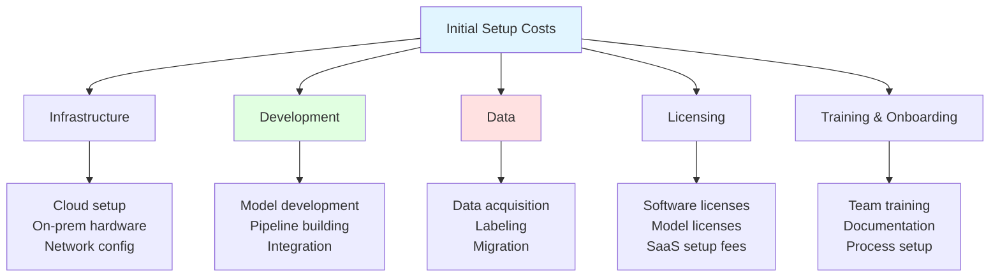
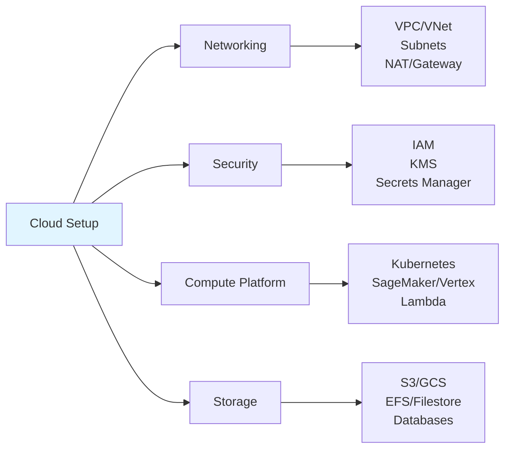
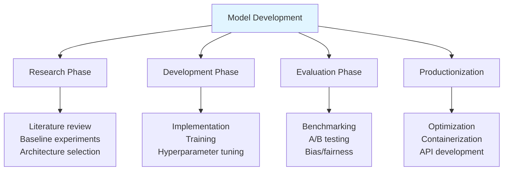
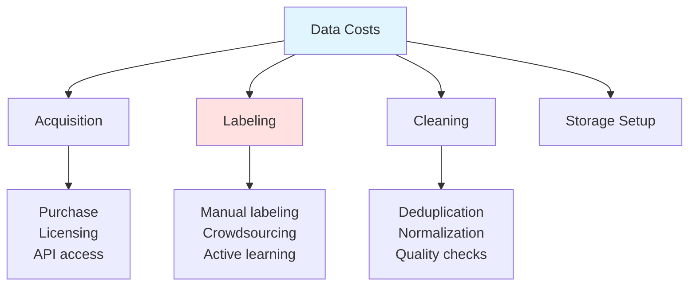
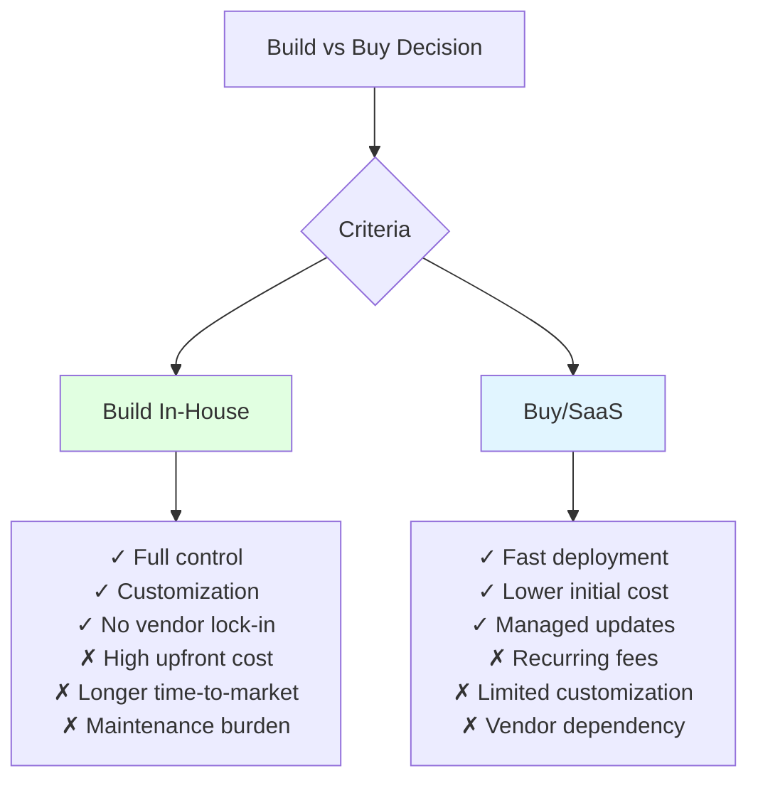

# Initial Setup Costs (CapEx)

## Overview
Initial setup costs are one-time or upfront expenditures required to establish ML/LLM infrastructure. Unlike operational costs, these are capital expenditures that create long-term value. Understanding CapEx helps with budgeting, ROI calculations, and build-vs-buy decisions.

## Cost Categories



## Infrastructure Setup

### Cloud Infrastructure



**Infrastructure Cost Estimation:**
```python
from dataclasses import dataclass
from typing import List, Optional
from enum import Enum

class CloudProvider(Enum):
    AWS = "aws"
    GCP = "gcp"
    AZURE = "azure"

@dataclass
class InfraComponent:
    name: str
    setup_hours: float  # Engineering hours
    one_time_cost: float  # Direct costs
    monthly_baseline: float  # Minimum monthly after setup

# Typical ML infrastructure components
INFRA_COMPONENTS = {
    "vpc_networking": InfraComponent("VPC & Networking", 16, 0, 50),
    "kubernetes_cluster": InfraComponent("Kubernetes (EKS/GKE)", 40, 0, 200),
    "ml_platform": InfraComponent("ML Platform (SageMaker/Vertex)", 24, 0, 100),
    "data_lake": InfraComponent("Data Lake Setup", 32, 0, 150),
    "secrets_management": InfraComponent("Secrets & KMS", 8, 0, 20),
    "monitoring_stack": InfraComponent("Monitoring & Logging", 24, 0, 100),
    "ci_cd_pipeline": InfraComponent("CI/CD for ML", 40, 0, 50),
    "feature_store": InfraComponent("Feature Store", 60, 0, 200),
    "model_registry": InfraComponent("Model Registry", 16, 0, 30),
    "vector_database": InfraComponent("Vector Database", 24, 0, 150),
}

def calculate_infrastructure_setup(
    components: List[str],
    hourly_rate: float = 150,  # Engineering cost per hour
    contingency: float = 0.2   # 20% buffer
) -> dict:
    """Calculate infrastructure setup costs."""

    selected = [INFRA_COMPONENTS[c] for c in components if c in INFRA_COMPONENTS]

    total_hours = sum(c.setup_hours for c in selected)
    engineering_cost = total_hours * hourly_rate
    direct_costs = sum(c.one_time_cost for c in selected)

    subtotal = engineering_cost + direct_costs
    contingency_amount = subtotal * contingency

    monthly_baseline = sum(c.monthly_baseline for c in selected)

    return {
        "components": [c.name for c in selected],
        "engineering_hours": total_hours,
        "engineering_cost": round(engineering_cost, 2),
        "direct_costs": round(direct_costs, 2),
        "contingency": round(contingency_amount, 2),
        "total_setup_cost": round(subtotal + contingency_amount, 2),
        "monthly_baseline": round(monthly_baseline, 2)
    }

# Example: Full ML platform setup
result = calculate_infrastructure_setup([
    "vpc_networking",
    "kubernetes_cluster",
    "ml_platform",
    "data_lake",
    "monitoring_stack",
    "ci_cd_pipeline",
    "feature_store",
    "model_registry"
])
print(result)
# {'components': [...], 'engineering_hours': 260,
#  'engineering_cost': 39000.0, 'direct_costs': 0.0,
#  'contingency': 7800.0, 'total_setup_cost': 46800.0,
#  'monthly_baseline': 880.0}
```

### On-Premises Hardware

```python
@dataclass
class HardwareSpec:
    name: str
    unit_cost: float
    quantity: int
    installation_cost: float
    annual_maintenance: float

def calculate_onprem_costs(specs: List[HardwareSpec]) -> dict:
    """Calculate on-premises hardware costs."""

    hardware_cost = sum(s.unit_cost * s.quantity for s in specs)
    installation = sum(s.installation_cost for s in specs)
    annual_maintenance = sum(s.annual_maintenance for s in specs)

    # Additional costs
    datacenter_prep = hardware_cost * 0.1  # 10% for DC prep
    networking = hardware_cost * 0.05       # 5% for network gear

    total_capex = hardware_cost + installation + datacenter_prep + networking

    return {
        "hardware_cost": round(hardware_cost, 2),
        "installation": round(installation, 2),
        "datacenter_prep": round(datacenter_prep, 2),
        "networking": round(networking, 2),
        "total_capex": round(total_capex, 2),
        "annual_maintenance": round(annual_maintenance, 2),
        "5_year_tco": round(total_capex + annual_maintenance * 5, 2)
    }

# Example: GPU cluster for training
gpu_cluster = [
    HardwareSpec("NVIDIA H100 Server", 300000, 4, 5000, 30000),
    HardwareSpec("Storage Array (100TB)", 80000, 1, 2000, 8000),
    HardwareSpec("Network Switch (100GbE)", 25000, 2, 1000, 2500),
    HardwareSpec("UPS System", 15000, 2, 500, 1500),
]

print(calculate_onprem_costs(gpu_cluster))
# {'hardware_cost': 1340000.0, 'installation': 8500.0,
#  'datacenter_prep': 134000.0, 'networking': 67000.0,
#  'total_capex': 1549500.0, 'annual_maintenance': 75500.0,
#  '5_year_tco': 1927000.0}
```

## Development Costs

### Model Development



**Development Cost Breakdown:**
```python
@dataclass
class DevelopmentPhase:
    name: str
    weeks: float
    team_size: float  # FTE
    compute_cost: float  # Weekly compute
    tools_cost: float  # Weekly tools/SaaS

MODEL_DEVELOPMENT_PHASES = {
    "research": DevelopmentPhase("Research & Prototyping", 4, 2, 500, 100),
    "development": DevelopmentPhase("Core Development", 6, 3, 2000, 200),
    "training": DevelopmentPhase("Training & Tuning", 4, 2, 5000, 100),
    "evaluation": DevelopmentPhase("Evaluation & Testing", 2, 2, 500, 150),
    "productionization": DevelopmentPhase("Productionization", 4, 2, 1000, 200),
}

def calculate_model_development_cost(
    phases: List[str],
    weekly_fte_cost: float = 4000,  # Fully loaded weekly cost per FTE
    complexity_multiplier: float = 1.0  # 1.0 = standard, 2.0 = complex LLM
) -> dict:
    """Calculate total model development costs."""

    selected = [MODEL_DEVELOPMENT_PHASES[p] for p in phases
                if p in MODEL_DEVELOPMENT_PHASES]

    breakdown = []
    for phase in selected:
        adjusted_weeks = phase.weeks * complexity_multiplier

        labor = adjusted_weeks * phase.team_size * weekly_fte_cost
        compute = adjusted_weeks * phase.compute_cost * complexity_multiplier
        tools = adjusted_weeks * phase.tools_cost

        breakdown.append({
            "phase": phase.name,
            "weeks": round(adjusted_weeks, 1),
            "labor": round(labor, 2),
            "compute": round(compute, 2),
            "tools": round(tools, 2),
            "subtotal": round(labor + compute + tools, 2)
        })

    total = sum(p["subtotal"] for p in breakdown)
    total_weeks = sum(p["weeks"] for p in breakdown)

    return {
        "breakdown": breakdown,
        "total_weeks": round(total_weeks, 1),
        "total_cost": round(total, 2),
        "cost_per_week": round(total / total_weeks, 2) if total_weeks else 0
    }

# Example: Full LLM development cycle
result = calculate_model_development_cost(
    phases=["research", "development", "training", "evaluation", "productionization"],
    complexity_multiplier=1.5  # LLM complexity
)
print(f"Total: ${result['total_cost']:,.2f} over {result['total_weeks']} weeks")
```

### Pipeline Development

```python
@dataclass
class PipelineComponent:
    name: str
    development_days: int
    integration_days: int
    testing_days: int

ML_PIPELINE_COMPONENTS = {
    "data_ingestion": PipelineComponent("Data Ingestion", 5, 3, 2),
    "data_validation": PipelineComponent("Data Validation", 3, 2, 2),
    "feature_engineering": PipelineComponent("Feature Engineering", 8, 4, 3),
    "training_pipeline": PipelineComponent("Training Pipeline", 10, 5, 4),
    "model_validation": PipelineComponent("Model Validation", 5, 3, 3),
    "serving_pipeline": PipelineComponent("Serving Pipeline", 8, 4, 4),
    "monitoring": PipelineComponent("Monitoring & Alerting", 5, 3, 2),
    "retraining_automation": PipelineComponent("Retraining Automation", 6, 4, 3),
}

def calculate_pipeline_cost(
    components: List[str],
    daily_rate: float = 800,  # Daily engineering cost
) -> dict:
    """Calculate ML pipeline development costs."""

    selected = [ML_PIPELINE_COMPONENTS[c] for c in components
                if c in ML_PIPELINE_COMPONENTS]

    total_dev_days = sum(c.development_days for c in selected)
    total_int_days = sum(c.integration_days for c in selected)
    total_test_days = sum(c.testing_days for c in selected)

    total_days = total_dev_days + total_int_days + total_test_days
    total_cost = total_days * daily_rate

    return {
        "components": [c.name for c in selected],
        "development_days": total_dev_days,
        "integration_days": total_int_days,
        "testing_days": total_test_days,
        "total_days": total_days,
        "total_weeks": round(total_days / 5, 1),
        "total_cost": round(total_cost, 2)
    }

# Example: Full MLOps pipeline
result = calculate_pipeline_cost([
    "data_ingestion",
    "data_validation",
    "feature_engineering",
    "training_pipeline",
    "model_validation",
    "serving_pipeline",
    "monitoring"
])
print(result)
```

## Data Costs

### Data Acquisition



**Data Labeling Cost Calculator:**
```python
@dataclass
class LabelingTask:
    task_type: str
    cost_per_item: float
    items_per_hour: float  # For time estimation

LABELING_COSTS = {
    "text_classification": LabelingTask("Text Classification", 0.05, 120),
    "ner_tagging": LabelingTask("NER Tagging", 0.15, 40),
    "sentiment": LabelingTask("Sentiment Analysis", 0.03, 200),
    "image_classification": LabelingTask("Image Classification", 0.02, 300),
    "object_detection": LabelingTask("Object Detection", 0.30, 20),
    "segmentation": LabelingTask("Image Segmentation", 0.80, 8),
    "transcription": LabelingTask("Audio Transcription", 1.50, 4),
    "llm_preference": LabelingTask("LLM Preference/RLHF", 0.50, 15),
    "qa_pairs": LabelingTask("Q&A Pair Generation", 0.25, 30),
}

def calculate_labeling_cost(
    task_type: str,
    num_items: int,
    quality_passes: int = 2,  # Multiple annotators
    review_percent: float = 0.1  # Expert review
) -> dict:
    """Calculate data labeling costs."""

    task = LABELING_COSTS[task_type]

    # Base labeling cost
    base_cost = num_items * task.cost_per_item * quality_passes

    # Expert review cost (3x base rate)
    review_cost = num_items * review_percent * task.cost_per_item * 3

    # Platform/management overhead (15%)
    overhead = (base_cost + review_cost) * 0.15

    total = base_cost + review_cost + overhead
    hours_estimate = num_items / task.items_per_hour * quality_passes

    return {
        "task_type": task.task_type,
        "num_items": num_items,
        "base_cost": round(base_cost, 2),
        "review_cost": round(review_cost, 2),
        "overhead": round(overhead, 2),
        "total_cost": round(total, 2),
        "cost_per_item": round(total / num_items, 4),
        "estimated_hours": round(hours_estimate, 1)
    }

# Example: RLHF dataset
result = calculate_labeling_cost(
    task_type="llm_preference",
    num_items=10000,
    quality_passes=3
)
print(result)
# {'task_type': 'LLM Preference/RLHF', 'num_items': 10000,
#  'base_cost': 15000.0, 'review_cost': 1500.0, 'overhead': 2475.0,
#  'total_cost': 18975.0, 'cost_per_item': 1.8975,
#  'estimated_hours': 2000.0}
```

### Data Migration

```python
def calculate_migration_cost(
    data_size_tb: float,
    source: str,
    destination: str,
    engineering_hours: float,
    hourly_rate: float = 150
) -> dict:
    """Calculate data migration costs."""

    # Transfer costs (example rates)
    transfer_rates = {
        ("on_prem", "aws"): 0.05,  # Per GB
        ("on_prem", "gcp"): 0.05,
        ("aws", "gcp"): 0.12,
        ("gcp", "aws"): 0.12,
    }

    transfer_key = (source, destination)
    transfer_rate = transfer_rates.get(transfer_key, 0.10)
    transfer_cost = data_size_tb * 1024 * transfer_rate

    # Engineering cost
    engineering_cost = engineering_hours * hourly_rate

    # Validation/QA (20% of engineering)
    validation_cost = engineering_cost * 0.2

    return {
        "data_size_tb": data_size_tb,
        "transfer_cost": round(transfer_cost, 2),
        "engineering_cost": round(engineering_cost, 2),
        "validation_cost": round(validation_cost, 2),
        "total_cost": round(transfer_cost + engineering_cost + validation_cost, 2)
    }
```

## Licensing Costs

### Software Licenses

```python
LICENSE_COSTS = {
    # ML Platforms
    "databricks_enterprise": {"setup": 0, "annual": 50000},
    "datarobot": {"setup": 10000, "annual": 100000},
    "h2o_enterprise": {"setup": 0, "annual": 40000},

    # Model Licenses
    "llama_commercial": {"setup": 0, "annual": 0},  # Free
    "openai_enterprise": {"setup": 0, "annual": 60000},  # Minimum commit
    "anthropic_enterprise": {"setup": 0, "annual": 100000},

    # Dev Tools
    "github_enterprise": {"setup": 0, "annual": 21 * 12},  # Per user/year
    "jfrog_artifactory": {"setup": 0, "annual": 15000},
    "weights_biases": {"setup": 0, "annual": 50 * 12},  # Per user/year
}

def calculate_licensing_costs(
    licenses: List[str],
    users: int = 10,
    years: int = 3
) -> dict:
    """Calculate software licensing costs."""

    first_year = 0
    annual = 0

    for license_name in licenses:
        if license_name in LICENSE_COSTS:
            lic = LICENSE_COSTS[license_name]
            first_year += lic["setup"]

            # Per-user licenses
            if lic["annual"] < 1000:
                annual += lic["annual"] * users
            else:
                annual += lic["annual"]

    return {
        "first_year_total": round(first_year + annual, 2),
        "annual_recurring": round(annual, 2),
        f"{years}_year_tco": round(first_year + annual * years, 2)
    }
```

### Model Usage Rights

| Model | Commercial Use | License Type | Typical Cost |
|-------|---------------|--------------|--------------|
| **Llama 3** | ✅ Yes | Meta License | Free (usage limits) |
| **Mistral** | ✅ Yes | Apache 2.0 | Free |
| **GPT-4** | ✅ Yes | API Only | Per-token |
| **Claude** | ✅ Yes | API Only | Per-token |
| **Gemini** | ✅ Yes | API Only | Per-token |
| **Stable Diffusion** | ✅ Yes | CreativeML | Free |

## Training & Onboarding

### Team Training Costs

```python
@dataclass
class TrainingProgram:
    name: str
    duration_days: float
    cost_per_person: float
    max_participants: int

TRAINING_PROGRAMS = {
    "mlops_bootcamp": TrainingProgram("MLOps Bootcamp", 5, 2500, 20),
    "kubernetes_ml": TrainingProgram("Kubernetes for ML", 3, 1500, 15),
    "llm_engineering": TrainingProgram("LLM Engineering", 4, 3000, 12),
    "data_engineering": TrainingProgram("Data Engineering", 4, 2000, 20),
    "cloud_certification": TrainingProgram("Cloud Cert Prep", 2, 500, 30),
    "ml_security": TrainingProgram("ML Security", 2, 1200, 15),
}

def calculate_training_cost(
    programs: List[str],
    team_size: int,
    include_opportunity_cost: bool = True,
    daily_rate: float = 600  # Lost productivity
) -> dict:
    """Calculate team training costs."""

    selected = [TRAINING_PROGRAMS[p] for p in programs
                if p in TRAINING_PROGRAMS]

    breakdown = []
    for prog in selected:
        participants = min(team_size, prog.max_participants)
        direct_cost = participants * prog.cost_per_person

        if include_opportunity_cost:
            opportunity = participants * prog.duration_days * daily_rate
        else:
            opportunity = 0

        breakdown.append({
            "program": prog.name,
            "participants": participants,
            "days": prog.duration_days,
            "direct_cost": round(direct_cost, 2),
            "opportunity_cost": round(opportunity, 2),
            "total": round(direct_cost + opportunity, 2)
        })

    return {
        "breakdown": breakdown,
        "total_direct": round(sum(p["direct_cost"] for p in breakdown), 2),
        "total_opportunity": round(sum(p["opportunity_cost"] for p in breakdown), 2),
        "grand_total": round(sum(p["total"] for p in breakdown), 2)
    }

# Example: Training new ML team
result = calculate_training_cost(
    programs=["mlops_bootcamp", "kubernetes_ml", "llm_engineering"],
    team_size=8
)
print(result)
```

## Total Cost of Ownership

### TCO Calculator

```python
from dataclasses import dataclass
from typing import Dict

@dataclass
class ProjectTCO:
    """Total Cost of Ownership for ML project."""

    # Initial costs
    infrastructure_setup: float
    development: float
    data_costs: float
    licensing_year1: float
    training: float

    # Annual operating costs
    compute_annual: float
    storage_annual: float
    api_costs_annual: float
    licensing_annual: float
    maintenance_annual: float

    def calculate_tco(self, years: int = 3) -> Dict:
        """Calculate multi-year TCO."""

        initial = (
            self.infrastructure_setup +
            self.development +
            self.data_costs +
            self.licensing_year1 +
            self.training
        )

        annual = (
            self.compute_annual +
            self.storage_annual +
            self.api_costs_annual +
            self.licensing_annual +
            self.maintenance_annual
        )

        tco = initial + (annual * years)

        # First year includes setup, subsequent years are OpEx only
        year1 = initial + annual
        subsequent = annual

        return {
            "initial_investment": round(initial, 2),
            "annual_operating": round(annual, 2),
            f"{years}_year_tco": round(tco, 2),
            "year_1": round(year1, 2),
            "year_2_onwards": round(subsequent, 2),
            "monthly_run_rate": round(annual / 12, 2),
            "breakdown": {
                "initial": {
                    "infrastructure": self.infrastructure_setup,
                    "development": self.development,
                    "data": self.data_costs,
                    "licensing": self.licensing_year1,
                    "training": self.training
                },
                "annual": {
                    "compute": self.compute_annual,
                    "storage": self.storage_annual,
                    "api_costs": self.api_costs_annual,
                    "licensing": self.licensing_annual,
                    "maintenance": self.maintenance_annual
                }
            }
        }

# Example: RAG System TCO
rag_project = ProjectTCO(
    # Initial
    infrastructure_setup=50000,
    development=150000,
    data_costs=30000,
    licensing_year1=20000,
    training=15000,

    # Annual
    compute_annual=48000,
    storage_annual=6000,
    api_costs_annual=36000,
    licensing_annual=20000,
    maintenance_annual=24000
)

print(rag_project.calculate_tco(years=3))
```

### Build vs Buy Analysis



```python
def build_vs_buy_analysis(
    # Build costs
    build_initial: float,
    build_annual_maintenance: float,
    build_time_months: float,

    # Buy costs
    buy_setup: float,
    buy_annual: float,
    buy_time_months: float,

    # Analysis period
    years: int = 3
) -> dict:
    """Compare build vs buy economics."""

    # Build TCO
    build_tco = build_initial + (build_annual_maintenance * years)

    # Buy TCO
    buy_tco = buy_setup + (buy_annual * years)

    # Time to value difference
    time_diff_months = build_time_months - buy_time_months

    # Break-even point (if build is cheaper long-term)
    if build_annual_maintenance < buy_annual:
        annual_savings = buy_annual - build_annual_maintenance
        break_even_years = (build_initial - buy_setup) / annual_savings
    else:
        break_even_years = float('inf')

    return {
        "build": {
            "initial": build_initial,
            "annual": build_annual_maintenance,
            f"{years}y_tco": round(build_tco, 2),
            "time_to_value_months": build_time_months
        },
        "buy": {
            "initial": buy_setup,
            "annual": buy_annual,
            f"{years}y_tco": round(buy_tco, 2),
            "time_to_value_months": buy_time_months
        },
        "recommendation": "BUILD" if build_tco < buy_tco else "BUY",
        "savings": round(abs(build_tco - buy_tco), 2),
        "break_even_years": round(break_even_years, 1) if break_even_years != float('inf') else "Never"
    }

# Example: Vector database
result = build_vs_buy_analysis(
    build_initial=80000,
    build_annual_maintenance=20000,
    build_time_months=6,

    buy_setup=5000,
    buy_annual=36000,
    buy_time_months=1,

    years=3
)
print(result)
# {'build': {'initial': 80000, 'annual': 20000, '3y_tco': 140000.0, ...},
#  'buy': {'initial': 5000, 'annual': 36000, '3y_tco': 113000.0, ...},
#  'recommendation': 'BUY', 'savings': 27000.0, 'break_even_years': 4.7}
```

## Budget Template

### Initial Project Budget

```python
def create_project_budget(
    project_name: str,
    project_type: str  # "poc", "mvp", "production"
) -> dict:
    """Generate budget template based on project type."""

    templates = {
        "poc": {
            "infrastructure": 5000,
            "development": 30000,
            "data": 5000,
            "tools": 2000,
            "contingency_pct": 0.20
        },
        "mvp": {
            "infrastructure": 25000,
            "development": 100000,
            "data": 20000,
            "tools": 10000,
            "contingency_pct": 0.25
        },
        "production": {
            "infrastructure": 75000,
            "development": 300000,
            "data": 50000,
            "tools": 30000,
            "contingency_pct": 0.30
        }
    }

    t = templates[project_type]
    subtotal = sum(v for k, v in t.items() if k != "contingency_pct")
    contingency = subtotal * t["contingency_pct"]

    return {
        "project": project_name,
        "type": project_type,
        "budget": {
            "infrastructure": t["infrastructure"],
            "development": t["development"],
            "data": t["data"],
            "tools": t["tools"],
            "contingency": round(contingency, 2),
            "total": round(subtotal + contingency, 2)
        }
    }
```

## Related Concepts
- [[32.01 Cost Monitoring Tools]]
- [[32.02 Operational Costs]]
- Cloud Cost Optimization (to be added)
- ROI Analysis (to be added)

## References
- [AWS TCO Calculator](https://calculator.aws/)
- [GCP TCO Calculator](https://cloud.google.com/products/calculator)
- [MLOps Cost Analysis - Neptune.ai](https://neptune.ai/blog/mlops-cost)
- [FinOps Foundation - Cloud Cost Management](https://www.finops.org/)
