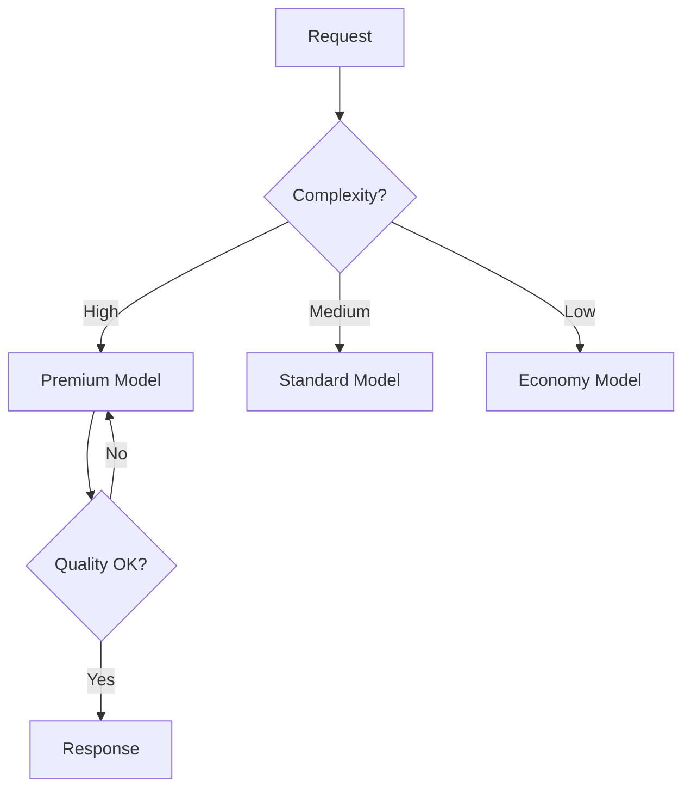

# Multi-Model Cost Strategy

## Overview
Use different AI models for different tasks based on cost, latency, and quality trade-offs. Intelligent routing optimizes spend while maintaining quality where it matters.

## Model Tiering

| Tier | Examples | Cost | Quality | Use Case |
|------|----------|------|---------|----------|
| **Premium** | GPT-4o, Claude 3.5 Sonnet, o1 | $$$ | ⭐⭐⭐⭐⭐ | Complex reasoning, critical decisions |
| **Standard** | GPT-4o-mini, Claude Haiku, Gemini Flash | $$ | ⭐⭐⭐ | General tasks, good balance |
| **Economy** | Llama 3, Mistral, self-hosted | $ | ⭐⭐ | High volume, cost-sensitive |

## Price Comparison (per 1M tokens)

| Model | Input | Output | Best For |
|-------|-------|--------|----------|
| o1 | $15.00 | $60.00 | Complex reasoning |
| Claude 3.5 Sonnet | $3.00 | $15.00 | Code, long context |
| GPT-4o | $2.50 | $10.00 | General, vision |
| GPT-4o-mini | $0.15 | $0.60 | Cost-effective general |
| Claude 3.5 Haiku | $0.80 | $4.00 | Fast, quality balance |
| Gemini 2 Flash | $0.10 | $0.40 | Ultra-cheap, long context |

## Intelligent Routing

### Classification Strategy

**Complexity Indicators**:
- High: analyze, synthesize, compare, architecture, code review
- Low: format, classify, translate simple, yes/no questions
- Context length >50K tokens → Higher tier

### Routing by Task Type

| Task | Recommended Tier | Rationale |
|------|------------------|-----------|
| Classification | Economy | Pattern matching |
| Summarization | Standard | Balance quality/cost |
| Code generation | Premium | Accuracy critical |
| Chat support | Standard | Good enough quality |
| Complex analysis | Premium | Reasoning required |
| Data extraction | Economy | Structured output |

## Fallback Chains

**Configuration**:
1. Primary: Preferred model
2. Secondary: Backup (different provider)
3. Tertiary: Reliable fallback

Handle: rate limits, timeouts, API errors, quality failures.

## Budget Allocation

| Category | Budget % | Models | Examples |
|----------|----------|--------|----------|
| **Critical** | 40% | Premium | User-facing chat, key decisions |
| **Standard** | 35% | Standard | Summarization, classification |
| **Batch** | 25% | Economy | Embeddings, data processing |

### Budget Controls
- Set spending caps per category
- Alert at 70%, 90%, 100% thresholds
- Auto-downgrade when budget exceeded

## A/B Testing Models

Test model performance before switching:
1. Split traffic (e.g., 50/50)
2. Track: cost, latency, quality score
3. Calculate cost-per-quality-point
4. Graduate winner to 100%

## Optimization Strategies

### Cost Reduction

| Strategy | Savings | Tradeoff |
|----------|---------|----------|
| Prompt caching | 50-90% | Setup complexity |
| Response caching | 70-90% | Stale responses |
| Shorter prompts | 20-40% | Less context |
| Model downgrade | 50-80% | Quality loss |
| Batching | 10-20% | Higher latency |

### Quality Preservation

- Use premium for user-visible outputs
- Use economy for internal processing
- Hybrid: cheap model drafts, expensive reviews

## Implementation Checklist

- [ ] Define model tiers and use cases
- [ ] Implement task classifier
- [ ] Set up fallback chains
- [ ] Configure budget limits per category
- [ ] Track cost/quality metrics
- [ ] A/B test before major changes

## Related Concepts
- [[32.06 FinOps Practices]]
- [[32.05 Training vs Inference Costs]]
- [[32.01 Cost Monitoring Tools]]

## References
- OpenAI Pricing Page
- Anthropic Pricing
- LiteLLM (multi-provider routing)
