# Multi-Model Cost Strategy

## Overview
A multi-model strategy involves using different AI models for different tasks based on cost, latency, and quality trade-offs. Instead of using a single expensive model for everything, intelligent routing optimizes spend while maintaining quality where it matters.

## Strategy Framework

```mermaid
graph TB
    A[Multi-Model Strategy] --> B[Model Tiering]
    A --> C[Task Routing]
    A --> D[Fallback Chains]
    A --> E[Cost Optimization]

    B --> B1["Tier 1: Premium<br/>Tier 2: Standard<br/>Tier 3: Economy"]
    C --> C1["Complexity detection<br/>Quality requirements<br/>Latency constraints"]
    D --> D1["Primary → Secondary<br/>Rate limit handling<br/>Error recovery"]
    E --> E1["Budget allocation<br/>Usage caps<br/>Dynamic routing"]

    style A fill:#e1f5ff
    style C fill:#e1ffe1
```



## Model Tiering

### Tier Classification


**Model Catalog:**
```python
from dataclasses import dataclass
from typing import Optional, List
from enum import Enum

class ModelTier(Enum):
    PREMIUM = "premium"      # Highest quality, highest cost
    STANDARD = "standard"    # Good balance
    ECONOMY = "economy"      # Cost-optimized

class ModelCapability(Enum):
    REASONING = "reasoning"
    CODING = "coding"
    CREATIVE = "creative"
    FACTUAL = "factual"
    MULTILINGUAL = "multilingual"
    VISION = "vision"
    LONG_CONTEXT = "long_context"

@dataclass
class ModelSpec:
    name: str
    provider: str
    tier: ModelTier
    input_cost_per_1m: float
    output_cost_per_1m: float
    context_window: int
    capabilities: List[ModelCapability]
    avg_latency_ms: int
    quality_score: float  # 0-1 benchmark score

MODEL_CATALOG = {
    # Premium Tier
    "gpt-4o": ModelSpec(
        name="gpt-4o",
        provider="openai",
        tier=ModelTier.PREMIUM,
        input_cost_per_1m=2.50,
        output_cost_per_1m=10.00,
        context_window=128000,
        capabilities=[ModelCapability.REASONING, ModelCapability.CODING,
                     ModelCapability.VISION, ModelCapability.LONG_CONTEXT],
        avg_latency_ms=800,
        quality_score=0.92
    ),
    "claude-3-5-sonnet": ModelSpec(
        name="claude-3-5-sonnet",
        provider="anthropic",
        tier=ModelTier.PREMIUM,
        input_cost_per_1m=3.00,
        output_cost_per_1m=15.00,
        context_window=200000,
        capabilities=[ModelCapability.REASONING, ModelCapability.CODING,
                     ModelCapability.LONG_CONTEXT],
        avg_latency_ms=1000,
        quality_score=0.94
    ),
    "o1": ModelSpec(
        name="o1",
        provider="openai",
        tier=ModelTier.PREMIUM,
        input_cost_per_1m=15.00,
        output_cost_per_1m=60.00,
        context_window=200000,
        capabilities=[ModelCapability.REASONING, ModelCapability.CODING],
        avg_latency_ms=15000,
        quality_score=0.98
    ),

    # Standard Tier
    "gpt-4o-mini": ModelSpec(
        name="gpt-4o-mini",
        provider="openai",
        tier=ModelTier.STANDARD,
        input_cost_per_1m=0.15,
        output_cost_per_1m=0.60,
        context_window=128000,
        capabilities=[ModelCapability.REASONING, ModelCapability.CODING,
                     ModelCapability.VISION],
        avg_latency_ms=400,
        quality_score=0.82
    ),
    "claude-3-5-haiku": ModelSpec(
        name="claude-3-5-haiku",
        provider="anthropic",
        tier=ModelTier.STANDARD,
        input_cost_per_1m=0.80,
        output_cost_per_1m=4.00,
        context_window=200000,
        capabilities=[ModelCapability.REASONING, ModelCapability.CODING],
        avg_latency_ms=300,
        quality_score=0.80
    ),
    "gemini-2-flash": ModelSpec(
        name="gemini-2-flash",
        provider="google",
        tier=ModelTier.STANDARD,
        input_cost_per_1m=0.10,
        output_cost_per_1m=0.40,
        context_window=1000000,
        capabilities=[ModelCapability.REASONING, ModelCapability.LONG_CONTEXT,
                     ModelCapability.VISION],
        avg_latency_ms=250,
        quality_score=0.78
    ),

    # Economy Tier
    "llama-3-70b": ModelSpec(
        name="llama-3-70b",
        provider="self-hosted",
        tier=ModelTier.ECONOMY,
        input_cost_per_1m=0.05,  # Estimated hosting cost
        output_cost_per_1m=0.05,
        context_window=8192,
        capabilities=[ModelCapability.REASONING, ModelCapability.CODING],
        avg_latency_ms=200,
        quality_score=0.75
    ),
    "mistral-large": ModelSpec(
        name="mistral-large",
        provider="mistral",
        tier=ModelTier.ECONOMY,
        input_cost_per_1m=2.00,
        output_cost_per_1m=6.00,
        context_window=128000,
        capabilities=[ModelCapability.REASONING, ModelCapability.CODING,
                     ModelCapability.MULTILINGUAL],
        avg_latency_ms=500,
        quality_score=0.76
    ),
}
```

## Intelligent Routing

### Router Architecture


**Smart Router Implementation:**
```python
from dataclasses import dataclass
from typing import Optional, Callable, Any
import re

@dataclass
class RoutingDecision:
    model: str
    reason: str
    estimated_cost: float
    fallback_model: Optional[str] = None

class TaskClassifier:
    """Classify task complexity and requirements."""

    # Patterns indicating high complexity
    COMPLEX_PATTERNS = [
        r'\b(analyze|synthesize|compare|evaluate|design)\b',
        r'\b(architecture|algorithm|optimization)\b',
        r'\b(code review|refactor|debug complex)\b',
        r'\b(research|investigate|deep dive)\b',
    ]

    # Patterns indicating simple tasks
    SIMPLE_PATTERNS = [
        r'\b(format|convert|translate simple)\b',
        r'\b(summarize short|extract|list)\b',
        r'\b(yes or no|true or false)\b',
        r'\b(classify|categorize|label)\b',
    ]

    def classify(self, prompt: str, context_length: int = 0) -> dict:
        """Classify task complexity."""
        prompt_lower = prompt.lower()

        # Check patterns
        complex_matches = sum(
            1 for p in self.COMPLEX_PATTERNS
            if re.search(p, prompt_lower)
        )
        simple_matches = sum(
            1 for p in self.SIMPLE_PATTERNS
            if re.search(p, prompt_lower)
        )

        # Context length factor
        if context_length > 50000:
            complexity = "high"
        elif complex_matches > simple_matches:
            complexity = "high"
        elif simple_matches > complex_matches:
            complexity = "low"
        else:
            complexity = "medium"

        # Detect required capabilities
        capabilities = []
        if re.search(r'\b(code|function|class|program)\b', prompt_lower):
            capabilities.append(ModelCapability.CODING)
        if re.search(r'\b(reason|think|analyze|why)\b', prompt_lower):
            capabilities.append(ModelCapability.REASONING)
        if re.search(r'\b(image|photo|picture|diagram)\b', prompt_lower):
            capabilities.append(ModelCapability.VISION)

        return {
            "complexity": complexity,
            "capabilities": capabilities,
            "context_length": context_length
        }

class ModelRouter:
    """Route requests to optimal model based on requirements."""

    def __init__(self, budget_limit: Optional[float] = None):
        self.classifier = TaskClassifier()
        self.budget_limit = budget_limit
        self.budget_spent = 0.0

    def select_model(
        self,
        prompt: str,
        context_length: int = 0,
        max_latency_ms: Optional[int] = None,
        required_quality: float = 0.0,
        prefer_provider: Optional[str] = None
    ) -> RoutingDecision:
        """Select optimal model for request."""

        classification = self.classifier.classify(prompt, context_length)
        complexity = classification["complexity"]
        required_caps = classification["capabilities"]

        # Filter eligible models
        eligible = []
        for name, spec in MODEL_CATALOG.items():
            # Check latency constraint
            if max_latency_ms and spec.avg_latency_ms > max_latency_ms:
                continue

            # Check quality requirement
            if spec.quality_score < required_quality:
                continue

            # Check capabilities
            if not all(cap in spec.capabilities for cap in required_caps):
                continue

            # Check context window
            if spec.context_window < context_length:
                continue

            # Provider preference
            if prefer_provider and spec.provider != prefer_provider:
                continue

            eligible.append((name, spec))

        if not eligible:
            # Fallback to most capable model
            return RoutingDecision(
                model="claude-3-5-sonnet",
                reason="No eligible models, using fallback",
                estimated_cost=0.0,
                fallback_model=None
            )

        # Select based on complexity
        tier_priority = {
            "high": [ModelTier.PREMIUM, ModelTier.STANDARD, ModelTier.ECONOMY],
            "medium": [ModelTier.STANDARD, ModelTier.PREMIUM, ModelTier.ECONOMY],
            "low": [ModelTier.ECONOMY, ModelTier.STANDARD, ModelTier.PREMIUM]
        }

        for tier in tier_priority[complexity]:
            tier_models = [(n, s) for n, s in eligible if s.tier == tier]
            if tier_models:
                # Select cheapest in tier
                name, spec = min(tier_models, key=lambda x: x[1].input_cost_per_1m)

                # Estimate cost (rough approximation)
                est_tokens = context_length + len(prompt.split()) * 1.3
                est_cost = (est_tokens / 1_000_000) * (spec.input_cost_per_1m + spec.output_cost_per_1m)

                # Find fallback
                fallback = None
                next_tier_models = [
                    (n, s) for n, s in eligible
                    if s.tier.value != tier.value and s.quality_score > spec.quality_score
                ]
                if next_tier_models:
                    fallback = next_tier_models[0][0]

                return RoutingDecision(
                    model=name,
                    reason=f"Selected {tier.value} tier for {complexity} complexity task",
                    estimated_cost=est_cost,
                    fallback_model=fallback
                )

        raise ValueError("No suitable model found")

# Usage
router = ModelRouter()

# Simple task → Economy model
decision = router.select_model(
    prompt="Classify this text as positive or negative: 'Great product!'",
    context_length=100
)
print(f"Model: {decision.model}, Reason: {decision.reason}")
# Model: llama-3-70b, Reason: Selected economy tier for low complexity task

# Complex task → Premium model
decision = router.select_model(
    prompt="Analyze this codebase architecture and suggest improvements for scalability",
    context_length=50000,
    required_quality=0.85
)
print(f"Model: {decision.model}, Reason: {decision.reason}")
# Model: gpt-4o, Reason: Selected premium tier for high complexity task
```

## Fallback Chains

### Cascade Strategy


**Fallback Chain Implementation:**
```python
from typing import List, Callable, Any
import asyncio
import httpx

@dataclass
class FallbackConfig:
    model: str
    max_retries: int = 2
    timeout_seconds: float = 30.0
    retry_on: List[str] = None  # Error types to retry

class FallbackChain:
    """Execute requests with automatic fallback."""

    def __init__(self, configs: List[FallbackConfig]):
        self.configs = configs
        self.metrics = {cfg.model: {"success": 0, "failure": 0} for cfg in configs}

    async def execute(
        self,
        prompt: str,
        call_model: Callable[[str, str], Any]
    ) -> tuple[str, Any]:
        """Execute with fallback chain."""

        last_error = None

        for config in self.configs:
            for attempt in range(config.max_retries + 1):
                try:
                    result = await asyncio.wait_for(
                        call_model(config.model, prompt),
                        timeout=config.timeout_seconds
                    )
                    self.metrics[config.model]["success"] += 1
                    return config.model, result

                except asyncio.TimeoutError:
                    last_error = f"Timeout on {config.model}"
                    continue

                except Exception as e:
                    last_error = str(e)
                    # Check if should retry
                    if config.retry_on and type(e).__name__ not in config.retry_on:
                        break

            self.metrics[config.model]["failure"] += 1

        raise RuntimeError(f"All models failed. Last error: {last_error}")

    def get_success_rates(self) -> dict:
        """Get success rates per model."""
        rates = {}
        for model, stats in self.metrics.items():
            total = stats["success"] + stats["failure"]
            rates[model] = stats["success"] / total if total > 0 else 0
        return rates

# Configure fallback chain
chain = FallbackChain([
    FallbackConfig("gpt-4o-mini", max_retries=2, timeout_seconds=10),
    FallbackConfig("claude-3-5-haiku", max_retries=2, timeout_seconds=15),
    FallbackConfig("gemini-2-flash", max_retries=1, timeout_seconds=20),
])
```

## Cost Optimization Patterns

### Dynamic Budget Allocation


**Budget Manager:**
```python
from datetime import datetime, timedelta
from collections import defaultdict

class BudgetManager:
    """Manage multi-model budget allocation."""

    def __init__(self, monthly_budget: float, allocations: dict):
        """
        allocations: {"critical": 0.4, "standard": 0.35, "batch": 0.25}
        """
        self.monthly_budget = monthly_budget
        self.allocations = allocations
        self.spending = defaultdict(float)
        self.reset_date = self._get_month_start()

    def _get_month_start(self) -> datetime:
        now = datetime.utcnow()
        return now.replace(day=1, hour=0, minute=0, second=0, microsecond=0)

    def _check_reset(self):
        if datetime.utcnow() >= self.reset_date + timedelta(days=32):
            self.spending.clear()
            self.reset_date = self._get_month_start()

    def get_remaining(self, category: str) -> float:
        """Get remaining budget for category."""
        self._check_reset()
        allocated = self.monthly_budget * self.allocations.get(category, 0)
        return max(0, allocated - self.spending[category])

    def can_spend(self, category: str, amount: float) -> bool:
        """Check if spend is within budget."""
        return self.get_remaining(category) >= amount

    def record_spend(self, category: str, amount: float):
        """Record spending."""
        self._check_reset()
        self.spending[category] += amount

    def get_status(self) -> dict:
        """Get budget status."""
        self._check_reset()

        status = {}
        for category, pct in self.allocations.items():
            allocated = self.monthly_budget * pct
            spent = self.spending[category]
            status[category] = {
                "allocated": round(allocated, 2),
                "spent": round(spent, 2),
                "remaining": round(allocated - spent, 2),
                "utilization": round(spent / allocated * 100, 1) if allocated > 0 else 0
            }

        total_spent = sum(self.spending.values())
        status["total"] = {
            "budget": self.monthly_budget,
            "spent": round(total_spent, 2),
            "remaining": round(self.monthly_budget - total_spent, 2),
            "utilization": round(total_spent / self.monthly_budget * 100, 1)
        }

        return status

# Usage
budget = BudgetManager(
    monthly_budget=10000,
    allocations={
        "critical": 0.40,
        "standard": 0.35,
        "batch": 0.25
    }
)

# Check before expensive operation
if budget.can_spend("critical", 5.00):
    # Use premium model
    budget.record_spend("critical", 5.00)
else:
    # Downgrade to standard
    pass

print(budget.get_status())
```

### A/B Testing Models

```python
import random
from typing import Dict, List, Tuple
from dataclasses import dataclass, field

@dataclass
class ModelExperiment:
    name: str
    models: List[str]
    weights: List[float]  # Traffic allocation
    metrics: Dict[str, Dict] = field(default_factory=dict)

class ModelABTester:
    """A/B test different models."""

    def __init__(self):
        self.experiments: Dict[str, ModelExperiment] = {}

    def create_experiment(
        self,
        name: str,
        models: List[str],
        weights: List[float]
    ):
        """Create a new A/B experiment."""
        assert len(models) == len(weights)
        assert abs(sum(weights) - 1.0) < 0.01

        self.experiments[name] = ModelExperiment(
            name=name,
            models=models,
            weights=weights,
            metrics={m: {"requests": 0, "cost": 0, "quality_sum": 0}
                    for m in models}
        )

    def get_model(self, experiment_name: str) -> str:
        """Get model for request based on weights."""
        exp = self.experiments[experiment_name]
        return random.choices(exp.models, weights=exp.weights)[0]

    def record_result(
        self,
        experiment_name: str,
        model: str,
        cost: float,
        quality_score: float
    ):
        """Record experiment result."""
        exp = self.experiments[experiment_name]
        exp.metrics[model]["requests"] += 1
        exp.metrics[model]["cost"] += cost
        exp.metrics[model]["quality_sum"] += quality_score

    def get_results(self, experiment_name: str) -> dict:
        """Get experiment results."""
        exp = self.experiments[experiment_name]

        results = {}
        for model, metrics in exp.metrics.items():
            n = metrics["requests"]
            if n > 0:
                results[model] = {
                    "requests": n,
                    "total_cost": round(metrics["cost"], 2),
                    "avg_cost": round(metrics["cost"] / n, 4),
                    "avg_quality": round(metrics["quality_sum"] / n, 3),
                    "cost_per_quality": round(metrics["cost"] / metrics["quality_sum"], 4)
                        if metrics["quality_sum"] > 0 else 0
                }

        return results

# Usage
tester = ModelABTester()

# Test GPT-4o-mini vs Claude Haiku for summarization
tester.create_experiment(
    name="summarization_model",
    models=["gpt-4o-mini", "claude-3-5-haiku"],
    weights=[0.5, 0.5]
)

# In production
model = tester.get_model("summarization_model")
# ... use model, get response ...
tester.record_result("summarization_model", model, cost=0.002, quality_score=0.85)

print(tester.get_results("summarization_model"))
```

## Cost Comparison Matrix

### Price-Performance Analysis

| Model | Cost/1M Input | Cost/1M Output | Quality | Speed | Best For |
|-------|---------------|----------------|---------|-------|----------|
| **o1** | $15.00 | $60.00 | ⭐⭐⭐⭐⭐ | 🐢 | Complex reasoning |
| **Claude 3.5 Sonnet** | $3.00 | $15.00 | ⭐⭐⭐⭐⭐ | 🐇 | Code, long context |
| **GPT-4o** | $2.50 | $10.00 | ⭐⭐⭐⭐ | 🐇 | General, vision |
| **GPT-4o-mini** | $0.15 | $0.60 | ⭐⭐⭐ | 🚀 | Cost-effective general |
| **Claude 3.5 Haiku** | $0.80 | $4.00 | ⭐⭐⭐ | 🚀 | Fast, quality balance |
| **Gemini 2 Flash** | $0.10 | $0.40 | ⭐⭐⭐ | 🚀 | Long context, cheap |
| **Llama 3 70B** | ~$0.05* | ~$0.05* | ⭐⭐⭐ | 🚀 | Self-hosted, privacy |

*Self-hosted costs vary based on infrastructure

### Scenario-Based Recommendations


## Monitoring Multi-Model Strategy

### Metrics Dashboard

```python
from prometheus_client import Counter, Histogram, Gauge

# Per-model metrics
model_requests = Counter(
    'llm_model_requests_total',
    'Total requests per model',
    ['model', 'tier', 'feature']
)

model_cost = Counter(
    'llm_model_cost_dollars',
    'Cost per model',
    ['model', 'tier']
)

model_quality = Histogram(
    'llm_model_quality_score',
    'Quality scores per model',
    ['model'],
    buckets=[0.5, 0.6, 0.7, 0.8, 0.9, 0.95, 1.0]
)

model_latency = Histogram(
    'llm_model_latency_seconds',
    'Latency per model',
    ['model'],
    buckets=[0.1, 0.5, 1, 2, 5, 10, 30]
)

# Routing metrics
routing_decisions = Counter(
    'llm_routing_decisions_total',
    'Routing decisions',
    ['from_tier', 'to_tier', 'reason']
)

def track_request(
    model: str,
    tier: str,
    feature: str,
    cost: float,
    quality: float,
    latency: float
):
    model_requests.labels(model=model, tier=tier, feature=feature).inc()
    model_cost.labels(model=model, tier=tier).inc(cost)
    model_quality.labels(model=model).observe(quality)
    model_latency.labels(model=model).observe(latency)
```

**Grafana Queries:**
```promql
# Cost distribution by tier
sum(rate(llm_model_cost_dollars[1h])) by (tier) * 3600

# Quality vs cost efficiency
avg(llm_model_quality_score) by (model)
/
(sum(rate(llm_model_cost_dollars[1h])) by (model) * 3600 + 0.001)

# Routing pattern analysis
sum(rate(llm_routing_decisions_total[1h])) by (from_tier, to_tier)
```

## Implementation Checklist

### Phase 1: Foundation
- [ ] Define model catalog with pricing
- [ ] Implement basic task classifier
- [ ] Set up cost tracking per model

### Phase 2: Routing
- [ ] Build model router
- [ ] Implement fallback chains
- [ ] Add quality validation

### Phase 3: Optimization
- [ ] Deploy budget manager
- [ ] Set up A/B testing
- [ ] Create monitoring dashboard

### Phase 4: Automation
- [ ] Auto-adjust routing based on metrics
- [ ] Implement dynamic budget reallocation
- [ ] Add anomaly detection

## Related Concepts
- [[32.01 Cost Monitoring Tools]]
- [[32.02 Operational Costs]]
- [[32.03 Initial Setup Costs]]
- [[11.08 MCP Server]] - Tool routing for LLMs

## References
- [OpenAI Pricing](https://openai.com/pricing)
- [Anthropic Pricing](https://www.anthropic.com/pricing)
- [Google AI Pricing](https://ai.google.dev/pricing)
- [LLM Router Patterns - Martian](https://withmartian.com/)
- [OpenRouter - Multi-model API](https://openrouter.ai/)
