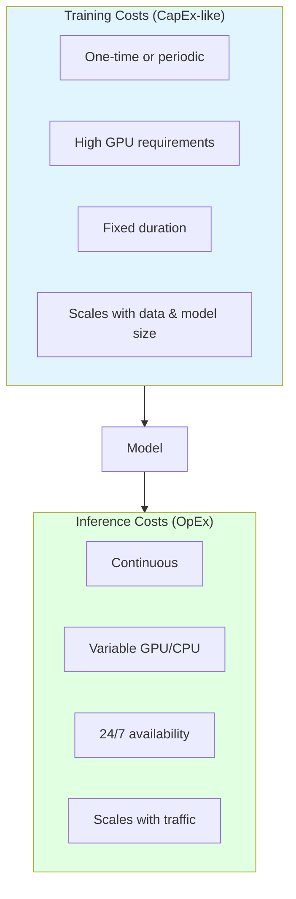
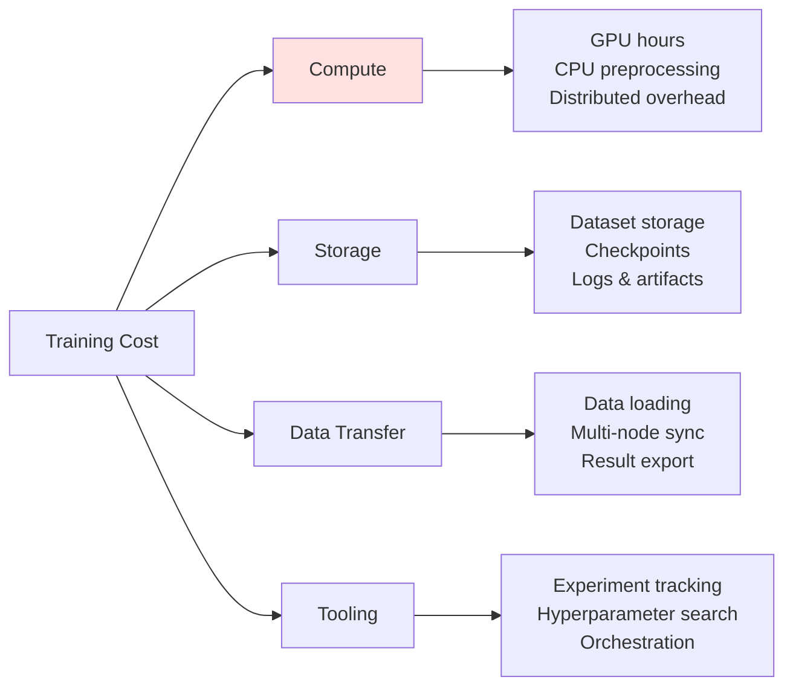
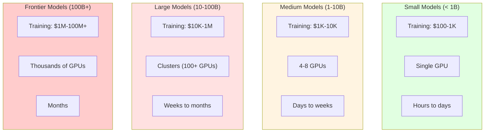
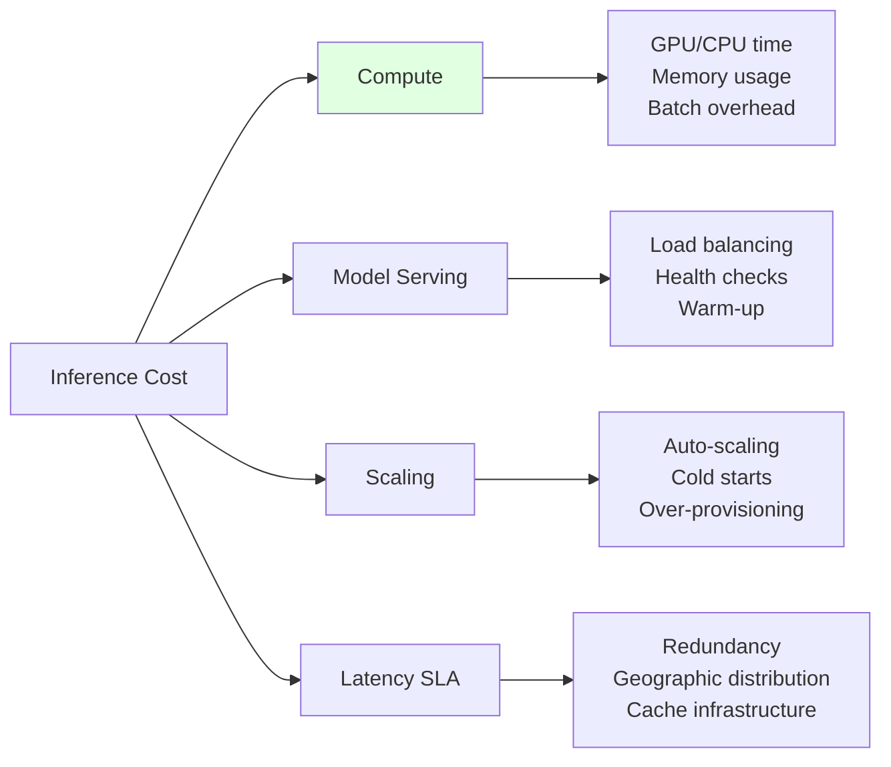
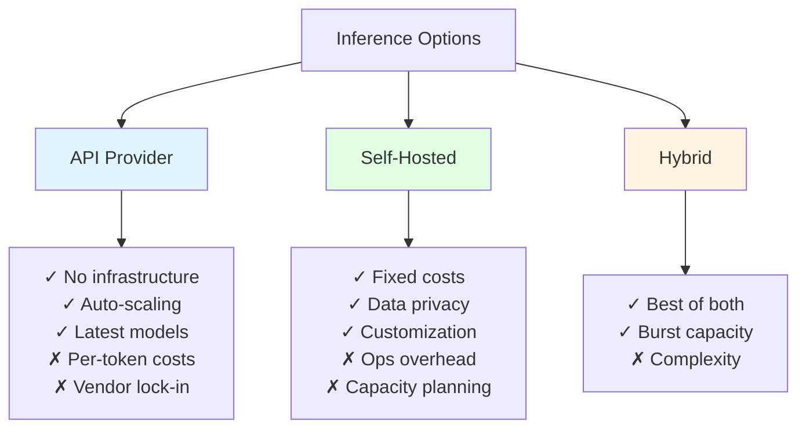
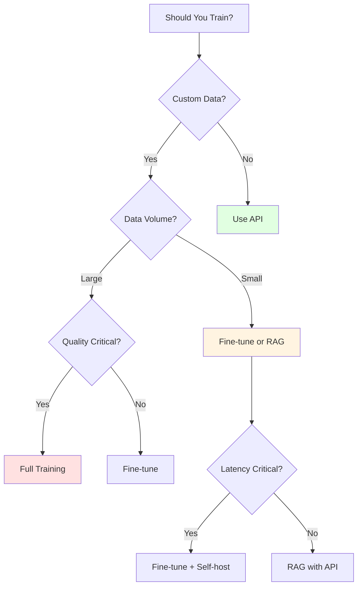

# Training vs Inference Costs

## Overview
Training and inference represent fundamentally different cost profiles in ML/LLM systems. Training is a periodic, compute-intensive investment that creates model value, while inference is an ongoing operational cost that scales with usage. Understanding this distinction is critical for budgeting and optimization.

## Cost Profile Comparison



| Aspect | Training | Inference |
|--------|----------|-----------|
| **Frequency** | Periodic (weekly/monthly) | Continuous |
| **Duration** | Hours to weeks | Milliseconds per request |
| **GPU Type** | High-memory (A100, H100) | Can use smaller GPUs |
| **Scaling** | Data size, model params | Request volume |
| **Optimization** | Spot instances, checkpointing | Batching, caching, quantization |
| **Cost Pattern** | Predictable bursts | Variable, usage-based |

## Training Costs Deep Dive

### Cost Components



### GPU Training Costs

```python
from dataclasses import dataclass
from typing import Optional
from enum import Enum

class GPUType(Enum):
    A100_40GB = "a100_40gb"
    A100_80GB = "a100_80gb"
    H100_80GB = "h100_80gb"
    A10G = "a10g"
    L4 = "l4"
    T4 = "t4"

@dataclass
class GPUSpec:
    name: str
    memory_gb: int
    hourly_cost_ondemand: float
    hourly_cost_spot: float
    tflops_fp16: float

GPU_PRICING = {
    # AWS SageMaker pricing (Jan 2026)
    GPUType.A100_40GB: GPUSpec("A100 40GB", 40, 4.10, 1.23, 312),
    GPUType.A100_80GB: GPUSpec("A100 80GB", 80, 5.12, 1.54, 312),
    GPUType.H100_80GB: GPUSpec("H100 80GB", 80, 8.22, 2.47, 989),
    GPUType.A10G: GPUSpec("A10G", 24, 1.21, 0.36, 125),
    GPUType.L4: GPUSpec("L4", 24, 0.81, 0.24, 121),
    GPUType.T4: GPUSpec("T4", 16, 0.53, 0.16, 65),
}

@dataclass
class TrainingJob:
    model_name: str
    model_params_billions: float
    dataset_size_gb: float
    epochs: int
    gpu_type: GPUType
    num_gpus: int
    estimated_hours: float
    use_spot: bool = True

def calculate_training_cost(job: TrainingJob) -> dict:
    """Calculate comprehensive training costs."""

    gpu = GPU_PRICING[job.gpu_type]

    # Compute cost
    hourly_rate = gpu.hourly_cost_spot if job.use_spot else gpu.hourly_cost_ondemand
    compute_cost = hourly_rate * job.num_gpus * job.estimated_hours

    # Storage costs (dataset + checkpoints)
    # Checkpoints: ~2x model size per checkpoint, 5 checkpoints
    model_size_gb = job.model_params_billions * 2  # FP16: 2 bytes per param
    checkpoint_storage_gb = model_size_gb * 2 * 5
    total_storage_gb = job.dataset_size_gb + checkpoint_storage_gb
    storage_cost = total_storage_gb * 0.023 * (job.estimated_hours / 720)  # Prorated S3

    # Data transfer (estimate: 2x dataset size for shuffling/loading)
    transfer_cost = job.dataset_size_gb * 2 * 0.02  # Cross-AZ transfer

    # Experiment tracking (W&B, MLflow, etc.)
    tooling_cost = job.estimated_hours * 0.50  # $0.50/hour estimate

    # Spot interruption overhead (15% extra time on average)
    if job.use_spot:
        overhead_factor = 1.15
    else:
        overhead_factor = 1.0

    total_compute = compute_cost * overhead_factor
    total = total_compute + storage_cost + transfer_cost + tooling_cost

    return {
        "job": job.model_name,
        "gpu": gpu.name,
        "num_gpus": job.num_gpus,
        "hours": job.estimated_hours,
        "costs": {
            "compute": round(total_compute, 2),
            "storage": round(storage_cost, 2),
            "transfer": round(transfer_cost, 2),
            "tooling": round(tooling_cost, 2),
            "total": round(total, 2)
        },
        "cost_per_epoch": round(total / job.epochs, 2),
        "cost_per_billion_params": round(total / job.model_params_billions, 2)
    }

# Example: Fine-tune 7B model
job = TrainingJob(
    model_name="llama-3-7b-finetuned",
    model_params_billions=7,
    dataset_size_gb=50,
    epochs=3,
    gpu_type=GPUType.A100_80GB,
    num_gpus=4,
    estimated_hours=12,
    use_spot=True
)
print(calculate_training_cost(job))
# {'job': 'llama-3-7b-finetuned', 'gpu': 'A100 80GB', 'num_gpus': 4,
#  'hours': 12, 'costs': {'compute': 84.74, 'storage': 0.04,
#  'transfer': 2.0, 'tooling': 6.0, 'total': 92.78},
#  'cost_per_epoch': 30.93, 'cost_per_billion_params': 13.25}
```

### Training Cost by Model Size



**Cost Estimation by Scale:**
```python
def estimate_training_cost_by_scale(
    params_billions: float,
    tokens_billions: float,
    gpu_type: GPUType = GPUType.H100_80GB,
    efficiency: float = 0.4  # MFU (Model FLOP Utilization)
) -> dict:
    """Estimate training cost using scaling laws."""

    gpu = GPU_PRICING[gpu_type]

    # Compute FLOPs needed (Chinchilla scaling: 6 * N * D)
    # N = parameters, D = tokens
    total_flops = 6 * params_billions * 1e9 * tokens_billions * 1e9

    # GPU throughput with efficiency
    flops_per_gpu_second = gpu.tflops_fp16 * 1e12 * efficiency

    # Total GPU-seconds needed
    gpu_seconds = total_flops / flops_per_gpu_second
    gpu_hours = gpu_seconds / 3600

    # Cost (using spot pricing)
    cost = gpu_hours * gpu.hourly_cost_spot

    return {
        "params_billions": params_billions,
        "tokens_billions": tokens_billions,
        "total_pflops": round(total_flops / 1e15, 2),
        "gpu_hours": round(gpu_hours, 2),
        "estimated_cost": round(cost, 2),
        "cost_per_billion_tokens": round(cost / tokens_billions, 2)
    }

# Examples
print("7B model, 1T tokens:", estimate_training_cost_by_scale(7, 1000))
print("70B model, 2T tokens:", estimate_training_cost_by_scale(70, 2000))
# 7B model: ~$15K
# 70B model: ~$700K
```

### Training Optimization Strategies

```python
@dataclass
class TrainingOptimization:
    name: str
    savings_percent: float
    complexity: str
    tradeoffs: str

TRAINING_OPTIMIZATIONS = [
    TrainingOptimization(
        "Spot/Preemptible Instances",
        savings_percent=70,
        complexity="Low",
        tradeoffs="Interruptions, need checkpointing"
    ),
    TrainingOptimization(
        "Mixed Precision (FP16/BF16)",
        savings_percent=50,
        complexity="Low",
        tradeoffs="Minor accuracy loss possible"
    ),
    TrainingOptimization(
        "Gradient Checkpointing",
        savings_percent=30,
        complexity="Low",
        tradeoffs="10-20% slower, but smaller GPUs"
    ),
    TrainingOptimization(
        "LoRA/QLoRA Fine-tuning",
        savings_percent=90,
        complexity="Medium",
        tradeoffs="Only trains adapters, not full model"
    ),
    TrainingOptimization(
        "Knowledge Distillation",
        savings_percent=80,
        complexity="High",
        tradeoffs="Needs teacher model, quality loss"
    ),
    TrainingOptimization(
        "Efficient Data Loading",
        savings_percent=15,
        complexity="Medium",
        tradeoffs="Engineering effort"
    ),
]

def recommend_optimizations(
    current_cost: float,
    target_cost: float,
    max_complexity: str = "Medium"
) -> list:
    """Recommend optimizations to hit target cost."""

    complexity_order = {"Low": 1, "Medium": 2, "High": 3}
    max_level = complexity_order[max_complexity]

    eligible = [
        opt for opt in TRAINING_OPTIMIZATIONS
        if complexity_order[opt.complexity] <= max_level
    ]

    # Sort by savings
    eligible.sort(key=lambda x: -x.savings_percent)

    recommendations = []
    remaining = current_cost

    for opt in eligible:
        if remaining <= target_cost:
            break

        savings = remaining * (opt.savings_percent / 100)
        remaining -= savings

        recommendations.append({
            "optimization": opt.name,
            "savings": round(savings, 2),
            "new_cost": round(remaining, 2),
            "tradeoffs": opt.tradeoffs
        })

    return recommendations
```

## Inference Costs Deep Dive

### Cost Components



### Per-Request Cost Calculation

```python
from dataclasses import dataclass
from typing import Optional

@dataclass
class InferenceConfig:
    model_name: str
    model_size_gb: float
    gpu_type: GPUType
    batch_size: int
    avg_input_tokens: int
    avg_output_tokens: int
    latency_ms: float

def calculate_inference_cost_per_request(config: InferenceConfig) -> dict:
    """Calculate cost per inference request."""

    gpu = GPU_PRICING[config.gpu_type]

    # Time per request (including batching efficiency)
    batch_time_ms = config.latency_ms
    time_per_request_ms = batch_time_ms / config.batch_size

    # GPU cost per request
    gpu_cost_per_ms = gpu.hourly_cost_ondemand / 3600 / 1000
    compute_cost = time_per_request_ms * gpu_cost_per_ms

    # Overhead costs (load balancing, monitoring, etc.) ~20%
    overhead_cost = compute_cost * 0.20

    # Memory cost (model loaded in GPU memory)
    # Amortize over requests per hour
    requests_per_hour = 3600 * 1000 / time_per_request_ms
    memory_cost_per_request = gpu.hourly_cost_ondemand / requests_per_hour * 0.1

    total = compute_cost + overhead_cost + memory_cost_per_request

    return {
        "model": config.model_name,
        "cost_per_request": round(total, 6),
        "cost_per_1k_requests": round(total * 1000, 4),
        "requests_per_dollar": round(1 / total, 0) if total > 0 else 0,
        "breakdown": {
            "compute": round(compute_cost, 6),
            "overhead": round(overhead_cost, 6),
            "memory": round(memory_cost_per_request, 6)
        },
        "tokens_per_request": config.avg_input_tokens + config.avg_output_tokens,
        "cost_per_1k_tokens": round(total * 1000 / (config.avg_input_tokens + config.avg_output_tokens), 4)
    }

# Example: Self-hosted LLM inference
config = InferenceConfig(
    model_name="llama-3-8b",
    model_size_gb=16,
    gpu_type=GPUType.A10G,
    batch_size=8,
    avg_input_tokens=500,
    avg_output_tokens=200,
    latency_ms=150
)
print(calculate_inference_cost_per_request(config))
```

### API vs Self-Hosted Comparison



**Break-Even Calculator:**
```python
def api_vs_selfhosted_breakeven(
    # API costs
    api_cost_per_1k_tokens: float,
    avg_tokens_per_request: int,

    # Self-hosted costs
    gpu_hourly_cost: float,
    requests_per_gpu_hour: int,

    # Fixed costs
    monthly_infra_overhead: float = 500,  # Monitoring, networking, etc.
    engineering_hours_monthly: float = 20,
    engineering_hourly_rate: float = 150
) -> dict:
    """Calculate break-even point for API vs self-hosted."""

    # API cost per request
    api_cost_per_request = (avg_tokens_per_request / 1000) * api_cost_per_1k_tokens

    # Self-hosted cost per request
    variable_cost_per_request = gpu_hourly_cost / requests_per_gpu_hour

    # Monthly fixed costs
    fixed_monthly = monthly_infra_overhead + (engineering_hours_monthly * engineering_hourly_rate)

    # Break-even calculation
    # API_cost = Self_hosted_cost
    # api_cost_per_request * N = fixed_monthly + variable_cost_per_request * N
    # N * (api_cost - variable_cost) = fixed_monthly
    # N = fixed_monthly / (api_cost - variable_cost)

    cost_diff = api_cost_per_request - variable_cost_per_request

    if cost_diff <= 0:
        breakeven_requests = float('inf')
        recommendation = "API is cheaper at all volumes"
    else:
        breakeven_requests = fixed_monthly / cost_diff
        recommendation = "Self-hosted" if breakeven_requests < 1_000_000 else "API"

    return {
        "api_cost_per_request": round(api_cost_per_request, 5),
        "selfhosted_variable_cost": round(variable_cost_per_request, 5),
        "selfhosted_fixed_monthly": round(fixed_monthly, 2),
        "breakeven_requests_monthly": round(breakeven_requests, 0),
        "breakeven_requests_daily": round(breakeven_requests / 30, 0),
        "recommendation": recommendation,
        "analysis": {
            "at_100k_monthly": {
                "api": round(api_cost_per_request * 100000, 2),
                "selfhosted": round(fixed_monthly + variable_cost_per_request * 100000, 2)
            },
            "at_1m_monthly": {
                "api": round(api_cost_per_request * 1000000, 2),
                "selfhosted": round(fixed_monthly + variable_cost_per_request * 1000000, 2)
            }
        }
    }

# Example: GPT-4o-mini vs self-hosted Llama
result = api_vs_selfhosted_breakeven(
    api_cost_per_1k_tokens=0.0004,  # GPT-4o-mini average
    avg_tokens_per_request=700,
    gpu_hourly_cost=1.21,  # A10G
    requests_per_gpu_hour=5000,  # Optimized batching
    monthly_infra_overhead=500,
    engineering_hours_monthly=20
)
print(result)
```

### Inference Optimization Strategies

```python
INFERENCE_OPTIMIZATIONS = [
    {
        "name": "Request Batching",
        "savings": "30-50%",
        "latency_impact": "+50-100ms",
        "implementation": "Easy",
        "description": "Group multiple requests into single GPU batch"
    },
    {
        "name": "KV Cache",
        "savings": "40-60%",
        "latency_impact": "Improves",
        "implementation": "Medium",
        "description": "Cache attention key-values for repeated prefixes"
    },
    {
        "name": "Prompt Caching",
        "savings": "50-90%",
        "latency_impact": "Improves",
        "implementation": "Medium",
        "description": "Cache responses for identical/similar prompts"
    },
    {
        "name": "Model Quantization (INT8/INT4)",
        "savings": "50-75%",
        "latency_impact": "Improves",
        "implementation": "Medium",
        "description": "Reduce model precision, smaller GPUs needed"
    },
    {
        "name": "Speculative Decoding",
        "savings": "20-40%",
        "latency_impact": "Improves",
        "implementation": "Hard",
        "description": "Use small model to draft, large to verify"
    },
    {
        "name": "Continuous Batching",
        "savings": "30-50%",
        "latency_impact": "Improves",
        "implementation": "Hard",
        "description": "Dynamic batching with vLLM/TensorRT-LLM"
    },
]
```

## Training vs Inference Trade-offs

### Investment Decision Framework



### Cost Allocation Model

```python
@dataclass
class MLProjectCosts:
    """Model training vs inference cost allocation."""

    # Training (one-time/periodic)
    initial_training_cost: float
    retraining_frequency_months: float
    retraining_cost: float

    # Inference (ongoing)
    requests_per_month: int
    cost_per_request: float

    def annual_costs(self) -> dict:
        # Training costs
        retrainings_per_year = 12 / self.retraining_frequency_months
        annual_training = self.initial_training_cost + (self.retraining_cost * retrainings_per_year)

        # Inference costs
        annual_inference = self.requests_per_month * self.cost_per_request * 12

        total = annual_training + annual_inference

        return {
            "annual_training": round(annual_training, 2),
            "annual_inference": round(annual_inference, 2),
            "total_annual": round(total, 2),
            "training_percent": round(annual_training / total * 100, 1),
            "inference_percent": round(annual_inference / total * 100, 1),
            "cost_per_request_amortized": round(total / (self.requests_per_month * 12), 6)
        }

# Example: Custom fine-tuned model
project = MLProjectCosts(
    initial_training_cost=5000,
    retraining_frequency_months=3,
    retraining_cost=1000,
    requests_per_month=500000,
    cost_per_request=0.0002
)
print(project.annual_costs())
# {'annual_training': 9000.0, 'annual_inference': 1200.0,
#  'total_annual': 10200.0, 'training_percent': 88.2,
#  'inference_percent': 11.8, 'cost_per_request_amortized': 0.0017}
```

### When to Train vs When to Use APIs

| Scenario | Recommendation | Rationale |
|----------|----------------|-----------|
| **< 10K requests/month** | API | Fixed costs don't justify self-hosting |
| **10K-100K requests/month** | Evaluate | Break-even zone, depends on use case |
| **> 100K requests/month** | Consider self-host | Volume justifies infrastructure |
| **Sensitive data** | Self-host/fine-tune | Data privacy requirements |
| **Unique domain** | Fine-tune | Generic models underperform |
| **Rapid iteration** | API | Faster experimentation |
| **Stable requirements** | Train/self-host | Optimize for efficiency |

## Cost Monitoring by Phase

### Training Cost Tracking

```python
from prometheus_client import Counter, Gauge, Histogram

# Training metrics
training_job_cost = Counter(
    'ml_training_job_cost_dollars',
    'Total training job cost',
    ['model', 'job_type', 'gpu_type']
)

training_gpu_hours = Counter(
    'ml_training_gpu_hours_total',
    'Total GPU hours for training',
    ['model', 'gpu_type']
)

training_efficiency = Gauge(
    'ml_training_mfu',
    'Model FLOP Utilization',
    ['model']
)

# Track training job
def track_training_job(
    model: str,
    job_type: str,  # "pretrain", "finetune", "eval"
    gpu_type: str,
    gpu_hours: float,
    cost: float,
    mfu: float
):
    training_job_cost.labels(
        model=model, job_type=job_type, gpu_type=gpu_type
    ).inc(cost)

    training_gpu_hours.labels(
        model=model, gpu_type=gpu_type
    ).inc(gpu_hours)

    training_efficiency.labels(model=model).set(mfu)
```

### Inference Cost Tracking

```python
# Inference metrics
inference_cost = Counter(
    'ml_inference_cost_dollars',
    'Total inference cost',
    ['model', 'deployment', 'tier']
)

inference_requests = Counter(
    'ml_inference_requests_total',
    'Total inference requests',
    ['model', 'deployment']
)

inference_tokens = Counter(
    'ml_inference_tokens_total',
    'Total tokens processed',
    ['model', 'direction']  # input/output
)

# Track inference
def track_inference(
    model: str,
    deployment: str,  # "api", "selfhosted"
    tier: str,  # "premium", "standard", "economy"
    input_tokens: int,
    output_tokens: int,
    cost: float
):
    inference_cost.labels(
        model=model, deployment=deployment, tier=tier
    ).inc(cost)

    inference_requests.labels(
        model=model, deployment=deployment
    ).inc()

    inference_tokens.labels(model=model, direction="input").inc(input_tokens)
    inference_tokens.labels(model=model, direction="output").inc(output_tokens)
```

### Unified Dashboard

```promql
# Training cost trend
sum(rate(ml_training_job_cost_dollars[7d])) by (model) * 86400 * 7

# Inference cost trend
sum(rate(ml_inference_cost_dollars[1h])) by (model) * 720  # Monthly projection

# Training vs Inference ratio
sum(ml_training_job_cost_dollars) / (sum(ml_training_job_cost_dollars) + sum(ml_inference_cost_dollars))

# Cost efficiency (requests per dollar)
sum(rate(ml_inference_requests_total[1h])) / sum(rate(ml_inference_cost_dollars[1h]))
```

## Summary: Optimization Checklist

### Training
- [ ] Use spot/preemptible instances (70% savings)
- [ ] Enable mixed precision training
- [ ] Implement gradient checkpointing
- [ ] Consider LoRA/QLoRA for fine-tuning
- [ ] Optimize data loading pipeline
- [ ] Use efficient batch sizes
- [ ] Monitor and improve MFU

### Inference
- [ ] Implement request batching
- [ ] Enable KV caching
- [ ] Add response caching layer
- [ ] Quantize models (INT8/INT4)
- [ ] Use continuous batching (vLLM)
- [ ] Right-size GPU instances
- [ ] Implement auto-scaling

## Related Concepts
- [[32.01 Cost Monitoring Tools]]
- [[32.02 Operational Costs]]
- [[32.03 Initial Setup Costs]]
- [[32.04 Multi-Model Cost Strategy]]
- [[12.01 Ensemble Methods Bagging & Boosting techniques]]

## References
- [Scaling Laws for Neural Language Models](https://arxiv.org/abs/2001.08361)
- [Training Compute-Optimal LLMs](https://arxiv.org/abs/2203.15556) (Chinchilla)
- [vLLM: High-throughput LLM Serving](https://github.com/vllm-project/vllm)
- [PEFT: Parameter-Efficient Fine-Tuning](https://github.com/huggingface/peft)
- [AWS SageMaker Pricing](https://aws.amazon.com/sagemaker/pricing/)
