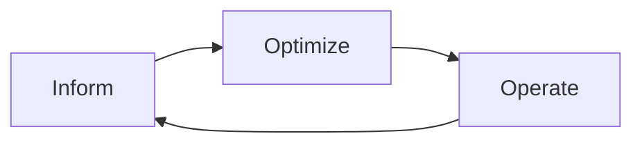

# FinOps Practices

## Overview
**FinOps** (Cloud Financial Operations) brings financial accountability to cloud spending. Critical for ML/LLM teams due to unpredictable costs from GPU compute, API usage, and data processing.

## FinOps Lifecycle

| Phase | Focus |
|-------|-------|
| **Inform** | Visibility, allocation, benchmarking |
| **Optimize** | Rightsizing, reservations, architecture |
| **Operate** | Policies, automation, governance |

## Core Principles

### 1. Teams Take Ownership
- **Engineering**: Resource decisions, optimization
- **Finance**: Budgets, forecasting, reporting
- **Business**: ROI analysis, prioritization

### 2. Centralized FinOps Team
Responsibilities:
- Tooling (cost visibility, tagging)
- Enablement (training, best practices)
- Governance (policies, budgets)
- Reporting (dashboards, forecasts)

### 3. Real-Time Decision Making
- Live cost feeds and usage metrics
- Anomaly detection and alerts
- Automated policy enforcement

## Maturity Model

| Level | Characteristics |
|-------|-----------------|
| **Crawl** | Manual reporting, limited tagging, reactive |
| **Walk** | Automated reporting, consistent tagging, some automation |
| **Run** | Real-time visibility, predictive analytics, full automation |

## Key Capabilities

### Cost Allocation
- **Tagging**: Team, project, environment, workload
- **Showback**: Show costs to teams (awareness)
- **Chargeback**: Bill costs to teams (accountability)
- **Shared costs**: Proportional or fixed allocation

### Forecasting
- Historical trend analysis
- Seasonality modeling
- Growth rate projection
- Confidence intervals

### Anomaly Detection
- Baseline statistics per service
- Z-score thresholds (2-3 std deviations)
- Severity levels (low → critical)
- Possible cause identification

## ML/LLM FinOps Challenges

| Challenge | Description |
|-----------|-------------|
| Variable workloads | Training vs inference, batch vs real-time |
| Experiment sprawl | Abandoned experiments, orphaned resources |
| GPU complexity | Utilization tracking, right-sizing |
| API unpredictability | Token-based costs, model selection |

## Unit Economics for ML

| Metric | Purpose |
|--------|---------|
| Cost per inference | Direct serving cost |
| Cost per 1k tokens | LLM API usage |
| Cost per training run | Model development |
| Cost per experiment | R&D efficiency |
| Inference margin | Revenue - cost / revenue |

## Governance Policies

| Policy | Action |
|--------|--------|
| Expensive dev instances | Block p4d/p5 in development |
| Large GPU requests | Require approval for >8 GPUs |
| Missing tags | Warn on untagged resources |
| Budget exceeded | Alert at 75%, 90%, 100% |

## Optimization Strategies

### Compute
- **Rightsizing**: Match instance to workload
- **Spot/Preemptible**: Use for fault-tolerant jobs
- **Reserved capacity**: Commit for stable workloads
- **Auto-scaling**: Scale down when idle

### LLM APIs
- **Model tiering**: Use cheaper models when possible
- **Caching**: Cache common responses
- **Batching**: Batch requests to reduce overhead
- **Prompt optimization**: Reduce token usage

### Storage
- **Tiered storage**: Hot/cold data separation
- **Lifecycle policies**: Auto-archive old data
- **Compression**: Reduce storage footprint
- **Deduplication**: Eliminate redundant data

## Tooling Categories

| Category | Examples |
|----------|----------|
| Cloud cost management | AWS Cost Explorer, GCP Billing, Azure Cost Management |
| Third-party | Kubecost, Spot.io, Apptio |
| Observability | Datadog, New Relic (cost views) |
| Custom dashboards | Grafana, Tableau, Looker |

## Best Practices

1. **Tag everything**: Enforce tagging from day one
2. **Budget alerts**: Set thresholds at 50%, 75%, 90%, 100%
3. **Regular reviews**: Weekly cost reviews with teams
4. **Unit economics**: Track cost per business metric
5. **Automation**: Automated rightsizing and scheduling
6. **Forecasting**: Monthly forecasts vs actuals
7. **Culture**: Make cost a team metric, not just finance

## Team Scorecard Metrics

| Metric | Description |
|--------|-------------|
| Budget adherence | Actual vs budget |
| Tagging compliance | % resources tagged |
| Optimization score | Actions taken on recommendations |
| Cost per unit | Cost efficiency ratio |
| MoM change | Month-over-month trend |

## Related Concepts
- [[32.01 Cost Monitoring Tools]]
- [[32.04 Multi-Model Cost Strategy]]
- [[32.05 Training vs Inference Costs]]

## References
- FinOps Foundation Framework
- "Cloud FinOps" by J.R. Storment & Mike Fuller
- AWS Well-Architected Cost Optimization Pillar
