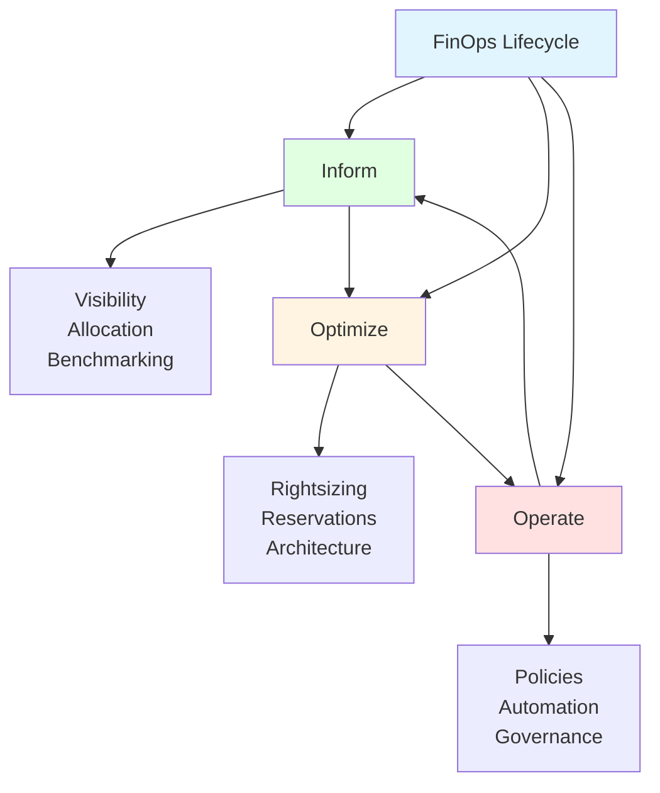
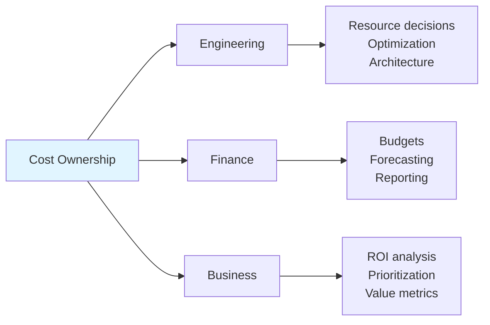
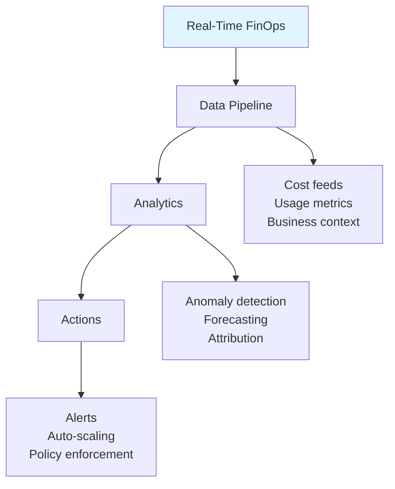
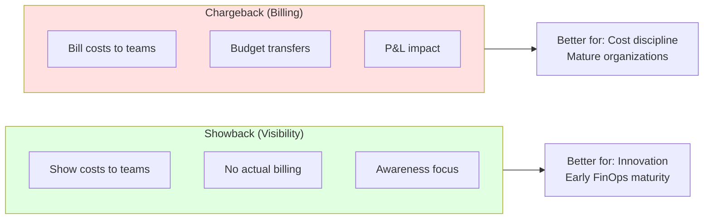
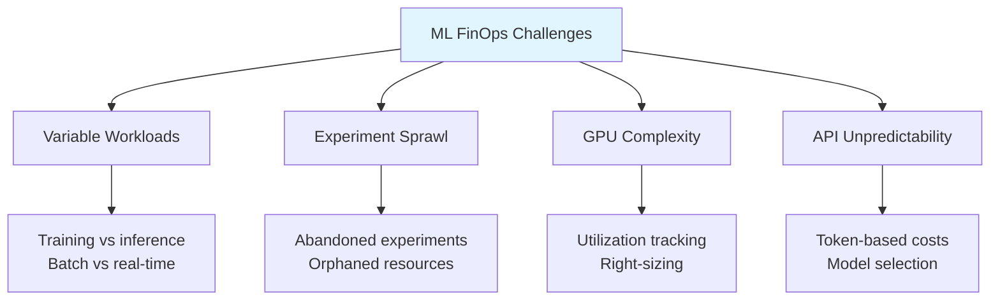
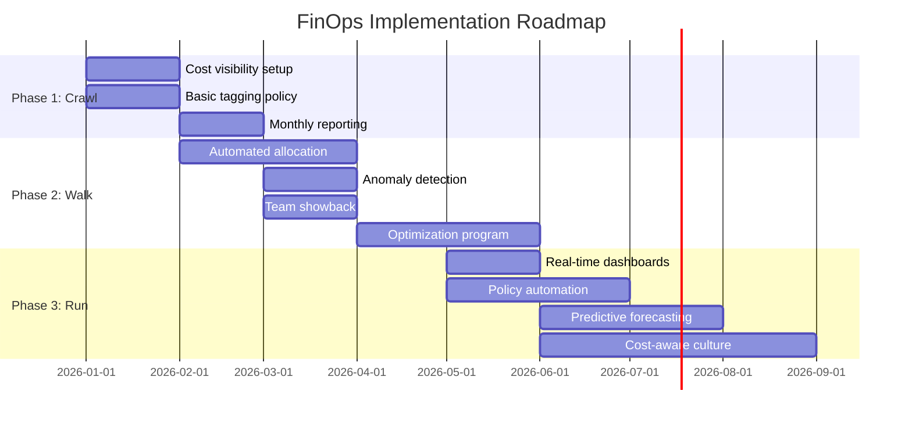

# FinOps Practices

## Overview
FinOps (Cloud Financial Operations) is a cultural practice that brings financial accountability to cloud spending. For ML/LLM teams, FinOps is critical due to unpredictable costs from GPU compute, API usage, and data processing at scale.

## FinOps Framework



## Core Principles

### 1. Teams Take Ownership



**Accountability Model:**
```python
from dataclasses import dataclass
from typing import List, Dict
from enum import Enum

class CostOwnerRole(Enum):
    ENGINEER = "engineer"
    TEAM_LEAD = "team_lead"
    FINANCE = "finance"
    EXECUTIVE = "executive"

@dataclass
class CostOwner:
    name: str
    role: CostOwnerRole
    cost_centers: List[str]
    budget_authority: float  # Max approval amount

@dataclass
class CostCenter:
    id: str
    name: str
    owners: List[CostOwner]
    monthly_budget: float
    alert_thresholds: List[float]  # [0.5, 0.75, 0.9, 1.0]

class FinOpsAccountability:
    def __init__(self):
        self.cost_centers: Dict[str, CostCenter] = {}
        self.owners: Dict[str, CostOwner] = {}

    def assign_owner(self, cost_center_id: str, owner: CostOwner):
        """Assign cost ownership."""
        if cost_center_id not in self.cost_centers:
            raise ValueError(f"Unknown cost center: {cost_center_id}")

        self.cost_centers[cost_center_id].owners.append(owner)
        owner.cost_centers.append(cost_center_id)

    def get_approval_chain(self, cost_center_id: str, amount: float) -> List[CostOwner]:
        """Get approval chain for a spend amount."""
        cc = self.cost_centers[cost_center_id]

        # Sort by authority level
        approvers = sorted(
            cc.owners,
            key=lambda o: o.budget_authority
        )

        # Find minimum authority needed
        chain = []
        for owner in approvers:
            chain.append(owner)
            if owner.budget_authority >= amount:
                break

        return chain

# Example setup
finops = FinOpsAccountability()

ml_platform = CostCenter(
    id="ml-platform",
    name="ML Platform Infrastructure",
    owners=[],
    monthly_budget=50000,
    alert_thresholds=[0.5, 0.75, 0.9, 1.0]
)

finops.cost_centers["ml-platform"] = ml_platform

# Assign owners
finops.assign_owner("ml-platform", CostOwner(
    name="ML Engineer",
    role=CostOwnerRole.ENGINEER,
    cost_centers=[],
    budget_authority=1000
))

finops.assign_owner("ml-platform", CostOwner(
    name="Team Lead",
    role=CostOwnerRole.TEAM_LEAD,
    cost_centers=[],
    budget_authority=10000
))
```

### 2. Centralized FinOps Team

```python
@dataclass
class FinOpsTeam:
    """Central FinOps function responsibilities."""

    responsibilities = {
        "tooling": [
            "Cost visibility platforms",
            "Tagging enforcement",
            "Showback/chargeback systems",
            "Anomaly detection"
        ],
        "enablement": [
            "Training engineering teams",
            "Best practices documentation",
            "Architecture reviews",
            "Optimization workshops"
        ],
        "governance": [
            "Policy definition",
            "Budget process",
            "Commitment management",
            "Vendor negotiations"
        ],
        "reporting": [
            "Executive dashboards",
            "Team scorecards",
            "Trend analysis",
            "Forecasting"
        ]
    }

class FinOpsMaturityModel:
    """FinOps Foundation Maturity Model."""

    LEVELS = {
        "crawl": {
            "description": "Basic visibility and reactive optimization",
            "characteristics": [
                "Manual cost reporting",
                "Limited tagging",
                "Reactive to bills",
                "Minimal automation"
            ]
        },
        "walk": {
            "description": "Proactive optimization with some automation",
            "characteristics": [
                "Automated reporting",
                "Consistent tagging",
                "Regular optimization reviews",
                "Some automated policies"
            ]
        },
        "run": {
            "description": "Real-time optimization with full automation",
            "characteristics": [
                "Real-time cost visibility",
                "Predictive analytics",
                "Automated optimization",
                "Cost-aware engineering culture"
            ]
        }
    }

    def assess_maturity(self, capabilities: Dict[str, int]) -> str:
        """Assess FinOps maturity level (1-5 scoring)."""
        avg_score = sum(capabilities.values()) / len(capabilities)

        if avg_score < 2:
            return "crawl"
        elif avg_score < 4:
            return "walk"
        else:
            return "run"
```

### 3. Real-Time Decision Making



## FinOps Capabilities

### Cost Allocation

```python
from dataclasses import dataclass, field
from typing import Dict, List, Optional
from decimal import Decimal

@dataclass
class AllocationRule:
    name: str
    source_tags: Dict[str, str]
    target_cost_center: str
    percentage: float = 100.0

@dataclass
class SharedCost:
    """Handle shared/untagged costs."""
    cost_id: str
    amount: Decimal
    allocation_method: str  # "even", "proportional", "fixed"
    targets: List[str]  # Cost centers

class CostAllocator:
    def __init__(self):
        self.rules: List[AllocationRule] = []
        self.allocations: Dict[str, Decimal] = {}

    def add_rule(self, rule: AllocationRule):
        self.rules.append(rule)

    def allocate(self, costs: List[Dict]) -> Dict[str, Decimal]:
        """Allocate costs to cost centers."""
        allocations: Dict[str, Decimal] = {}
        unallocated: List[Dict] = []

        for cost in costs:
            allocated = False
            for rule in self.rules:
                # Check if cost matches rule
                if self._matches_rule(cost, rule):
                    target = rule.target_cost_center
                    amount = Decimal(str(cost['amount'])) * Decimal(str(rule.percentage / 100))

                    allocations[target] = allocations.get(target, Decimal('0')) + amount
                    allocated = True
                    break

            if not allocated:
                unallocated.append(cost)

        # Handle unallocated costs
        if unallocated:
            self._allocate_shared(unallocated, allocations)

        return allocations

    def _matches_rule(self, cost: Dict, rule: AllocationRule) -> bool:
        tags = cost.get('tags', {})
        for key, value in rule.source_tags.items():
            if tags.get(key) != value:
                return False
        return True

    def _allocate_shared(
        self,
        costs: List[Dict],
        allocations: Dict[str, Decimal]
    ):
        """Distribute shared costs proportionally."""
        total_shared = sum(Decimal(str(c['amount'])) for c in costs)
        total_allocated = sum(allocations.values())

        if total_allocated == 0:
            return

        # Proportional allocation
        for center, amount in allocations.items():
            proportion = amount / total_allocated
            allocations[center] += total_shared * proportion

# Example
allocator = CostAllocator()

allocator.add_rule(AllocationRule(
    name="ML Training",
    source_tags={"team": "ml", "workload": "training"},
    target_cost_center="ml-training"
))

allocator.add_rule(AllocationRule(
    name="ML Inference",
    source_tags={"team": "ml", "workload": "inference"},
    target_cost_center="ml-inference"
))
```

### Showback vs Chargeback



**Showback Report Generator:**
```python
from dataclasses import dataclass
from datetime import datetime
from typing import Dict, List
import pandas as pd

@dataclass
class ShowbackReport:
    period: str
    cost_center: str
    costs: Dict[str, float]
    budget: float
    previous_period: Dict[str, float]

class ShowbackSystem:
    def __init__(self):
        self.cost_data: List[Dict] = []

    def generate_report(
        self,
        cost_center: str,
        start_date: datetime,
        end_date: datetime
    ) -> ShowbackReport:
        """Generate showback report for a cost center."""

        # Filter costs
        period_costs = [
            c for c in self.cost_data
            if c['cost_center'] == cost_center
            and start_date <= c['date'] <= end_date
        ]

        # Aggregate by category
        costs_by_category: Dict[str, float] = {}
        for cost in period_costs:
            category = cost.get('category', 'Other')
            costs_by_category[category] = (
                costs_by_category.get(category, 0) + cost['amount']
            )

        return ShowbackReport(
            period=f"{start_date.date()} to {end_date.date()}",
            cost_center=cost_center,
            costs=costs_by_category,
            budget=self._get_budget(cost_center),
            previous_period=self._get_previous_period(cost_center, start_date, end_date)
        )

    def generate_team_scorecard(self, team: str) -> Dict:
        """Generate FinOps scorecard for a team."""
        return {
            "team": team,
            "metrics": {
                "budget_adherence": self._calculate_budget_adherence(team),
                "tagging_compliance": self._calculate_tagging_compliance(team),
                "optimization_score": self._calculate_optimization_score(team),
                "cost_per_unit": self._calculate_unit_economics(team),
            },
            "trends": {
                "mom_change": self._calculate_month_over_month(team),
                "efficiency_trend": self._calculate_efficiency_trend(team),
            },
            "recommendations": self._get_recommendations(team)
        }

    def _get_budget(self, cost_center: str) -> float:
        # Implementation
        return 10000.0

    def _get_previous_period(
        self,
        cost_center: str,
        start: datetime,
        end: datetime
    ) -> Dict[str, float]:
        # Implementation
        return {}

    def _calculate_budget_adherence(self, team: str) -> float:
        return 0.85  # 85% adherence

    def _calculate_tagging_compliance(self, team: str) -> float:
        return 0.92  # 92% tagged

    def _calculate_optimization_score(self, team: str) -> float:
        return 0.78  # Optimization opportunities addressed

    def _calculate_unit_economics(self, team: str) -> Dict:
        return {"cost_per_inference": 0.002, "cost_per_training_run": 150}

    def _calculate_month_over_month(self, team: str) -> float:
        return -0.05  # 5% decrease

    def _calculate_efficiency_trend(self, team: str) -> str:
        return "improving"

    def _get_recommendations(self, team: str) -> List[str]:
        return [
            "Consider reserved capacity for stable inference workloads",
            "Review idle GPU instances in dev environment"
        ]
```

### Forecasting

```python
from dataclasses import dataclass
from typing import List, Tuple
import numpy as np
from datetime import datetime, timedelta

@dataclass
class CostForecast:
    period: str
    predicted_cost: float
    confidence_interval: Tuple[float, float]
    drivers: List[Dict]

class CostForecaster:
    def __init__(self, historical_data: List[Dict]):
        self.data = historical_data

    def forecast_linear(self, days_ahead: int = 30) -> CostForecast:
        """Simple linear regression forecast."""
        costs = [d['cost'] for d in self.data]
        days = list(range(len(costs)))

        # Linear regression
        slope, intercept = np.polyfit(days, costs, 1)

        # Predict
        future_day = len(costs) + days_ahead
        predicted = slope * future_day + intercept

        # Confidence interval (simple std-based)
        std = np.std(costs)
        ci = (predicted - 1.96 * std, predicted + 1.96 * std)

        return CostForecast(
            period=f"Next {days_ahead} days",
            predicted_cost=round(predicted, 2),
            confidence_interval=(round(ci[0], 2), round(ci[1], 2)),
            drivers=[
                {"factor": "historical_trend", "impact": slope * days_ahead}
            ]
        )

    def forecast_with_seasonality(
        self,
        months_ahead: int = 3
    ) -> List[CostForecast]:
        """Forecast with monthly seasonality."""
        # Group by month
        monthly_costs: Dict[int, List[float]] = {}
        for d in self.data:
            month = d['date'].month
            monthly_costs.setdefault(month, []).append(d['cost'])

        # Calculate monthly averages
        monthly_avg = {
            m: np.mean(costs) for m, costs in monthly_costs.items()
        }

        # Project forward
        forecasts = []
        current_month = datetime.now().month

        for i in range(1, months_ahead + 1):
            target_month = ((current_month - 1 + i) % 12) + 1
            base_cost = monthly_avg.get(target_month, np.mean(list(monthly_avg.values())))

            # Apply growth trend
            growth_rate = self._calculate_growth_rate()
            predicted = base_cost * (1 + growth_rate) ** i

            forecasts.append(CostForecast(
                period=f"Month +{i}",
                predicted_cost=round(predicted, 2),
                confidence_interval=(
                    round(predicted * 0.85, 2),
                    round(predicted * 1.15, 2)
                ),
                drivers=[
                    {"factor": "seasonality", "baseline": base_cost},
                    {"factor": "growth", "rate": growth_rate}
                ]
            ))

        return forecasts

    def _calculate_growth_rate(self) -> float:
        """Calculate month-over-month growth rate."""
        if len(self.data) < 60:  # Need at least 2 months
            return 0.0

        first_month = sum(d['cost'] for d in self.data[:30])
        last_month = sum(d['cost'] for d in self.data[-30:])

        months = len(self.data) / 30
        return (last_month / first_month) ** (1 / months) - 1
```

### Anomaly Detection

```python
from dataclasses import dataclass
from typing import List, Optional
from datetime import datetime
import numpy as np

@dataclass
class CostAnomaly:
    timestamp: datetime
    service: str
    expected_cost: float
    actual_cost: float
    deviation_percent: float
    severity: str  # "low", "medium", "high", "critical"
    possible_causes: List[str]

class AnomalyDetector:
    def __init__(self, sensitivity: float = 2.0):
        self.sensitivity = sensitivity  # Standard deviations
        self.baselines: Dict[str, Dict] = {}

    def update_baseline(self, service: str, costs: List[float]):
        """Update baseline statistics for a service."""
        self.baselines[service] = {
            "mean": np.mean(costs),
            "std": np.std(costs),
            "p95": np.percentile(costs, 95),
            "updated": datetime.utcnow()
        }

    def detect(self, service: str, cost: float) -> Optional[CostAnomaly]:
        """Detect if a cost is anomalous."""
        if service not in self.baselines:
            return None

        baseline = self.baselines[service]
        mean, std = baseline["mean"], baseline["std"]

        if std == 0:
            return None

        z_score = (cost - mean) / std

        if abs(z_score) < self.sensitivity:
            return None

        deviation = ((cost - mean) / mean) * 100

        # Determine severity
        if abs(z_score) < 3:
            severity = "low"
        elif abs(z_score) < 4:
            severity = "medium"
        elif abs(z_score) < 5:
            severity = "high"
        else:
            severity = "critical"

        return CostAnomaly(
            timestamp=datetime.utcnow(),
            service=service,
            expected_cost=round(mean, 2),
            actual_cost=round(cost, 2),
            deviation_percent=round(deviation, 1),
            severity=severity,
            possible_causes=self._identify_causes(service, cost, mean)
        )

    def _identify_causes(
        self,
        service: str,
        cost: float,
        expected: float
    ) -> List[str]:
        """Identify possible causes for anomaly."""
        causes = []

        if cost > expected:
            causes.extend([
                "Traffic spike or viral event",
                "New feature deployment",
                "Batch job or retraining",
                "Inefficient query or process",
                "Missing auto-scaling limit",
                "Rate limit exhaustion (fallback to expensive model)"
            ])
        else:
            causes.extend([
                "Service outage or degradation",
                "Feature disabled or A/B test",
                "Improved efficiency",
                "Traffic drop",
                "Caching improvement"
            ])

        return causes

# Example usage
detector = AnomalyDetector(sensitivity=2.5)

# Set baselines
detector.update_baseline("openai-api", [100, 105, 98, 110, 95, 102, 108])
detector.update_baseline("inference-gpu", [500, 520, 480, 510, 490, 530, 500])

# Check for anomalies
anomaly = detector.detect("openai-api", 250)  # Spike!
if anomaly:
    print(f"🚨 {anomaly.severity.upper()} anomaly detected!")
    print(f"  Expected: ${anomaly.expected_cost}, Actual: ${anomaly.actual_cost}")
    print(f"  Deviation: {anomaly.deviation_percent}%")
    print(f"  Possible causes: {anomaly.possible_causes[:3]}")
```

## FinOps for ML/LLM

### ML-Specific Challenges



### ML Cost Unit Economics

```python
@dataclass
class MLUnitEconomics:
    """Track cost per unit of ML value."""

    # Inference
    cost_per_inference: float
    cost_per_1k_tokens: float
    cost_per_user_session: float

    # Training
    cost_per_training_run: float
    cost_per_experiment: float
    cost_per_model_iteration: float

    # Business value
    revenue_per_inference: float
    ltv_per_user: float

    @property
    def inference_margin(self) -> float:
        """Gross margin on inference."""
        if self.revenue_per_inference == 0:
            return 0
        return (self.revenue_per_inference - self.cost_per_inference) / self.revenue_per_inference

    @property
    def training_roi(self) -> float:
        """ROI of training investment."""
        # Simplified: (Revenue from model - Training cost) / Training cost
        # Assumes model generates revenue over its lifetime
        return 0  # Implement based on your metrics

class MLFinOpsTracker:
    def __init__(self):
        self.inference_costs: List[float] = []
        self.inference_revenues: List[float] = []
        self.training_costs: List[float] = []

    def track_inference(self, cost: float, revenue: float = 0):
        self.inference_costs.append(cost)
        self.inference_revenues.append(revenue)

    def track_training(self, cost: float):
        self.training_costs.append(cost)

    def get_unit_economics(self) -> MLUnitEconomics:
        return MLUnitEconomics(
            cost_per_inference=np.mean(self.inference_costs) if self.inference_costs else 0,
            cost_per_1k_tokens=0,  # Calculate based on token tracking
            cost_per_user_session=0,  # Calculate based on session tracking
            cost_per_training_run=np.mean(self.training_costs) if self.training_costs else 0,
            cost_per_experiment=0,
            cost_per_model_iteration=0,
            revenue_per_inference=np.mean(self.inference_revenues) if self.inference_revenues else 0,
            ltv_per_user=0
        )
```

### Governance Policies

```python
from dataclasses import dataclass
from typing import List, Callable, Any
from enum import Enum

class PolicyAction(Enum):
    ALLOW = "allow"
    WARN = "warn"
    BLOCK = "block"
    REQUIRE_APPROVAL = "require_approval"

@dataclass
class FinOpsPolicy:
    name: str
    description: str
    condition: Callable[[Dict], bool]
    action: PolicyAction
    notification_channels: List[str]

class FinOpsPolicyEngine:
    def __init__(self):
        self.policies: List[FinOpsPolicy] = []

    def add_policy(self, policy: FinOpsPolicy):
        self.policies.append(policy)

    def evaluate(self, request: Dict) -> Dict:
        """Evaluate a resource request against policies."""
        results = []

        for policy in self.policies:
            if policy.condition(request):
                results.append({
                    "policy": policy.name,
                    "action": policy.action.value,
                    "description": policy.description
                })

        # Determine final action (most restrictive)
        if any(r["action"] == "block" for r in results):
            final_action = PolicyAction.BLOCK
        elif any(r["action"] == "require_approval" for r in results):
            final_action = PolicyAction.REQUIRE_APPROVAL
        elif any(r["action"] == "warn" for r in results):
            final_action = PolicyAction.WARN
        else:
            final_action = PolicyAction.ALLOW

        return {
            "allowed": final_action in [PolicyAction.ALLOW, PolicyAction.WARN],
            "action": final_action.value,
            "policies_triggered": results
        }

# Example policies
engine = FinOpsPolicyEngine()

# Block expensive instances in dev
engine.add_policy(FinOpsPolicy(
    name="no-expensive-dev-instances",
    description="Block p4d/p5 instances in development",
    condition=lambda r: (
        r.get("environment") == "development" and
        r.get("instance_type", "").startswith(("p4d", "p5"))
    ),
    action=PolicyAction.BLOCK,
    notification_channels=["slack"]
))

# Require approval for large GPU requests
engine.add_policy(FinOpsPolicy(
    name="large-gpu-approval",
    description="Require approval for >8 GPUs",
    condition=lambda r: r.get("gpu_count", 0) > 8,
    action=PolicyAction.REQUIRE_APPROVAL,
    notification_channels=["slack", "email"]
))

# Warn on untagged resources
engine.add_policy(FinOpsPolicy(
    name="tagging-required",
    description="Resources must have required tags",
    condition=lambda r: not all(
        tag in r.get("tags", {})
        for tag in ["team", "project", "environment"]
    ),
    action=PolicyAction.WARN,
    notification_channels=["slack"]
))

# Test
result = engine.evaluate({
    "environment": "development",
    "instance_type": "p4d.24xlarge",
    "gpu_count": 8,
    "tags": {"team": "ml"}
})
print(result)
# {'allowed': False, 'action': 'block',
#  'policies_triggered': [{'policy': 'no-expensive-dev-instances', ...}]}
```

## FinOps Metrics & KPIs

### Key Metrics

| Metric | Description | Target |
|--------|-------------|--------|
| **Cost per Unit** | Cost per inference/training run | Decreasing |
| **Budget Variance** | Actual vs budgeted spend | < 10% |
| **Tagging Compliance** | % resources properly tagged | > 95% |
| **Commitment Coverage** | % spend covered by reservations | 60-80% |
| **Waste Percentage** | Idle/unused resources | < 5% |
| **Optimization Rate** | Recommendations implemented | > 70% |

### Dashboard Template

```python
import streamlit as st
import plotly.express as px
import plotly.graph_objects as go

def render_finops_dashboard():
    st.title("🎯 FinOps Dashboard")

    # KPI Row
    col1, col2, col3, col4, col5 = st.columns(5)

    with col1:
        st.metric(
            "Monthly Spend",
            "$45,230",
            "-5.2%",
            delta_color="inverse"
        )

    with col2:
        st.metric(
            "Budget Utilization",
            "87%",
            "+2%"
        )

    with col3:
        st.metric(
            "Cost per Inference",
            "$0.0023",
            "-12%",
            delta_color="inverse"
        )

    with col4:
        st.metric(
            "Tagging Compliance",
            "94%",
            "+3%"
        )

    with col5:
        st.metric(
            "Waste %",
            "3.2%",
            "-1.5%",
            delta_color="inverse"
        )

    # Charts
    st.subheader("Spend by Category")

    fig = go.Figure(data=[
        go.Sankey(
            node=dict(
                label=["Total", "Compute", "Storage", "API", "Network",
                       "Training", "Inference", "Dev", "Prod"],
                color=["#1f77b4", "#ff7f0e", "#2ca02c", "#d62728", "#9467bd",
                       "#8c564b", "#e377c2", "#7f7f7f", "#bcbd22"]
            ),
            link=dict(
                source=[0, 0, 0, 0, 1, 1, 2, 2],
                target=[1, 2, 3, 4, 5, 6, 7, 8],
                value=[25000, 8000, 10000, 2230, 5000, 20000, 2000, 6000]
            )
        )
    ])

    st.plotly_chart(fig, use_container_width=True)

    # Team Scorecards
    st.subheader("Team Scorecards")

    teams = [
        {"team": "ML Platform", "budget_adherence": 92, "tagging": 98, "optimization": 85},
        {"team": "Data Science", "budget_adherence": 78, "tagging": 89, "optimization": 72},
        {"team": "NLP", "budget_adherence": 95, "tagging": 96, "optimization": 90},
    ]

    for team in teams:
        with st.expander(f"{team['team']} Team"):
            cols = st.columns(3)
            cols[0].metric("Budget Adherence", f"{team['budget_adherence']}%")
            cols[1].metric("Tagging Compliance", f"{team['tagging']}%")
            cols[2].metric("Optimization Score", f"{team['optimization']}%")
```

## Implementation Roadmap



## Related Concepts
- [[32.01 Cost Monitoring Tools]]
- [[32.02 Operational Costs]]
- [[32.03 Initial Setup Costs]]
- [[32.04 Multi-Model Cost Strategy]]
- [[32.05 Training vs Inference Costs]]

## References
- [FinOps Foundation](https://www.finops.org/)
- [FinOps Framework](https://www.finops.org/framework/)
- [State of FinOps Report](https://www.finops.org/insights/state-of-finops/)
- [Cloud FinOps Book (O'Reilly)](https://www.oreilly.com/library/view/cloud-finops/9781492054610/)
- [AWS Well-Architected Cost Optimization](https://docs.aws.amazon.com/wellarchitected/latest/cost-optimization-pillar/)
- [GCP FinOps Hub](https://cloud.google.com/learn/what-is-finops)
