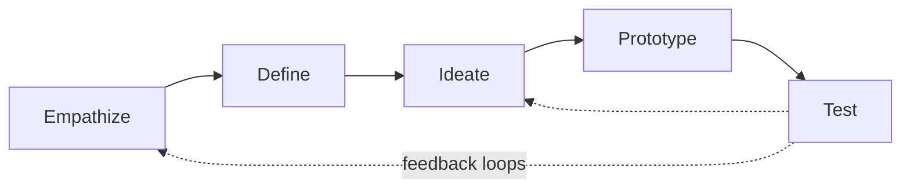

# Design Thinking

## Overview

**Design Thinking** is a human-centered, iterative problem-solving methodology that prioritizes understanding user needs before committing to solutions. Popularized by IDEO and the Stanford d.school, it structures ambiguous problems into five phases — Empathize, Define, Ideate, Prototype, Test — cycling between **divergent** (generate options) and **convergent** (narrow down) thinking.

> [!INFO]
> Design Thinking is a *problem-framing* methodology, not a delivery process. It answers "are we building the right thing?" — delivery frameworks like Agile answer "are we building the thing right?"

## The Five Phases

- **Empathize** — observe and interview users to understand their actual needs, not stated wants (field studies, user interviews, journey mapping).
- **Define** — synthesize research into a clear **problem statement** / point-of-view (e.g., "*[user]* needs *[need]* because *[insight]*").
- **Ideate** — diverge: generate many candidate solutions without judging them (brainstorming, "How Might We" questions, SCAMPER).
- **Prototype** — build the cheapest artifact that makes an idea testable (paper sketch, mockup, Wizard-of-Oz demo).
- **Test** — put prototypes in front of real users, learn, and loop back to any earlier phase.

> [!WARNING]
> The phases are **non-linear**. Treating them as a waterfall checklist ("we did empathy in week 1, done") is the most common failure mode — testing routinely sends you back to redefine the problem.

## Key Concepts

- **Human-centered**: desirability (do users want it?) is checked before feasibility (can we build it?) and viability (should the business do it?).
- **Diverge, then converge**: separate idea *generation* from idea *selection* — judging too early kills novel options.
- **Bias toward action**: prototype to think; a rough artifact surfaces more truth than a long discussion.
- **Fail cheap, fail early**: the cost of discovering a wrong assumption grows with each phase it survives.

## Design Thinking vs. Adjacent Methodologies

| Methodology | Core question | Best when |
|---|---|---|
| **Design Thinking** | Are we solving the right problem? | Problem is ambiguous, user needs unclear |
| **Lean Startup** | Will anyone pay for this? | Business model is the unknown |
| **Agile / Scrum** | How do we deliver iteratively? | Problem is known, execution is the challenge |
| **Design Sprint** | Can we validate in 5 days? | Need a fast, time-boxed answer to one question |

These compose: Design Thinking to frame the problem → Lean to validate the market → Agile to deliver.

## Practical Use Cases

- **ML/AI product discovery** — before building a model, empathize with end users to verify the problem is worth automating; many ML projects fail on problem framing, not modeling.
- **Ambiguous stakeholder requests** — use Define to convert "we need AI" into a testable problem statement.
- **UX for AI systems** — prototype model behavior with Wizard-of-Oz tests (a human faking model output) before spending on training.
- **Internal tooling** — shadow the engineers/analysts who will use the tool instead of guessing requirements.

> [!TIP]
> For ML projects, a "prototype" can be a rule-based baseline or a spreadsheet. If users don't engage with the fake version, a real model won't save it.

## Related Concepts

- [[33_Project_Management_MOC]] - parent index
- [[31.01 ML System Design Patterns]] - design thinking frames the problem these patterns implement
