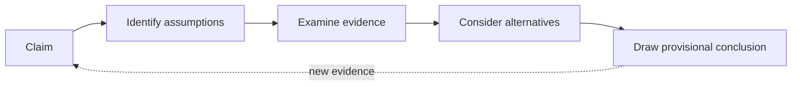

# Critical Thinking

## Overview

**Critical Thinking** is the disciplined practice of evaluating claims, evidence, and reasoning before accepting a conclusion — asking "how do we know this is true?" instead of "does this sound right?". It is the counterweight to intuition: intuition generates answers fast, critical thinking checks whether those answers survive scrutiny.

> [!INFO]
> Critical thinking is not being negative or contrarian. It applies the same skepticism to your *own* conclusions as to others' — the goal is accuracy, not winning arguments.

## Core Loop

- **Claim** — state precisely what is being asserted; vague claims ("the model works well") can't be evaluated.
- **Identify assumptions** — what must be true for the claim to hold? Which assumptions are unstated?
- **Examine evidence** — is it relevant, sufficient, and representative? Who produced it and what were their incentives?
- **Consider alternatives** — what else could explain the same evidence? Actively look for disconfirming cases.
- **Provisional conclusion** — hold it with confidence proportional to the evidence, and update when new evidence arrives.

## Key Concepts

- **Argument = claim + evidence + inference**: attack points are the evidence (is it true?) and the inference (does it actually follow?), not the person or the tone.
- **Falsifiability**: a belief you can't imagine evidence against isn't a conclusion, it's a commitment. Ask "what would change my mind?"
- **Socratic questioning**: probe with "why?", "compared to what?", "what's the base rate?", "who benefits if this is believed?"
- **First-principles thinking**: decompose a claim into fundamentals and rebuild, instead of reasoning by analogy ("everyone does X, so X is right").
- **Strong opinions, weakly held**: commit enough to act, stay open enough to reverse when the data disagrees.

> [!WARNING]
> The most common failure mode is **confirmation bias** — searching only for evidence that supports what you already believe. Others to watch: **survivorship bias** (you only see the successes), **sunk-cost fallacy** (past investment justifying future waste), **authority bias** (the paper/vendor/senior said so), and **narrative fallacy** (a good story feels more true than messy data).

## Common Reasoning Errors

| Error | What it looks like | Counter-move |
|---|---|---|
| **Correlation ≠ causation** | "Metric rose after launch, so launch caused it" | Ask for a control / counterfactual |
| **Cherry-picking** | Benchmark shows only the favorable datasets | Ask what was excluded and why |
| **Base-rate neglect** | "99% accurate" on a 1%-prevalence problem | Compute the confusion matrix |
| **False dichotomy** | "Build in-house or fall behind" | Enumerate the excluded middle options |
| **Anecdote as data** | "A customer complained, we must rewrite" | Ask for frequency and severity across users |

## Practical Use Cases

- **Evaluating model results** — "accuracy improved" invites the questions: on which split? vs. what baseline? is the test set leaked? does the metric match the business goal?
- **Vendor and paper claims** — benchmark numbers are marketing until you know the setup; reproduce on your own data before deciding.
- **Stakeholder requests** — "we need an LLM for this" is a claim; surface the assumption (that the problem needs one) before scoping the project.
- **Incident post-mortems** — resist the first plausible story; the fix that pattern-matches a known failure may not address the actual cause.
- **Reviewing LLM output** — generated text is fluent regardless of correctness, so fluency is zero evidence; verify claims against primary sources.

> [!TIP]
> Institutionalize it: ask "what would prove us wrong?" in design reviews, assign a devil's advocate for big decisions, and write down predictions *before* seeing results so hindsight can't rewrite them.

## Critical Thinking vs. Adjacent Modes

| Mode | Core question | Best when |
|---|---|---|
| **Critical Thinking** | Is this claim actually true? | Evaluating evidence, decisions, results |
| **Design Thinking** | Are we solving the right problem? | Problem is ambiguous, needs unclear |
| **Systems Thinking** | How do the parts interact over time? | Feedback loops and second-order effects dominate |
| **Creative Thinking** | What else could this be? | You need options, not judgment (defer critique) |

These compose: creative/design thinking to generate options, critical thinking to select among them.

## Related Concepts

- [[33_Project_Management_MOC]] - parent index
- [[33.01 Design Thinking]] - contrast: framing problems vs. evaluating claims
- [[95.02 Everybody Lies]] - example: what data reveals when self-reports mislead
