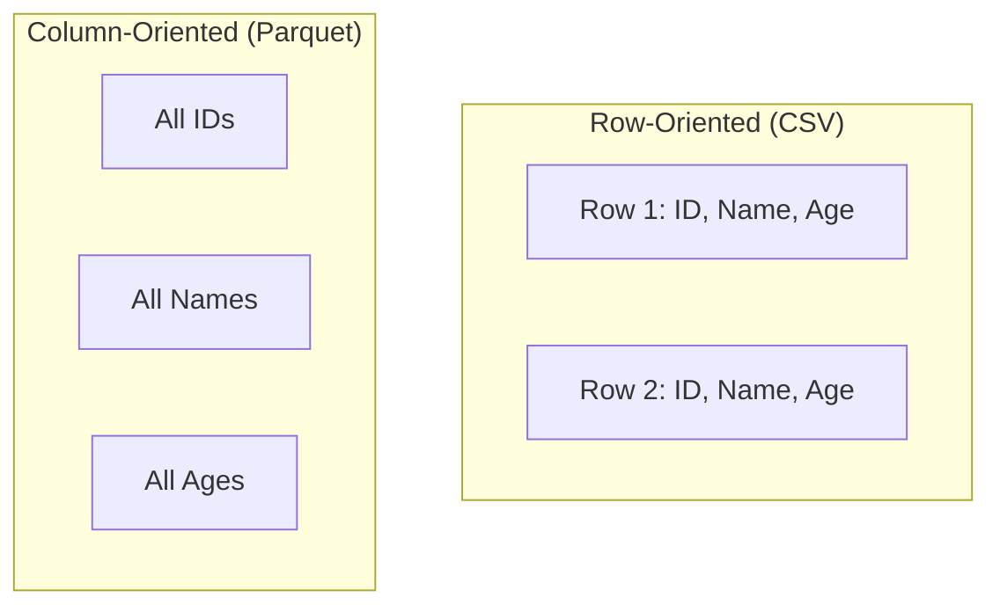
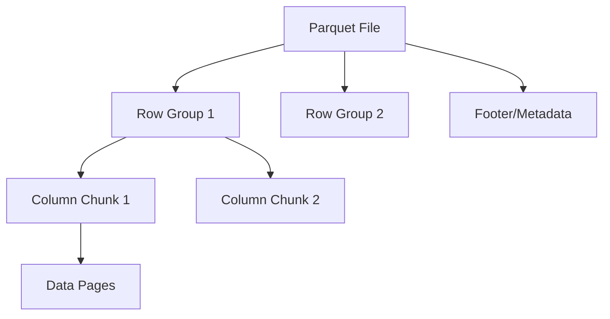
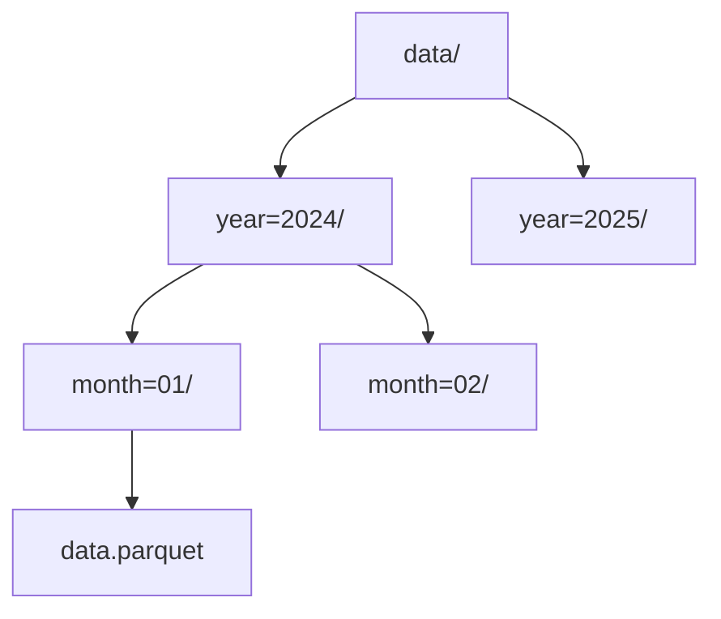
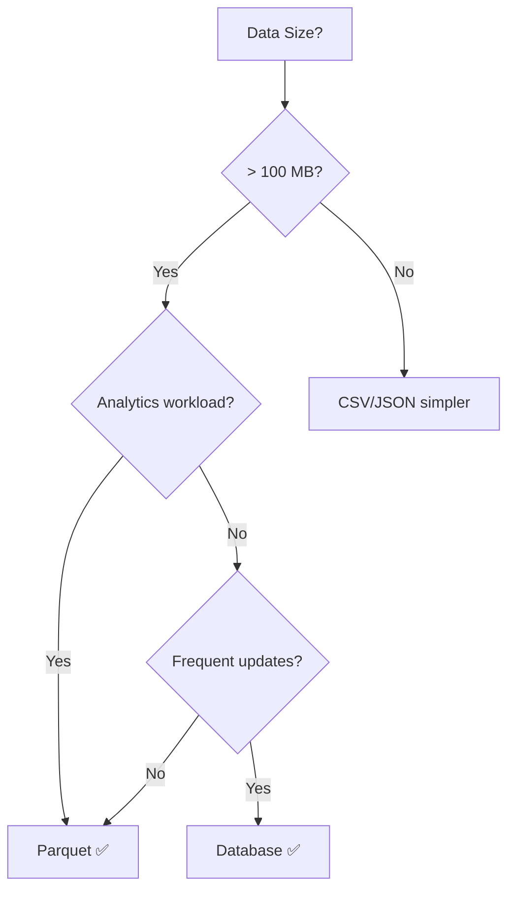

# Parquet File Format

## Overview
Apache Parquet is a **column-oriented binary** storage format optimized for analytics. Provides significant performance and storage advantages over row-based formats like CSV.

## Key Characteristics

| Feature | Description |
|---------|-------------|
| **Column-oriented** | Data stored by columns, not rows |
| **Binary format** | Not human-readable |
| **Self-describing** | Schema embedded in file |
| **Compressed** | 75-90% smaller than CSV |
| **Type-safe** | Strong typing with metadata |

## Column vs Row Storage

**Benefits of columnar**:
- Read only needed columns
- Better compression (similar values)
- Vectorized operations

## File Structure

| Component | Description | Default Size |
|-----------|-------------|--------------|
| **Row Group** | Set of rows, parallelization unit | ~128 MB |
| **Column Chunk** | One column within a row group | Variable |
| **Page** | Unit of compression | ~1 MB |
| **Footer** | Schema, statistics, metadata | Variable |

## Encoding Schemes

| Encoding | Best For | How It Works |
|----------|----------|--------------|
| **Plain** | General data | Raw values |
| **Dictionary** | Low cardinality | Map values to integers |
| **RLE** | Repeated values | (value, count) pairs |
| **Delta** | Sequential data | Store differences |
| **Bit-Packed** | Small integers | Minimal bits per value |

## Compression Codecs

| Codec | Speed | Ratio | Use Case |
|-------|-------|-------|----------|
| **Snappy** | ⚡ Fast | Medium | Default, read-heavy |
| **GZIP** | Slow | High | Storage-constrained |
| **ZSTD** | Medium | High | Modern alternative |
| **LZO** | Fast | Low | MapReduce compatible |
| **Brotli** | Slow | Highest | Archival |

## Advantages vs Disadvantages

| ✅ Advantages | ❌ Disadvantages |
|---------------|------------------|
| Fast analytical queries | Slower writes |
| High compression | Not human-readable |
| Column pruning | Overhead for small data |
| Predicate pushdown | Requires specialized tools |
| Schema evolution | Not for transactional |
| Ecosystem integration | Row access inefficient |

## Comparison with Other Formats

| Feature | Parquet | [[41.02 CSV File Format\|CSV]] | [[41.03 JSON File Format\|JSON]] |
|---------|---------|-----|------|
| Storage | Column | Row | Document |
| Format | Binary | Text | Text |
| Compression | ✅ Built-in | ❌ | ❌ |
| Schema | ✅ Embedded | ❌ | ❌ Optional |
| Nested data | ✅ | ❌ | ✅ |
| File size | Small | Large | Medium |
| Query speed | Fast | Slow | Slow |

## Use Cases

### ✅ Ideal For

| Use Case | Why |
|----------|-----|
| Data warehousing | Column-based analytics |
| ETL pipelines | Efficient transforms |
| Data lakes | S3/HDFS storage |
| ML feature stores | Fast column access |
| Time-series | Compression, filtering |

### ❌ Not Ideal For

| Use Case | Why | Alternative |
|----------|-----|-------------|
| OLTP databases | Frequent updates | Row-based DB |
| Small datasets | High overhead | CSV |
| Human inspection | Binary format | JSON/CSV |
| Streaming writes | Needs buffering | JSON Lines |

## Partitioning

| Strategy | Best For |
|----------|----------|
| **By date** | Time-series queries |
| **By region** | Geographic filtering |
| **By category** | Categorical access |

## Statistics & Optimization

### Column Statistics (in footer)

| Statistic | Use |
|-----------|-----|
| Min/Max | Predicate pushdown |
| Null count | Query planning |
| Row count | Cardinality estimation |

### Query Optimizations

| Optimization | Description |
|--------------|-------------|
| **Column pruning** | Read only needed columns |
| **Predicate pushdown** | Skip row groups by stats |
| **Row group skipping** | Skip based on min/max |

## When to Use Parquet

## Related Concepts
- [[41_Data_Engineering_MOC]] - Parent category
- [[41.02 CSV File Format]] - Contrast: row-based alternative for small data
- [[41.03 JSON File Format]] - Contrast: human-readable alternative
- [[41.04 Apache Arrow]] - In-memory format for zero-copy reads

## References
- [Apache Parquet](https://parquet.apache.org/)
- [Parquet Format Spec](https://github.com/apache/parquet-format)
