# Parquet File Format

## Overview
Apache Parquet is an open-source, column-oriented data storage format designed for efficient data storage and retrieval. It's optimized for use with big data processing frameworks and provides significant performance advantages over row-based formats like CSV or JSON.

## Key Characteristics

### 1. Column-Oriented Storage
Data is stored by columns rather than rows, enabling:
- **Efficient compression**: Similar data types compress better
- **Faster queries**: Read only needed columns
- **Better I/O**: Skip irrelevant data


### 2. Efficient Compression
- **Type-specific encoding**: Different encoding for different data types
- **Compression codecs**: Snappy, GZIP, LZO, Brotli, ZSTD
- **Typical compression**: 75-90% smaller than CSV

### 3. Schema Evolution
- Add new columns without rewriting existing data
- Remove columns
- Rename columns (with metadata)

### 4. Self-Describing
- Schema embedded in file
- Column metadata and statistics
- No external schema needed

## File Structure

### Hierarchical Organization


### Components

**1. Row Group**
- Set of rows (default ~128MB)
- Unit of parallelization
- Contains column chunks

**2. Column Chunk**
- All data for one column in a row group
- Stored contiguously
- Contains pages

**3. Page**
- Unit of compression and encoding
- Typically 1MB
- Types: Data Page, Dictionary Page, Index Page

**4. Footer**
- File metadata
- Schema definition
- Column statistics (min, max, count, null count)

### Binary Format Structure

Parquet files are **binary files** with a specific on-disk format:

```
4-byte magic number "PAR1"
<Column 1 Chunk 1 + Column Metadata>
<Column 2 Chunk 1 + Column Metadata>
...
<Column N Chunk 1 + Column Metadata>
<Column 1 Chunk 2 + Column Metadata>
...
<Column N Chunk M + Column Metadata>
<File Metadata>
4-byte length in bytes of file metadata (little endian)
4-byte magic number "PAR1"
```

**Key Binary Components:**
- **Magic number**: `PAR1` (4 bytes) at start and end
- **Thrift encoding**: Metadata encoded using Apache Thrift
- **Little-endian**: All integers stored in little-endian format
- **Variable-length**: File size depends on data and compression

## Data Types

### Supported Types
- **Primitive**: BOOLEAN, INT32, INT64, FLOAT, DOUBLE, BYTE_ARRAY
- **Logical**: STRING, TIMESTAMP, DATE, DECIMAL, UUID
- **Complex**: LIST, MAP, STRUCT
- **Nested**: Supports nested data structures

### Type Encoding


### Encoding Schemes in Detail

**1. PLAIN Encoding**
- Raw binary values stored as-is
- No compression or transformation
- Used as fallback for other encodings

**2. PLAIN_DICTIONARY / RLE_DICTIONARY**
- Assign integer IDs to unique values
- Store dictionary of unique values + IDs
- Efficient for low-cardinality columns (e.g., categories, enums)
- Example: ["RED", "BLUE", "RED"] → Dictionary: {0: "RED", 1: "BLUE"}, Data: [0, 1, 0]

**3. RLE (Run Length Encoding)**
- Encode repeated values as (value, count)
- Efficient for columns with many consecutive repeats
- Example: [5, 5, 5, 5, 7, 7] → [(5, 4), (7, 2)]

**4. BIT_PACKED**
- Pack values into minimal number of bits
- Efficient for small integers (e.g., 0-7 uses 3 bits instead of 32)
- Combined with RLE for hybrid encoding

**5. DELTA_BINARY_PACKED**
- Store first value, then deltas (differences)
- Efficient for sorted/sequential data (timestamps, IDs)
- Example: [1000, 1001, 1002, 1003] → 1000, [1, 1, 1, 1]

**6. DELTA_LENGTH_BYTE_ARRAY**
- For variable-length data (strings)
- Store lengths as deltas, then concatenate values
- Reduces overhead for similar-length strings

**7. DELTA_BYTE_ARRAY**
- Store prefix lengths + suffixes
- Efficient for strings with common prefixes
- Example: ["apple", "apply", "application"] → [(0, "apple"), (4, "y"), (4, "ication")]

### Definition and Repetition Levels

For handling **NULL values** and **nested structures**:

**Definition Levels**
- Indicate which optional fields are defined (not NULL)
- Required for nullable columns
- Encoded as integers using RLE/Bit-Packing

**Repetition Levels**
- Indicate repeated values in nested structures
- Used for arrays and maps
- Determines when new list/map starts


## Advantages

### 1. Performance
- **Fast queries**: Column pruning and predicate pushdown
- **Efficient scans**: Read only required columns
- **Reduced I/O**: Compressed data, skip unnecessary columns

### 2. Storage Efficiency
- **High compression**: 75-90% smaller than CSV
- **Type-specific encoding**: Optimal for each data type
- **Less disk space**: Lower storage costs

### 3. Ecosystem Integration
Works seamlessly with:
- **Apache Spark**: Native support
- **Apache Hive**: Read/write
- **Presto/Trino**: Query engine
- **Pandas**: Python DataFrame I/O
- **Arrow**: In-memory analytics
- **Dask**: Parallel computing
- **AWS Athena**: Serverless queries
- **Google BigQuery**: Data warehouse
- **Snowflake**: Cloud data platform

### 4. Schema Evolution
- Add columns without rewriting
- Backward and forward compatibility
- Versioned schemas

## Disadvantages

### 1. Write Performance
- Slower writes than row-based formats
- Requires buffering for column organization
- Not ideal for frequent updates

### 2. Row-Based Access
- Inefficient for selecting entire rows
- Better for column-based analytics
- Not suitable for transactional workloads

### 3. Small Files
- Overhead for very small datasets
- Better for large datasets (>100MB)
- CSV might be simpler for small data

### 4. Tooling
- Requires specialized tools to read
- Not human-readable
- Can't inspect with text editor

## Use Cases

### ✅ Ideal For
- **Data warehousing**: Analytical queries
- **ETL pipelines**: Data transformation
- **Big data analytics**: Spark, Hive workloads
- **Data lakes**: S3, HDFS storage
- **OLAP queries**: Aggregations, filtering
- **Machine learning**: Feature stores
- **Time-series data**: Column-based queries

### ❌ Not Ideal For
- **OLTP databases**: Frequent updates
- **Small datasets**: High overhead
- **Row-based access**: Need all columns always
- **Streaming writes**: Requires buffering
- **Human inspection**: Not readable

## Working with Parquet

### Python with Pandas

```python
import pandas as pd

# Write to Parquet
df = pd.DataFrame({
    'id': [1, 2, 3],
    'name': ['Alice', 'Bob', 'Charlie'],
    'age': [25, 30, 35],
    'salary': [50000, 60000, 70000]
})

df.to_parquet('data.parquet',
              compression='snappy',
              engine='pyarrow')

# Read from Parquet
df_loaded = pd.read_parquet('data.parquet')

# Read specific columns
df_subset = pd.read_parquet('data.parquet',
                            columns=['name', 'age'])

# Read with filters
df_filtered = pd.read_parquet('data.parquet',
                              filters=[('age', '>', 25)])
```

### Python with PyArrow

```python
import pyarrow as pa
import pyarrow.parquet as pq

# Write
table = pa.table({
    'id': [1, 2, 3],
    'name': ['Alice', 'Bob', 'Charlie'],
    'age': [25, 30, 35]
})

pq.write_table(table, 'data.parquet',
               compression='gzip',
               use_dictionary=True,
               compression_level=9)

# Read
table = pq.read_table('data.parquet')
df = table.to_pandas()

# Read metadata
parquet_file = pq.ParquetFile('data.parquet')
print(parquet_file.metadata)
print(parquet_file.schema)
```

### PySpark

```python
from pyspark.sql import SparkSession

spark = SparkSession.builder.appName("parquet").getOrCreate()

# Write
df = spark.createDataFrame([
    (1, "Alice", 25, 50000),
    (2, "Bob", 30, 60000),
    (3, "Charlie", 35, 70000)
], ["id", "name", "age", "salary"])

df.write.parquet("data.parquet",
                 mode="overwrite",
                 compression="snappy")

# Read
df_loaded = spark.read.parquet("data.parquet")

# Read with column pruning
df_subset = spark.read.parquet("data.parquet").select("name", "age")

# Read with predicate pushdown
df_filtered = spark.read.parquet("data.parquet").filter("age > 25")
```

## Compression Codecs

### Comparison

```mermaid
graph TB
    A[Compression Codec] --> B{Tradeoff}

    B --> C["Snappy<br/>⚡ Fastest<br/>📦 Medium Compression"]
    B --> D["GZIP<br/>⏱️ Slower<br/>📦 High Compression"]
    B --> E["ZSTD<br/>⚖️ Balanced<br/>📦 High Compression"]
    B --> F["LZO<br/>⚡ Fast<br/>📦 Low Compression"]
    B --> G["Brotli<br/>⏱️ Slow<br/>📦 Highest Compression"]

    style C fill:#e1ffe1
    style E fill:#e1ffe1
```



### Recommendations
- **Snappy**: Default, good balance (read-heavy workloads)
- **GZIP**: Maximum compression (storage-constrained)
- **ZSTD**: Modern alternative, better than GZIP
- **LZO**: Splittable, good for MapReduce
- **Brotli**: Best compression (archival)

## Partitioning Strategy

### Hive-Style Partitioning


```python
# Write partitioned data
df.write.parquet("data/",
                 partition_by=['year', 'month', 'day'],
                 compression='snappy')

# Read specific partition
df = pd.read_parquet("data/year=2026/month=01/")
```

### Benefits
- **Partition pruning**: Skip irrelevant partitions
- **Parallel processing**: Read partitions independently
- **Easier management**: Organize by time/category

## Best Practices

### 1. Row Group Size
- **Default**: 128MB
- **Recommendation**: Match HDFS/S3 block size
- **Trade-off**: Larger = better compression, less parallelism

### 2. Page Size
- **Default**: 1MB
- **Smaller pages**: Better granular access
- **Larger pages**: Better compression

### 3. Compression
- Use Snappy for most cases
- GZIP for archival/cold storage
- Test different codecs for your data

### 4. Schema Design
- Use appropriate data types (INT32 vs INT64)
- Leverage nested types for hierarchical data
- Include column descriptions in metadata

### 5. Partitioning
- Partition by query patterns (date, region, etc.)
- Avoid too many small partitions
- Balance partition size (target ~100MB-1GB per partition)

### 6. Write Patterns
- Write larger batches when possible
- Avoid frequent small writes
- Use append mode carefully (creates new files)

## Performance Optimization

### Column Pruning
```python
# Only read needed columns (10x faster)
df = pd.read_parquet('data.parquet', columns=['id', 'name'])
```

### Predicate Pushdown
```python
# Filter at read time using metadata
df = pd.read_parquet('data.parquet',
                     filters=[('age', '>', 25), ('salary', '<', 100000)])
```

### Row Group Statistics
- Min/max values enable skipping row groups
- Null count helps optimize queries
- Automatically computed during write

## File Size Considerations


## Comparison with Other Formats

| Feature | Parquet | CSV | JSON | Avro | ORC |
|---------|---------|-----|------|------|-----|
| **Storage** | Column | Row | Row | Row | Column |
| **Compression** | Excellent | Good | Poor | Good | Excellent |
| **Read Speed** | Fast (columns) | Slow | Slow | Medium | Fast |
| **Write Speed** | Medium | Fast | Fast | Fast | Medium |
| **Human Readable** | No | Yes | Yes | No | No |
| **Schema** | Embedded | None | None | Embedded | Embedded |
| **Nested Data** | Yes | No | Yes | Yes | Yes |
| **Ecosystem** | Excellent | Universal | Universal | Good | Hadoop |

## Related Concepts
- [[41.02 CSV File Format]]
- [[41.03 JSON File Format]]
- [[41.04 Apache Arrow]]
- Data Lake Architecture (to be added)
- ETL Pipelines (to be added)
- Data Partitioning Strategies (to be added)

## References
- [Apache Parquet Official Documentation](https://parquet.apache.org/docs/)
- [Parquet Format Specification](https://github.com/apache/parquet-format)
- Dremel: Interactive Analysis of Web-Scale Datasets (Google, 2010)
- [PyArrow Documentation](https://arrow.apache.org/docs/python/)
